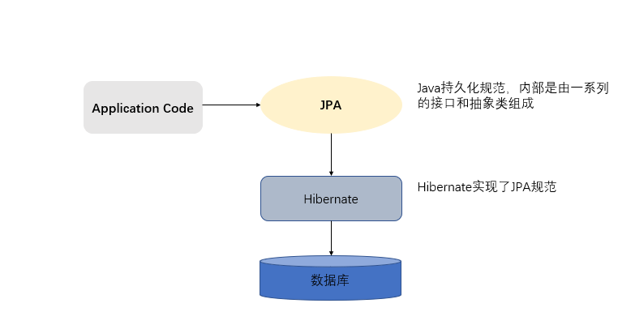

[TOC]

# 一、ORM

ORM（Object-Relational Mapping） 表示对象关系映射。在面向对象的软件开发中，通过ORM，就可以把对象映射到关系型数据库中。只要有一套程序能够做到建立对象与数据库的关联，操作对象就可以直接操作数据库数据，就可以说这套程序实现了ORM对象关系映射

简单的说：ORM就是建立实体类和数据库表之间的关系，从而达到操作实体类就相当于操作数据库表的目的。


## 1.1 为什么使用ROM

当实现一个应用程序时（不使用O/R Mapping），我们可能会写特别多数据访问层的代码，从数据库保存数据、修改数据、删除数据，而这些代码都是重复的。而使用ORM则会大大减少重复性代码。对象关系映射（Object Relational Mapping，简称ORM），主要实现程序对象到关系数据库数据的映射。


### 1.2 常见ORM 框架

常见的orm框架：Mybatis（ibatis）、Hibernate、Spring Data Jpa


# 二、 Hibernate与JPA

## 1. Hibernate 概述

Hibernate是一个开放源代码的对象关系映射框架，它对JDBC进行了非常轻量级的对象封装，它将POJO与数据库表建立映射关系，是一个全自动的orm框架，Hibernate可以自动生成SQL语句，自动执行，使得Java程序员可以随心所欲的使用对象编程思维来操纵数据库。


## 2. JPA概述

PA的全称是Java Persistence API， 即Java 持久化API，是SUN公司推出的一套基于ORM的规范，内部是由一系列的接口和抽象类构成。

JPA通过注解描述对象－关系表的映射关系，并将运行期的实体对象持久化到数据库中。


## 3. JPA的优势

 

### 3.1 标准化

  JPA 是 JCP 组织发布的 Java EE 标准之一，因此任何声称符合 JPA 标准的框架都遵循同样的架构，提供相同的访问API，这保证了基于JPA开发的企业应用能够经过少量的修改就能够在不同的JPA框架下运行。

 

### 3.2  容器级特性的支持

  JPA框架中支持大数据集、事务、并发等容器级事务，这使得 JPA 超越了简单持久化框架的局限，在企业应用发挥更大的作用。

 

### 3.3 简单方便

  JPA的主要目标之一就是提供更加简单的编程模型：在JPA框架下创建实体和创建Java 类一样简单，没有任何的约束和限制，只需要使用 javax.persistence.Entity进行注释，JPA的框架和接口也都非常简单，没有太多特别的规则和设计模式的要求，开发者可以很容易的掌握。JPA基于非侵入式原则设计，因此可以很容易的和其它框架或者容器集成

 

### 3.4 查询能力

  JPA的查询语言是面向对象而非面向数据库的，它以面向对象的自然语法构造查询语句，可以看成是Hibernate HQL的等价物。JPA定义了独特的JPQL（Java Persistence Query Language），JPQL是EJB QL的一种扩展，它是针对实体的一种查询语言，操作对象是实体，而不是关系数据库的表，而且能够支持批量更新和修改、JOIN、GROUP BY、HAVING 等通常只有 SQL 才能够提供的高级查询特性，甚至还能够支持子查询。

 

### 3.5 高级特性

  JPA 中能够支持面向对象的高级特性，如类之间的继承、多态和类之间的复杂关系，这样的支持能够让开发者最大限度的使用面向对象的模型设计企业应用，而不需要自行处理这些特性在关系数据库的持久化。


## 4. JPA 与 Hibernate的关系

JPA规范本质上就是一种ORM规范，注意不是ORM框架——因为JPA并未提供ORM实现，它只是制订了一些规范，提供了一些编程的API接口，但具体实现则由服务厂商来提供实现。  



JPA和Hibernate的关系就像JDBC和JDBC驱动的关系，JPA是规范，Hibernate除了作为ORM框架之外，它也是一种JPA实现。如果使用JPA规范进行数据库操作，底层需要Hibernate作为其实现类完成数据持久化工作。


# 三、JPA 入门案例

## 1. 需求介绍：

案例实现的功能是保存一本书籍到书籍表中


## 2. 导入jar包坐标

pom.xml

```xml
<!-- junit -->
<dependency>
    <groupId>junit</groupId>
    <artifactId>junit</artifactId>
    <version>4.12</version>
    <scope>test</scope>
</dependency>

<!-- Hibernate对jpa的支持 -->
<dependency>
    <groupId>org.hibernate</groupId>
    <artifactId>hibernate-entitymanager</artifactId>
    <version>5.4.28.Final</version>
</dependency>

<!-- c3p0 -->
<dependency>
    <groupId>org.hibernate</groupId>
    <artifactId>hibernate-c3p0</artifactId>
    <version>5.4.28.Final</version>
</dependency>

<!-- log4j -->
<dependency>
    <groupId>log4j</groupId>
    <artifactId>log4j</artifactId>
    <version>1.2.17</version>
</dependency>

<!-- Mysql驱动 -->
<dependency>
    <groupId>mysql</groupId>
    <artifactId>mysql-connector-java</artifactId>
    <version>5.1.49</version>
</dependency>

<dependency>
    <groupId>org.projectlombok</groupId>
    <artifactId>lombok</artifactId>
    <version>1.18.18</version>
</dependency>
</dependencies>
```


## 3. 建表 创建实体类

```sql
CREATE TABLE goods (
  uuid varchar(32) NOT NULL,
  name varchar(64) NOT NULL,
  description varchar(128) DEFAULT NULL,
  price double(12,2) DEFAULT '999999999.99',
  PRIMARY KEY (uuid)
) ENGINE=InnoDB DEFAULT CHARSET=utf8;
```


```java
import lombok.Data;

@Data
public class Book {
    private String uuid;
    private String name;
    private String description;
    private Double price;
}
```


## 4. 实体类和数据库表的映射配置

```java
import lombok.Data;
import org.hibernate.annotations.GenericGenerator;

import javax.persistence.*;

@Data // lombok 自动生成getter setter and toString
@Entity //声明实体类
@Table(name = "goods") // 指定表名
@GenericGenerator(name = "jpa-uuid", strategy = "uuid") // 主键生成器
public class Book {
    @Id // 声明当前属性为主键
    @GeneratedValue(generator = "jpa-uuid")
    @Column(name = "uuid")// 数据库中的列名
    private String uuid;

    @Column(name = "name")
    private String name;

    @Column(name = "description")
    private String description;

    @Column(name = "price")
    private Double price;
}
```

>​     @Entity
>
>​      作用：指定当前类是实体类。
>
>​    @Table
>
>​      作用：指定实体类和表之间的对应关系。
>
>​      属性：
>
>​        name：指定数据库表的名称
>
>​    @Id
>
>​      作用：指定当前字段是主键。
>
>​    @GeneratedValue
>
>​      作用：指定主键的生成方式。。
>
>​      属性：
>
>​        strategy ：指定主键生成策略。
>
>​    @Column
>
>​      作用：指定实体类属性和数据库表之间的对应关系
>
>​      属性：
>
>​        name：指定数据库表的列名称。
>
>​        unique：是否唯一 
>
>​        nullable：是否可以为空 
>
>​        inserttable：是否可以插入 
>
>​        updateable：是否可以更新 
>
>​        columnDefinition: 定义建表时创建此列的DDL 
>
>​        secondaryTable: 从表名。如果此列不建在主表上（默认建在主表），该属性定义该列所在从表的名字搭建开发环境[重点]


## 5. 编写Hibernate核心配置文件

在java工程的resources下创建一个名为META-INF的文件夹，在此文件夹下创建一个名为persistence.xml的配置文件

```xml
<?xml version="1.0" encoding="UTF-8"?>
<persistence xmlns="http://java.sun.com/xml/ns/persistence"
             xmlns:xsi="http://www.w3.org/2001/XMLSchema-instance"
             xsi:schemaLocation="http://java.sun.com/xml/ns/persistence
    http://java.sun.com/xml/ns/persistence/persistence_2_0.xsd"
             version="2.0">
    <!--配置持久化单元
		name：持久化单元名称
		transaction-type：事务类型
		 	RESOURCE_LOCAL：本地事务管理
		 	JTA：分布式事务管理 -->
    <persistence-unit name="myJpa" transaction-type="RESOURCE_LOCAL">
        <!--配置JPA规范的服务提供商 -->
        <provider>org.hibernate.jpa.HibernatePersistenceProvider</provider>
        <properties>
            <!-- 数据库驱动 -->
            <property name="javax.persistence.jdbc.driver" value="com.mysql.jdbc.Driver"/>
            <!-- 数据库地址 -->
            <property name="javax.persistence.jdbc.url" value="jdbc:mysql://192.168.1.3/ssm_demo?useSSL=false&amp;characterEncoding=utf-8"/>
            <!-- 数据库用户名 -->
            <property name="javax.persistence.jdbc.user" value="yang" />
            <!-- 数据库密码 -->
            <property name="javax.persistence.jdbc.password" value="yang" />
            <!--jpa提供者的可选配置：我们的JPA规范的提供者为hibernate，所以jpa的核心配置中兼容hibernate的配置-->
            <property name="hibernate.show_sql" value="true" />
            <property name="hibernate.format_sql" value="true" />
            <!--删除/重建SQL架构 开启这个选项会重建表
            <property name="hibernate.hbm2ddl.auto" value="create" />
			-->
        </properties>
    </persistence-unit>
</persistence>
```


### 6. 编写测试类

```java
import cn.onecolour.jpa.test.entity.Book;
import org.junit.Test;

import javax.persistence.EntityManager;
import javax.persistence.EntityManagerFactory;
import javax.persistence.EntityTransaction;
import javax.persistence.Persistence;

public class JpaTest {
    @Test
    public void testInsert() {
        /*
         * 创建实体管理类工厂，借助Persistence的静态方法获取
         * 		其中传递的参数为持久化单元名称，需要jpa配置文件中指定
         */
        EntityManagerFactory factory =
                Persistence.createEntityManagerFactory("myJpa");
        // 创建实体管理类
        EntityManager em = factory.createEntityManager();
        // 获取事务对象
        EntityTransaction transaction = em.getTransaction();

        // 开启事务
        transaction.begin();

        Book book = new Book();
        book.setName("MySQL是怎样运行的");
        book.setDescription("深入剖析MySQL必知必会高性能数据库运行数据分析与数据处理的书籍，" +
                "采用200多幅图辅助讲解重点内容，提供彩图下载、公众号答疑服务，双色印刷。");
        book.setPrice(49.00);

        em.persist(book);
        System.out.println(book.getUuid());

        // 提交事务
        transaction.commit();
        // 释放资源
        em.close();
        factory.close();
    }
}
```


# 四、主键生成

通过annotation（注解）来映射hibernate实体的,基于annotation的hibernate主键标识为@Id, 其生成规则由@GeneratedValue设定的.这里的@id和@GeneratedValue都是JPA的标准用法。

JPA提供的四种标准用法为`TABLE`,`SEQUENCE`,`IDENTITY`,`AUTO`。

## 1. IDENTITY

IDENTITY:主键由数据库自动生成（主要是自动增长型）

```java
@Id // 声明当前属性为主键
@Column(name = "user_id")// 数据库中的列名
private Long id;
```


## 2. SEQUENCE

SEQUENCE：根据底层数据库的序列来生成主键，条件是数据库支持序列。

```java
@Id  
@GeneratedValue(strategy = GenerationType.SEQUENCE,generator="payablemoney_seq")  
@SequenceGenerator(name="payablemoney_seq", sequenceName="seq_payment")  
private Long custId;


//@SequenceGenerator源码中的定义
@Target({TYPE, METHOD, FIELD})   
@Retention(RUNTIME)  
public @interface SequenceGenerator {  
    //表示该表主键生成策略的名称，它被引用在@GeneratedValue中设置的“generator”值中
    String name();  
    //属性表示生成策略用到的数据库序列名称。
    String sequenceName() default "";  
    //表示主键初识值，默认为0
    int initialValue() default 0;  
    //表示每次主键值增加的大小，例如设置1，则表示每次插入新记录后自动加1，默认为50
    int allocationSize() default 50;  
}

```


## 3. AUTO

AUTO：主键由程序控制

```java
@Id  
@GeneratedValue(strategy = GenerationType.AUTO)  
private Long custId;
```


## 4. TABLE

TABLE：使用一个特定的数据库表格来保存主键

```JAVA
@Id  
    @GeneratedValue(strategy = GenerationType.TABLE, generator="payablemoney_gen")  
    @TableGenerator(name = "pk_gen",  
        table="tb_generator",  
        pkColumnName="gen_name",  
        valueColumnName="gen_value",  
        pkColumnValue="PAYABLEMOENY_PK",  
        allocationSize=1  
    ) 
private Long custId;


//@TableGenerator的定义：
@Target({TYPE, METHOD, FIELD})   
@Retention(RUNTIME)  
public @interface TableGenerator {  
    //表示该表主键生成策略的名称，它被引用在@GeneratedValue中设置的“generator”值中
    String name();  
    //表示表生成策略所持久化的表名，例如，这里表使用的是数据库中的“tb_generator”。
    String table() default "";  
    //catalog和schema具体指定表所在的目录名或是数据库名
    String catalog() default "";  
    String schema() default "";  
    //属性的值表示在持久化表中，该主键生成策略所对应键值的名称。例如在“tb_generator”中将“gen_name”作为主键的键值
    String pkColumnName() default "";  
    //属性的值表示在持久化表中，该主键当前所生成的值，它的值将会随着每次创建累加。例如，在“tb_generator”中将“gen_value”作为主键的值 
    String valueColumnName() default "";  
    //属性的值表示在持久化表中，该生成策略所对应的主键。例如在“tb_generator”表中，将“gen_name”的值为“CUSTOMER_PK”。 
    String pkColumnValue() default "";  
    //表示主键初识值，默认为0。 
    int initialValue() default 0;  
    //表示每次主键值增加的大小，例如设置成1，则表示每次创建新记录后自动加1，默认为50。
    int allocationSize() default 50;  
    UniqueConstraint[] uniqueConstraints() default {};  
} 
```


```SQL
    //这里应用表tb_generator，定义为 ：
    CREATE TABLE  tb_generator (  
        id NUMBER NOT NULL,  
        gen_name VARCHAR2(255) NOT NULL,  
        gen_value NUMBER NOT NULL,  
        PRIMARY KEY(id)  
    )
```


# 五、JPA的API介绍

## 1. Persistence

`Persistence`对象主要作用是用于获取`EntityManagerFactory`对象的 。通过调用该类的`createEntityManagerFactory`静态方法，根据配置文件中持久化单元名称创建`EntityManagerFactory`。

```java
String unitName = "myJpa";
EntityManagerFactory factory= Persistence.createEntityManagerFactory(unitName);
```


## 2. EntityManagerFactory

EntityManagerFactory 接口主要用来创建 `EntityManager` 实例

由于EntityManagerFactory 是一个线程安全的对象（即多个线程访问同一个EntityManagerFactory 对象不会有线程安全问题），并且EntityManagerFactory 的创建极其浪费资源，所以在使用JPA编程时，我们可以对EntityManagerFactory 的创建进行优化，只需要做到**一个工程只存在一个EntityManagerFactory** 即可。

```java
//创建实体管理类
EntityManager em = factory.createEntityManager();
```


## 3. EntityManager

在 JPA 规范中, EntityManager是完成持久化操作的核心对象。实体类作为普通 java对象，只有在调用 EntityManager将其持久化后才会变成持久化对象。EntityManager对象在一组实体类与底层数据源之间进行 O/R 映射的管理。它可以用来管理和更新 Entity Bean, 根椐主键查找 Entity Bean, 还可以通过JPQL语句查询实体。

通过调用EntityManager的方法完成获取事务，以及持久化数据库的操作

> getTransaction : 获取事务对象
>
>  persist ： 保存操作
>
>  merge ： 更新操作
>
>  remove ： 删除操作
>
>  find/getReference ： 根据id查询


## 4. EntityTransaction

在 JPA 规范中, EntityTransaction是完成事务操作的核心对象，对于EntityTransaction在我们的java代码中承接的功能比较简单

>begin：开启事务
>
>commit：提交事务
>
>rollback：回滚事务


# 六、抽取JPAUtil

```java
import javax.persistence.EntityManager;
import javax.persistence.EntityManagerFactory;
import javax.persistence.EntityTransaction;
import javax.persistence.Persistence;

public  class JPAUtil {
    // JPA的实体管理器工厂：相当于Hibernate的SessionFactory
    private final static EntityManagerFactory factory;
    private static EntityManager em;

    // 使用静态代码块赋值
    static {
        // 方法参数必须和persistence.xml中persistence-unit标签name属性取值一致
        factory = Persistence.createEntityManagerFactory("myJpa");
    }

    /**
     * 使用管理器工厂生产一个管理器对象
     *
     * @return EntityManager
     */
    public static EntityManager getEntityManager() {
        em = factory.createEntityManager();
        return em;
    }

    public static EntityTransaction getEntityTransaction(){
        return em == null ? getEntityManager().getTransaction() : em.getTransaction();
    }

}
```


# 七、使用JPA完成CRUD

```java
import cn.onecolour.jpa.entity.Book;
import cn.onecolour.jpa.util.JPAUtil;
import org.junit.After;
import org.junit.Before;
import org.junit.Test;

import javax.persistence.EntityManager;
import javax.persistence.EntityTransaction;

public class JpaTest2 {
    private EntityManager em;
    private EntityTransaction transaction;

    @Before
    public void before(){
        this.em = JPAUtil.getEntityManager();
        this.transaction = em.getTransaction();
        // 开始事务
        transaction.begin();
    }
    @After
    public void after() {
        // 提交事务
        transaction.commit();
        // 关闭连接
        em.close();
    }
    // 增

    @Test
    public void test1() {
        Book book = new Book();
        book.setName("MySQL是怎样运行的");
        book.setDescription("深入剖析MySQL必知必会高性能数据库运行数据分析与数据处理的书籍，" +
                "采用200多幅图辅助讲解重点内容，提供彩图下载、公众号答疑服务，双色印刷。");
        book.setPrice(49.00);
        em.persist(book);
        String uuid = book.getUuid();
        System.out.println(uuid + "\n");
    }

    // 改
    @Test
    public void test2() {
        Book book = em.find(Book.class, "402881827844df51017844df542a0000");
        System.out.println("修改前："+ book + "\n");
        book.setPrice(35.25);
        System.out.println("修改后："+ book + "\n\n");
    }

    // 查
    @Test
    public void test3(){
        Book book = em.find(Book.class, "402881827844df51017844df542a0000");
        // 使用延迟加载策略
        Book book2 = em.getReference(Book.class, "402881827844df51017844df542a0000");
        
        System.out.println(book);
    }
    // 删

//    @Test
//    public void test4() {
//        em.remove(em.find(Book.class, "402881827844df51017844df542a0000"));
//    }
}
```


结果打印如下

```
402881827844e4d4017844e4d6e30000

Hibernate: 
    insert 
    into
        goods
        (description, name, price, uuid) 
    values
        (?, ?, ?, ?)
Hibernate: 
    select
        book0_.uuid as uuid1_0_0_,
        book0_.description as descript2_0_0_,
        book0_.name as name3_0_0_,
        book0_.price as price4_0_0_ 
    from
        goods book0_ 
    where
        book0_.uuid=?
修改前：Book(uuid=402881827844df51017844df542a0000, name=MySQL是怎样运行的, description=深入剖析MySQL必知必会高性能数据库运行数据分析与数据处理的书籍，采用200多幅图辅助讲解重点内容，提供彩图下载、公众号答疑服务，双色印刷。, price=49)

修改后：Book(uuid=402881827844df51017844df542a0000, name=MySQL是怎样运行的, description=深入剖析MySQL必知必会高性能数据库运行数据分析与数据处理的书籍，采用200多幅图辅助讲解重点内容，提供彩图下载、公众号答疑服务，双色印刷。, price=35.25)


Hibernate: 
    select
        book0_.uuid as uuid1_0_0_,
        book0_.description as descript2_0_0_,
        book0_.name as name3_0_0_,
        book0_.price as price4_0_0_ 
    from
        goods book0_ 
    where
        book0_.uuid=?
Book(uuid=402881827844df51017844df542a0000, name=MySQL是怎样运行的, description=深入剖析MySQL必知必会高性能数据库运行数据分析与数据处理的书籍，采用200多幅图辅助讲解重点内容，提供彩图下载、公众号答疑服务，双色印刷。, price=35.25)

Process finished with exit code 0

```


# 八、JPA中的复杂查询


`JPQL`全称Java Persistence Query Language

 

基于首次在EJB2.0中引入的EJB查询语言(EJB QL),Java持久化查询语言(JPQL)是一种可移植的查询语言，旨在以面向对象表达式语言的表达式，将SQL语法和简单查询语义绑定在一起·使用这种语言编写的查询是可移植的，可以被编译成所有主流数据库服务器上的SQL。

 

其特征与原生SQL语句类似，并且完全面向对象，通过类名和属性访问，而不是表名和表的属性。

```java
import cn.onecolour.jpa.util.JPAUtil;
import org.junit.After;
import org.junit.Before;
import org.junit.Test;

import javax.persistence.EntityManager;
import javax.persistence.EntityTransaction;
import javax.persistence.Query;
import java.util.List;

public class JpaTest3 {
    private EntityManager em;
    private EntityTransaction transaction;
    private Query query;

    @Before
    public void before() {
        //获取实体管理对象
        this.em = JPAUtil.getEntityManager();
        //获取事务对象
        this.transaction = em.getTransaction();
        // 开始事务
        transaction.begin();
    }

    @After
    public void after() {
        // 提交事务
        transaction.commit();
        // 关闭连接
        em.close();
    }

    // 查询全部
    @Test
    public void test1() {
        // 创建query对象
        String jPql = "from Book ";
        query = em.createQuery(jPql);

        // 查询并得到返回结果
        List list = query.getResultList();
        for (Object object : list) {
            System.out.println(object);
        }
    }

    // 分页查询
    @Test
    public void test2() {
        //创建query对象
        String jPql = "from Book";
        query = em.createQuery(jPql);

        // 起始索引, 每页显示条数
        query.setFirstResult(0).setMaxResults(2);
        // 查询并返回结果
        List list = query.getResultList();
        for (Object object : list) {
            System.out.println(object);
        }
    }

    // 条件查询
    @Test
    public void test3() {
        //创建query对象
        String jPql = "from Book where name like ?1";
        query = em.createQuery(jPql);
        //对占位符赋值，从0 开始
        query.setParameter(1, "%MySQL%");
        // 查询
        List list = query.getResultList();
        for (Object object : list) {
            System.out.println(object);
        }
    }

    // 排序查询
    @Test
    public void test4() {
        //创建query对象
        String jPql = "from Book order by price desc ";
        query = em.createQuery(jPql);
        // 查询并得到返回结果后打印
        for (Object object : query.getResultList()) {
            System.out.println(object);
        }

    }

    // 统计查询

    @Test
    public void test5() {
        //创建query对象
        String jPql = "select count(uuid) from Book ";
        query = em.createQuery(jPql);

        System.out.println(query.getSingleResult());
    }
}
```


