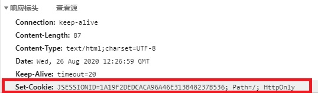

[TOC]


# 一、会话

WEB应用中的**会话**是指一个客户端浏览器与WEB服务器之间连续发生的一系列请求和响应的过程。

WEB应用的**会话状态**是指WEB服务器与浏览器在会话过程中产生的状态信息，借助会话状态，WEB服务器能把属于同一会话中的一系列请求和响应过程关联起来。

## 1. 实现有状态的会话

HTTP协议是一种无状态的协议，WEB服务器本身不能识别哪些请求是同一个浏览器发出的，浏览器的每一次请求都是完全孤立的。

浏览器对自身发出的每一个请求消息进行标识，属于同一会话的请求消息附带相同的标识号，属于不同会话的请求消息附带不同的标识号，我们将这种标识号称为**会话ID**（Session ID）。WEB服务器端程序通过会话ID来识别来自同一个浏览器的访问请求。

会话ID可以通过Cookie技术在请求消息中进行传递，也可作为请求URL的附加参数进行传递。由于会话ID是WEB服务器为客户端浏览器分配的唯一代号，通常在WEB服务器接收到某个浏览器的第一次访问时产生，并随着响应消息一同发送给浏览器。

会话过程由服务器端的程序开启，当开启会话后，服务器端程序需要为这个会话创建一个独立的存储结构来保存该会话的状态信息，属于同一个会话的访问请求均可且只能访问属于该会话的存储结构中的状态信息。


***


# 二、Cookie

## 1.简介

​		**Cookie**是一种在客户端保持HTTP状态信息的技术，是一个保存在客户机中的简单的文本文件, 这个文件与特定的 Web 文档关联在一起, 保存了该客户机访问这个Web 文档时的信息, 当客户机再次访问这个 Web 文档时这些信息可供该文档使用。由于“Cookie”具有可以保存在客户机上的特性, 因此它可以帮助我们实现记录用户个人信息的功能, 而这一切都不必使用复杂的程序。

​		一个 Web 站点可能会为每一个访问者产生一个唯一的**ID**, 然后以 Cookie 文件的形式保存在每个用户的机器上。如果使用浏览器访问 Web, 会看到所有保存在硬盘上的 Cookie。在这个文件夹里每一个文件都是一个由“名/值”对组成的文本文件,另外还有一个文件保存有所有对应的 Web 站点的信息。在这里的每个 Cookie 文件都是一个简单而又普通的文本文件。透过文件名, 就可以看到是哪个 Web 站点在机器上放置了Cookie(当然站点信息在文件里也有保存) 

​		WEB服务器通过在HTTP响应消息中增加Set-Cookie响应头字段将Cookie信息发送给浏览器；浏览器则通过在HTTP请求消息中增加Cookie请求头字段将Cookie回传给WEB服务器。


***


## 2. Cookie的特点&作用

### 2.1 特点

* 一个Cookie只能表示一种信息，其中至少包含一个标识该信息的名称（NAME）和设置值（VALUE）。NAME/VALUE
* 一个WEB站点可给一个WEB浏览器发送多个Cookie，一个WEB浏览器可以存储多个WEB站点提供的Cookie。
* 浏览器一般只允许存放300个Cookie，每个站点最多存放20个Cookie.
* 每个Cookie的大小不超过4KB。

### 2.2 作用

1. cookie一般用于存出少量的不太敏感的数据
2. 在不登录的情况下，完成服务器对客户端的身份识别

## 3. Cookie的组成

Cookie是一段不超过4KB的小型文本数据，由一个名称（Name）、一个值（Value）和其它几个用于控制Cookie有效期、安全性、使用范围的可选属性组成。其中 [3]  ：

### 3.1 Name/Value

设置Cookie的名称及相对应的值，对于认证Cookie，Value值包括Web服务器所提供的访问令牌 。

### 3.2 Expires属性

设置Cookie的生存期。有两种存储类型的Cookie：会话性与持久性。Expires属性缺省时，为会话性Cookie，仅保存在客户端内存中，并在用户关闭浏览器时失效；持久性Cookie会保存在用户的硬盘中，直至生存期到或用户直接在网页中单击“注销”等按钮结束会话时才会失效 。

### 3.3 Path属性

定义了Web站点上可以访问该Cookie的目录 。

### 3.4 Domain属性

指定了可以访问该 Cookie 的 Web 站点或域。Cookie 机制并未遵循严格的同源策略，允许一个子域可以设置或获取其父域的 Cookie。当需要实现单点登录方案时，Cookie 的上述特性非常有用，然而也增加了 Cookie受攻击的危险，比如攻击者可以借此发动会话定置攻击。因而，浏览器禁止在 Domain 属性中设置.org、.com 等通用顶级域名、以及在国家及地区顶级域下注册的二级域名，以减小攻击发生的范围 。

### 3.5 Secure属性

指定是否使用HTTPS安全协议发送Cookie。使用HTTPS安全协议，可以保护Cookie在浏览器和Web服务器间的传输过程中不被窃取和篡改。该方法也可用于Web站点的身份鉴别，即在HTTPS的连接建立阶段，浏览器会检查Web网站的SSL证书的有效性。但是基于兼容性的原因（比如有些网站使用自签署的证书）在检测到SSL证书无效时，浏览器并不会立即终止用户的连接请求，而是显示安全风险信息，用户仍可以选择继续访问该站点。由于许多用户缺乏安全意识，因而仍可能连接到Pharming攻击所伪造的网站 [3]  。

### 3.6 HTTPOnly 属性 

用于防止客户端脚本通过document.cookie属性访问Cookie，有助于保护Cookie不被跨站脚本攻击窃取或篡改。但是，HTTPOnly的应用仍存在局限性，一些浏览器可以阻止客户端脚本对Cookie的读操作，但允许写操作；此外大多数浏览器仍允许通过XMLHTTP对象读取HTTP响应中的Set-Cookie头 。

## 4. Cookie在Servlet中的实现

### 4.1 快速入门

使用步骤：

1. 创建Cookie对象，绑定数据

```java
new Cookie(String name, String value);
```

2. 发送Cookie对象

```java
response.addCookie(Cookie cookie);
```

3. 获取Cookie，拿到数据

```java
Cookie[] cs =  request.getCookies();
```

### 4.2 实现原理

基于响应头set-cookie和请求头cookie实现


### 4.3 细节

#### 4.3.1 发送多个cookie

创建多个Cookie对象，使用response调用多次addCookie方法发送cookie即可。

#### 4.3.2 设置cookie 的生命周期

```java
cookie.setMaxAge(int expiry) // expiry的单位为秒
```

默认情况下（即不设置expiry值），当会话结束后，Cookie数据被销毁

1. expiry为正数 将Cookie数据写到硬盘的文件中。持久化存储。并指定cookie存活时间，时间到后，cookie文件自动失效
2. 负数：默认值
3. 零：删除cookie信息

#### 4.3.3 Cookie支持中文

1. Tomcat8之前 使用URL编码解码（或BASE64）

```java
Cookie c = new Cookie("Username", URLEncoder.encode(Username, StandardCharsets.UTF_8));
// 编码

URLDecoder.decode(c.getValue(), StandardCharsets.UTF_8);
// 解码
```

2. Tomcat8之后：cookie支持中文数据。特殊字符还是不支持，建议使用URL编码存储，URL解码解析

#### 4.3.4 cookie共享

##### 同一服务器

默认情况下cookie不能共享

```java
cookie.setPath(String path);
```

如果要共享，则可以将path设置为"/"

##### 相同根域名，不同服务器

```java
cookie.setDomain(String path)
```

如果设置根域名相同，那么多个服务器之间cookie可以共享

```java
Cookie c = new Cookie();
c.setDomain(".baidu.com");// tieba.baidu.com和news.baidu.com中cookie可以共享
```

### 4.4 案例

>案例需求：
> 	1. 访问一个Servlet，如果是第一次访问，则提示：您好，欢迎您首次访问。
>	2. 如果不是第一次访问，则提示：欢迎回来，您上次访问时间为:显示时间字符串

#### 4.4.1 不使用url编码日期

```java
package com.anli.servlet;c

import javax.servlet.ServletException;
import javax.servlet.annotation.WebServlet;
import javax.servlet.http.Cookie;
import javax.servlet.http.HttpServlet;
import javax.servlet.http.HttpServletRequest;
import javax.servlet.http.HttpServletResponse;
import java.io.IOException;
import java.io.PrintWriter;
import java.text.SimpleDateFormat;
import java.util.Date;

@WebServlet("/printLastTime")
public class PrintLastTime extends HttpServlet {
    protected void doPost(HttpServletRequest request, HttpServletResponse response) throws ServletException, IOException {
        Cookie[] cs = request.getCookies();
        boolean flag = false;
        String LastTime = null;
        int ClickTime = 0;

        // 判断是否有LastTime这个Cookie
        if (cs != null) {
            for (Cookie c : cs) {
                System.out.println(c.getName() + ":" + c.getValue());
                if ("LastTime".equals(c.getName())) {
                    flag = true;
                    LastTime = c.getValue();
                }
                if ("ClickTime".equals(c.getName())) {
                    ClickTime = Integer.parseInt(c.getValue());
                }
            }
        }

        // 设置响应编码utf-8
        response.setHeader("content-type", "text/html;charset=UTF-8");
        response.setCharacterEncoding("utf-8");


        
        // 获取字符输出流对象
        PrintWriter pw = response.getWriter();

        // 登录次数加1
        ClickTime++;

        // 设置日期格式
        SimpleDateFormat df = new SimpleDateFormat("yyyy-MM-dd HH:mm:ss");


        if (flag) {
            Date time = new Date();
            time.setTime(Long.parseLong(LastTime));
            pw.write("欢迎回来，您上次访问时间为:" + df.format(time) + "</br>这是您第" + ClickTime + "次登录"));
            LastTime = String.valueOf(new Date().getTime()); // new Date()为获取当前系统时间
            Cookie c1 = new Cookie("LastTime", LastTime);
            Cookie c2 = new Cookie("ClickTime", Integer.toString(ClickTime));
            response.addCookie(c1);
            response.addCookie(c2);

        } else {
            pw.write("您好，欢迎您首次访问。");
            LastTime = String.valueOf(new Date().getTime()); // new Date()为获取当前系统时间
            Cookie c1 = new Cookie("LastTime", LastTime);
            Cookie c2 = new Cookie("ClickTime", Integer.toString(ClickTime));
            response.addCookie(c1);
            response.addCookie(c2);
        }
    }


    protected void doGet(HttpServletRequest request, HttpServletResponse response) throws ServletException, IOException {
        this.doPost(request, response);
    }
}

```

#### 4.4.2 使用URL编码日期

```java
package com.anli.servlet;

import javax.servlet.ServletException;
import javax.servlet.annotation.WebServlet;
import javax.servlet.http.Cookie;
import javax.servlet.http.HttpServlet;
import javax.servlet.http.HttpServletRequest;
import javax.servlet.http.HttpServletResponse;
import java.io.IOException;
import java.io.PrintWriter;
import java.net.URLDecoder;
import java.net.URLEncoder;
import java.nio.charset.StandardCharsets;
import java.text.SimpleDateFormat;
import java.util.Date;

@WebServlet("/printLastTime")
public class PrintLastTime extends HttpServlet {
    protected void doPost(HttpServletRequest request, HttpServletResponse response) throws ServletException, IOException {
        Cookie[] cs = request.getCookies();
        boolean flag = false;
        String LastTime = null;
        int ClickTime = 0;

        // 判断是否有LastTime这个Cookie
        if (cs != null) {
            for (Cookie c : cs) {
                System.out.println(c.getName() + ":" + c.getValue());
                if ("LastTime".equals(c.getName())) {
                    flag = true;
                    LastTime = URLDecoder.decode(c.getValue(), StandardCharsets.UTF_8);
                }
                if ("ClickTime".equals(c.getName())) {
                    ClickTime = Integer.parseInt(c.getValue());
                }
            }
        }

        // 设置响应编码utf-8
        response.setHeader("content-type", "text/html;charset=UTF-8");
        response.setCharacterEncoding("utf-8");

        // 获取字符输出流对象
        PrintWriter pw = response.getWriter();

        // 登录次数加1
        ClickTime++;

        // 设置日期格式
        SimpleDateFormat df = new SimpleDateFormat("yyyy年MM月dd日 HH时mm分ss秒");


        if (flag) {
            pw.write("欢迎回来，您上次访问时间为:" + LastTime + "</br>这是您第" + ClickTime + "次登录<br>" + request.getLocalAddr());

        } else {
            pw.write("您好，欢迎您首次访问。");
        }
        LastTime = df.format(new Date());
        Cookie c1 = new Cookie("LastTime", URLEncoder.encode(LastTime, StandardCharsets.UTF_8));
        Cookie c2 = new Cookie("ClickTime", Integer.toString(ClickTime));
        response.addCookie(c1);
        response.addCookie(c2);
    }


    protected void doGet(HttpServletRequest request, HttpServletResponse response) throws ServletException, IOException {
        this.doPost(request, response);
    }
}
```


## 5. Cookie方法

| 序号 | 方法 & 描述                                                  |
| :--- | :----------------------------------------------------------- |
| 1    | **public void setDomain(String pattern)** 该方法设置 cookie 适用的域，例如 runoob.com。 |
| 2    | **public String getDomain()** 该方法获取 cookie 适用的域，例如 runoob.com。 |
| 3    | **public void setMaxAge(int expiry)** 该方法设置 cookie 过期的时间（以秒为单位）。如果不这样设置，cookie 只会在当前 session 会话中持续有效。 |
| 4    | **public int getMaxAge()** 该方法返回 cookie 的最大生存周期（以秒为单位），默认情况下，-1 表示 cookie 将持续下去，直到浏览器关闭。 |
| 5    | **public String getName()** 该方法返回 cookie 的名称。名称在创建后不能改变。 |
| 6    | **public void setValue(String newValue)** 该方法设置与 cookie 关联的值。 |
| 7    | **public String getValue()** 该方法获取与 cookie 关联的值。  |
| 8    | **public void setPath(String uri)** 该方法设置 cookie 适用的路径。如果您不指定路径，与当前页面相同目录下的（包括子目录下的）所有 URL 都会返回 cookie。 |
| 9    | **public String getPath()** 该方法获取 cookie 适用的路径。   |
| 10   | **public void setSecure(boolean flag)** 该方法设置布尔值，表示 cookie 是否应该只在加密的（即 SSL）连接上发送。 |
| 11   | **public void setComment(String purpose)** 设置cookie的注释。该注释在浏览器向用户呈现 cookie 时非常有用。 |
| 12   | **public String getComment()** 获取 cookie 的注释，如果 cookie 没有注释则返回 null。 |


***


# 三、Session

## 1. 简介

>在计算机中，尤其是在网络应用中，称为“会话控制”。Session对象存储特定用户会话所需的属性及配置信息。这样，当用户在应用程序的Web页之间跳转时，存储在Session对象中的变量将不会丢失，而是在整个用户会话中一直存在下去。当用户请求来自应用程序的 Web页时，如果该用户还没有会话，则Web服务器将自动创建一个 Session对象。当会话过期或被放弃后，服务器将终止该会话。

### 1.1 Sevrlet中的Session

Servlet 提供了 **HttpSession** 接口，该接口提供了一种跨多个页面请求或访问网站时识别用户以及存储有关用户信息的方式。

Servlet 容器使用这个接口来创建一个 HTTP 客户端和 HTTP 服务器之间的 session 会话。会话持续一个指定的时间段，跨多个连接或页面请求。

通过调用 HttpServletRequest 的公共方法 **getSession()** 来获取 HttpSession 对象，如下所示：

```java
HttpSession session = request.getSession();
```

### 1.2 常见的Session实现方式

#### 1.2.1 隐藏的表单字段

一个 Web 服务器可以发送一个隐藏的 HTML 表单字段，以及一个唯一的 session 会话 ID，如下所示：

```
<input type="hidden" name="session_id" value="12345">
```

该条目意味着，当表单被提交时，指定的名称和值会被自动包含在 GET 或 POST 数据中。每次当 Web 浏览器发送回请求时，session_id 值可以用于保持不同的 Web 浏览器的跟踪。

这可能是一种保持 session 会话跟踪的有效方式，但是点击常规的超文本链接（\<A HREF...>）不会导致表单提交，因此隐藏的表单字段也不支持常规的 session 会话跟踪。

#### 1.2.2 URL重写

您可以在每个 URL 末尾追加一些额外的数据来标识 session 会话，服务器会把该 session 会话标识符与已存储的有关 session 会话的数据相关联。

例如，http: //w3cschool.cc/file.htm:?**sessionid=12345**，session 会话标识符被附加为 sessionid=12345，标识符可被 Web 服务器访问以识别客户端。

URL 重写是一种更好的维持 session 会话的方式，它在浏览器不支持 cookie 时能够很好地工作，但是它的缺点是会动态生成每个 URL 来为页面分配一个 session 会话 ID，即使是在很简单的静态 HTML 页面中也会如此。

### 1.2.3 Cookie

见2.1


## 2. Session在Servlet中的实现

### 2.1 原理

Servlet中Session的实现是依赖于Cookie的。当第一次访问页面时,服务器会自动设置如下Cookie

```
Set-Cookie:JSESSIONID=XXX;Path = "/";HttpOnly
```



### 2.2 常用方法

1. 获取HttpSession对象：

   ```java
   HttpSession session = request.getSession();
   ```

2. 使用HttpSession对象：

   ```java
   Object getAttribute(String name)  
   void setAttribute(String name, Object value)
   void removeAttribute(String name)  
   ```

## 3. 细节 

1. 客户端关闭后，服务器不关闭，两次获取session默认不相同

   * 若要使session相同，需要设置Cookie中JSESSIONID持久化储存

   ```java
   Cookie c = new Cookie("JSESSIONID",session.getId());
   c.setMaxAge(60*60);
   response.addCookie(c);
   ```

2. 客户端不关闭，服务器关闭后，两次获取的session不同

   * Tomcat默认开启session的钝化：
     * 在服务器正常关闭之前，将session对象系列化到硬盘上
   * session的活化：
     * 在服务器启动后，将session文件转化为内存中的session对象即可。

3. session销毁时间

   1. 服务器关闭

   2. session对象调用invalidate() 。

   3. 默认失效时间为30分，可在web.xml中配置

      ```xml
        <session-config>
          <session-timeout>15</session-timeout>
        </session-config>
      <!-- 修改session失效时间为15分钟 -->
      ```

## 4. Session的特点

1. session用于存储一次会话的多次请求的数据，存在服务器端
2. session可以存储任意类型，任意大小的数据

* session与Cookie的区别：
		1. session存储数据在服务器端，Cookie在客户端
	2. session没有数据大小限制，Cookie有
	3. session数据安全，Cookie相对于不安全

## 5. Session方法

| 序号 | 方法 & 描述                                                  |
| :--- | :----------------------------------------------------------- |
| 1    | **public Object getAttribute(String name)** 该方法返回在该 session 会话中具有指定名称的对象，如果没有指定名称的对象，则返回 null。 |
| 2    | **public Enumeration getAttributeNames()** 该方法返回 String 对象的枚举，String 对象包含所有绑定到该 session 会话的对象的名称。 |
| 3    | **public long getCreationTime()** 该方法返回该 session 会话被创建的时间，自格林尼治标准时间 1970 年 1 月 1 日午夜算起，以毫秒为单位。 |
| 4    | **public String getId()** 该方法返回一个包含分配给该 session 会话的唯一标识符的字符串。 |
| 5    | **public long getLastAccessedTime()** 该方法返回客户端最后一次发送与该 session 会话相关的请求的时间自格林尼治标准时间 1970 年 1 月 1 日午夜算起，以毫秒为单位。 |
| 6    | **public int getMaxInactiveInterval()** 该方法返回 Servlet 容器在客户端访问时保持 session 会话打开的最大时间间隔，以秒为单位。 |
| 7    | **public void invalidate()** 该方法指示该 session 会话无效，并解除绑定到它上面的任何对象。 |
| 8    | **public boolean isNew()** 如果客户端还不知道该 session 会话，或者如果客户选择不参入该 session 会话，则该方法返回 true。 |
| 9    | **public void removeAttribute(String name)** 该方法将从该 session 会话移除指定名称的对象。 |
| 10   | **public void setAttribute(String name, Object value)** 该方法使用指定的名称绑定一个对象到该 session 会话。 |
| 11   | **public void setMaxInactiveInterval(int interval)** 该方法在 Servlet 容器指示该 session 会话无效之前，指定客户端请求之间的时间，以秒为单位。 |