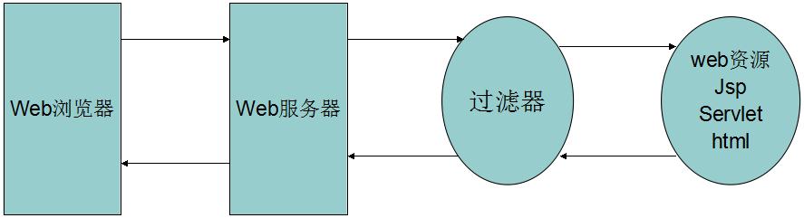
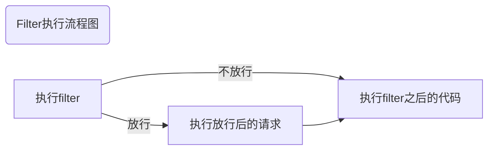
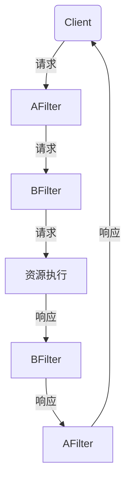

[TOC]

# Filter 过滤器

## 1. 简介

Filter也称之为过滤器，它是Servlet技术中最实用的技术，Web开发人员通过Filter技术，对web服务器管理的所有web资源：例如Jsp, Servlet, 静态图片文件或静态 html 文件等进行拦截，从而实现一些特殊的功能。例如实现URL级别的权限访问控制、过滤敏感词汇、压缩响应信息等一些高级功能。

它主要用于对用户请求（HttpServletRequest）进行**预处理**，也可以对HttpServletResponse进行**后处理**。使用Filter的完整流程：Filter对用户请求进行预处理，接着将请求交给Servlet进行处理并生成响应，最后Filter再对服务器响应进行后处理。



Demo 请求编码处理

```java
import javax.servlet.*;
import javax.servlet.annotation.WebFilter;
import java.io.IOException;

/**
 * 如果request没有指定编码，则为request指定编码为utf-8
 */
@WebFilter("/*")
public class AllFilter implements Filter {
    @Override
    public void destroy() {
    }

    @Override
    public void doFilter(ServletRequest req, ServletResponse resp, FilterChain chain) throws ServletException, IOException {
        if(req.getCharacterEncoding()==null||"".equals(req.getCharacterEncoding())) {
            req.setCharacterEncoding("utf-8");
        }
        chain.doFilter(req, resp);
    }

    @Override
    public void init(FilterConfig config) throws ServletException {

    }
}
```


### 1.1 使用场景

* 身份验证过滤器（Authentication Filters）
* 数据压缩过滤器（Data compression Filters）
* 加密过滤器（Encryption Filters）
* 触发资源访问事件过滤器
* 图像转换过滤器（Image Conversion Filters）
* 日志记录和审核过滤器（Logging and Auditing Filters）。
* MIME-TYPE 链过滤器（MIME-TYPE Chain Filters）
* 标记化过滤器（Tokenizing Filters）
* XSL/T 过滤器（XSL/T Filters），转换 XML 内容


## 2. 使用步骤

1.  定义一个类实现Filter接口

   ```java
   public class FilterTest implements Filter{
       ...
   }
   ```

2. 复写方法

   ```java
   public class AllFilter implements Filter {
       @Override
       public void destroy() {
           ...
       }
   
       @Override
       public void doFilter(ServletRequest req, ServletResponse resp, FilterChain chain) throws ServletException, IOException {
           ...
       }
   
       @Override
       public void init(FilterConfig config) throws ServletException {
           ...
       }
   
   }
   
   ```

   | 方法                                                         | 描述                                                         |
   | :----------------------------------------------------------- | :----------------------------------------------------------- |
   | public void doFilter (ServletRequest, ServletResponse, FilterChain) | 该方法完成实际的过滤操作，当客户端请求方法与过滤器设置匹配的URL时，Servlet容器将先调用过滤器的doFilter方法。FilterChain用户访问后续过滤器。 |
   | public void init(FilterConfig filterConfig)                  | web 应用程序启动时，web 服务器将创建Filter 的实例对象，并调用其init方法，读取web.xml配置，完成对象的初始化功能，从而为后续的用户请求作好拦截的准备工作（filter对象只会创建一次，init方法也只会执行一次）。开发人员通过init方法的参数，可获得代表当前filter配置信息的FilterConfig对象。 |
   | public void destroy()                                        | Servlet容器在销毁过滤器实例前调用该方法，在该方法中释放Servlet过滤器占用的资源。 |

3. 配置拦截路径

   * web.xml配置

     ```xml
     <filter>
         <filter-name>demo1</filter-name>
         <!-- filter-class 为全类名 -->
         <filter-class>cn.onecolour.web.filter.FilterDemo1</filter-class>
     </filter>
     <filter-mapping>
     <filter-name>demo1</filter-name>
     <!-- 拦截路径 -->
     <url-pattern>/*</url-pattern>
     </filter-mapping>
     ```

   * 注解配置 Filter

     ```java
     @WebFilter("/*")
     public class AllFilter implements Filter {
         ...
     }
     ```

     

## 3. 执行流程




## 4. 生命周期

### 4.1 init

init:在服务器启动后，会创建Filter对象，然后调用init方法。只执行一次。用于加载资源

### 4.2 doFilter

doFilter:每一次请求被拦截资源时，会执行。执行多次

### 4.3 destory

destroy:在服务器关闭后，Filter对象被销毁。如果服务器是正常关闭，则会执行destroy方法。只执行一次。用于释放资源


## 5. 配置详解

### 5.1filter目录配置

1. 具体资源路径：/index.jsp 只有访问index.jsp资源时，过滤器才会被执行
2. 拦截目录： /user/*	访问/user下的所有资源时，过滤器都会被执行
3. 后缀名拦截： *.jsp		访问所有后缀名为jsp资源时，过滤器都会被执行
4. 拦截所有资源：/*		访问所有资源时，过滤器都会被执行

### 5.2 filter 优先级

1. 使用注解@WebFilter 配置的

   * 按照类名的字符串比较规则比较，值小的先执行
   * 如先执行AFilter 再执行 BFilter

2. web.xml配置： \<filter-mapping\>谁定义在上边，谁先执行

   ```xml
   <?xml version="1.0" encoding="UTF-8"?>
   <web-app xmlns:xsi="http://www.w3.org/2001/XMLSchema-instance" xmlns="http://java.sun.com/xml/ns/javaee" xsi:schemaLocation="http://java.sun.com/xml/ns/javaee http://java.sun.com/xml/ns/javaee/web-app_3_0.xsd" id="WebApp_ID" version="3.0">
     <display-name>FilterDemo01</display-name>
     <welcome-file-list>
       <welcome-file>index.jsp</welcome-file>
     </welcome-file-list>
     
     <!-- 过滤顺序：谁的写在上面，谁先被过滤 -->
     <filter>
       <filter-name>FilterTest01</filter-name>
       <filter-class>cn.onecolour.web.filter.FilterTest01</filter-class>
     </filter>
     <filter-mapping>
       <filter-name>FilterTest01</filter-name>
       <url-pattern>/*</url-pattern> <!-- 过滤所有 -->
     </filter-mapping>
     
     <filter>
       <filter-name>FilterTest02</filter-name>
       <filter-class>cn.onecolour.web.filter.FilterTest02</filter-class>
     </filter>
     <filter-mapping>
       <filter-name>FilterTest02</filter-name>
       <url-pattern>/*</url-pattern> <!-- 过滤所有 -->
     </filter-mapping>
       
   </web-app>
   ```

### 5.3 请求器链

如果有两个过滤器：AFilter和过滤器BFilter




### 5.4 过滤请求方式配置 

资源被访问的方式

#### 5.4.1 注解配置

* REQUEST：默认值。浏览器直接请求资源

* FORWARD：转发访问资源

* INCLUDE：包含访问资源

* ERROR：错误跳转资源

* ASYNC：异步访问资源

```java
@WebFilter(value = "/*", dispatcherTypes = {DispatcherType.FORWARD})
```

#### 5.4.2 web.xml

```xml
<filter>
    <filter-name>demo1</filter-name>
    <!-- filter-class 为全类名 -->
    <filter-class>cn.onecolour.web.filter.FilterDemo1</filter-class>
</filter>
<filter-mapping>
<filter-name>demo1</filter-name>
<!-- 拦截路径 -->
<url-pattern>/*</url-pattern>
<!-- 请求的方式 -->
<dispatcher>FORWARD</dispatcher>
</filter-mapping>

```

## 6 案例

### 6.1 过滤敏感词汇（采用动态代理增强 ServletRequest）

```java
import javax.servlet.*;
import javax.servlet.annotation.WebFilter;
import java.io.BufferedReader;
import java.io.FileReader;
import java.io.IOException;
import java.lang.reflect.InvocationHandler;
import java.lang.reflect.Method;
import java.lang.reflect.Proxy;
import java.util.*;

/**
 * 敏感词汇过滤器
 */
@WebFilter("/test/*")
public class SensitiveWordsFilter implements Filter {


    public void doFilter(ServletRequest req, ServletResponse resp, FilterChain chain) throws ServletException, IOException {
        //1.创建代理对象，增强getParameter方法

        ServletRequest proxy_req = (ServletRequest) Proxy.newProxyInstance(req.getClass().getClassLoader(), req.getClass().getInterfaces(), new InvocationHandler() {
            @Override
            public Object invoke(Object proxy, Method method, Object[] args) throws Throwable {
                //增强getParameter方法
                //判断是否是getParameter方法
                if (method.getName().equals("getParameter")) {
                    //增强返回值
                    //获取返回值
                    String value = (String) method.invoke(req, args);
                    if (value != null) {
                        for (String str : list) {
                            if (value.contains(str)) {
                                value = value.replaceAll(str, "***");
                            }
                        }
                    }

                    return value;
                } else if (method.getName().equals("getParameterMap")) {
                    //判断方法名是否是 getParameterMap

                    Map<String, String[]> map = new HashMap<String, String[]>((Map<String, String[]>) method.invoke(req, args));
                    /*
                     * 注意：(Map<String, String[]>)method.invoke(req, args)获得的map是					 * 被锁定的，将会报错java.lang.IllegalStateException: No 							 * modifications are allowed to a locked ParameterMap
                     * 
                    */
                    
                    if (map != null) {
                        for (String str : list) {
                            Set<Map.Entry<String, String[]>> entries = map.entrySet();
                            for (Map.Entry<String, String[]> entry : entries) {
                                String[] value = entry.getValue();

                                // 该标志为true表示含有敏感词汇
                                boolean flag = false;
                                for (int i = 0; i < value.length; i++) {
                                    String s = value[i];
                                    if (s.contains(str)) {
                                        value[i] = s.replaceAll(str, "***");
                                        flag = true;
                                    }
                                }
                                if (flag) {
                                    map.put(entry.getKey(), value);
                                }
                            }
                        }
                    }
                    return map;
                } else if (method.getName().equals("getParameterValues")){
                    //判断方法名是否是 getParameterValues

                    String[] values = (String[]) method.invoke(req,args);
                    if (values!=null&&values.length>0){
                        for (int i = 0; i < values.length; i++) {
                            String value = values[i];
                            for (String str : list) {
                                if (value.contains(str)){
                                    values[i] = value.replaceAll(str,"***");
                                }
                            }
                        }
                    }
                    return values;
                }
                return method.invoke(req, args);
            }
        });

        //2.放行
        chain.doFilter(proxy_req, resp);
    }

    private List<String> list = new ArrayList<String>();//敏感词汇集合

    public void init(FilterConfig config) throws ServletException {

        try {
            //1.获取文件真实路径
            ServletContext servletContext = config.getServletContext();
            String realPath = servletContext.getRealPath("/WEB-INF/classes/敏感词汇.txt");
            //2.读取文件
            BufferedReader br = new BufferedReader(new FileReader(realPath));
            //3.将文件的每一行数据添加到list中
            String line = null;
            while ((line = br.readLine()) != null) {
                list.add(line);
            }

            br.close();

        } catch (Exception e) {
            e.printStackTrace();
        }

    }

    public void destroy() {
    }
}
```

### 6.2 登录资源过滤

```java

import javax.servlet.*;
import javax.servlet.annotation.WebFilter;
import javax.servlet.http.HttpServletRequest;
import java.io.IOException;

/**
 * 登录验证的过滤器
 */
@WebFilter("/*")
public class LoginFilter implements Filter {


    public void doFilter(ServletRequest req, ServletResponse resp, FilterChain chain) throws ServletException, IOException {
        System.out.println(req);
        //0.强制转换
        HttpServletRequest request = (HttpServletRequest) req;

        //1.获取资源请求路径
        String uri = request.getRequestURI();
        //2.判断是否包含登录相关资源路径,要注意排除掉 css/js/图片/验证码等资源
        if(uri.contains("/login.jsp") || uri.contains("/loginServlet") || uri.contains("/css/") || uri.contains("/js/") || uri.contains("/fonts/") || uri.contains("/checkCodeServlet")  ){
            //包含，用户就是想登录。放行
            chain.doFilter(req, resp);
        }else{
            //不包含，需要验证用户是否登录
            //3.从获取session中获取user
            Object user = request.getSession().getAttribute("user");
            if(user != null){
                //登录了。放行
                chain.doFilter(req, resp);
            }else{
                //没有登录。跳转登录页面

                request.setAttribute("login_msg","您尚未登录，请登录");
                request.getRequestDispatcher("/login.jsp").forward(request,resp);
            }
        }


        // chain.doFilter(req, resp);
    }

    public void init(FilterConfig config) throws ServletException {

    }

    public void destroy() {
    }

}
```

