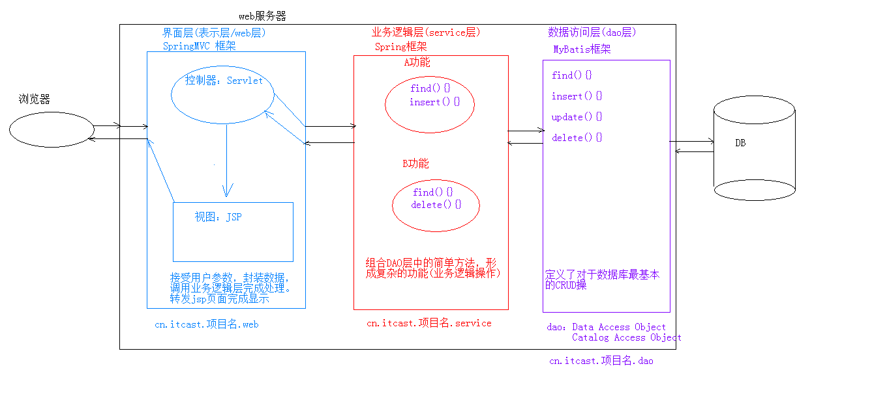

[TOC]

# MVC

## 1. 基本概念

1. M：Model，模型。JavaBean
    * 模型代表一个存取数据的对象或 JAVA POJO。它也可以带有逻辑，在数据变化时更新控制器。，如：查询数据库，封装对象
2. V：View，视图。JSP
    * 视图代表模型包含的数据的可视化。
3. C：Controller，控制器。Servlet
    * 控制器作用于模型和视图上。它控制数据流向模型对象，并在数据变化时更新视图。它使视图与模型分离开。
      1. 获取用户的输入
      2. 调用模型
      3. 将数据交给视图进行展示

## 2. 优缺点

1. 优点：
			1. 耦合性低，方便维护，可以利于分工协作
	2. 重用性高

2. 缺点：
  1. 使得项目架构变得复杂，对开发人员要求高

# 三层架构

> 三层架构中主要功能与业务逻辑一般要在业务逻辑层进行信息处理和实现，其中三层体系架构中的客户端和数据库要预设中间层，成为组建层。三层架构中的三层具有一定的逻辑性，即是将三层设置到同一个计算机系统中，把业务协议、合法校验以及数据访问等程序归置到中间层进行信息处理，一般客户端无法和数据库进行数据传输，主要是利用 COM/DCOM 通讯和中间层构建衔接通道，实现中间层与数据库的数据传输，进而实现客户端与是数据库的交互。

## 界面层(表示层)（UI）

表示层又称表现层 UI，位于三层构架的最上层，与用户直接接触，主要是 B/S 信息系统中的 Wed 浏览页面。作为 Wed 浏览页面，表示层的主要功能是实现系统数据的传入与输出，在此过程中不需要借助逻辑判断操作就可以将数据传送到 BBL 系统中进行数据处理，处理后会将处理结果反馈到表示层中。换句话说，表示层就是实现用户界面功能，将用户的需求传达和反馈，并用 BLL 或者是 Models 进行调试，保证用户体验。

## 业务逻辑层（BLL）

业务逻辑层 BLL 的功能是对具体问题进行逻辑判断与执行操作，接收到表现层 UI 的用户指令后，会连接数据访问层 DAL，访问层在三层构架中位于表示层与数据层中间位置，同时也是表示层与数据层的桥梁，实现三层之间的数据连接和指令传达，可以对接收数据进行逻辑处理，实现数据的修改、获取、删除等功能，并将处理结果反馈到表示层 UI 中，实现软件功能。

## 数据访问层（DAL）

数据访问层 DAL 是数据库的主要操控系统，实现数据的增加、删除、修改、查询等操作，并将操作结果反馈到业务逻辑层 BBL。在实际运行的过程中，数据访问层没有逻辑判断能力，为了实现代码编写的严谨性，提高代码阅读程度，一般软件开发人员会在该层中编写 Data AccessCommon，保证数据访问层 DAL 数据处理功能。

## 优点

1. 高内聚、低耦合，可以降低层与层之间的依赖。
2. 各层互相独立，完成自己该完成的任务，项目可以多人同时开发，开发人员可以只关注整个结构中的其中某一层。 
3. 容易移植、维护，如 B / S 转 C / S、SQLServer 转 Oracle、添加、修改、删除等。 
4. 有利于标准化。
5. 有利于各层逻辑的复用。
6. 安全性高。用户端只能通过业务逻辑层来调用数据访问层，减少了入口点，把很多危险的系统功能都屏蔽了。