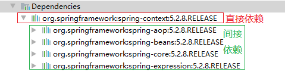

[TOC]

# 一、Maven的依赖传递

## 1. 依赖冲突的原因

### 1.1 依赖机制

在maven中，依赖是可以传递的，假设存在三个项目，分别是项目A，项目B以及项目C。假设C依赖B，B依赖A，那么我们可以根据maven项目依赖的特征不难推出项目C也依赖A。

通过上面的图可以看到，当前项目依赖于spring-context，而spring-context依赖于spring-aop, spring-beans, spring- core等。最终的结果就是当前项目间接依赖于spring-aop, spring-beans, spring- core等。

### 1.2 仲裁机制

如果 A 应用间接依赖多个 C 应用，且版本都不一样，Maven 将会通过仲裁机制选择：

* 优先按照依赖管理元素中指定的版本声明进行仲裁时，下面的两个原则都无效了

* 短路径优先
* 若路径相同，将看 pom 中声明的顺序。

