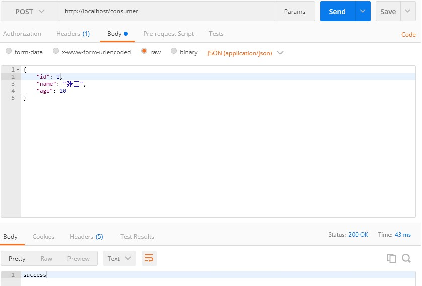

[TOC]

# 一、前言

## 1. 系统架构的演变

随着互联网的发展，网站应用的规模不断扩大。需求的激增，带来的是技术上的压力。系统架构也因此也不断的演进、升级、迭代。从单一应用，到垂直拆分，到分布式服务，到SOA，以及现在火热的微服务架构，还有Google带领下来势汹涌的Service Mesh。

### 1.1 集中式架构

网站建设初期，访问人数有限，数据量不大，只需要一台服务器足矣，这时应用程序、文件、数据库等所有资源全部集中在这台服务器上（也称为集中式部署）


优点：

* 系统开发速度快
* 维护成本低
* 适用于并发要求较低的系统

缺点：

* 代码耦合度高，后期维护困难
* 无法针对不同模块进行针对性优化
* 无法水平扩展
* 单点容错率低，并发能力差


### 1.2 垂直拆分

当访问量逐渐增大，单一应用无法满足需求，此时为了应对更高的并发和业务需求，我们根据业务功能对系统进行拆分


优点：

* 系统拆分实现了流量分担，解决了并发问题
* 可以针对不同模块进行优化
* 方便水平扩展，负载均衡，容错率提高

缺点：

* 系统间相互独立，会有很多重复开发工作，影响开发效率


### 1.3 分布式服务

当垂直应用越来越多，应用之间交互不可避免，将核心业务抽取出来，作为独立的服务，逐渐形成稳定的服务中心，使前端应用能更快速的响应多变的市场需求。


优点：

* 将基础服务进行了抽取，系统间相互调用，提高了代码复用和开发效率

缺点：

* 系统间耦合度变高，调用关系错综复杂，难以维护


### 1.4 面向服务架构

SOA（Service Oriented Architecture）面向服务的架构：它是一种设计方法，其中包含多个服务， 服务之间通过相互依赖最终提供一系列的功能。一个服务 通常以独立的形式存在与操作系统进程中。各个服务之间 通过网络调用。
SOA结构图：


>ESB（企业服务总线），简单 来说 ESB 就是一根管道，用来连接各个服务节点。为了集 成不同系统，不同协
>议的服务，ESB 做了消息的转化解释和路由工作，让不同的服务互联互通。

SOA缺点：每个供应商提供的ESB产品有偏差，自身实现较为复杂；应用服务粒度较大，ESB集成整合所有服务和协议、数据转换使得运维、测试部署困难。所有服务都通过一个通路通信，直接降低了通信速度。


### 1.5 微服务架构

微服务架构是使用一套小服务来开发单个应用的方式或途径，每个服务基于单一业务能力构建，运行在自己的进程中，并使用轻量级机制通信，通常是HTTP API，并能够通过自动化部署机制来独立部署。这些服务可以使用不同的编程语言实现，以及不同数据存储技术，并保持最低限度的集中式管理。


>API Gateway网关是一个服务器，是系统的唯一入口。为每个客户端提供一个定制的API。API网关核心是，所
>有的客户端和消费端都通过统一的网关接入微服务，在网关层处理所有的非业务功能。如它还可以具有其它职责，如身份验证、监控、负载均衡、缓存、请求分片与管理、静态响应处理。通常，网关提RESTful/HTTP的方式访问服务。而服务端通过服务注册中心进行服务注册和管理。

**微服务的特点：**

* 单一职责：微服务中每一个服务都对应唯一的业务能力，做到单一职责
* 微：微服务的服务拆分粒度很小，例如一个用户管理就可以作为一个服务。每个服务虽小，但“五脏俱全”。
* 面向服务：面向服务是说每个服务都要对外暴露Rest风格服务接口API。并不关心服务的技术实现，做到与平台
* 和语言无关，也不限定用什么技术实现，只要提供Rest的接口即可。
* 自治：自治是说服务间互相独立，互不干扰
  * 团队独立：每个服务都是一个独立的开发团队，人数不能过多。
  * 技术独立：因为是面向服务，提供Rest接口，使用什么技术没有别人干涉
  * 前后端分离：采用前后端分离开发，提供统一Rest接口，后端不用再为PC、移动端开发不同接口
  * 数据库分离：每个服务都使用自己的数据源
  * 部署独立，服务间虽然有调用，但要做到服务重启不影响其它服务。有利于持续集成和持续交付。每个服
  * 务都是独立的组件，可复用，可替换，降低耦合，易维护


微服务架构与SOA都是对系统进行拆分；微服务架构基于SOA思想，可以把微服务当做去除了ESB的SOA。ESB是SOA架构中的中心总线，设计图形应该是星形的，而微服务是去中心化的分布式软件架构。两者比较类似，但其实也有一些差别：
|功能 |SOA |微服务|
|:--|:--|:--|
|组件大小| 大块业务逻辑 |单独任务或小块业务逻辑|
|耦合| 通常松耦合|   总是松耦合|
|管理| 着重中央管理 | 着重分散管理|
|目标| 确保应用能够交互操作| 易维护、易扩展、更轻量级的交互|

## 2. 服务调用方式
### 2.1 RPC 和 HTTP
无论是微服务还是SOA，都面临着服务间的远程调用。

常见的远程调用方式有以下2种：

* RPC：Remote Produce Call远程过程调用，RPC基于Socket，工作在会话层。自定义数据格式，速度快，效率高。早期的webservice，现在热门的dubbo，都是RPC的典型代表。

* Http：http其实是一种网络传输协议，基于TCP，工作在应用层，规定了数据传输的格式。现在客户端浏览器与服务端通信基本都是采用Http协议，也可以用来进行远程服务调用。缺点是消息封装臃肿，优势是对服务的提供和调用方没有任何技术限定，自由灵活，更符合微服务理念。

  

### 2.2 Http客户端工具

既然微服务选择了Http，那么我们就需要考虑自己来实现对请求和响应的处理。不过开源世界已经有很多的http客户端工具，能够帮助我们做这些事情，

* HttpClient
* OKHttp
* URLConnection

不过这些不同的客户端，API各不相同。而Spring也有对http的客户端进行封装，提供了工具类叫RestTemplate。


* UserController

```java
import cn.onecolour.entity.User;
import org.springframework.web.bind.annotation.*;

import java.util.*;

@RestController()
@RequestMapping(value = "/users",produces = {"application/json;charset=utf-8","text/plain;charset=utf-8"})     // 通过这里配置使下面的映射都在/users下
public class UserController {
    // 创建线程安全的Map，模拟users信息的存储
    static Map<Long, User> users = Collections.synchronizedMap(new HashMap<Long, User>());

    /**
     * 处理"/users/"的GET请求，用来获取用户列表
     */
    @GetMapping
    public List<User> getUserList() {
        // 还可以通过@RequestParam从页面中传递参数来进行查询条件或者翻页信息的传递
        return new ArrayList<User>(users.values());
    }

    /**
     * 处理"/users/"的POST请求，用来创建User
     */
    @PostMapping
    public String postUser(@RequestBody User user) {
        // @RequestBody注解用来绑定通过http请求中application/json类型上传的数据
        users.put(user.getId(), user);
        return "success";
    }

    /**
     * 处理"/users/{id}"的GET请求，用来获取url中id值的User信息
     */
    @GetMapping("/{id}")
    public User getUser(@PathVariable Long id) {
        // url中的id可通过@PathVariable绑定到函数的参数中
        return users.get(id);
    }

    /**
     * 处理"/users/{id}"的PUT请求，用来更新User信息
     */
    @PutMapping("/{id}")
    public String putUser(@PathVariable Long id, @RequestBody User user) {
        User u = users.get(id);
        u.setName(user.getName());
        u.setAge(user.getAge());
        users.put(id, u);
        return "success";
    }

    /**
     * 处理"/users/{id}"的DELETE请求，用来删除User
     */
    @DeleteMapping("/{id}")
    public String deleteUser(@PathVariable Long id) {
        users.remove(id);
        return "success";
    }

}
```

* User

```java
@Data
public class User {
    private Long id;
    // 姓名
    private String name;
    // 年龄
    private Integer age;

}
```

* 测试方法

```java
//创建HttpClient工具
private final CloseableHttpClient client = HttpClients.createDefault();

@Test
public void httpClientTest() throws IOException {
    String url = "http://localhost:8080/users";
    // 1. get获取user列表，此时应该为空
    System.out.println(EntityUtils.toString(client.execute(new HttpGet(url)).getEntity()) + "\n");

    // 2. Post一个user对象
    HttpPost requestPost = new HttpPost(url);
    requestPost.setHeader("content-type", "application/json;charset=utf-8");
    StringEntity stringEntity = new StringEntity("{\"id\":1,\"name\":\"测试用户1\",\"age\":20}", "UTF-8");
    requestPost.setEntity(stringEntity);
    // 发送请求
    CloseableHttpResponse response = client.execute(requestPost);
    System.out.println("POST请求响应内容：" + EntityUtils.toString(response.getEntity()) + "\n");

    // 3. get获取user列表
    System.out.println(EntityUtils.toString(client.execute(new HttpGet(url)).getEntity()) + "\n");

    // 4. put修改id为1的user
    HttpPut requestPut = new HttpPut(url + "/1");
    requestPut.setHeader("content-type", "application/json;charset=utf8");
    StringEntity stringEntity1 = new StringEntity("{\"name\":\"测试用户1\",\"age\":29}", "UTF-8");
    requestPut.setEntity(stringEntity1);
    // 发送请求
    response = client.execute(requestPut);
    System.out.println("PUT请求响应内容：" + EntityUtils.toString(response.getEntity()) + "\n");

    // 5. get一个id为1的user
    System.out.println(EntityUtils.toString(client.execute(new HttpGet(url + "/1")).getEntity()) + "\n");

    // 6. del删除id为1的user
    HttpDelete requestDelete = new HttpDelete(url + "/1");
    System.out.println("Delete请求响应内容：" + EntityUtils.toString(client.execute(requestDelete).getEntity()) + "\n");

    // 7. get查一下user列表，应该为空
    System.out.println(EntityUtils.toString(client.execute(new HttpGet(url)).getEntity()) + "\n");
}
```


### 2.3 RestTemplate

Spring提供了一个RestTemplate模板工具类，对基于Http的客户端进行了封装，并且实现了对象与json的序列化和反序列化，非常方便。RestTemplate并没有限定Http的客户端类型，而是进行了抽象，目前常用的3种都有支持：

* HttpClient
* OkHttp
* JDK原生的URLConnection（默认的）


测试方法：

```java
// restTemplate
private final RestTemplate restTemplate = new RestTemplate();

@Test
public void restTemplateTest() {
    String url = "http://localhost:8080/users";
    User user = new User();
    user.setId(1L);
    user.setName("测试用户1");
    user.setAge(20);

    // 1. get获取user列表，此时应该为空
    System.out.println(restTemplate.getForObject(url, List.class) + "\n");

    // 2. Post一个user对象
    HttpHeaders headers = new HttpHeaders();
    headers.setContentType(MediaType.APPLICATION_JSON);
    HttpEntity<User> httpEntity = new HttpEntity<>(user, headers);
    String s = restTemplate.postForObject(url, httpEntity, String.class);
    System.out.println("POST请求响应内容：" + s + "\n");

    // 3. get获取user列表
    System.out.println(restTemplate.getForObject(url, List.class) + "\n");

    // 4. put修改id为1的user
    user.setAge(29);
    httpEntity = new HttpEntity<>(user, headers);
    // 4.1 没有返回值
    /*restTemplate.put(url+"/{id}",httpEntity,user.getId());*/
    // 4.2 有返回值
    ResponseEntity<String> response = restTemplate.exchange(url + "/{id}", HttpMethod.PUT, httpEntity, String.class,user.getId());
    String s1 = response.getBody();
    System.out.println("PUT请求响应内容：" + s1 + "\n");

    // 5. get一个id为1的user
    System.out.println(restTemplate.getForObject(url + "/{id}", User.class, user.getId()) + "\n");

    // 6. del删除id为1的user
    ResponseEntity<String> response1 = restTemplate.exchange(url + "/{id}", HttpMethod.DELETE, null, String.class, user.getId());
    String s2 = response1.getBody();
    System.out.println("Delete请求响应内容：" + s2 + "\n");

    // 7. get查一下user列表，应该为空
    System.out.println(restTemplate.getForObject(url, List.class) + "\n");

}
```


### 2.4 MockMVC基于RESTful风格的测试

```java
private MockMvc mvc;

@Before
public void setupMockMvc(){
    mvc = MockMvcBuilders.standaloneSetup(new UserController()).build();
}

@Test
public void MockMvcTest() throws Exception{
    // 测试UserController
    MockHttpServletRequestBuilder request;

    // 1、get查一下user列表，应该为空
    request = get("/users/");
    mvc.perform(request)
        .andExpect(status().isOk())
        .andExpect(content().string(equalTo("[]")));

    // 2、post提交一个user
    request = post("/users/")
        .contentType(MediaType.APPLICATION_JSON)
        .content("{\"id\":1,\"name\":\"测试大师\",\"age\":20}").characterEncoding("utf-8");
    mvc.perform(request)
        .andExpect(content().string(equalTo("success")));

    // 3、get获取user列表，应该有刚才插入的数据
    request = get("/users/");
    mvc.perform(request)
        .andExpect(status().isOk())
        .andExpect(content().string(equalTo("[{\"id\":1,\"name\":\"测试大师\",\"age\":20}]")));

    // 4、put修改id为1的user
    request = put("/users/1")
        .contentType(MediaType.APPLICATION_JSON)
        .content("{\"name\":\"测试终极大师\",\"age\":30}");
    mvc.perform(request)
        .andExpect(content().string(equalTo("success")));

    // 5、get一个id为1的user
    request = get("/users/1");
    mvc.perform(request)
        .andExpect(content().string(equalTo("{\"id\":1,\"name\":\"测试终极大师\",\"age\":30}")));

    // 6、del删除id为1的user
    request = delete("/users/1");
    mvc.perform(request)
        .andExpect(content().string(equalTo("success")));

    // 7、get查一下user列表，应该为空
    request = get("/users/").characterEncoding("GBK");
    mvc.perform(request)
        .andExpect(status().isOk())
        .andExpect(content().string(equalTo("[]")));

}
```

在测试之前要引入：

```java
import static org.hamcrest.Matchers.equalTo;
import static org.springframework.test.web.servlet.request.MockMvcRequestBuilders.*;
import static org.springframework.test.web.servlet.result.MockMvcResultMatchers.content;
import static org.springframework.test.web.servlet.result.MockMvcResultMatchers.status;
```


# 二、Spring Cloud 快速入门

## 1. 初识Spring Cloud

微服务的实现方式很多，但是最火的莫过于Spring Cloud，原因

* 后台硬：作为Spring家族的一员，有整个Spring全家桶靠山，背景十分强大。
* 技术强：Spring作为Java领域的前辈，可以说是功力深厚。有强力的技术团队支撑，一般人还真比不了
* 群众基础好：可以说大多数程序员的成长都伴随着Spring框架，试问：现在有几家公司开发不用Spring？Spring Cloud与Spring的各个框架无缝整合，对大家来说一切都是熟悉的配方，熟悉的味道。
* 使用方便：相信大家都体会到了SpringBoot给我们开发带来的便利，而Spring Cloud完全支持Spring Boot的开发，用很少的配置就能完成微服务框架的搭建


## 2. 简介

Spring Cloud是Spring旗下的项目之一，官网地址：http://projects.spring.io/spring-cloud/

Spring Cloud也是一样，它将现在非常流行的一些技术整合到一起，实现了诸如：配置管理，服务发现，智能路由，负载均衡，熔断器，控制总线，集群状态等功能；协调分布式环境中各个系统，为各类服务提供模板性配置。其主要涉及的组件包括：

* Eureka：注册中心Zuul、Gateway：服务网关
* Ribbon：负载均衡
* Feign：服务调用
* Hystrix或Resilience4j：熔断器
* ...


## 3. 版本

Spring Cloud不是一个组件，而是许多组件的集合；它的版本命名比较特殊，是以A到Z的为首字母的一些单词（伦敦地铁站的名字）组成


## 4. Eureka 注册中心

### 4.1 简介

Spring-Cloud Euraka是Spring Cloud集合中一个组件，它是对Euraka的集成，用于服务注册和发现。Eureka是Netflix中的一个开源框架。它和 zookeeper、Consul一样，都是用于服务注册管理的，同样，Spring-Cloud 还集成了Zookeeper和Consul。

在项目中使用Spring Cloud Euraka的原因是***它可以利用Spring Cloud Netfilix中其他的组件，如zull等，因为Euraka是属于Netfilix的。***

Eureka由多个instance(服务实例)组成，这些服务实例可以分为两种：Eureka Server和Eureka Client。为了便于理解，我们将Eureka client再分为Service Provider和Service Consumer。

* Eureka Server 提供服务注册和发现
* Service Provider 服务提供方，将自身服务注册到Eureka，从而使服务消费方能够找到
* Service Consumer服务消费方，从Eureka获取注册服务列表，从而能够消费服务


Eureka：就是服务注册中心（可以是一个集群），对外暴露自己的地址
提供者：启动后向Eureka注册自己信息（地址，提供什么服务）
消费者：向Eureka订阅服务，Eureka会将对应服务的所有提供者地址列表发送给消费者，并且定期更新
心跳(续约)：提供者定期通过http方式向Eureka刷新自己的状态

#### 4.1.1Eureka与Zookeeper比较

[cap原理](http://www.ruanyifeng.com/blog/2018/07/cap.html。)

* P:Partition tolerance,网络分区容错。类似多机房部署，保证服务稳定性。
* A: Availability，可用性。
* C:Consistency ，一致性。

CAP定理：CAP三个属性对于分布式系统不同同时做到。如AP/CP/AC。再来看Zookeepr区别：

（1）Zookeeper是CP，分布式协同服务，突出一致性。对ZooKeeper的的每次请求都能得到一致的数据结果，但是无法保证每次访问服务可用性。如请求到来时，zookeer正在做leader选举，此时不能提供服务，即不满足A可用性。

（2）Euere是AP，高可用与可伸缩的Service发现服务，突出可用性。相对于Zookeeper而言，可能返回数据没有一致性，但是保证能够返回数据，服务是可用的。

[为什么服务发现使用Eureka，而不是Zookeeper](http://dockone.io/article/78)


### 4.2 入门案例

#### 4.2.1 搭建Eureka server

##### 1）新建Spring工程

###### a. 使用Spring Initializr


###### b. 新建一个空的Maven工程，导包

```xml
<parent>
    <groupId>org.springframework.boot</groupId>
    <artifactId>spring-boot-starter-parent</artifactId>
    <version>2.3.9.RELEASE</version>
    <relativePath/> <!-- lookup parent from repository -->
</parent>
<groupId>cn.onecolour</groupId>
<artifactId>eureka-server</artifactId>
<version>1.0.0-SNAPSHOT</version>
<name>eureka-server</name>
<description>Eureka Server</description>
<properties>
    <java.version>11</java.version>
    <spring-cloud.version>Hoxton.SR10</spring-cloud.version>
</properties>
<dependencies>
    <dependency>
        <groupId>org.springframework.cloud</groupId>
        <artifactId>spring-cloud-starter-netflix-eureka-server</artifactId>
    </dependency>

    <dependency>
        <groupId>org.springframework.boot</groupId>
        <artifactId>spring-boot-starter-test</artifactId>
        <scope>test</scope>
    </dependency>
</dependencies>
<dependencyManagement>
    <dependencies>
        <dependency>
            <groupId>org.springframework.cloud</groupId>
            <artifactId>spring-cloud-dependencies</artifactId>
            <version>${spring-cloud.version}</version>
            <type>pom</type>
            <scope>import</scope>
        </dependency>
    </dependencies>
</dependencyManagement>
```

##### 2）编写启动类

```java
package cn.onecolour.eurekaserver;

import org.springframework.boot.SpringApplication;
import org.springframework.boot.autoconfigure.SpringBootApplication;
import org.springframework.cloud.netflix.eureka.server.EnableEurekaServer;
//声明当前应用为eureka服务
@EnableEurekaServer
@SpringBootApplication
public class EurekaServerApplication {
    public static void main(String[] args) {
        SpringApplication.run(EurekaServerApplication.class, args);
    }
}
```

##### 3）编写配置文件

```yaml
server:
  port: 8761

spring:
  application:
    # 应用名称，会在Eureka中作为服务的id标识（serviceId）
    name: eureka-server

eureka:
  instance:
    # 注册到eureka host或IP地址(注册中心)
    hostname: localhost
  client:
    # EurekaServer的地址，现在是自己的地址，如果是集群，需要写其它Server的地址。
    service-url:
      defaultZone: http://${eureka.instance.hostname}:${server.port}/eureka/
      #表示是否需要将自己注册到Eureka Server上(默认为true),单机部署,不需要设置为true;
      # 但是注册中心集群时候必须为true;因为集群时,需要提供本Eureka Server可发现性;(即是否注册自己的开关)
    register-with-eureka: true
    #表示是否从Eureka Server获取注册信息
    fetch-registry: false
```

##### 4）启动服务

访问 localhost:8761


#### 4.2.2 服务注册（服务提供者）

注册服务，就是在服务上添加Eureka的客户端依赖，客户端代码会自动把服务注册到EurekaServer中。

##### 1）添加依赖

> 在 http-demo中添加Eureka依赖

```xml
<!-- Eureka客户端 -->
<dependency>
    <groupId>org.springframework.cloud</groupId>
    <artifactId>spring-cloud-starter-netflix-eureka-server</artifactId>
    <version>2.2.7.RELEASE</version>
</dependency>
```


##### 2）修改启动类

>在启动类上开启Eureka客户端功能

`@EnableDiscoveryClient`

```java
@EnableDiscoveryClient
@SpringBootApplication
public class HttpDemoApplication {
    public static void main(String[] args) {
        SpringApplication.run(HttpDemoApplication.class, args);
    }
}
```


##### 3）修改配置文件

如下

```yaml
server:
  port: 8080
spring:
  mvc:
    hiddenmethod:
      filter:
        enabled: true
  application:
    # 应用名
    name: http-demo
eureka:
  client:
    service-url:
      defaultZone: http://localhost:8761/eureka
```

注意：
这里我们添加了spring.application.name属性来指定应用名称，将来会作为服务的id使用。

启动http-demo项目，访问Eureka监控页面


#### 4.2.3 服务发现（服务消费者）

##### 1）新建Maven项目http-demo-consumer

```java
<parent>
    <artifactId>spring-boot-starter-parent</artifactId>
    <groupId>org.springframework.boot</groupId>
    <version>2.3.9.RELEASE</version>
</parent>

<dependencies>
    <dependency>
        <groupId>org.springframework.boot</groupId>
        <artifactId>spring-boot-starter-web</artifactId>
    </dependency>
    <!-- Eureka客户端 -->
    <dependency>
        <groupId>org.springframework.cloud</groupId>
        <artifactId>spring-cloud-starter-netflix-eureka-server</artifactId>
        <version>2.2.7.RELEASE</version>
    </dependency>
    <dependency>
        <groupId>org.projectlombok</groupId>
        <artifactId>lombok</artifactId>
    </dependency>
</dependencies>
```

##### 2）编写启动类

```java
@EnableDiscoveryClient
@SpringBootApplication
public class HttpDemoConsumer {
    public static void main(String[] args) {
        SpringApplication.run(HttpDemoConsumer.class,args);
    }
}
```

##### 3）编写Controller

```java
package cn.onecolour.consumer.controller;

import org.springframework.beans.factory.annotation.Autowired;
import org.springframework.cloud.client.ServiceInstance;
import org.springframework.cloud.client.discovery.DiscoveryClient;
import org.springframework.web.bind.annotation.*;
import org.springframework.web.client.RestTemplate;

import java.util.List;
import java.util.Map;

@RestController
@RequestMapping("/consumer")
public class ConsumerController {

    private final RestTemplate restTemplate = new RestTemplate();

    @Autowired
    private DiscoveryClient discoveryClient;

    @GetMapping("/{id}")
    public Map getById(@PathVariable Long id) {
        //获取eureka中注册的http-demo实例列表
        List<ServiceInstance> serviceInstanceList =
                discoveryClient.getInstances("http-demo");
        ServiceInstance serviceInstance = serviceInstanceList.get(0);

        String url = "http://" + serviceInstance.getHost() + ":"
                + serviceInstance.getPort() + "/users/" + id;
        return restTemplate.getForObject(url, Map.class);
    }

    @PostMapping
    public String postUser(@RequestBody Map<String, Object> map) {
        List<ServiceInstance> serviceInstanceList =
                discoveryClient.getInstances("http-demo");
        ServiceInstance serviceInstance = serviceInstanceList.get(0);
        String url = "http://" + serviceInstance.getHost() + ":"
                + serviceInstance.getPort() + "/users";
        return restTemplate.postForObject(url, map, String.class);
    }
}
```


##### 4）编写配置文件

```yml
server:
  port: 80
  
spring:
  application:
    # 应用名
    name: http-demo-consumer
eureka:
  client:
    service-url:
      defaultZone: http://localhost:8761/eureka
```

##### 5）启动应用

访问注册中心页面


#### 4.2.4 测试




### 4.3 Eureka 详解

#### 4.3.1 基础架构

Eureka架构中的三个核心角色：

* 服务注册中心

  Eureka的服务端应用，提供服务注册和发现功能，就是上文中的eureka-server

* 服务提供者

  提供服务的应用，可以是SpringBoot应用，也可以是其它任意技术实现，只要对外提供的是Rest风格服务即可。就是上文中的http-demo

* 服务消费者

  消费应用从注册中心获取服务列表，从而得知每个服务方的信息，知道去哪里调用服务方。

  http-demo-consumer


#### 4.3.2 高可用的Eureka Server

Eureka Server即服务的注册中心，在刚才的案例中，只有一个EurekaServer，事实上EurekaServer也可以是一个集群，形成高可用的Eureka中心。

> 服务同步

多个Eureka Server之间也会互相注册为服务，当服务提供者注册到Eureka Server集群中的某个节点时，该节点会把服务的信息同步给集群中的每个节点，从而实现数据同步。因此，无论客户端访问到Eureka Server集群中的任意一个节点，都可以获取到完整的服务列表信息。

>使用idea时可能会遇到不能将resources文件夹下的内容打包到 classes文件夹下
>
>也有可能是打包方式为pom
>
>添加以下内容
>
>```xml
>    <build>
>        <resources>
>            <resource>
>                <directory>src/main/resources</directory>
>                <includes>
>                    <include>**.*</include>
>                    <include>**/*.*</include>
>                    <include>**/*/*.*</include>
>                </includes>
>            </resource>
>        </resources>
>    </build>
>```

在单台服务器上部署多个Eureka Server时要在hosts文件中设置如下

```
127.0.0.1 eureka-server-1
127.0.0.1 eureka-server-2
```

##### 1）创建空maven工程eureka-parent，导包

```xml
<properties>
    <java.version>11</java.version>
    <spring-cloud.version>Hoxton.SR10</spring-cloud.version>
</properties>

<parent>
    <groupId>org.springframework.boot</groupId>
    <artifactId>spring-boot-starter-parent</artifactId>
    <version>2.3.9.RELEASE</version>
    <relativePath/> <!-- lookup parent from repository -->
</parent>
<dependencies>
    <dependency>
        <groupId>org.springframework.cloud</groupId>
        <artifactId>spring-cloud-starter-netflix-eureka-server</artifactId>
    </dependency>
    <dependency>
        <groupId>org.springframework.boot</groupId>
        <artifactId>spring-boot-starter</artifactId>
    </dependency>
    <dependency>
        <groupId>org.springframework.boot</groupId>
        <artifactId>spring-boot-starter-web</artifactId>
    </dependency>
    <dependency>
        <groupId>org.springframework.boot</groupId>
        <artifactId>spring-boot-starter-test</artifactId>
        <scope>test</scope>
    </dependency>
</dependencies>
<dependencyManagement>
    <dependencies>
        <dependency>
            <groupId>org.springframework.cloud</groupId>
            <artifactId>spring-cloud-dependencies</artifactId>
            <version>${spring-cloud.version}</version>
            <type>pom</type>
            <scope>import</scope>
        </dependency>
    </dependencies>
</dependencyManagement>
```


##### 2）分别创建两个Module ，继承eureka-parent

`eureka-server-1/src/main/cn/onecolour/eurekaServer1.java`

```java
@EnableEurekaServer
@EnableDiscoveryClient
@SpringBootApplication
public class eurekaServer1 {
    public static void main(String[] args) {
        SpringApplication.run(eurekaServer1.class, args);
    }
}
```

`eureka-server-2/src/main/cn/onecolour/eurekaServer2.java`

```java
@EnableEurekaServer
@EnableDiscoveryClient
@SpringBootApplication
public class eurekaServer2 {
    public static void main(String[] args) {
        SpringApplication.run(eurekaServer2.class, args);
    }
}
```


##### 3）编写配置文件

<span style="color:red;">注意：Eureka集群配置时，application.name必须相同，否则会出现</span>`available-replicas`为空的情况

```yaml
server:
  port: 10001

spring:
  application:
    # 应用名称，会在Eureka中作为服务的id标识（serviceId）
    name: eureka-server

eureka:
  instance:
    # 注册到eureka host或IP地址(注册中心)
    hostname: eureka-server-1
  client:
    # 集群写其它Server的地址,多个以逗号隔开。
    serviceUrl:
      defaultZone: http://eureka-server-2:10002/eureka/
      #即是否注册自己的开关
    register-with-eureka: true
    # 表示是否从Eureka Server获取注册信息
    fetch-registry: true
```


```yaml
server:
  port: 10002

spring:
  application:
    name: eureka-server
    
eureka:
  instance:
    hostname: eureka-server-2
  client:
    serviceUrl:
      defaultZone: http://eureka-server-1:10001/eureka/
    register-with-eureka: true
    fetch-registry: true
```


##### 4）运行测试


#### 4.3.3 Eureka 客户端

服务提供者要向EurekaServer注册服务，并且完成服务续约等工作。

##### 1）服务注册 - Producer

服务提供者（`Producer`）在启动时，会检测配置属性中的： eureka.client.register-with-erueka=true 参数是否正确，事实上默认就是true。如果值确实为true，则会向EurekaServer发起一个Rest请求，并携带自己的元数据信息，EurekaServer会把这些信息保存到一个双层Map结构中。

* 第一层Map的Key就是服务id，一般是配置中的spring.application.name 属性

* 第二层Map的key是服务的实例id。一般host+ serviceId + port，例如： localhost:user-service:8081

* 值则是服务的实例对象，也就是说一个服务，可以同时启动多个不同实例，形成集群。

>默认注册时使用的是主机名，如果想用ip进行注册，可以在`http-demo` 中添加配置如下：
>
>```yml
>eureka:
>  instance:
>    ip-address: 127.0.0.1 # ip地址
>      prefer-ip-address: true # 更倾向于使用ip，而不是host名
>```


##### 2）服务续约 - Producer

在注册服务完成以后，服务提供者会维持一个心跳（定时向EurekaServer发起Rest请求），告诉EurekaServer：“我还活着”。这个我们称为服务的续约（renew）

`eureka.instance.lease-expiration-duration-in-seconds`  服务失效时间，默认值90秒

`eureka.instance.lease-renewal-interval-in-seconds`  服务续约(renew)的间隔，默认为30秒

默认情况下每隔30秒服务会向注册中心发送一次心跳，证明自己还活着。如果超过90秒没有发送心跳，EurekaServer就会认为该服务宕机，会定时（eureka.server.eviction-interval-timer-in-ms设定的时间）从服务列表中移除，多数情况下可以不用修改。


##### 3）获取服务列表 - Consumer

当服务消费者启动时，会检测eureka.client.fetch-registry=true 参数的值，如果为true，则会从EurekaServer服务的列表拉取只读备份，然后缓存在本地。并且每隔30秒会重新拉取并更新数据。

`eureka.client.registry-fetch-interval-seconds`


#### 4.3.4 失效剔除和自我保护

`Eureka Sverver`

##### 1）服务下线

当服务进行正常关闭操作时，它会触发一个服务下线的REST请求给Eureka Server，告诉服务注册中心：“我要下线了”。服务中心接受到请求之后，将该服务置为下线状态。


##### 2）失效剔除

有时我们的服务可能由于内存溢出或网络故障等原因使得服务不能正常的工作，而服务注册中心并未收到“服务下线”的请求。相对于服务提供者的“服务续约”操作，服务注册中心在启动时会创建一个定时任务，默认每隔一段时间（默认为60秒）将当前清单中超时（默认为90秒）没有续约的服务剔除，这个操作被称为失效剔除。

可以通过`eureka.server.eviction-interval-timer-in-ms`参数对其进行修改，单位是毫秒。


##### 3） 自我保护

关停一个服务，很可能会在Eureka面板看到一条警告

<span style="color:red;font-weight:bold">EMERGENCY! EUREKA MAY BE INCORRECTLY CLAIMING INSTANCES ARE UP WHEN THEY’RE NOT. RENEWALS ARE LESSER THAN THRESHOLD AND HENCE THE INSTANCES ARE NOT BEING EXPIRED JUST TO BE SAFE.</span>

这是触发了Eureka的自我保护机制。当服务未按时进行心跳续约时，Eureka会统计服务实例最近15分钟心跳续约的比例是否低于了85%。在生产环境下，因为网络延迟等原因，心跳失败实例的比例很有可能超标，但是此时就把服务剔除列表并不妥当，因为服务可能没有宕机。Eureka在这段时间内不会剔除任何服务实例，直到网络恢复正常。生产环境下这很有效，保证了大多数服务依然可用，不过也有可能获取到失败的服务实例，因此服务调用者必须做好服务的失败容错。

可以通过下面的配置来关停自我保护:

`eureka.server.enable-self-preservation` 关闭自我保护模式（默认为true）


#### 4.3.5 下线操作 —— 客户端通知Eureka下线

使用actuator由客户端发起下线。调用客户端actuator提供的/shutdown/接口。执行完此操作之后，不仅停止了服务，还从eureka下线了。

1. 在项目中引用

```xml
<dependency>
	<groupId>org.springframework.boot</groupId>
	<artifactId>spring-boot-starter-actuator</artifactId>
</dependency>
```

2. 配置文件中添加:

```properties
#启用shutdown
endpoints.shutdown.enabled=true
#不进行密码验证(线上环境应该设置为true)
management.security.enabled=false
```

3. 服务下线

```
POST http://Eureka-Client-Host:Port/shutdown
```

成功则返回json

```json
{
    "message": "Shutting down, bye..."
}
```


#### 4.3.6 设置Eureka的服务实例状态

有时候我们下线服务实例之后，***需要在不重新部署服务实例的情况下，重新上线服务实例***。此时就使用这种方式。

##### 1）下线

```
方法：PUT
接口：/eureka/apps/{appName}/{instanceId}/status?value=OUT_OF_SERVICE
```

```
方法：DELETE
接口：/eureka/apps/{appName}/{instanceID}

Eureka客户端每隔一段时间（默认30秒）会发送一次心跳到注册中心。在通过delte方式下线一个服务时，如果没有停掉的该服务，那么该服务很快就又会注册到Eureka。所以在使用这种方式时，可以先kill掉服务，然后再执行delete操作，从注册中心移除改服务。
```


##### 2）恢复上线

```
方法： DELETE 
接口： /eureka/apps/{appName}/{instanceId}/status?value=UP
```


## 5. 负载均衡Ribbon

参考：http://c.biancheng.net/view/5356.html

Spring Cloud Ribbon是基于Netflix Ribbon实现的一套客户端负载均衡的工具。它是一个基于HTTP和TCP的客户端负载均衡器。它可以通过在客户端中配置ribbonServerList来设置服务端列表去轮询访问以达到均衡负载的作用。

当Ribbon与Eureka联合使用时，ribbonServerList会被DiscoveryEnabledNIWSServerList重写，扩展成从Eureka注册中心中获取服务实例列表。同时它也会用NIWSDiscoveryPing来取代IPing，它将职责委托给Eureka来确定服务端是否已经启动。

而当Ribbon与Consul联合使用时，ribbonServerList会被ConsulServerList来扩展成从Consul获取服务实例列表。同时由ConsulPing来作为IPing接口的实现。

我们在使用Spring Cloud Ribbon的时候，不论是与Eureka还是Consul结合，都会在引入Spring Cloud Eureka或Spring Cloud Consul依赖的时候通过自动化配置来加载上述所说的配置内容，所以我们可以快速在Spring Cloud中实现**服务间**调用的负载均衡。


### 5.1 简单上手

1. 将http-demo中的`server.port`修改为

```yaml
server:
  port: ${port: 8080}
```


2. 复制多个HttpDemoApplication


3. 在http-demo-consumer中加入

```xml
<dependency>
    <groupId>org.springframework.cloud</groupId>
    <artifactId>spring-cloud-starter-ribbon</artifactId>
</dependency>
```

4. 修改http-demo-consumer的配置文件和controller

配置文件中添加

```yaml
# {服务名称}.ribbon.NFLoadBalancerRuleClassName
http-demo:
  ribbon:
    NFLoadBalancerRuleClassName: com.netflix.loadbalancer.RandomRule
    
```

`com.netflix.loadbalancer.{ClassName}` ClassName有如下配置：

* BestAvailabl

  选择一个最小的并发请求的 Server，逐个考察 Server，如果 Server 被标记为错误，则跳过，然后再选择 ActiveRequestCount 中最小的 Server。

* AvailabilityFilteringRule

  过滤掉那些一直连接失败的且被标记为 circuit tripped 的后端 Server，并过滤掉那些高并发的后端 Server 或者使用一个 AvailabilityPredicate 来包含过滤 Server 的逻辑。其实就是检查 Status 里记录的各个 Server 的运行状态。

* ZoneAvoidanceRule

  使用 ZoneAvoidancePredicate 和 AvailabilityPredicate 来判断是否选择某个 Server，前一个判断判定一个 Zone 的运行性能是否可用，剔除不可用的 Zone（的所有 Server），AvailabilityPredicate 用于过滤掉连接数过多的 Server。

* RandomRule

  随机选择一个 Server。

* RoundRobinRule

  轮询选择，轮询 index，选择 index 对应位置的 Server。

* RetryRule

  对选定的负载均衡策略机上重试机制，也就是说当选定了某个策略进行请求负载时在一个配置时间段内若选择 Server 不成功，则一直尝试使用 subRule 的方式选择一个可用的 Server

* ResponseTimeWeightedRule

  作用同 WeightedResponseTimeRule，ResponseTime-Weighted Rule 后来改名为 WeightedResponseTimeRule。

* WeightedResponseTimeRule

  根据响应时间分配一个 Weight（权重），响应时间越长，Weight 越小，被选中的可能性越低。


```java
@RestController
@RequestMapping("/consumer")
public class ConsumerController {

    @Autowired
    private  RestTemplate restTemplate;


    @GetMapping("/{id}")
    public Map getById(@PathVariable Long id) {
        // http://{Service-Name}/...
        String url = "http://http-demo/users/" + id;
        return restTemplate.getForObject(url, Map.class);
    }

    @PostMapping
    public String postUser(@RequestBody Map<String, Object> map) {
        String url = "http://http-demo/users";
        return restTemplate.postForObject(url, map, String.class);
    }
}

```

5. 修改http-demo-consumer的启动类

```java
@EnableDiscoveryClient
@SpringBootApplication
public class HttpDemoConsumer {
    public static void main(String[] args) {
        SpringApplication.run(HttpDemoConsumer.class,args);
    }

    @Bean
    @LoadBalanced
    // 负载均衡注解
    public RestTemplate restTemplate(){
        return new RestTemplate();
    }
}
```

Eureka 页面


## 6. 熔断器Hystrix

`Hystrix`是`Netflix`开源的一个延迟和容错库，用于隔离访问远程服务、第三方库，防止出现级联失败。

>Hystrix是一种叫豪猪的动物，身体后半部分长满了圆棘刺，当遇到危险时，通过后退的攻击方式将棘刺插入敌人身体，以保护自己不受伤害。

主页：https://github.com/Netflix/Hystrix/


在Spring Cloud部署的微服务系统中，模拟服务故障，证明Hystrix组件可以保证当服务提供者提供的服务不可用时，调用方可以切换到降级后的执行策略，保持系统服务稳定性，同时介绍Hystrix的算法机制和原理。


### 6.1 雪崩问题

在微服务架构中，我们将系统拆分成了一个个的服务单元，各单元应用间通过服务注册与订阅的方式互相依赖。由于每个单元都在不同的进程中运行，依赖通过远程调用的方式执行，这样就有可能因为网络原因或是依赖服务自身问题出现调用故障或延迟，而这些问题会直接导致调用方的对外服务也出现延迟，若此时调用方的请求不断增加，最后就会出现因等待出现故障的依赖方响应而形成任务积压，线程资源无法释放，最终导致自身服务的瘫痪，进一步甚至出现故障的蔓延最终导致整个系统的瘫痪。如果这样的架构存在如此严重的隐患，那么相较传统架构就更加的不稳定。为了解决这样的问题，因此产生了断路器等一系列的服务保护机制。

针对上述问题，在Spring Cloud Hystrix中实现了线程隔离、断路器等一系列的服务保护功能。它也是基于Netflix的开源框架 Hystrix实现的，该框架目标在于通过控制那些访问远程系统、服务和第三方库的节点，从而对延迟和故障提供更强大的容错能力。Hystrix具备了服务降级、服务熔断、线程隔离、请求缓存、请求合并以及服务监控等强大功能。


正常业务请求，调用者(User Request) 调用 A、P、H、I 四个服务


当`服务I`发生异常。请求阻塞，用户请求就不会得到响应，则tomcat的这个线程不会释放，于是越来越多的用户请求到来，越来越多的线程会阻塞：


服务器支持的线程和并发数有限，请求一直阻塞，会导致服务器资源耗尽，从而导致所有其它服务都不可用，形成雪崩效应。


Hystirx解决雪崩问题的手段主要是服务降级，包括：

* 线程隔离
* 服务熔断


### 6.2 线程隔离&服务降级

#### 6.2.1 原理

服务降级：优先保证核心服务，而非核心服务不可用或弱可用。


* Hystrix为每个依赖服务调用分配一个小的线程池，如果线程池已满调用将被立即拒绝，默认不采用排队，加速失败判定时间。
* 用户的请求将不再直接访问服务，而是通过线程池中的空闲线程来访问服务，如果线程池已满，或者请求超时，则会进行降级处理，什么是服务降级？

用户的请求故障时，不会被阻塞，更不会无休止的等待或者看到系统崩溃，至少可以看到一个执行结果（例如返回友好的提示信息） 。

**服务降级虽然会导致请求失败，但是不会导致阻塞，而且最多会影响这个依赖服务对应的线程池中的资源，对其它服务没有响应。**

触发Hystrix服务降级的情况：

* 线程池已满
* 请求超时


#### 6.2.2 基本使用

##### 1）引入依赖

```xml
<dependency>
    <groupId>org.springframework.cloud</groupId>
    <artifactId>spring-cloud-starter-netflix-hystrix</artifactId>
</dependency>
```

##### 2）开启熔断

```java
@EnableDiscoveryClient
@SpringBootApplication
@EnableCircuitBreaker
public class HttpDemoConsumer {
    // ....
}
```

`@EnableDiscoveryClient`
`@SpringBootApplication`
`@EnableCircuitBreaker`

三个注解可以合并为

`@SpringCloudApplication`


##### 3）降级逻辑

当目标服务的调用出现故障，我们希望快速失败，给用户一个友好提示。因此需要提前编写好失败时的降级处理逻辑，要使用HystrixCommand来完成。

改造`cn/onecolour/consumer/controller/ConsumerController.java`

```java
@GetMapping("/{id}")
@HystrixCommand(fallbackMethod = "getByIdFallback")
public String getById(@PathVariable Long id) {
    String url = "http://http-demo/users/" + id;
    return restTemplate.getForObject(url, String.class);
}

public String getByIdFallback(Long id) {
    return "请求失败";
}
```

> 熔断的降级逻辑方法必须跟正常逻辑方法保证：相同的参数列表和返回值声明。

`@HystrixCommand(fallbackMethod = "queryByIdFallBack")`：用来声明一个降级逻辑的方法

当http-demo正常提供服务时，访问与之前一直，当http-demo停机时，页面返回


##### 4）默认的Fallback

@DefaultProperties(defaultFallback = "defaultFallBack")：在类上指明统一的失败降级方法；该类中所有方法
返回类型要与处理失败的方法的返回类型一致。


##### 5）超时设置

在application.yml中

```yaml
hystrix:
  command:
    default:
      execution:
        isolation:
          thread:
            timeoutInMilliseconds: 1000 # 默认1000ms,请求在超过1秒后都会返回错误信息
```

这个配置会作用于全局所有方法，请求在超过1秒后都会返回错误信息


#### 6.2.3 服务熔断

##### 1）熔断原理

在服务熔断中，使用的熔断器，也叫断路器，其英文单词为：Circuit Breaker

在服务消费端的服务降级逻辑因为hystrix命令调用依赖服务超时，触发了降级逻辑，但是即使这样，受限于Hystrix超时时间的问题，我们的调用依然很有可能产生堆积。这个时候断路器就会发挥作用。

Hystrix的服务熔断机制，可以实现弹性容错；当服务请求情况好转之后，可以自动重连。通过断路的方式，将后续请求直接拒绝，一段时间（默认5秒）之后允许部分请求通过，如果调用成功则回到断路器关闭状态，否则继续打开，拒绝请求的服务。

Hystrix的熔断状态机模型：


状态机有3个状态：

* Closed：关闭状态（断路器关闭），所有请求都正常访问。
* Open：打开状态（断路器打开），所有请求都会被降级。Hystrix会对请求情况计数，当一定时间内失败请求百分比达到阈值，则触发熔断，断路器会完全打开。默认失败比例的阈值是50%，请求次数最少不低于20次。
* Half Open：半开状态，不是永久的，断路器打开后会进入休眠时间（默认是5S）。随后断路器会自动进入半开状态。此时会释放部分请求通过，若这些请求都是健康的，则会关闭断路器，否则继续保持打开，再次进行休眠计时

##### 2）执行流程


1. 首先在向一个服务发送一个请求的时候用，首先会创建一个 `HystrixCommand` 或者 `HystrixIbserverCommand` 的对象，此对象用于保存请求依赖的信息
2. 此命令有是四种执行方法

* execute 该方法是阻塞的，从依赖请求中接收到单个响应（或者出错时抛出异常）。
* queue —从依赖请求中返回一个包含单个响应的Future对象。
* observe —订阅一个从依赖请求中返回的代表响应的Observable对象。
* toObservable —返回一个Observable对象，只有当你订阅它时，它才会执行Hystrix命令并发射响应。


```
K             value   = command.execute();
Future<K>     fValue  = command.queue();
Observable<K> ohValue = command.observe();         //hot observable
Observable<K> ocValue = command.toObservable();    //cold observable
```


3. 检查是够有缓存
4. 回路器是否是开启的，开启的话，直接直接Fallback方法或者其实现
5. 线程池、队列、信号量是否已满 ，拒绝的话直接跳转到第8步骤
6. 开始执行，直接失败，跳转到第8步骤，直接成功返回 Observable
7. 执行结束，计算回路指标，用于决断当前回路状态
8. 获取FallBack，从流程图中可以看到以下情况会出现执行FallBack的情况

* 当前回路处于熔断状态
* 线程池和队列或者信号量已满
* 发送请求失败，或者请求超时


##### 3）断路器的三个重要参数

快照时间窗、请求总数下限、错误百分比下限

* 快照时间窗：断路器确定是否打开需要统计一些请求和错误数据，而统计的时间范围就是快照时间窗，默认为最近的10秒。
* 请求总数下限：在快照时间窗内，必须满足请求总数下限才有资格根据熔断。默认为20，意味着在10秒内，如果该hystrix命令的调用此时不足20次，即时所有的请求都超时或其他原因失败，断路器都不会打开。
* 错误百分比下限：当请求总数在快照时间窗内超过了下限，比如发生了30次调用，如果在这30次调用中，有16次发生了超时异常，也就是超过50%的错误百分比，在默认设定50%下限情况下，这时候就会将断路器打开。

> 断路器未打开之前，对于之前那个示例的情况就是每个请求都会在当hystrix超时之后返回`fallback`，每个请求时间延迟就是近似hystrix的超时时间，如果设置为5秒，那么每个请求就都要延迟5秒才会返回。当熔断器在10秒内发现请求总数超过20，并且错误百分比超过50%，这个时候熔断器打开。打开之后，再有请求调用的时候，将不会调用主逻辑，而是直接调用降级逻辑，这个时候就不会等待5秒之后才返回fallback。通过断路器，实现了自动地发现错误并将降级逻辑切换为主逻辑，减少响应延迟的效果。
>
> 在断路器打开之后，处理逻辑并没有结束，我们的降级逻辑已经被成了主逻辑，那么原来的主逻辑要如何恢复呢？对于这一问题，hystrix也为我们实现了自动恢复功能。当断路器打开，对主逻辑进行熔断之后，hystrix会启动一个休眠时间窗，在这个时间窗内，降级逻辑是临时的成为主逻辑，当休眠时间窗到期，断路器将进入半开状态，释放一次请求到原来的主逻辑上，如果此次请求正常返回，那么断路器将继续闭合，主逻辑恢复，如果这次请求依然有问题，断路器继续进入打开状态，休眠时间窗重新计时。
>
> 通过上面的一系列机制，hystrix的断路器实现了对依赖资源故障的端口、对降级策略的自动切换以及对主逻辑的自动恢复机制。这使得我们的微服务在依赖外部服务或资源的时候得到了非常好的保护，同时对于一些具备降级逻辑的业务需求可以实现自动化的切换与恢复，相比于设置开关由监控和运维来进行切换的传统实现方式显得更为智能和高效。

```yaml
# 配置熔断策略：
hystrix:
  command:
    default:
      circuitBreaker:
        errorThresholdPercentage: 50 # 触发熔断错误比例阈值，默认值50%
        sleepWindowInMilliseconds: 10000 # 熔断后休眠时长，默认值5秒
        requestVolumeThreshold: 10 # 熔断触发最小请求次数，默认值是20
      execution:
        isolation:
          thread:
            timeoutInMilliseconds: 2000 # 熔断超时设置，默认为1000ms
```


***


## 7.  Feign

Spring Cloud Feign是一套基于Netflix Feign实现的声明式服务调用客户端。它使得编写Web服务客户端变得更加简单。我们只需要通过创建接口并用注解来配置它既可完成对Web服务接口的绑定。它具备可插拔的注解支持，包括Feign注解、`JAX-RS`(Java API for RESTful Web Services)注解。它也支持可插拔的编码器和解码器。Spring Cloud Feign还扩展了对Spring MVC注解的支持，同时还整合了Ribbon和Eureka来提供均衡负载的HTTP客户端实现。


### 7.1 快速入门

#### 7.1.1 导入依赖

```xml
<parent>
    <artifactId>spring-boot-starter-parent</artifactId>
    <groupId>org.springframework.boot</groupId>
    <version>2.3.9.RELEASE</version>
</parent>

<dependencies>
    <dependency>
        <groupId>org.springframework.boot</groupId>
        <artifactId>spring-boot-starter-web</artifactId>
    </dependency>
    <dependency>
        <groupId>org.springframework.boot</groupId>
        <artifactId>spring-boot-starter-actuator</artifactId>
    </dependency>
    <dependency>
        <groupId>org.springframework.cloud</groupId>
        <artifactId>spring-cloud-starter-openfeign</artifactId>
    </dependency>
    <!-- Eureka客户端 -->
    <dependency>
        <groupId>org.springframework.cloud</groupId>
        <artifactId>spring-cloud-starter-netflix-eureka-server</artifactId>
    </dependency>
    <dependency>
        <groupId>org.projectlombok</groupId>
        <artifactId>lombok</artifactId>
    </dependency>
</dependencies>

<dependencyManagement>
    <dependencies>
        <dependency>
            <groupId>org.springframework.cloud</groupId>
            <artifactId>spring-cloud-dependencies</artifactId>
            <version>Hoxton.SR10</version>
            <type>pom</type>
            <scope>import</scope>
        </dependency>
    </dependencies>
</dependencyManagement>
```

#### 7.1.2 Feign客户端

```java
package cn.onecolour.consumerFeign.client;

import org.springframework.cloud.openfeign.FeignClient;
import org.springframework.web.bind.annotation.GetMapping;
import org.springframework.web.bind.annotation.PathVariable;

@FeignClient("http-demo")
public interface HttpDemoClient {
    @GetMapping("/users/{id}")
    String queryById(@PathVariable("id") Long id);
}
```

* 首先这是一个接口，Feign会通过动态代理，帮我们生成实现类。这点跟mybatis的mapper很像
* `@FeignClient` ，声明这是一个Feign客户端，同时通过value 属性指定服务名称
* 接口中的定义方法，完全采用SpringMVC的注解，Feign会根据注解帮我们生成URL，并访问获取结果
* @GetMapping中的`/users/{id}`是Feign需要拼接可访问的地址

#### 7.1.3 编写控制器

```java
package cn.onecolour.consumerFeign.controller;

import cn.onecolour.consumerFeign.client.HttpDemoClient;
import org.springframework.beans.factory.annotation.Autowired;
import org.springframework.web.bind.annotation.GetMapping;
import org.springframework.web.bind.annotation.PathVariable;
import org.springframework.web.bind.annotation.RequestMapping;
import org.springframework.web.bind.annotation.RestController;

@RestController
@RequestMapping("/users")
public class HttpDemoController {
    @Autowired
    private HttpDemoClient client;

    @GetMapping("/{id}")
    public String queryById(@PathVariable("id") Long id){
        return client.queryById(id);
    }
}
```


#### 7.1.4 开启Feign功能

在启动类上添加`@EnableFeignClients`开启Feign功能

```java
package cn.onecolour.consumerFeign;

import org.springframework.boot.SpringApplication;
import org.springframework.boot.autoconfigure.SpringBootApplication;
import org.springframework.cloud.client.discovery.EnableDiscoveryClient;
import org.springframework.cloud.openfeign.EnableFeignClients;

@SpringBootApplication
@EnableDiscoveryClient
@EnableFeignClients // 开启feign功能
public class HttpDemoConsumerFeignApplication {
    public static void main(String[] args) {
        SpringApplication.run(HttpDemoConsumerFeignApplication.class,args);
    }
}
```


#### 7.1.5 Feign内置Ribbon配置

Feign中本身已经集成了Ribbon依赖和自动配置，因此不需要额外引入依赖，也不需要再注册RestTemplate 对象。

```yaml
http-demo:
  ribbon:
    # NFLoadBalancerRuleClassName: com.netflix.loadbalancer.RandomRule 
    #配置规则 随机
    # NFLoadBalancerRuleClassName: com.netflix.loadbalancer.RoundRobinRule 
    #配置规则 轮询
    # NFLoadBalancerRuleClassName: com.netflix.loadbalancer.RetryRule 
    #配置规则 重试
    # NFLoadBalancerRuleClassName: com.netflix.loadbalancer.WeightedResponseTimeRule 
    #配置规则 响应时间权重
    NFLoadBalancerRuleClassName: com.netflix.loadbalancer.BestAvailableRule #配置规则 最空闲连接策略
    ConnectTimeout: 500 #请求连接超时时间 默认1000
    ReadTimeout: 1000 #请求处理的超时时间 默认2000
    OkToRetryOnAllOperations: true #对所有请求都进行重试
    MaxAutoRetriesNextServer: 2 #切换实例的重试次数
    MaxAutoRetries: 1 #对当前实例的重试次数
```


#### 7.1.6 Feign集成Hytrix

Feign默认也有对Hystrix的集成，只不过，默认情况下是关闭的。

```yaml
feign:
  hystrix:
    enabled: true # 开启Feign的熔断功能
```

1. 定义一个接口，HttpDemoClient

```java
package cn.onecolour.consumerFeign.client;

import cn.onecolour.consumerFeign.client.fallback.HttpDemoClientFallback;
import org.springframework.cloud.openfeign.FeignClient;
import org.springframework.web.bind.annotation.GetMapping;
import org.springframework.web.bind.annotation.PathVariable;

@FeignClient(name = "http-demo" , fallback = HttpDemoClientFallback.class)
public interface HttpDemoClient {
    @GetMapping("/users/{id}")
    String queryById(@PathVariable("id") Long id);
}
```


2. 实现client, HttpDemoClientFallback

```java
package cn.onecolour.consumerFeign.client.fallback;

import cn.onecolour.consumerFeign.client.HttpDemoClient;
import org.springframework.stereotype.Component;

@Component
public class HttpDemoClientFallback implements HttpDemoClient {
    @Override
    public String queryById(Long id) {

        return "error" + id;
    }
}

```


#### 7.1.7 请求压缩 GZIP

Spring Cloud Feign 支持对请求和响应进行GZIP压缩，以减少通信过程中的性能损耗。通过下面的参数即可开启请求与响应的压缩功能：

```yaml
feign:
  compression:
    request:
      enabled: true # 开启请求压缩
    response:
      enabled: true # 开启响应压缩
```

对请求的数据类型，以及触发压缩的大小下限进行设置:

```yaml
feign:
  compression:
    request:
      enabled: true # 开启请求压缩
      mime-types: text/html,application/xml,application/json # 设置压缩的数据类型
      min-request-size: 2048 # 设置触发压缩的大小下限
```

上面的数据类型、压缩大小下限均为默认值。

#### 7.1.8 日志级别

一般来说通过`logging.level.{packageName}=debug` 来设置日志级别。然而这个对Fegin客户端而言不会产生效果。因为@FeignClient 注解修改的客户端在被代理时，都会创建一个新的Fegin.Logger实例。我们需要额外指定这个日志的级别才可以。


1. 修改包的日志级别

```yaml
logging:
  level:
    cn.onecolour: debug
```

2. FeignConfig配置类，定义日志级别

```java
@Configuration
public class FeignConfig {
    @Bean
    Logger.Level feignLoggerLevel(){
        //记录所有请求和响应的明细，包括头信息、请求体、元数据
        return Logger.Level.FULL;
    }
}
```

这里指定的Level级别是FULL，Feign支持4种级别：

* NONE：不记录任何日志信息，这是默认值。
* BASIC：仅记录请求的方法，URL以及响应状态码和执行时间
* HEADERS：在BASIC的基础上，额外记录了请求和响应的头信息
* FULL：记录所有请求和响应的明细，包括头信息、请求体、元数据。

3. 在client接口中指定配置类

```java
@FeignClient(value = "http-demo", fallback = HttpDemoFallback.class,
configuration = FeignConfig.class)
```


