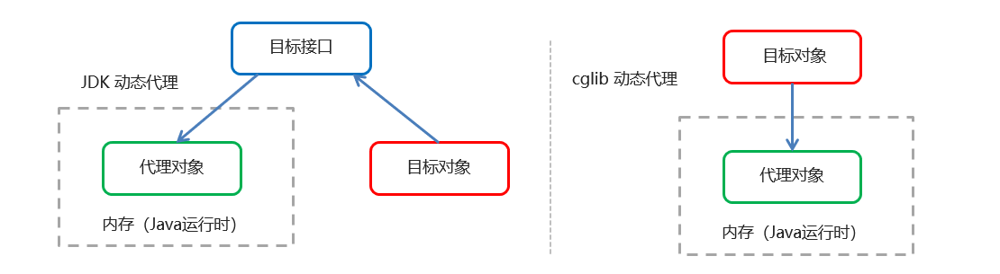

[TOC]

# 一、Spring入门

## 1. Spring入门

### 1.1 简介

Spring是分层的 Java SE/EE应用 full-stack 轻量级开源框架，以 IoC（**<span style="color:red;">I</span>**nverse <span style="color:red;">o</span>f **<span style="color:red;">C</span>**ontrol：反转控制）和 AOP（**<span style="color:red;">A</span>**spect **<span style="color:red;">O</span>**riented **<span style="color:red;">P</span>**rogramming：面向切面编程）为内核。

提供了展现层 SpringMVC和持久层 Spring JDBCTemplate以及业务层事务管理等众多的企业级应用技术，还能整合开源世界众多著名的第三方框架和类库，逐渐成为使用最多的Java EE 企业应用开源框架


### 1.2 Spring的优势

1. 非侵入式设计

Spring是一种非侵入式（non-invasive）框架，它可以使应用程序代码对框架的依赖最小化。

2. 方便解耦、简化开发

Spring就是一个大工厂，可以将所有对象的创建和依赖关系的维护工作都交给Spring容器的管理，大大的降低了组件之间的耦合性。

3. 支持AOP

Spring提供了对AOP的支持，它允许将一些通用任务，如安全、事物、日志等进行集中式处理，从而提高了程序的复用性。

4. 支持声明式事务处理

只需要通过配置就可以完成对事物的管理，而无须手动编程。

5. 方便程序的测试

Spring提供了对Junit4的支持，可以通过注解方便的测试Spring程序。

6. 方便集成各种优秀框架

Spring不排斥各种优秀的开源框架，其内部提供了对各种优秀框架（如Struts、Hibernate、MyBatis、Quartz等）的直接支持。

7. 降低Jave EE API的使用难度。

Spring对Java EE开发中非常难用的一些API（如JDBC、JavaMail等），都提供了封装，使这些API应用难度大大降低。


### 1.3 Spring的体系结构


### 1.4 Spring快速入门

#### Spring程序开发步骤

1. 导入Spring开发的基本包
2. 编写Dao层，Service层，及其实现类
3. 创建Spring核心配置文件（一般为applicationContext.xml）
4. 在Spring配置文件中配置Bean
5. 使用Spring的API获得Bean实例


#### 1.4.1 导入Spring开发的基本包

```xml
<!--导入spring的context坐标，context依赖core、beans、expression-->
<dependency>
    <groupId>org.springframework</groupId>
    <artifactId>spring-context</artifactId>
    <version>5.2.8.RELEASE</version>
</dependency>
```


#### 1.4.2 编写Dao, Service 接口及其实现类

```java
public interface UserDao {
    public void save();
}

public class UserDaoImpl implements UserDao {
    public void save() {
        System.out.println("UserDaoImpl saving...");
    }
}

public interface UserService {
    public void save();
}

public class UserServiceImpl implements UserService {
    private UserDao userDao;
    public void setUserDao(UserDao userDao) {
        this.userDao = userDao;
    }

    public void save() {
        userDao.save();
    }
}
```


#### 1.4.3 创建Spring配置文件

在类路径下（resources）创建applicationContext.xml配置文件

```xml
<?xml version="1.0" encoding="UTF-8"?>
<beans xmlns="http://www.springframework.org/schema/beans"
       xmlns:xsi="http://www.w3.org/2001/XMLSchema-instance"
       xsi:schemaLocation="http://www.springframework.org/schema/beans http://www.springframework.org/schema/beans/spring-beans.xsd">
</beans>
```


#### 1.4.4 在applicationContext.xml中配置Bean

```xml
<?xml version="1.0" encoding="UTF-8"?>
<beans xmlns="http://www.springframework.org/schema/beans"
       xmlns:xsi="http://www.w3.org/2001/XMLSchema-instance"
       xsi:schemaLocation="http://www.springframework.org/schema/beans http://www.springframework.org/schema/beans/spring-beans.xsd">

    <bean id="userDao" class="cn.onecolour.springDemo.dao.impl.UserDaoImpl"></bean>
    <bean id="userService" class="cn.onecolour.springDemo.service.impl.UserServiceImpl">
        <property name="userDao" ref="userDao" ></property>
        <!-- 通过set方法注入 -->
    </bean>

</beans>
```


#### 1.4.5 使用Spring的API获取Bean

```java
@Test
public void test1(){
    ApplicationContext app = new ClassPathXmlApplicationContext("applicationContext.xml");
    UserService userService = app.getBean("userService",UserService.class);
    userService.save();
}
```


***


## 2. Spring配置文件

### 2.1 Bean标签配置

#### 2.1.1 Bean标签基本配置

```xml
<bean id="ID" class="全类名"></bean>
```

用于配置对象交由Spring 来创建。

*默认*情况下它调用的是类中的无参构造函数，如果没有无参构造函数则不能创建成功。

基本属性：

id：Bean实例在Spring容器中的唯一标识

class：Bean的全限定名称


#### 2.1.2 Bean标签范围配置

```xml
<bean id="userDao" class="cn.onecolour.springDemo.dao.impl.UserDaoImpl" scope="singleton"></bean>
```

scope: 指对象的作用范围

| 取值范围                                  | 说明                                                         |
| ----------------------------------------- | :----------------------------------------------------------- |
| <span style="color:red;">singleton</span> | **默认值**，单例的                                           |
| <span style="color:red;">prototype</span> | 多例的                                                       |
| request                                   | WEB项目中，Spring 创建一个Bean的对象，将对象存入到request域中 |
| session                                   | WEB项目中，Spring创建一个Bean的对象，将对象存入到session域中 |
| global   session                          | WEB项目中，应用在Portle环境，如果没有Portlet   环境那么globalSession相当于   session |

1. 但scope的取值为**singleton**时

   Bean的实例化个数：1个

   Bean的实例化时间：但Spring核心文件被加载时，实例化配置的Bean实例

   Bean的生命周期：

   * 对象创建：当应用加载，创建容器时，对象就被创建了
   * 对象运行：只要容器在，对象一直活着
   * 对象销毁：当应用卸载，销毁容器时，对象就被销毁了

2. 但scope的取值为**prototype**时

   Bean的实例化个数：多个

   Bean的实例化时机：当调用getBean()方法时实例化Bean

   Bean的生命周期：

   * 对象创建：当使用对象时，创建新的对象实例
   * 对象运行：只要对象在使用中，就一直活着
   * 对象销毁：当对象长时间不用时，被 Java 的垃圾回收器回收了


#### 2.1.3 Bean标签生命周期配置

```xml
<bean id="userDao" class="cn.onecolour.springDemo.dao.impl.UserDaoImpl" init-method="init" destroy-method="destory"></bean>
```

* init-method：指定类中的初始化方法名称
* destroy-method：指定类中销毁方法名称


### 2.2 Bean实例化的三种方式

#### 2.2.1 使用无参构造方法实例化

```xml
<bean id="userDao" class="cn.onecolour.springDemo.dao.impl.UserDaoImpl"></bean>
```


#### 2.2.2 工厂静态方法实例化

工厂的静态方法返回Bean实例

```java
public class StaticFactoryBean {
    public static UserDao createUserDao(){    
    return new UserDaoImpl();
    }
}
```

```xml
<bean id="userDao" class="cn.onecolour.springDemo.factory.StaticFactoryBean" 
      factory-method="createUserDao" />
```


#### 2.2.3 工厂实例方法实例化

工厂的非静态方法返回Bean实例

```java
public class DynamicFactoryBean {  
	public UserDao createUserDao(){        
		return new UserDaoImpl(); 
	}
}
```

```xml
<bean id="factoryBean" class="cn.onecolour.springDemo.factory.DynamicFactoryBean"/>
<bean id="userDao" factory-bean="factoryBean" factory-method="createUserDao"/>
```


 ### 2.3 Bean的依赖注入

依赖注入（Dependency Injection）：它是 Spring 框架核心 IOC 的具体实现。

在编写程序时，通过控制反转，把对象的创建交给了 Spring，但是代码中不可能出现没有依赖的情况。

IOC 解耦只是降低他们的依赖关系，但不会消除。例如：业务层仍会调用持久层的方法。

那这种业务层和持久层的依赖关系，在使用 Spring 之后，就让 Spring 来维护了。

简单的说，就是坐等框架把持久层对象传入业务层，而不用我们自己去获取


#### 2.3.1 Bean依赖注入的三种方式

1. 构造方法 \<constructor-arg>

   ```java
   public class UserServiceImpl implements UserService {
       private UserDao userDao;
       public void UserService(UserDao userDao) {
           this.userDao = userDao;
       }
   
       public void save() {
           userDao.save();
       }
   }
   ```

   配置Spring容器调用有参构造时进行注入

   ```xml
   <bean id="userDao" class="cn.onecolour.springDemo.dao.impl.UserDaoImpl"/>
   <bean id="userService" class="cn.onecolour.springDemo.service.impl.UserServiceImpl">      		   	<constructor-arg name="userDao" ref="userDao"></constructor-arg>
   </bean>
   ```

   

2. set方法 \<property>

   ```java
   public class UserServiceImpl implements UserService {
       private UserDao userDao;
       public void setUserDao(UserDao userDao) {
           this.userDao = userDao;
       }
   
       public void save() {
           userDao.save();
       }
   }
   ```

   配置Spring容器调用set方法进行注入

   ```xml
   <bean id="userDao" class="cn.onecolour.springDemo.dao.impl.UserDaoImpl"/>
   <bean id="userService" class="cn.onecolour.springDemo.service.impl.UserServiceImpl">
   	<property name="userDao" ref="userDao"/>
   </bean>
   ```

   

3. set方法，p命名空间注入

P命名空间注入本质也是set方法注入，但比起上述的set方法注入更加方便，主要体现在配置文件中，如下：

首先，需要引入P命名空间：

```xml
<beans xmlns="http://www.springframework.org/schema/beans"
       xmlns:p="http://www.springframework.org/schema/p"
       xmlns:xsi="http://www.w3.org/2001/XMLSchema-instance"
       xsi:schemaLocation="http://www.springframework.org/schema/beans http://www.springframework.org/schema/beans/spring-beans.xsd">
```

其次，修改注入方式

```xml
<bean id="userService" class="cn.onecolour.springDemo.service.impl.UserServiceImpl" p:userDao-
 ref="userDao"/>
```


#### 2.3.2 Bean的依赖注入的数据类型

上面的操作，都是注入的引用Bean，处了对象的引用可以注入，普通数据类型，集合等都可以在容器中进行注入。

注入数据的三种数据类型 

* 普通数据类型

* 引用数据类型

* 集合数据类型

1. 基本数据类型的注入

   ```java
   public class UserServiceImpl implements UserService {
       private String name;
       private int age;
   
       public void setName(String name) {
           this.name = name;
       }
   
       public void setAge(int age) {
           this.age = age;
       }
   
       public void print(){
           System.out.println(name+"==="+age);
       }
   }
   ```

   ```xml
   <bean id="userService" class="cn.onecolour.springDemo.service.impl.UserServiceImpl">
       <property name="name" value="zhangsan"></property>
       <property name="age" value="21"></property>
   </bean>
   ```

2. 集合数据类型（List）的注入

   * List\<基本数据类型>的注入

     ```java
     public class UserServiceImpl implements UserService {
         private List<String> list;
         public void setList(List<String> list) {
             this.list = list;
         }
         public void save() {
             System.out.println(list);
         }
     }
     ```

     ```xml
     <bean id="userService" class="cn.onecolour.springDemo.service.impl.UserServiceImpl">
         <property name="list">
             <list>
                 <value>zhangsan</value>
                 <value>lisi</value>
                 <value>wangwu</value>
             </list>
         </property>
     </bean>
     ```

   * List\<T>的注入

     ```java
     public class User {
         private String username;
         private String password;
     
         public String getUsername() {
             return username;
         }
     
         public void setUsername(String username) {
             this.username = username;
         }
     
         public String getPassword() {
             return password;
         }
     
         public void setPassword(String password) {
             this.password = password;
         }
     
         @Override
         public String toString() {
             return "User{" +
                     "username='" + username + '\'' +
                     ", password='" + password + '\'' +
                     '}';
         }
     }
     ```

     ```java
     public class UserServiceImpl implements UserService {
         private List<User> list;
         public void save() {
             System.out.println(list);
         }
     
         public void setList(List<User> list) {
             this.list = list;
         }
     }
     ```

     ```xml
     <bean id="userService" class="cn.onecolour.springDemo.service.impl.UserServiceImpl">
         <property name="list">
             <list>
                 <ref bean="user1"/>
                 <ref bean="user2"/>
             </list>
         </property>
     </bean>
     <bean id="user1" class="cn.onecolour.springDemo.domain.User">
         <property name="username" value="zhangsan"/>
         <property name="password" value="1234567"/>
     </bean>
     <bean id="user2" class="cn.onecolour.springDemo.domain.User">
         <property name="username" value="lisi"/>
         <property name="password" value="7654321"/>
     </bean>
     ```

3. 集合数据类型（ Map)的注入

   * Map\<String, String>的注入

     ```java
     public class UserServiceImpl implements UserService {
         private Map<String, String> map;
     
         public void setMap(Map<String, String> map) {
             this.map = map;
         }
     
         public void save() {
             System.out.println(map);
         }
     }
     ```

     ```xml
     <bean id="userService" class="cn.onecolour.springDemo.service.impl.UserServiceImpl">
         <property name="map">
             <map>
                 <entry key="username" value="zhangsan"></entry>
                 <entry key="password" value="1234567"/>
             </map>
         </property>
     </bean>
     ```

   * Map<String, T>的注入

     ```java
     public class UserServiceImpl implements UserService {
         private Map<String, User> map;
     
         public void setMap(Map<String, User> map) {
             this.map = map;
         }
     
         public void save() {
             System.out.println(map);
         }
     }
     ```

     ```xml
     <bean id="userService" class="cn.onecolour.springDemo.service.impl.UserServiceImpl">
         <property name="map">
             <map>
                 <entry key="u1" value-ref="user1"></entry>
                 <entry key="u2" value-ref="user2"/>
             </map>
         </property>
     </bean>
     <bean id="user1" class="cn.onecolour.springDemo.domain.User">
         <property name="username" value="zhangsan"/>
         <property name="password" value="1234567"/>
     </bean>
     <bean id="user2" class="cn.onecolour.springDemo.domain.User">
         <property name="username" value="lisi"/>
         <property name="password" value="7654321"/>
     </bean>
     ```

     

4. 集合数据类型（Properties）的注入

   * 等效于Map\<String, String>的注入

   ```java
   public class UserServiceImpl implements UserService {
       private Properties pro;
   
       public void setPro(Properties pro) {
           this.pro = pro;
       }
       
       public void save() {
           userDao.save();
           System.out.println(pro);
       }
   }
   ```

   ```xml
   <bean id="userService" class="cn.onecolour.springDemo.service.impl.UserServiceImpl">
       <property name="pro">
           <props>
               <prop key="username">zhangsan</prop>
               <prop key="password">1234567</prop>
           </props>
       </property>
   </bean>
   ```

### 2.4 引入其他配置文件（分模块开发）

实际开发中，Spring的配置内容非常多，这就导致Spring配置很繁杂且体积很大，所以，可以将部分配置拆解到其他配置文件中，而在Spring主配置文件通过import标签进行加载

```xml
<import resource="applicationContext-xxx.xml"/>
```


### 2.5 配置文件加载properties

1. 首先加入context命名空间

```xml
<beans xmlns="http://www.springframework.org/schema/beans"
       xmlns:context="http://www.springframework.org/schema/context"
       xmlns:xsi="http://www.w3.org/2001/XMLSchema-instance"
       xsi:schemaLocation="http://www.springframework.org/schema/beans http://www.springframework.org/schema/beans/spring-beans.xsd
                           http://www.springframework.org/schema/context http://www.springframework.org/schema/context/spring-context.xsd">
```

2. 加载properties文件

```xml
<context:property-placeholder location="classpath:jdbc.properties"/>
```

3. 注入配置

   通过SPEL使用配置

```xml
<bean id="dataSource" class="com.mchange.v2.c3p0.ComboPooledDataSource">
    <property name="driverClass" value="${jdbc.driver}"/>
    <property name="jdbcUrl" value="${jdbc.url}"/>
    <property name="user" value="${jdbc.username}"/>
    <property name="password" value="${jdbc.password}"/>
</bean>
```


## 3. Spring相关API

### 3.1 ApplicationContext的继承体系

applicationContext：接口类型，代表应用上下文，可以通过其实例获得 Spring 容器中的 Bean 对象


### 3.2 ApplicationContext的实现类

1. ClassPathXmlApplicationContext 

​      它是从类的根路径下加载配置文件 (**推荐使用**)

2. FileSystemXmlApplicationContext 

    它是从磁盘路径上加载配置文件，配置文件可以在磁盘的任意位置。

3. AnnotationConfigApplicationContext

    当使用注解配置容器对象时，需要使用此类来创建 spring 容器。它用来读取注解。(**注解开发时使用**)

### 3.3 getBean()方法

```java
Object getBean(String name) throws BeansException;
Object getBean(String name, Object... args) throws BeansException;
// 当参数的数据类型是字符串时，表示根据Bean的id从容器中获得Bean实例，返回是Object，需要强转。
<T> T getBean(Class<T> requiredType) throws BeansException;
// 当参数的数据类型是Class类型时，表示根据类型从容器中匹配Bean实例，当容器中相同类型的Bean有多个时，则此方法会报错
<T> T getBean(String name, Class<T> requiredType) throws BeansException;
// 从容器中根据Bean的id==>name 获得Bean实例， 返回指定类型

```

```java
ApplicationContext app = new ClassPathXmlApplicationContext("applicationContext.xml");
UserService userService = app.getBean("userService",UserService.class);

ApplicationContext app = new ClassPathXmlApplicationContext("applicationContext.xml");
UserService userService = (UserService)app.getBean("userService");

ApplicationContext app = new ClassPathXmlApplicationContext("applicationContext.xml");
UserService userService = app.getBean(UserService.class);
```


***


# 二、Spring注解开发

## 1. Spring原始注解

解代替xml配置文件可以简化配置，提高开发效率。 

Spring原始注解主要是替代\<Bean>的配置


| 注解            | 说明                                           |
| --------------- | ---------------------------------------------- |
| **@Component**  | 使用在类上用于实例化Bean                       |
| **@Controller** | 使用在web层类上用于实例化Bean                  |
| **@Service**    | 使用在service层类上用于实例化Bean              |
| **@Repository** | 使用在dao层类上用于实例化Bean                  |
| **@Autowired**  | 使用在字段上用于根据类型依赖注入               |
| **@Qualifier**  | 结合@Autowired一起使用用于根据名称进行依赖注入 |
| **@Resource**   | 相当于@Autowired+@Qualifier，按照名称进行注入  |
| **@Value**      | 注入普通属性                                   |
| **@Scope**      | 标注Bean的作用范围                             |
| @PostConstruct  | 使用在方法上标注该方法是Bean的初始化方法       |
| @PreDestroy     | 使用在方法上标注该方法是Bean的销毁方法         |


**注意：**

使用原始注解进行开发时，需要在applicationContext.xml中配置组件扫描，作用是指定哪个包及其子包下的Bean需要进行扫描以便识别使用注解配置的类、字段和方法。

```xml
<!--注解的组件扫描-->
<context:component-scan base-package="cn.onecolour.springDemo"></context:component-scan>
```

使用@Compont或@Repository标识UserDaoImpl需要Spring进行实例化。

```java
//@Component("userDao")
@Repository("userDao")
public class UserDaoImpl implements UserDao {
    @Override
    public void save() {
    	System.out.println("save running... ...");
    }
}
```

使用@Compont或@Service标识UserServiceImpl需要Spring进行实例化

使用@Autowired或者@Autowired+@Qulifier或者@Resource进行userDao的注入

注：*使用@Resource需要先导入javax.annotation-api*

```xml
<dependency>
    <groupId>javax.annotation</groupId>
    <artifactId>javax.annotation-api</artifactId>
    <version>1.3.2</version>
</dependency>
```

```java
//@Component("userService")
@Service("userService")
public class UserServiceImpl implements UserService {
    /*@Autowired
    @Qualifier("userDao")*/
    @Resource(name="userDao")
    private UserDao userDao;
    @Override
    public void save() {       
   	  userDao.save();
    }
}
```

使用@Value进行基本数据类型的注入

```java
@Repository("userDao")
public class UserDaoImpl implements UserDao {
    @Value("注入普通数据")
    private String str;
    @Value("${jdbc.driver}")
    private String driver;
    @Override
    public void save() {
        System.out.println(str);
        System.out.println(driver);
        System.out.println("save running... ...");
    }
}
```

使用@Scope标注Bean的范围

```java
//@Scope("prototype")
@Scope("singleton")
public class UserDaoImpl implements UserDao {
   public void save(){
       System.out.println("UserDaoImpl saving...");
   }
}
```

使用@PostConstruct标注初始化方法，使用@PreDestroy标注销毁方法

```java
@PostConstruct
public void init(){
	System.out.println("初始化方法....");
}
@PreDestroy
public void destroy(){
	System.out.println("销毁方法.....");
}
```


## 2. Spring新注解

使用上面的注解还不能全部替代xml配置文件，还需要使用注解替代的配置如下：

非自定义的Bean的配置：\<bean>

加载properties文件的配置：\<context:property-placeholder>

组件扫描的配置：\<context:component-scan>

引入其他文件：\<import>

| 注解            | 说明                                                         |
| --------------- | ------------------------------------------------------------ |
| @Configuration  | 用于指定当前类是一个 Spring   配置类，当创建容器时会从该类上加载注解 |
| @ComponentScan  | 用于指定 Spring   在初始化容器时要扫描的包。   作用和在 Spring   的 xml 配置文件中的   <context:component-scan   base-package="com.itheima"/>一样 |
| @Bean           | 使用在方法上，标注将该方法的返回值存储到   Spring   容器中   |
| @PropertySource | 用于加载.properties   文件中的配置                           |
| @Import         | 用于导入其他配置类                                           |

@Configuration

@ComponentScan

@Import

```java
@Configuration
@ComponentScan("cn.onecolour.springDemo")
@Import({DataSourceConfiguration.class})
public class SpringConfiguration {
}
```

@PropertySource

@value

```java
@PropertySource("classpath:jdbc.properties")
public class DataSourceConfiguration {
    @Value("${jdbc.driver}")
    private String driver;
    @Value("${jdbc.url}")
    private String url;
    @Value("${jdbc.username}")
    private String username;
    @Value("${jdbc.password}")
    private String password;
    @Bean(name="dataSource")
    
    public DataSource getDataSource() throws PropertyVetoException { 
        ComboPooledDataSource dataSource = new ComboPooledDataSource(); 
        dataSource.setDriverClass(driver);
        dataSource.setJdbcUrl(url);
        dataSource.setUser(username);
        dataSource.setPassword(password);
        return dataSource;
    } 
}
```


# 三、Spring-test

## 1. 原始Junit测试Spring的问题

在测试类中，每个测试方法都有以下两行代码：

```java
ApplicationContext ac = new ClassPathXmlApplicationContext("bean.xml");
IAccountService as = ac.getBean("accountService",IAccountService.class);
```

这两行代码的作用是获取容器，如果不写的话，直接会提示空指针异常。所以又不能轻易删掉。

解决办法：

让SpringJunit负责创建Spring容器，但是需要将配置文件的名称告诉它

将需要进行测试Bean直接在测试类中进行注入


## 2. Spring集成Junit步骤

1. 导入spring集成Junit的坐标

2. 使用@RunWith注解改变JUnit的默认执行类

3. 使用@ContextConfiguration指定配置文件或配置类

4. 注入需要测试的对象

5. 创建测试方法进行测试

### 2.1 导包

导入spring集成Junit的坐标

```xml
<!--此处需要注意的是，spring5 及以上版本要求 junit 的版本必须是 4.12 及以上-->
<dependency>
    <groupId>junit</groupId>
    <artifactId>junit</artifactId>
    <version>4.12</version>
    <scope>test</scope>
</dependency>
<dependency>
    <groupId>org.springframework</groupId>
    <artifactId>spring-test</artifactId>
    <version>5.2.8.RELEASE</version>
</dependency>
```

### 2.2 使用@RunWith注解改变JUnit的默认执行类

```java
@RunWith(SpringJUnit4ClassRunner.class)
public class SpringTest {
}
```

### 2.3 使用@ContextConfiguration指定配置文件或配置类

```java
@RunWith(SpringJUnit4ClassRunner.class)
//加载spring核心配置文件
//@ContextConfiguration(value = {"classpath:applicationContext.xml"})
//加载spring核心配置类
@ContextConfiguration(classes = {SpringConfiguration.class})
public class SpringTest {
}
```

### 2.4 注入需要测试的对象

```java
@RunWith(SpringJUnit4ClassRunner.class)
@ContextConfiguration(classes = {SpringConfiguration.class})
public class SpringTest {
    @Resource(name = "userService")
    // @Autowired
    UserService userService;
}
```

### 2.4 创建测试方法进行测试

```java
@RunWith(SpringJUnit4ClassRunner.class)
@ContextConfiguration(classes = {SpringConfiguration.class})
public class SpringTest {
    @Resource(name = "userService")
    UserService userService;
    
    @Test
    public void testUserService() throws SQLException {
        userService.save();
    }
}
```


***


# 四、Spring AOP

## 1. AOP简介

### 1.1 什么是AOP

AOP 为 <span style="color:red;">A</span>spect <span style="color:red;">O</span>riented <span style="color:red;">P</span>rogramming 的缩写，意思为面向切面编程，是通过预编译方式和运行期动态代理实现程序功能的统一维护的一种技术。

AOP 是 OOP的延续，是软件开发中的一个热点，也是Spring框架中的一个重要内容，是函数式编程的一种衍生范型。利用AOP可以对业务逻辑的各个部分进行隔离，从而使得业务逻辑各部分之间的耦合度降低，提高程序的可重用性，同时提高了开发的效率。

> OOP: 面向对象编程 Object Oriented Programming


### 1.2 AOP的作用及其优势

作用：在程序运行期间，在不修改源码的情况下对方法进行功能增强

优势：减少重复代码，提高开发效率，并且便于维护


### 1.3 AOP的底层实现

实际上，AOP 的底层是通过 Spring 提供的的动态代理技术实现的。在运行期间，Spring通过动态代理技术动态的生成代理对象，代理对象方法执行时进行增强功能的介入，在去调用目标对象的方法，从而完成功能的增强。


### 1.4 AOP动态代理技术


常用的动态代理技术

JDK 代理 : 基于<span style="color:red;font-weight:bold">接口</span>的动态代理技术 ==>目标类必须为某一接口的实现类

cglib 代理：基于父类的动态代理技术



具体实现见	Java基础/设计模式.md


### 1.5 AOP相关概念

Spring 的 AOP 实现底层就是对上面的动态代理的代码进行了封装，封装后我们只需要对需要关注的部分进行代码编写，并通过配置的方式完成指定目标的方法增强。

 AOP 的常用相关术语如下：

- Target（目标对象）：代理的目标对象

- Proxy （代理）：一个类被 AOP 织入增强后，就产生一个结果代理类

- Joinpoint（连接点）：所谓连接点是指那些被拦截到的点。在spring中, 这些点指的是方法，因为spring只支持方法类型的连接点

- Pointcut（切入点）：所谓切入点是指我们要对哪些 Joinpoint 进行拦截的定义

- Advice（通知/ 增强）：所谓通知是指拦截到 Joinpoint 之后所要做的事情就是通知

- Aspect（切面）：是切入点和通知（引介）的结合

- Weaving（织入）：是指把增强应用到目标对象来创建新的代理对象的过程。spring采用动态代理织入，而AspectJ采用编译期织入和类装载期织入


### 1.6 AOP 开发明确的事项

* 在开发过程中需要注意：
    * 谁是切点（切点表达式配置）
  * 谁是通知（切面类中的增强方法）
  * 将切点和通知进行织入配置

#### 1.6.1 需要编写的内容

- 核心业务代码（目标类的目标方法）

- 切面类，切面类中有通知(增强功能方法)

- 在配置文件中，配置织入关系，即将哪些通知与哪些连接点进行结合

#### 1.6.2 AOP技术实现的内容

Spring 框架监控切入点方法的执行。一旦监控到切入点方法被运行，使用代理机制，动态创建目标对象的代理对象，根据通知类别，在代理对象的对应位置，将通知对应的功能织入，完成完整的代码逻辑运行。


#### 1.6.3 AOP底层使用的代理方法

在 spring 中，框架会根据目标类是否实现了接口来决定采用哪种动态代理的方式。


## 2. 基于XML的AOP开发

1. 导入 AOP 相关坐标

2. 创建目标接口和目标类（内部有切点）

3. 创建切面类（内部有增强方法）

4. 将目标类和切面类的对象创建权交给 spring

5. 在 applicationContext.xml 中配置织入关系

6. 测试代码


### 2.1 导入AOP相关坐标

spring-context中含有aop，官方推荐使用aspectj

```xml
<!--导入spring的context坐标，context依赖aop-->
<dependency>
    <groupId>org.springframework</groupId>
    <artifactId>spring-context</artifactId>
    <version>5.2.8.RELEASE</version>
</dependency>
<!-- aspectj -->
<dependency>
    <groupId>org.aspectj</groupId>
    <artifactId>aspectjweaver</artifactId>
    <version>1.9.6</version>
</dependency>
```

### 2.2 创建目标接口和目标类（内部有切点）

目标接口：

```java
public interface TargetInterface {
    public void method();
}
```

目标类：

```java
public class Target implements TargetInterface{
    @Override
    public void method() {
        System.out.println("Target is running....");
    }
}
```

### 2.3 创建切面类

```java
public class TargetAspect {

    // 前置增强方法
    public void before(){
        System.out.println("前置代码增强.....");
    }
}
```

### 2.4 在Spring配置文件中创建Bean

```xml
<!-- 目标类 -->
<bean id="target" class="cn.onecolour.aop.Target"/>
<!-- 切面 -->
<bean id="targetAspect" class="cn.onecolour.aop.TargetAspect"/>
```

### 2.5 配置织入关系

需要先引入aop

```xml
<beans xmlns="http://www.springframework.org/schema/beans"
       xmlns:aop="http://www.springframework.org/schema/aop"
       xmlns:xsi="http://www.w3.org/2001/XMLSchema-instance"
       xsi:schemaLocation="http://www.springframework.org/schema/beans http://www.springframework.org/schema/beans/spring-beans.xsd
                           http://www.springframework.org/schema/aop http://www.springframework.org/schema/aop/spring-aop.xsd
">
```

配置织入关系

```xml
<!-- 配置织入关系 -->
<aop:config>
    <!--引用targetAspect的Bean为切面对象-->
    <aop:aspect ref="targetAspect">
        <!--配置Target的method方法执行时要进行targetAspect的before方法前置增强-->
        <aop:before method="before" pointcut="execution(public void cn.onecolour.aop.Target.method())"/>
    </aop:aspect>
</aop:config>
```

### 2.6 测试

```java
@RunWith(SpringJUnit4ClassRunner.class)
@ContextConfiguration("classpath:applicationContext.xml")
public class TargetTest {

    @Autowired
    private TargetInterface target;

    @Test
    public void test1(){
        target.method();
    }
}
```

输出结果：


## 3. AOP XML配置详解

```xml
<aop:config>
    <aop:aspect ref=“切面类”>
        <aop:通知类型 method=“切面类中方法名” pointcut=“切点表达式"></aop:before>
    </aop:aspect>
</aop:config>
```

### 3.1 切点表达式 pointcut

切点表达式的写法：

```xml
execution([修饰符] 返回值类型 包名.类名.方法名(参数))
```

- 访问修饰符可以省略
- 返回值类型、包名、类名、方法名可以使用星号*  代表任意
- 包名与类名之间一个点 . 代表当前包下的类，两个点 .. 表示当前包及其子包下的类
- 参数列表可以使用两个点 .. 表示任意个数，任意类型的参数列表

例子：

```xml
execution(public void cn.onecolour.aop.Target.method())	
execution(void cn.onecolour.aop.Target.*(..))
execution(* cn.onecolour.aop.*.*(..))
execution(* cn.onecolour.aop..*.*(..))
execution(* *..*.*(..))
```

### 3.2 通知类型

```xml
<aop:通知类型 method=“切面类中方法名” pointcut=“切点表达式"></aop:通知类型>
```

| 名称 | 标签 | 说明 |
| :--: | :--: | :--- |
|前置通知|\<aop:before>|用于配置前置通知，指定增强的方法在切入点方法之**前**执行|
|后置通知|\<aop:after-returning>|用于配置后置通知，指定增强的方法在切入点方法之**后**执行|
|环绕通知|\<aop:around>|用于配置环绕通知，指定增强的方法在切入点方法之前之后都执行|
|异常抛出通知|\<aop:after-throwing>|用于配置异常抛出通知，指定增强的方法在**出现异常时**执行|
|最终通知|\<aop:after>|用于配置最终通知，无论增强方法是否执行异常都会执行|

注意：环绕通知函数需要ProceedingJoinPoint类型的参数，示例：

```java
// 环绕增强方法
public Object around(ProceedingJoinPoint point) throws Throwable {
    System.out.println("环绕增强前......");
    point.proceed(); // 放行
    System.out.println("环绕增强后......");
    return point;
}
```


### 3.3 切点表达式的抽取

当多个增强的切点表达式相同时，可以将切点表达式进行抽取，在增强中使用 pointcut-ref 属性代替 pointcut 属性来引用抽取后的切点表达式。

```xml
<!-- 目标类 -->
<bean id="target" class="cn.onecolour.aop.Target"/>
<!-- 切面 -->
<bean id="targetAspect" class="cn.onecolour.aop.TargetAspect"/>
<!-- 配置织入关系 -->
<aop:config>
    <!--引用targetAspect的Bean为切面对象-->
    <aop:aspect ref="targetAspect">
        <aop:pointcut id="pointCut1" expression="execution(* cn.onecolour.aop.*.*(..))"/>
        <aop:before method="before" pointcut-ref="pointCut1"/>
        <aop:around method="around" pointcut-ref="pointCut1"/>
        <aop:after-returning method="afterReturning" pointcut-ref="pointCut1"/>
    </aop:aspect>
</aop:config>
```


## 4. 基于注解的AOP开发

1. 创建目标接口和目标类（内部有切点）

2. 创建切面类（内部有增强方法）

3. 将目标类和切面类的对象创建权交给 spring

4. 在切面类中使用注解配置织入关系

5. 在配置文件中开启组件扫描和 AOP 的自动代理

6. 测试

### 4.1 创建目标接口和目标类(内部有切点)

```java
public interface TargetInterface {
    public void method();
}

public class Target implements TargetInterface{
    public void method() {
        System.out.println("Target is running....");
    }
}
```

### 4.2 创建切面类

```java
public class TargetAspect {
    public Object around(ProceedingJoinPoint point) throws Throwable {
        System.out.println("环绕增强前......");
        point.proceed();
        System.out.println("环绕增强后......");
        return point;
    }
}
```

### 4.4 注解配置

目标类：

```java
@Component("target")
public class Target implements TargetInterface{
    public void method() {
        System.out.println("Target is running....");
    }
}
```

切面类：

```java
@Component("targetAspect")
@Aspect
public class TargetAspect {
    // 环绕增强方法
    @Around("TargetAspect.point()")
    public Object around(ProceedingJoinPoint point) throws Throwable {
        System.out.println("环绕增强前......");
        point.proceed();
        System.out.println("环绕增强后......");
        return point;
    }
    
    // 切点表达式抽取
    @Pointcut("execution(* cn.onecolour.aop.*.*(..))")
    public void point(){}
}
```

### 4.5 在配置文件中开启组件扫描和 AOP 的自动代理

```xml
<!-- 开启组件扫描 -->
<context:component-scan base-package="cn.onecolour.aop"/>
<!--aop的自动代理-->
<aop:aspectj-autoproxy />
```

### 4.6 测试

```java
@RunWith(SpringJUnit4ClassRunner.class)
@ContextConfiguration("classpath:applicationContext.xml")
public class TargetTest {

    @Autowired
    private TargetInterface target;

    @Test
    public void test1(){
        target.method();
    }
}
```

控制台输出：


## 5. 注解配置AOP详解

### 5.1 注解通知的类型

通知配置的语法	@通知注解(“切点表达式")

|     名称     | 标签            | 说明                                                       |
| :----------: | :-------------- | :--------------------------------------------------------- |
|   前置通知   | @Before         | 用于配置前置通知，指定增强的方法在切入点方法之**前**执行   |
|   后置通知   | @AfterReturning | 用于配置后置通知，指定增强的方法在切入点方法之**后**执行   |
|   环绕通知   | @Around         | 用于配置环绕通知，指定增强的方法在切入点方法之前之后都执行 |
| 异常抛出通知 | @AfterThrowing  | 用于配置异常抛出通知，指定增强的方法在**出现异常时**执行   |
|   最终通知   | @After          | 用于配置最终通知，无论增强方法是否执行异常都会执行         |

### 5.2 切点表达式的抽取

同 xml配置
aop 一样，我们可以将切点表达式抽取。抽取方式是在切面内定义方法，在该方法上使用@Pointcut注解定义切点表达式，然后在在增强注解中进行引用。具体如下：

```java
@Component("targetAspect")
@Aspect
public class TargetAspect {
    // 前置增强方法
    @Before("TargetAspect.point()")
    public void before(){
        System.out.println("前置代码增强.....");
    }
    
    // 切点表达式抽取
    @Pointcut("execution(* cn.onecolour.aop.*.*(..))")
    public void point(){}
}
```


***


# 五、Spring JdbcTemplate

## 1. JdbcTemplate 基本使用

### 1.1 JdbcTemplate是什么？

JdbcTemplate是spring框架中提供的一个对象，是对原始繁琐的Jdbc API对象的简单封装。spring框架为我们提供了很多的操作模板类。

例如：操作关系型数据的JdbcTemplate和HibernateTemplate，操作nosql数据库的RedisTemplate，操作消息队列的JmsTemplate等等。


### 1.2 JdbcTemplate 基本使用

①导入数据库驱动以及spring-jdbc和spring-tx坐标

②创建数据库表和实体

③XML注入jdbcTemplate

④执行数据库操作

#### 1.2.1 导入坐标

导入spring-jdbc, spring-tx(事务控制), spring-context 以及数据源和数据库驱动

```xml
<!-- spring-tx -->
<dependency>
    <groupId>org.springframework</groupId>
    <artifactId>spring-tx</artifactId>
    <version>5.2.8.RELEASE</version>
</dependency>
<!-- spring-jdbc -->
<dependency>
    <groupId>org.springframework</groupId>
    <artifactId>spring-jdbc</artifactId>
    <version>5.2.8.RELEASE</version>
</dependency>
<!--导入spring的context坐标，context依赖core、beans、expression-->
<dependency>
    <groupId>org.springframework</groupId>
    <artifactId>spring-context</artifactId>
    <version>5.2.8.RELEASE</version>
</dependency>
<!-- 数据库驱动 -->
<dependency>
    <groupId>mysql</groupId>
    <artifactId>mysql-connector-java</artifactId>
    <version>5.1.49</version>
</dependency>
<!-- 数据库连接池 -->
<dependency>
    <groupId>com.alibaba</groupId>
    <artifactId>druid</artifactId>
    <version>1.1.23</version>
</dependency>
```

#### 1.2.2 创建数据表和实体类

数据测试表

```sql
CREATE TABLE `account` (
  `name` char(20) NOT NULL,
  `money` double(10,2) DEFAULT NULL,
  PRIMARY KEY (`name`)
) ENGINE=InnoDB DEFAULT CHARSET=utf8;
```

实体类

```java
public class Account {
    private String name;
    private double money;
    
    // Setter And Getter Here

    @Override
    public String toString() {
        return "Account{" +
                "name='" + name + '\'' +
                ", money=" + money +
                '}';
    }
}
```


#### 1.2.3 注入jdbcTemplate

数据库配置如下：

```properties
jdbc.driver=com.mysql.jdbc.Driver
jdbc.url=jdbc:mysql://192.168.1.3/test?useSSL=false&characterEncoding=utf-8
jdbc.username=root
jdbc.password=root
jdbc.initialSize=5
jdbc.maxActive=10
jdbc.maxWait=3000
```

applicationContext.xml Spring配置文件

```xml
<!-- 载入数据库配置 -->
<context:property-placeholder location="classpath:jdbc.properties"/>
<!-- 数据库连接池 -->
<bean id="dataSource" class="com.alibaba.druid.pool.DruidDataSource">
    <property name="driverClassName" value="${jdbc.driver}"/>
    <property name="url" value="${jdbc.url}"/>
    <property name="username" value="${jdbc.username}"/>
    <property name="password" value="${jdbc.password}"/>
    <property name="initialSize" value="${jdbc.initialSize}"/>
    <property name="maxActive" value="${jdbc.maxActive}"/>
    <property name="maxWait" value="${jdbc.maxWait}"/>
</bean>
<!-- 将数据库注入jdbcTemplate -->
<bean id="jdbcTemplate" class="org.springframework.jdbc.core.JdbcTemplate">
    <property name="dataSource" ref="dataSource"/>
</bean>
```


#### 1.2.4 在测试类中执行数据库操作

```java
@RunWith(SpringJUnit4ClassRunner.class)
@ContextConfiguration("classpath:applicationContext.xml")
public class JdbcTemplateTest {

    @Autowired
    private JdbcTemplate jdbcTemplate;

    // 查询所有
    @Test
    public void queryAllTest(){
        List<Account> accounts = jdbcTemplate.query("SELECT * FROM account", new BeanPropertyRowMapper<Account>(Account.class));
        System.out.println(accounts);
    }

    // 查询一个
    @Test
    public void queryOneTest(){
        Account account = jdbcTemplate.queryForObject("SELECT * FROM account WHERE name=?", new BeanPropertyRowMapper<Account>(Account.class), "王五");
        System.out.println(account);
    }

    // 聚合查询
    @Test
    public void queryCountTest(){
        Integer integer = jdbcTemplate.queryForObject("SELECT COUNT(*) FROM account", Integer.class);
        System.out.println(integer);
    }

    // 添加
    @Test
    public void insertTest(){
        jdbcTemplate.update("INSERT INTO account VALUES(?,?)", "张三", 4000);
        int i = jdbcTemplate.update("INSERT INTO account VALUES(?,?)", "王五", 2000);
        System.out.println(i);
    }

    // 修改
    @Test
    public void updateTest(){
        int i = jdbcTemplate.update("UPDATE account SET money=? WHERE name=?", 3500, "王五");
        System.out.println(i);
    }
}
```


## 2. 声明式事务控制

Spring 的声明式事务顾名思义就是采用声明的方式来处理事务。这里所说的声明，就是指在配置文件中声明，用在 Spring 配置文件中声明式的处理事务来代替代码式的处理事务。

**声明式事务处理的作用**

- 事务管理不侵入开发的组件。具体来说，业务逻辑对象就不会意识到正在事务管理之中，事实上也应该如此，因为事务管理是属于系统层面的服务，而不是业务逻辑的一部分，如果想要改变事务管理策划的话，也只需要在定义文件中重新配置即可
- 在不需要事务管理的时候，只要在设定文件上修改一下，即可移去事务管理服务，无需改变代码重新编译，这样维护起来极其方便

**注意：Spring 声明式事务控制底层就是AOP。**

### 2.1 编程式事务控制相关对象

#### 2.1.1 PlatformTransactionManager 事务管理器平台

PlatformTransactionManager 接口是 spring 的事务管理器，它里面提供了我们常用的操作事务的方法。

| 方法                                                         | 说明               |
| :--| :-- |
| TransactionStatus getTransaction(TransactionDefinition definition) | 获取事物的状态信息 |
|void commit(TransactionStatus status)|提交事务|
|void rollback(TransactionStatus status)|回滚事务|

注意：

PlatformTransactionManager 是接口类型，不同的 Dao 层技术则有不同的实现类，例如：Dao 层技术是**jdbc** 或 **mybatis** 时：**org.springframework.jdbc.datasource.DataSourceTransactionManager** 

Dao 层技术是**hibernate**时：**org.springframework.orm.hibernate5.HibernateTransactionManager**

#### 2.1.2 TransactionDefinition 事务定义对象

TransactionDefinition 是事务的定义信息对象，里面有如下方法：

| 方法                                        | 说明                           |
| :------------------------------------------ | :----------------------------- |
| int getIsolationLevel()                     | 获得事务的隔离级别             |
| int getPropagationBehavior()                | 获得事务的传播行为             |
| int getTimeout()                            | 获得超时时间                   |
| boolean isReadOnly()                        | 是否只读                       |
| static TransactionDefinition withDefaults() | 返回一个默认设置的事务定义对象 |

##### 1. 事务隔离级别

设置隔离级别，可以解决事务并发产生的问题，如脏读、不可重复读和虚读。

- ISOLATION_DEFAULT

- ISOLATION_READ_UNCOMMITTED

- ISOLATION_READ_COMMITTED    <span style="color:red;">    Oracle默认事务级别</span>

- ISOLATION_REPEATABLE_READ<span style="color:red;">    Mysql默认事务级别</span>

- ISOLATION_SERIALIZABLE

##### 2. 事务传播行为

- **REQUIRED：如果当前没有事务，就新建一个事务，如果已经存在一个事务中，加入到这个事务中。一般的选择（默认值）**

- **SUPPORTS：支持当前事务，如果当前没有事务，就以非事务方式执行（没有事务）**

- MANDATORY：使用当前的事务，如果当前没有事务，就抛出异常

- REQUERS_NEW：新建事务，如果当前在事务中，把当前事务挂起。

- NOT_SUPPORTED：以非事务方式执行操作，如果当前存在事务，就把当前事务挂起

- NEVER：以非事务方式运行，如果当前存在事务，抛出异常

- NESTED：如果当前存在事务，则在嵌套事务内执行。如果当前没有事务，则执行 REQUIRED 类似的操作

- 超时时间：默认值是-1，没有超时限制。如果有，以秒为单位进行设置

- 是否只读：建议查询时设置为只读


#### 2.1.3 TransactionStatus 事务运行状态

TransactionStatus 接口提供的是事务具体的运行状态，继承自TransactionExecution, SavepointManager, Flushable，方法如下

| 方法                        | 说明                             |
| :-------------------------- | :------------------------------- |
| boolean hasSavepoint();     | 返回是否存储回滚点               |
| boolean isCompleted();      | 返回当前事务是否完成             |
| boolean isNewTransaction(); | 返回当前事务是否是否是新事物     |
| boolean isRollbackOnly();   | 返回当前事务是否已经被设置为回滚 |

#### 2.1.4 编程式事务控制案例

数据注入统一采用XML配置文件注入

* Dao层

  * AccountDao接口

  ```java
  public interface AccountDao {
      public Double queryMoney(String name);
      public boolean updateMoney(String name,double cash);
  }
  ```

  * AccountDaoImpl实现类  

  ```java
  public class AccountDaoImpl implements AccountDao {
      private JdbcTemplate jdbcTemplate;
  
      public void setJdbcTemplate(JdbcTemplate jdbcTemplate) {
          this.jdbcTemplate = jdbcTemplate;
      }
  
      @Override
      public Double queryMoney(String name) {
          return jdbcTemplate.queryForObject("SELECT money FROM account WHERE name=?", Double.class, name);
      }
  
      @Override
      public boolean updateMoney(String name, double cash) {
          try {
              int i = jdbcTemplate.update("UPDATE account SET money=? WHERE name=?", cash, name);
              return i == 1;
          } catch (Exception e) {
              return false;
          }
  
      }
  }
  ```

* Service层

  * AccountService接口 

  ```java
  public interface AccountService {
      // 支付方法
      public boolean pay(String from, String to,double cash);
  }
  ```

  * AccountServiceImpl 实现类

  ```java
  public class AccountServiceImpl implements AccountService {
  
  
      private AccountDao accountDao;
  
      public void setAccountDao(AccountDao accountDao) {
          this.accountDao = accountDao;
      }
  
      private PlatformTransactionManager transactionManager;
  
      public void setTransactionManager(PlatformTransactionManager transactionManager) {
          this.transactionManager = transactionManager;
      }
  
      @Override
      public boolean pay(String from, String to, double cash) {
          boolean a = false;
          boolean b = false;
          TransactionStatus status = transactionManager.getTransaction(TransactionDefinition.withDefaults());
          try{
              Double fromMoney = accountDao.queryMoney(from);
              Double toMoney = accountDao.queryMoney(to);
              a = accountDao.updateMoney(from, fromMoney - cash);
              /*int i= 1/0;*/
              b = accountDao.updateMoney(to, toMoney + cash);
          } catch (Exception e){
              transactionManager.rollback(status);
              return false;
          }
          transactionManager.commit(status);
          return a && b;
      }
  }
  ```

* 相关配置

  * applicationContext.xml

  ```xml
  <?xml version="1.0" encoding="UTF-8"?>
  <beans xmlns="http://www.springframework.org/schema/beans"
         xmlns:context="http://www.springframework.org/schema/context"
         xmlns:xsi="http://www.w3.org/2001/XMLSchema-instance"
         xsi:schemaLocation="
         http://www.springframework.org/schema/beans http://www.springframework.org/schema/beans/spring-beans.xsd
         http://www.springframework.org/schema/context  http://www.springframework.org/schema/context/spring-context.xsd
  ">
      <!-- 载入数据库配置 -->
      <context:property-placeholder location="classpath:jdbc.properties"/>
      <!-- 数据库连接池 -->
      <bean id="dataSource" class="com.alibaba.druid.pool.DruidDataSource">
          <property name="driverClassName" value="${jdbc.driver}"/>
          <property name="url" value="${jdbc.url}"/>
          <property name="username" value="${jdbc.username}"/>
          <property name="password" value="${jdbc.password}"/>
          <property name="initialSize" value="${jdbc.initialSize}"/>
          <property name="maxActive" value="${jdbc.maxActive}"/>
          <property name="maxWait" value="${jdbc.maxWait}"/>
      </bean>
      <!-- 将数据库注入jdbcTemplate -->
      <bean id="jdbcTemplate" class="org.springframework.jdbc.core.JdbcTemplate">
          <property name="dataSource" ref="dataSource"/>
      </bean>
  
      <!-- Dao层 -->
      <bean id="accountDao" class="cn.onecolour.dao.impl.AccountDaoImpl">
          <property name="jdbcTemplate" ref="jdbcTemplate"/>
      </bean>
      <!-- Service层 -->
      <bean id="accountService" class="cn.onecolour.service.impl.AccountServiceImpl">
          <property name="accountDao" ref="accountDao"/>
          <property name="transactionManager" ref="transactionManager"/>
      </bean>
  
      <!-- 平台事务管理器 -->
      <bean id="transactionManager" class="org.springframework.jdbc.datasource.DataSourceTransactionManager">
          <property name="dataSource" ref="dataSource"/>
      </bean>
  
  </beans>
  ```

  * jdbc.properties

  ```properties
  jdbc.driver=com.mysql.jdbc.Driver
  jdbc.url=jdbc:mysql://192.168.1.3/test?useSSL=false&characterEncoding=utf-8
  jdbc.username=root
  jdbc.password=root
  jdbc.initialSize=5
  jdbc.maxActive=10
  jdbc.maxWait=3000
  ```

* 测试类

  ```java
  @RunWith(SpringJUnit4ClassRunner.class)
  @ContextConfiguration("classpath:applicationContext.xml")
  public class CodingTransactionControl {
  
      @Autowired
      private AccountService accountService;
  
      @Test
      public void test1(){
          boolean pay = accountService.pay("张三", "王五", 285);
          System.out.println(pay);
      }
  }
  ```

数据库初始数据：


运行测试类中test1()后：


将AccountServiceImpl中的int i = 1/0;打开后：

数据库数据不变，


### 2.2 基于XML的声明式事务控制

由于Spring的事务控制基于AOP因此，在配置XML之前需要明确：

- 谁是切点？
- 谁是通知？
- 配置切面？

#### 2.2.1 引入tx命名空间

```xml
<?xml version="1.0" encoding="UTF-8"?>
<beans xmlns="http://www.springframework.org/schema/beans"
       xmlns:context="http://www.springframework.org/schema/context"
       xmlns:tx="http://www.springframework.org/schema/tx"
       xmlns:xsi="http://www.w3.org/2001/XMLSchema-instance"
       xsi:schemaLocation="
       http://www.springframework.org/schema/beans http://www.springframework.org/schema/beans/spring-beans.xsd
       http://www.springframework.org/schema/context  http://www.springframework.org/schema/context/spring-context.xsd
       http://www.springframework.org/schema/tx  http://www.springframework.org/schema/tx/spring-tx.xsd
">
```

#### 2.2.2 配置事务增强

<span style="color:red;">注意：事务控制时，操作失败需要回滚必须要有异常抛出，Spring 的事务控制是捕获到RuntimeExpection，判断是否回滚。因此使用try...catch时最后一定要throw new RuntimeExpection(String message)</span>

```xml
<!-- 平台事务管理器 -->
<bean id="transactionManager" class="org.springframework.jdbc.datasource.DataSourceTransactionManager">
    <property name="dataSource" ref="dataSource"/>
</bean>
<!-- 事务增强配置 -->
<tx:advice id="transactionInterceptor" transaction-manager="transactionManager">
    <tx:attributes>
        <!-- 切点方法 -->
        <tx:method name="pay"/>
    </tx:attributes>
</tx:advice>
```

注意 切点方法\<tx:method name="*"/>的详细参数：

```xml
<tx:method name="pay" propagation="REQUIRED" isolation="DEFAULT" read-only="false" timeout="-1" rollback-for="java.lang.Exception"/>
```

- name：切点方法名称 （用*代表通配符）
- isolation:事务的隔离级别
- propogation：事务的传播行为
- timeout：超时时间
- read-only：是否只读
- rollback-for：发生什么错误时回滚
- no-rollback-for: 发生什么错误时不回滚

#### 2.2.3 事务AOP织入

```xml
<!-- 事务的织入  -->
<aop:config>
    <aop:advisor advice-ref="transactionInterceptor" pointcut="execution(* cn.onecolour.service.impl.*.*(..))"/>
</aop:config>
```


### 2.3 基于注解的声明式事务控制

一般来说，在applicationContext.xml文件中，放置第三方包产生的Bean，自己写的程序则直接使用注解

#### 2.3.1 编写AccountDao

```java
@Repository("accountDao")
public class AccountDaoImpl implements AccountDao {
    @Resource(name = "jdbcTemplate")
    private JdbcTemplate jdbcTemplate;
    
    @Override
    public Double queryMoney(String name) {
        return jdbcTemplate.queryForObject("SELECT money FROM account WHERE name=?", Double.class, name);
    }

    @Override
    public boolean updateMoney(String name, double cash) {
        try {
            int i = jdbcTemplate.update("UPDATE account SET money=? WHERE name=?", cash, name);
            return i == 1;
        } catch (Exception e) {
            return false;
        }

    }
}
```

#### 2.3.2 编写 AccoutService

```java
@Service("accountService")
@Transactional(propagation = Propagation.REQUIRED)
public class AccountServiceImpl implements AccountService {
    @Resource(name = "accountDao")
    private AccountDao accountDao;
    
    @Override
    public boolean pay(String from, String to, double cash) {
        boolean a = false;
        boolean b = false;
        Double fromMoney = accountDao.queryMoney(from);
        Double toMoney = accountDao.queryMoney(to);
        a = accountDao.updateMoney(from, fromMoney - cash);
//        int i = 1 / 0;
        b = accountDao.updateMoney(to, toMoney + cash);
        return a && b;
    }
}
```

<span style="color:red;">注意：事务控制时，操作失败需要回滚必须要有异常抛出，Spring 的事务控制是捕获到RuntimeExpection，判断是否回滚</span>

#### 2.3.3 applicationContext.xml

```xml
<?xml version="1.0" encoding="UTF-8"?>
<beans xmlns="http://www.springframework.org/schema/beans"
       xmlns:context="http://www.springframework.org/schema/context"
       xmlns:tx="http://www.springframework.org/schema/tx"
       xmlns:xsi="http://www.w3.org/2001/XMLSchema-instance"
       xsi:schemaLocation="
       http://www.springframework.org/schema/beans http://www.springframework.org/schema/beans/spring-beans.xsd
       http://www.springframework.org/schema/context  http://www.springframework.org/schema/context/spring-context.xsd
       http://www.springframework.org/schema/tx  http://www.springframework.org/schema/tx/spring-tx.xsd
">
    <!-- 载入数据库配置 -->
    <context:property-placeholder location="classpath:jdbc.properties"/>
    <!-- 数据库连接池 -->
    <bean id="dataSource" class="com.alibaba.druid.pool.DruidDataSource">
        <property name="driverClassName" value="${jdbc.driver}"/>
        <property name="url" value="${jdbc.url}"/>
        <property name="username" value="${jdbc.username}"/>
        <property name="password" value="${jdbc.password}"/>
        <property name="initialSize" value="${jdbc.initialSize}"/>
        <property name="maxActive" value="${jdbc.maxActive}"/>
        <property name="maxWait" value="${jdbc.maxWait}"/>
    </bean>
    <!-- 将数据库注入jdbcTemplate -->
    <bean id="jdbcTemplate" class="org.springframework.jdbc.core.JdbcTemplate">
        <property name="dataSource" ref="dataSource"/>
    </bean>
    
    <!-- 平台事务管理器 -->
    <bean id="transactionManager" class="org.springframework.jdbc.datasource.DataSourceTransactionManager">
        <property name="dataSource" ref="dataSource"/>
    </bean>
    
    <!-- 组件扫描 -->
    <context:component-scan base-package="cn.onecolour"/>
    <!-- 事务的注解驱动 -->
    <tx:annotation-driven transaction-manager="transactionManager"/>
    

</beans>
```

#### 2.3.4 注意事项

1. 使用 @Transactional 在需要进行事务控制的类或是方法上修饰，注解可用的属性同 xml 配置方式，例如隔离级别、传播行为等。

2. 注解使用在类上，那么该类下的所有方法都使用同一套注解参数配置。

3. 使用在方法上，不同的方法可以采用不同的事务参数配置。

4. Xml配置文件中要开启事务的注解驱动 <tx:annotation-driven transaction-manager="事务驱动器"/>


