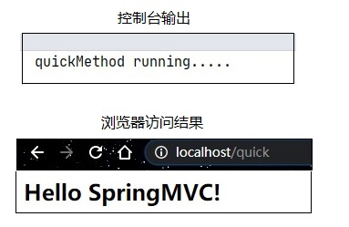
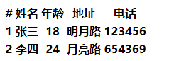

[TOC]

# 一、Spring与Web环境的集成


## 1. 基本配置

### 1.1 ApplicationContext（应用上下文对象）获取方式

应用上下文对象是通过`new ClasspathXmlApplicationContext(spring配置文件.xml)` 方式获取的，但是每次从容器中获得Bean时都要编写`new ClasspathXmlApplicationContext(spring配置文件.xml) `，这样的弊端是配置文件加载多次，应用上下文对象创建多次。

在Web项目中，可以使用`ServletContextListener`监听Web应用的启动，我们可以在Web应用启动时，就加载Spring的配置文件，创建应用上下文对象ApplicationContext，在将其存储到最大的域servletContext域中，这样就可以在任意位置从域中获得应用上下文ApplicationContext对象了。

### 1.2 加载Spring配置文件

手动实现ContextLoaderListener

<details>
    <summary>展开查看</summary>
    <pre>
    <code>
<span style="color:red">ContextLoaderListener类</span>
public class ContextLoaderListener implements ServletContextListener {
    public void contextInitialized(ServletContextEvent servletContextEvent) {
        ServletContext servletContext = servletContextEvent.getServletContext();
        //读取web.xml中的全局参数
        String contextConfigLocation = servletContext.getInitParameter("contextConfigLocation");
        ApplicationContext app = new ClassPathXmlApplicationContext(contextConfigLocation);
        //将Spring的应用上下文对象存储到ServletContext域中
        servletContext.setAttribute("app",app);
        System.out.println("spring容器创建完毕....");
    }
    public void contextDestroyed(ServletContextEvent servletContextEvent) {
    }
}
	</code>
	<code>
<span style="color:red">web.xml配置</span>
&lt;!--全局初始化参数--&gt;
&lt;context-param&gt;
	&lt;param-name&gt;contextConfigLocation&#60;/param-name&gt;
	&lt;param-value&gt;classpath:applicationContext.xml&lt;/param-value&gt;
&lt;/context-param&gt;
&lt;!--配置监听器--&gt;
&lt;listener&gt;
	&lt;listener-class>包名.ContextLoaderListener&lt;/listener-class&gt;
&lt;/listener&gt;
	</code>
    </pre>
</details>

Spring提供了一个监听器ContextLoaderListener就是对上述功能的封装，该监听器内部加载Spring配置文件，创建应用上下文对象，并存储到ServletContext域中，提供了一个客户端工具WebApplicationContextUtils供使用者获得应用上下文对象。

所以我们需要做的只有两件事：

1. 在web.xml中配置ContextLoaderListener监听器（先导入spring-web坐标）

2. 使用WebApplicationContextUtils获得应用上下文对象ApplicationContext

#### 1.2.1 导入spring-web

spring-webmvc包含spring-web和spring-context（导入spring-webmvc 就不用导入前者了）

```xml
<dependency>
    <groupId>org.springframework</groupId>
    <artifactId>spring-web</artifactId>
    <version>5.2.8.RELEASE</version>
</dependency>
```

#### 1.2.2 在web.xml中配置ContextLoderListener监听器

```xml
<!-- 全局参数 -->
<context-param>
    <param-name>contextConfigLocation</param-name>
    <param-value>classpath:applicationContext.xml</param-value>
</context-param>

<!-- ContextLoaderLListener -->
<listener>
    <listener-class>org.springframework.web.context.ContextLoaderListener</listener-class>
</listener>
```


## 2. SpringMvc简介

### 2.1 SpringMVC概述

>SpringMVC 是一种基于 Java 的实现 MVC 设计模型的请求驱动类型的轻量级 Web 框架，属于SpringFrameWork 的后续产品，已经融合在 Spring Web Flow 中。
>
>SpringMVC 已经成为目前最主流的MVC框架之一，并且随着Spring3.0 的发布，全面超越 Struts2，成为最优秀的 MVC 框架。它通过一套注解，让一个简单的 Java 类成为处理请求的控制器，而无须实现任何接口。同时它还支持 RESTful 编程风格的请求。

[RESTful 架构详解]:(https://www.runoob.com/w3cnote/restful-architecture.html)	"RESTful"

### 2.2 SpringMVC快速入门

开发步骤：

1. 导入SpringMVC相关坐标
2. 配置SpringMVC核心控制器DispathcerServlet
3. 创建Controller类和视图页面
4. 使用注解配置Controller类中业务方法的映射地址
5. 配置SpringMVC核心文件 spring-mvc.xml
6. 客户端发起请求测试

#### 2.2.1 导入SpringMVC的坐标、导入Servlet和Jsp的坐标

```xml
<!-- servlet -->
<dependency>
    <groupId>javax.servlet</groupId>
    <artifactId>javax.servlet-api</artifactId>
    <version>4.0.1</version>
    <scope>provided</scope>
</dependency>
<!-- jsp -->
<dependency>
    <groupId>javax.servlet.jsp</groupId>
    <artifactId>javax.servlet.jsp-api</artifactId>
    <version>2.3.3</version>
    <scope>provided</scope>
</dependency>
<!-- spring-webmvc -->
<dependency>
    <groupId>org.springframework</groupId>
    <artifactId>spring-webmvc</artifactId>
    <version>5.2.8.RELEASE</version>
</dependency>
```


#### 2.2.2 在web.xml配置SpringMVC核心控制器

```xml
<!-- DispatcherServlet -->
<servlet>
    <servlet-name>DispatcherServlet</servlet-name>
    <servlet-class>org.springframework.web.servlet.DispatcherServlet</servlet-class>
    <init-param>
        <param-name>contextConfigLocation</param-name>
        <param-value>classpath:spring-mvc.xml</param-value>
    </init-param>
    <load-on-startup>1</load-on-startup>
</servlet>
<servlet-mapping>
    <servlet-name>DispatcherServlet</servlet-name>
    <url-pattern>/</url-pattern>
</servlet-mapping>
```


#### 2.2.3 创建Controller和业务方法

```java
public class QuickController {
	public String quickMethod(){
		System.out.println("quickMethod running.....");
		return "index";
	}
}
```


#### 2.2.4 创建视图页面index.jsp

```jsp
<%@ page contentType="text/html;charset=UTF-8" language="java" %>
<html>
<head>
    <title>index</title>
</head>
<body>
<h2>Hello SpringMVC!</h2>
</body>
</html>
```


#### 2.2.5 Controller配置注解

```java
@Controller
public class QuickController {
    @RequestMapping("/quick")
    public String quickMethod(){
        System.out.println("quickMethod running.....");
        return "index.jsp";
    }
}
```


#### 2.2.6 创建并配置spring-mvc.xml

```xml
<?xml version="1.0" encoding="UTF-8"?>
<beans xmlns="http://www.springframework.org/schema/beans"
       xmlns:context="http://www.springframework.org/schema/context"
       xmlns:xsi="http://www.w3.org/2001/XMLSchema-instance"
       xsi:schemaLocation="
       http://www.springframework.org/schema/context  http://www.springframework.org/schema/context/spring-context.xsd
       http://www.springframework.org/schema/beans http://www.springframework.org/schema/beans/spring-beans.xsd
">
    <!-- 组件扫描 -->
    <context:component-scan base-package="cn.onecolour.controller"/>
</beans>
```


#### 2.2.7 测试

访问 localhost/quick




***


## 3. SpringMVC 组件解析


1. 用户发送请求至前端控制器DispatcherServlet
2. DispatcherServlet收到请求调用HandlerMapping处理器映射器。
3. 处理器映射器根据请求url找到具体的处理器，生成处理器对象及处理器拦截器(如果有则生成)一并返回给DispatcherServlet。
4. DispatcherServlet通过HandlerAdapter处理器适配器调用处理器
5. 执行处理器(Controller，也叫后端控制器)。
6. Controller执行完成返回ModelAndView
7. HandlerAdapter将controller执行结果ModelAndView返回给DispatcherServlet
8. DispatcherServlet将ModelAndView传给ViewReslover视图解析器
9. ViewReslover解析后返回具体View
10. DispatcherServlet对View进行渲染视图（即将模型数据填充至视图中）。
11. DispatcherServlet响应用户

### 3.1 前端控制器 DispatcherServlet

​		用户请求到达前端控制器，它就相当于 MVC 模式中的 C，DispatcherServlet 是整个流程控制的中心，由

它调用其它组件处理用户的请求，DispatcherServlet 的存在降低了组件之间的耦合性。

### 3.2 处理器映射器 HandlerMapping

​		HandlerMapping 负责根据用户请求找到 Handler 即处理器，SpringMVC 提供了不同的映射器实现不同的映射方式，例如：配置文件方式，实现接口方式，注解方式等。

### 3.3 处理器适配器 HandlerAdapter

​		通过 HandlerAdapter 对处理器进行执行，这是适配器模式的应用，通过扩展适配器可以对更多类型的处理器进行执行。

### 3.4 处理器 Handler

​		它就是我们开发中要编写的具体业务控制器。由 DispatcherServlet 把用户请求转发到 Handler。由Handler 对具体的用户请求进行处理。

### 3.5 视图解析器 View Resolver

​		View Resolver 负责将处理结果生成 View 视图，View Resolver 首先根据逻辑视图名解析成物理视图名，即具体的页面地址，再生成 View 视图对象，最后对 View 进行渲染将处理结果通过页面展示给用户。

### 3.6 视图 View 

​		SpringMVC 框架提供了很多的 View 视图类型的支持，包括：jstlView、freemarkerView、pdfView等。最常用的视图就是 jsp。一般情况下需要通过页面标签或页面模版技术将模型数据通过页面展示给用户，需要由程序员根据业务需求开发具体的页面


## 4. @RequestMapping

* 作用：用于建立请求URL和处理请求方法之间的对应关系

* 位置：
  * 放于类上：请求URL 的第一级访问目录。此处不写的话，就相当于应用的根目录
  * 放于方法上，请求 URL 的第二级访问目录，与类上的使用@ReqquestMapping标注的一级目录一起组成访问虚拟路径
* 属性：
  * value: 用于指定请求的URL String[]
  * path: 与value作用相同 String[]
  * method: 指定访问方法 RequestMethod[]
  * params: 指定request中必须包含某些参数值，才让该方法处理。
    * 如：  params = {"accountName"}，表示请求参数必须有accountName
    * params = {"moeny!100"}, {"moeny!=100"}，表示请求参数中money不能是100
    * {"!moeny"}请求参数中不能有money
  * header: 指定request中必须包含某些指定的header值，才能让该方法处理请求。
  * consumes: 指定处理请求的提交内容类型（Content-Type），例如application/json, text/html;
  * produces:  指定返回的内容类型，仅当request请求头中的(Accept)类型中包含该指定类型才返回；

>在Request中
>ContentType 用来告诉服务器当前发送的数据是什么格式
>Accept 用来告诉服务器，客户端能认识哪些格式,最好返回这些格式中的其中一种
>
>
>consumes 用来限制ContentType
>produces 用来限制Accept
>
>
>举例:
>有个用户给我发了一个请求,
>
>请求头中
>ContentType =application/json
>Accept = */*
>就是说用户发送的json格式的数据，可以接收任意格式的数据返回


* Ant 风格资源地址支持 3 种匹配符：
  ?：匹配文件名中的一个字符
  \*：匹配文件名中的任意字符
  \*\*：\*\* 匹配多层路径
  @RequestMapping 还支持 Ant 风格的 URL ：
  /user/\*/createUser: 
  /user/**aaa**/createUser、/user/**bbb**/createUser 等 URL
  /user/\*\*/createUser
  /user/createUser    /user/**aaa/bbb**/createUser 等 URL
  /user/createUser??: 
  /user/createUser**aa**、/user/createUser**bb** 等 URL


## 5. SpringMVC 视图解析器简单配置

SpringMVC有默认组件配置，默认组件都是DispatcherServlet.properties配置文件中配置的，该配置文件地址org/springframework/web/servlet/DispatcherServlet.properties，该文件中配置了默认的视图解析器，如下：

```properties
org.springframework.web.servlet.ViewResolver=org.springframework.web.servlet.view.InternalResourceViewResolver
```

该解析器源码，可以看到该解析器的默认设置，如下：

```properties
REDIRECT_URL_PREFIX = "redirect:"  --重定向前缀
FORWARD_URL_PREFIX = "forward:"    --转发前缀（默认值）
prefix = "";     --视图名称前缀
suffix = "";     --视图名称后缀
```


### 5.1 修改视图的前后缀

通过属性注入的方式修改视图的的前后缀，简化Controller编写

```xml
<!--配置内部资源视图解析器-->
<bean class="org.springframework.web.servlet.view.InternalResourceViewResolver">
  <property name="prefix" value="/WEB-INF/views/"></property>
  <property name="suffix" value=".jsp"></property>
</bean>
```

> 通过该前后缀的配置，假设要转发到/WEB-INF/views/index.jsp 
>
> 配置前需要这样写：return "forward:/WEB-INF/views/index.jsp"; 
>
> ​		或return "/WEB-INF/views/index.jsp";
>
> 配置后只需要 return "index";即可


***


# 二、SpringMVC的数据响应

## 1. SpringMVC数据响应方式

### 1.1 页面跳转

直接返回字符串

通过ModelAndView对象返回

### 1.2 回写数据

直接返回字符串

返回对象或集合    


## 2 SpringMVC数据响应-页面跳转

### 2.1 直接返回字符串

此种方式会将字符串与视图解析器 View Resolver在xml配置中的前后缀进行拼接后跳转

例如：

Controller如下

```java
@Controller
public class QuickController {
    @RequestMapping(value = "/quick")
    public String quickMethod(){
        System.out.println("quickMethod running.....");
        return "index.jsp";
    }
}

```

xml中ViewResolver配置如下：

```xml
<bean class="org.springframework.web.servlet.view.InternalResourceViewResolver">
    <property name="prefix" value="/WEB-INF/view"/>
    <property name="suffix" value=".jsp"/>
</bean>
```

访问localhost/quick时将会把资源转发给/WEB-INF/view/index.jsp


### 2.2返回ModelAndView对象

在Controller中方法形参上直接声明ModelAndView，无需在方法中自己创建，在方法中直接使用该对象设置视图，同样可以跳转页面。当然也可以自己new一个

```java
@RequestMapping("/quick2")
public ModelAndView quick2(ModelAndView modelAndView) {
    /*
            Model:模型 作用封装数据
            View：视图 作用展示数据
         */
    modelAndView.
        addObject("show", "ModelAndView show").
        setViewName("index.jsp");
    return modelAndView;
}

@RequestMapping("/quick2")
public String quick2(ModelAndView modelAndView) {
    modelAndView.
        addObject("show", "ModelAndView show")
    return "index.jsp";
}

```

ModelAndView addObject() 方法是将数据放入Request域中


## 3.SpringMVC数据响应-回写数据

### 3.1 直接回写字符串

#### 3.1.1使用原生servlet Response对象回写

```java
@RequestMapping("/quick3")
public void quick3(HttpServletResponse response) throws IOException {
    response.getWriter().write("你好 SpringMVC!");
    response.setContentType("text/html;charset=utf-8");
}
```

采用这种方式回写，如果要返回中文，需要设置返回值编码，直接返回数据是没有content-type的

#### 3.1.2 使用@ResponseBody回写数据

```java
@RequestMapping(value = "/quick4",produces = "text/html;charset=utf-8")
@ResponseBody
public String quick4(){
    return "你好 SpringMVC!";
}
```


### 3.2 回写JSON数据

#### 3.2.1 直接回写JSON数据

```java
@RequestMapping(value = "/quick5",produces = "application/json;charset=utf-8")
@ResponseBody
public String quick5(){
    return "{\"message\":\"你好 SpringMVC!\"}";
}
```

#### 3.2.2 返回集合或对象 xml配置处理器适配器

通过SpringMVC帮助我们对对象或集合进行json字符串的转换并回写，为处理器适配器配置消息转换参数，指定使用fastjson, jackson进行对象或集合的转换，因此需要在spring-mvc.xml中进行如下配置

fastjson:

```xml
<bean class="org.springframework.web.servlet.mvc.method.annotation.RequestMappingHandlerAdapter">
    <property name="messageConverters">
        <list>
            <bean class="org.springframework.http.converter.StringHttpMessageConverter">
                <property name="defaultCharset" value="utf-8"/>
            </bean>
            <bean class="com.alibaba.fastjson.support.spring.FastJsonHttpMessageConverter">
                <property name="supportedMediaTypes">
                    <list>
                        <value>application/json;charset=utf-8</value>
                    </list>
                </property>
            </bean>
        </list>
    </property>
</bean>
```

jackson:

jackson依赖

```xml
<!-- jackson -->
<dependency>
    <groupId>com.fasterxml.jackson.core</groupId>
    <artifactId>jackson-annotations</artifactId>
    <version>2.9.8</version>
</dependency>
<dependency>
    <groupId>com.fasterxml.jackson.core</groupId>
    <artifactId>jackson-databind</artifactId>
    <version>2.9.8</version>
</dependency>
<dependency>
    <groupId>com.fasterxml.jackson.core</groupId>
    <artifactId>jackson-core</artifactId>
    <version>2.9.8</version>
</dependency>
```

```xml
<!-- jackson -->
<bean class="org.springframework.web.servlet.mvc.method.annotation.RequestMappingHandlerAdapter">
    <property name="messageConverters">
        <list>
            <bean class="org.springframework.http.converter.StringHttpMessageConverter">
                <property name="defaultCharset" value="utf-8"/>
            </bean>
            <bean class="org.springframework.http.converter.json.MappingJackson2HttpMessageConverter">
                <property name="supportedMediaTypes">
                    <list>
                        <value>application/json;charset=utf-8</value>
                    </list>
                </property>
            </bean>
        </list>
    </property>
</bean>
```

测试方法

```java
    @RequestMapping(value = "/quick6")
    @ResponseBody
    public Account quick6(){
        Account account = new Account();
        account.setName("张三");
        account.setMoney(1000);
        return account;
    }
```

### 3.3 回写集合与数组

#### 3.3.1 采用回写字符串的方式

直接将集合和数组转成字符串return即可

#### 3.3.2 使用json方式即可

同3.2.2


### 3.4 注意

在方法上添加@ResponseBody就可以返回json格式的字符串，但是这样配置比较麻烦，配置的代码比较多，因此，我们可以使用mvc的注解驱动代替上述配置

```xml
<mvc:annotation-driven/>
```

在 SpringMVC 的各个组件中，处理器映射器、处理器适配器、视图解析器称为 SpringMVC 的三大组件。

使用`<mvc:annotation-driven />`自动加载 RequestMappingHandlerMapping（处理映射器）和

RequestMappingHandlerAdapter（ 处 理 适 配 器 ），可用在spring-mvc.xml配置文件中使用

`<mvc:annotation-driven />`替代注解处理器和适配器的配置。

同时使用`<mvc:annotation-driven />`

默认底层就会集成jackson进行对象或集合的json格式字符串的转换


# 三、SpringMVC获得请求参数

客户端请求参数的格式是：name=value&name=value……

服务器端要获得请求的参数，有时还需要进行数据的封装，SpringMVC可以接收如下类型的参数

基本类型参数

POJO类型参数

数组类型参数

集合类型参数

## 1. 基本数据类型

@RequestParam 来映射请求参数。 value 值即请求参数的参数名 required 该参数是否必须，默认为true，defaultValue 请求参数的默认值

```java
@RequestMapping(value = "/testRequestParam")
public String testRequestParam(
    @RequestParam(value = "username") String un,
    @RequestParam(value = "age", required = false, defaultValue = "0") int age) {
    System.out.println("testRequestParam, username: " + un + ", age: "
                       + age);
    return SUCCESS;
}
```


### 1.1 当形参名与传入数据名一致

```java
@RequestMapping("/quick8")
@ResponseBody
public Map<String,String> quick8(String username){
    Map<String,String> map = new HashMap<String,String>();
    map.put("username", username);
    return map;
}
```

访问：

```http
http://localhost/quick8?username=%E5%BC%A0%E4%B8%89
```

页面显示：

```json
{"username":"张三"}
```

### 1.2 当形参名与传入数据名不一致

使用@RequestParam标注在形参上，进行注入

前端传入的参数名为age, 将其注入到userAge中

```java
@RequestMapping("/quick9")
@ResponseBody
public Map<String,Object> quick9(@RequestParam("age") int userAge){
    Map<String,Object> map = new HashMap<String,Object>();
    map.put("userAge",userAge);
    return map;
}
```

访问

```http
http://localhost/quick9?age=13
```

页面显示：

```json
{"userAge":13}
```


## 2. POJO类型

Controller中的业务方法的POJO参数的属性名与请求参数的name一致，参数值会自动映射匹配。

Spring MVC 会按请求参数名和 POJO 属性名进行自动匹配， 自动为该对象填充属性值。支持级联属性。 

如：dept.deptId、dept.address.tel 等

JavaBean

```java
public class Account {
    private String name;
    private double money;

    public String getName() {
        return name;
    }

    public void setName(String name) {
        this.name = name;
    }

    public double getMoney() {
        return money;
    }

    public void setMoney(double money) {
        this.money = money;
    }
}
```

方法

```java
@RequestMapping("/quick10")
@ResponseBody
public Account quick10(Account account){
    return account;
}
```

页面显示：

```json
{"name":"zhangsan","money":999.0}
```


## 3. 数组类型

### 3.1基本数据类型数组

业务方法数组名称与请求参数的name一致，参数值会自动映射匹配，不同时用@RequestParam标注在形参上

```java
@RequestMapping("/quick11")
@ResponseBody
public String[] quick11(String[] str){
    return str;
}
```

```http
http://localhost/quick11?str=zhangsan&str=lisi&str=wangwu
```

```json
["zhangsan","lisi","wangwu"]
```

## 4 集合

### 4.1 List\<T>集合

接收前端提交json获得POJO类型数组：

```java
@RequestMapping("/quick12")
@ResponseBody
public String quick12(@RequestBody List<Account> list){
    return list.toString();
}
```

POST请求：

```http
POST http://localhost:80/quick12
Content-Type: application/json;charset=utf-8

[
  {
    "name": "张三",
    "money": 500
  },
  {
    "name": "李四",
    "money": 253.5
  }
]
```

Response:

```http
POST http://localhost:80/quick12

HTTP/1.1 200 OK
Server: Apache-Coyote/1.1
Content-Type: text/plain;charset=UTF-8
Content-Length: 74
Date: Sat, 26 Sep 2020 08:54:24 GMT

[Account{name='张三', money=500.0}, Account{name='李四', money=253.5}]
```

### 4.2 Map集合

```java
@RequestMapping("/quick13")
@ResponseBody
public String quick14(@RequestBody Map<String,Object> map){
    return map.toString();
}
```

POST请求

```http
POST http://localhost:80/quick13
Content-Type: application/json;charset=utf-8

{
  "name": "张三",
  "age": 18,
  "gender": "male",
  "address": "四川"
}
```

Response

```http
POST http://localhost:80/quick13

HTTP/1.1 200 OK
Server: Apache-Coyote/1.1
Content-Type: text/plain;charset=UTF-8
Content-Length: 50
Date: Sat, 26 Sep 2020 09:01:15 GMT

{name=张三, age=18, gender=male, address=四川}
```

## 5. 复杂类型

```java
public class Vo<T> {

    private List<T> voList;
    private String id;
    private Map<String,String> map;

    public List<T> getVoList() {
        return voList;
    }

    public void setVoList(List<T> voList) {
        this.voList = voList;
    }

    public String getId() {
        return id;
    }

    public void setId(String id) {
        this.id = id;
    }

    public Map<String, String> getMap() {
        return map;
    }

    public void setMap(Map<String, String> map) {
        this.map = map;
    }

    @Override
    public String toString() {
        return "Vo{" +
                "voList=" + voList +
                ", id='" + id + '\'' +
                ", map=" + map +
                '}';
    }
}
```

方法：

```java
@RequestMapping("/quick14")
@ResponseBody
public Vo<Account> quick14(@RequestBody Vo<Account> vo){
    return vo;
}
```

请求：

```http
POST http://localhost:80/quick14
Content-Type: application/json;charset=utf-8

{
  "voList": [
    {
      "name": "张三",
      "money": 500
    },
    {
      "name": "李四",
      "money": 253.5
    }
  ],
  "id": "1234567abcd",
  "map": {"abc": "efg","hello": "SpringMVC"}
}
```

Response

```http
POST http://localhost:80/quick14

HTTP/1.1 200 OK
Server: Apache-Coyote/1.1
Content-Type: application/json;charset=utf-8
Transfer-Encoding: chunked
Date: Sat, 26 Sep 2020 09:08:18 GMT

{
  "voList": [
    {
      "name": "张三",
      "money": 500.0
    },
    {
      "name": "李四",
      "money": 253.5
    }
  ],
  "id": "1234567abcd",
  "map": {
    "abc": "efg",
    "hello": "SpringMVC"
  }
}
```


## 6. 参数绑定

当请求的参数名称与Controller的业务方法参数名称不一致时，就需要通过@RequestParam注解显示的绑定

见本节1.2


## 7. @PathVariable 映射 URL 绑定的占位符

通过 **@PathVariable** 可以将 URL 中占位符参数绑定到控制器处理方法的入参中：URL 中的 {<span style="color:blue">xxx</span>} 占位符可以通过
@PathVariable("<span style="color:blue">xxx</span>") 绑定到操作方法的入参中。

```java
@RequestMapping("/{uuid}")
public String findByUuid(@PathVariable String uuid, Model model){
     Goods goods = goodsService.findByUuid(uuid);
     model.addAttribute("goods",goods);
     return "goods";
}
```


# 四、静态访问资源的开启

当有静态资源需要加载时，比如jquery文件，通过谷歌开发者工具抓包发现，没有加载到jquery文件，原因是SpringMVC的前端控制器DispatcherServlet的url-pattern配置的是/,代表对所有的资源都进行过滤操作，我们可以通过以下两种方式指定放行静态资源：

配置资源目录后可能会造成controller，在spring-mvc.xml中加入

```xml
<mvc:annotation-driven/>
```

## 1. 放行指定目录

在spring-mvc.xml配置文件中指定放行的资源

```xml
`<mvc:resources mapping="/js/*" location="/js/"/> `
```

## 2. 使用servlet处理器

当访问路径在springmvc中不存在时将其交给servlet

```xml
<mvc:default-servlet-handler/>
```


# 五、请求编码过滤器

在web.xml中配置

```xml
<!-- CharacterEncodingFilter -->
<filter>
    <filter-name>CharacterEncodingFilter</filter-name>
    <filter-class>org.springframework.web.filter.CharacterEncodingFilter</filter-class>
    <init-param>
        <param-name>encoding</param-name>
        <param-value>UTF-8</param-value>
    </init-param>
    <init-param>
        <param-name>forceEncoding</param-name>
        <param-value>true</param-value>
    </init-param>
</filter>
<filter-mapping>
    <filter-name>CharacterEncodingFilter</filter-name>
    <url-pattern>/*</url-pattern>
</filter-mapping>
```


***


# 六、自定义类型转换器

SpringMVC 默认已经提供了一些常用的类型转换器，例如客户端提交的字符串转换成int型进行参数设置。

但是不是所有的数据类型都提供了转换器，没有提供的就需要自定义转换器，例如：日期类型的数据就需要自定义转换器。

日期类型数据转换器简单实现，使得前端输入的yyyy-MM-dd格式日期可以正常解析

```java
public class DateConverter implements Converter<String, Date> {
    @Override
    public Date convert(String source) {
        SimpleDateFormat format = new SimpleDateFormat("yyyy-MM-dd");
        Date date = null;
        try {
            date = format.parse(source);
        } catch (ParseException e) {
            e.printStackTrace();
        }
        return date;
    }
}
```

在spring-mvc.xml中配置

```xml
<!-- 声明日期转换器 -->
<bean id="conversionService" class="org.springframework.context.support.ConversionServiceFactoryBean">
    <property name="converters">
        <list>
            <bean class="cn.onecolour.converter.DateConverter"/>
        </list>
    </property>
</bean>
```

添加后需要在注解驱动上加入conversion-service="conversionService"

```xml
<mvc:annotation-driven conversion-service="conversionService"/>
```

修改后，前台提交的日期参数就只能为yyyy-MM-dd格式。

方法

```
@RequestMapping("/quick15")
@ResponseBody
public String quick15(@RequestParam(defaultValue = "2000-01-01") Date date){
    return date.toString();
}
```

```http
GET http://localhost/quick15?data=1998-11-25

HTTP/1.1 200 OK
Server: Apache-Coyote/1.1
Content-Type: text/plain;charset=ISO-8859-1
Content-Length: 28
Date: Sat, 26 Sep 2020 11:44:39 GMT

Sat Jan 01 00:00:00 CST 2000
```


***


# 七、SpringMVC 获得Servlet相关API

SpringMVC支持使用原始ServletAPI对象作为**控制器方法的形参**进行注入，常用的对象如下：

* HttpServletRequest

* HttpServletResponse

* HttpSession
* java.security.Principal 
* Locale 
* InputStream 
* OutputStream 
* Reader 
* Writer


# 八、获得请求头信息

## 1. @RequestHeader

使用@RequestHeader可以获得请求头信息，相当于web阶段学习的request.getHeader(name)

@RequestHeader注解的属性如下：

value：请求头的名称

required：是否必须携带此请求头

```java
@RequestMapping(value="/quick16")
@ResponseBody
public void quick16(@RequestHeader(value = "User-Agent",required = false) String userAgent) throws IOException {
    System.out.println(userAgent);
}
```


## 2. @CookieValue

使用@CookieValue可以获得指定Cookie的值

@CookieValue注解的属性如下：

value：指定cookie的名称

required：是否必须携带此cookie

```java
@RequestMapping(value="/quick17")
@ResponseBody
public void quick17(@CookieValue(value = "JSESSIONID") String jsessionId) throws IOException {
    System.out.println(jsessionId);
}
```


***


# 九、处理模型数据

Spring MVC 提供了以下几种途径输出模型数据：

1. <span style="color:red">ModelAndView</span>: 处理方法返回值类型为 ModelAndView时, 方法体即可通过该对象添加模型数据

2. <span style="color:red">Map 及 Model</span>: 入参为org.springframework.ui.Model、org.springframework.ui.ModelMap 或 java.uti.Map 时，处理方法返回时，Map 中的数据会自动添加到模型中。

3. <span style="color:red">@SessionAttributes</span>: 将模型中的某个属性暂存到HttpSession 中，以便多个请求之间可以共享这个属性

4. <span style="color:red">@ModelAttribute</span>: 方法入参标注该注解后, 入参的对象就会放到数据模型中


## 1. ModelAndView

控制器处理方法的返回值如果为 ModelAndView, 则其既包含视图信息，也包含模型数据信息。

目标方法的返回值可以是 ModelAndView 类型。  其中可以包含视图和模型信息，SpringMVC 会把 ModelAndView 的 model 中数据放入到 request 域对象中

```java
@RequestMapping("/testModelAndView")
public ModelAndView testModelAndView(){
    String viewName = SUCCESS;
    ModelAndView modelAndView = new ModelAndView(viewName);

    //添加模型数据到 ModelAndView 中.
    modelAndView.addObject("time", new Date());

    return modelAndView;
}
```


## 2. Map、Model、ModelMap

目标方法可以添加 Map 类型(实际上也可以是 Model 类型或 ModelMap 类型)的参数，

```java
@RequestMapping("/testMap")
public String testMap(Map<String, Object> map){
    System.out.println(map.getClass().getName()); 
    map.put("names", Arrays.asList("Tom", "Jerry", "Mike"));
    return SUCCESS;
}
```


## 3. @SessionAttributes

若希望<span style="color:red">在多个请求之间共用某个模型属性数据</span>，则可以在控制器**类**上标注一个 <span style="color:red">@SessionAttributes</span>, Spring MVC 将在模型中对应的属性暂存到 **HttpSession** 中。

@SessionAttributes 除了可以通过<span style="color:red">属性名</span>指定需要放到会 话中的属性外，还可以通过模型属性的<span style="color:red">对象类型</span>指定哪些模型属性需要放到会话中

该注解只能放在类的上面. 而不能修饰放方法

```java
@SessionAttributes(value={"user"}, types={String.class})
@RequestMapping("/springmvc")
@Controller
public class SpringMVCTest {
    @RequestMapping("/testSessionAttributes")
    public String testSessionAttributes(Map<String, Object> map){
        User user = new User("Tom", "123456", 15);
        map.put("user", user);
        map.put("school", "xiaotaiyang");
        return SUCCESS;
    }
}
```


## 4. @ModelAttribute


## 5. @ControllerAdvice

@ControllerAdvice 是一个增强的 Controller。使用这个 Controller ，可以实现三个方面的功能：

1. 全局异常处理
2. 全局数据绑定
3. 全局数据预处理

### 5.1 全局异常处理

```java
@RestControllerAdvice
// @RestControllerAdvice 是 @ResponseBody和@ControllerAdvice的结合
public class GlobalExceptionHandler {
    // 处理java.lang.ArithmeticException
    @ExceptionHandler(value = { java.lang.ArithmeticException.class })
    public String handlerArithmeticException(Exception e) { // e:该对象包含错误信息
        return "数学运算错误："+e.getMessage();
    }

    // 处理java.lang.NullPointerException
    @ExceptionHandler(value = { java.lang.NullPointerException.class })
    public String handlerNullPointerException(Exception e) { // e:该对象包含错误信息
        return "空指针错误："+e.getMessage();
    }
}

```

全局数据绑定功能可以用来做一些初始化的数据操作，我们可以将一些公共的数据定义在添加了 @ControllerAdvice 注解的类中，这样，在每一个 Controller 的接口中，就都能够访问导致这些数据。


## 5.2 全局数据绑定


## 5.3 全局数据预处理


# 十、SpringMVC使用Thymeleaf

## 1. 创建maven工程，导包

`pom.xml`

```xml
<?xml version="1.0" encoding="UTF-8"?>
<project xmlns="http://maven.apache.org/POM/4.0.0"
         xmlns:xsi="http://www.w3.org/2001/XMLSchema-instance"
         xsi:schemaLocation="http://maven.apache.org/POM/4.0.0 http://maven.apache.org/xsd/maven-4.0.0.xsd">
    <modelVersion>4.0.0</modelVersion>

    <groupId>cn.onecolour</groupId>
    <artifactId>springmvc-thymeleaf</artifactId>
    <version>1.0-SNAPSHOT</version>
    <packaging>war</packaging>

    <properties>
        <project.build.sourceEncoding>UTF-8</project.build.sourceEncoding>
        <maven.compiler.source>1.8</maven.compiler.source>
        <maven.compiler.target>1.8</maven.compiler.target>

        <spring.version>5.2.13.RELEASE</spring.version>
        <shiro.version>1.7.1</shiro.version>
        <aspectj.version>1.9.6</aspectj.version>
        <jackson.version>2.9.8</jackson.version>
        <thymeleaf.verson>3.0.12.RELEASE</thymeleaf.verson>
    </properties>


    <dependencies>
        <!-- logging -->
        <dependency>
            <groupId>commons-logging</groupId>
            <artifactId>commons-logging</artifactId>
            <version>1.2</version>
        </dependency>
        <dependency>
            <groupId>log4j</groupId>
            <artifactId>log4j</artifactId>
            <version>1.2.17</version>
        </dependency>

        <!-- jackson -->
        <dependency>
            <groupId>com.fasterxml.jackson.core</groupId>
            <artifactId>jackson-core</artifactId>
            <version>${jackson.version}</version>
        </dependency>
        <dependency>
            <groupId>com.fasterxml.jackson.core</groupId>
            <artifactId>jackson-databind</artifactId>
            <version>${jackson.version}</version>
        </dependency>
        <dependency>
            <groupId>com.fasterxml.jackson.core</groupId>
            <artifactId>jackson-annotations</artifactId>
            <version>${jackson.version}</version>
        </dependency>

        <!-- IOC -->
        <dependency>
            <groupId>org.springframework</groupId>
            <artifactId>spring-core</artifactId>
            <version>${spring.version}</version>
        </dependency>
        <dependency>
            <groupId>org.springframework</groupId>
            <artifactId>spring-context</artifactId>
            <version>${spring.version}</version>
        </dependency>

        <!-- AOP -->
        <dependency>
            <groupId>org.springframework</groupId>
            <artifactId>spring-aop</artifactId>
            <version>${spring.version}</version>
        </dependency>
        <dependency>
            <groupId>org.aspectj</groupId>
            <artifactId>aspectjweaver</artifactId>
            <version>${aspectj.version}</version>
        </dependency>

        <!-- spring mvc -->
        <dependency>
            <groupId>org.springframework</groupId>
            <artifactId>spring-web</artifactId>
            <version>${spring.version}</version>
        </dependency>
        <dependency>
            <groupId>org.springframework</groupId>
            <artifactId>spring-webmvc</artifactId>
            <version>${spring.version}</version>
        </dependency>

        <!-- J2EE -->
        <dependency>
            <groupId>javax.servlet</groupId>
            <artifactId>javax.servlet-api</artifactId>
            <version>4.0.1</version>
            <scope>provided</scope>
        </dependency>

        <!-- thymeleaf -->
        <dependency>
            <groupId>org.thymeleaf</groupId>
            <artifactId>thymeleaf-spring5</artifactId>
            <version>${thymeleaf.verson}</version>
        </dependency>
        <dependency>
            <groupId>org.thymeleaf</groupId>
            <artifactId>thymeleaf</artifactId>
            <version>${thymeleaf.verson}</version>
        </dependency>


        <dependency>
            <groupId>org.projectlombok</groupId>
            <artifactId>lombok</artifactId>
            <version>1.18.18</version>
            <scope>provided</scope>
        </dependency>

        <dependency>
            <groupId>org.springframework</groupId>
            <artifactId>spring-test</artifactId>
            <version>${spring.version}</version>
        </dependency>
        <dependency>
            <groupId>junit</groupId>
            <artifactId>junit</artifactId>
            <version>4.12</version>
            <scope>test</scope>
        </dependency>
    </dependencies>
    <!-- maven tomcat7插件 -->
    <build>
        <finalName>SpringMVC-Thymeleaf</finalName>
        <plugins>
            <plugin>
                <groupId>org.apache.tomcat.maven</groupId>
                <artifactId>tomcat7-maven-plugin</artifactId>
                <version>2.2</version>
                <configuration>
                    <uriEncoding>utf-8</uriEncoding>
                    <port>80</port>
                    <path>/</path>
                </configuration>
            </plugin>
        </plugins>
    </build>
</project>
```

## 2. web.xml配置

```xml
<?xml version="1.0" encoding="UTF-8" ?>
<web-app xmlns:xsi="http://www.w3.org/2001/XMLSchema-instance"
         xmlns="http://java.sun.com/xml/ns/javaee"
         xsi:schemaLocation="http://java.sun.com/xml/ns/javaee http://java.sun.com/xml/ns/javaee/web-app_3_0.xsd"
         version="3.0">
    <display-name>Spring MVC 整合 Thymeleaf</display-name>

    <!-- Spring配置文件位置 -->
    <context-param>
        <param-name>contextConfigLocation</param-name>
        <param-value>classpath:applicationContext.xml</param-value>
    </context-param>
    <!-- 上下文监听器 -->
    <listener>
        <listener-class>org.springframework.web.context.ContextLoaderListener</listener-class>
    </listener>

    <!-- Spring MVC DispatcherServlet  -->
    <servlet>
        <servlet-name>dispatcherServlet</servlet-name>
        <servlet-class>org.springframework.web.servlet.DispatcherServlet</servlet-class>
        <init-param>
            <param-name>contextConfigLocation</param-name>
            <param-value>classpath:spring-mvc.xml</param-value>
        </init-param>
        <load-on-startup>1</load-on-startup>
    </servlet>
    <servlet-mapping>
        <servlet-name>dispatcherServlet</servlet-name>
        <url-pattern>/</url-pattern>
    </servlet-mapping>

    <!-- 字符编码过滤器 -->
    <filter>
        <filter-name>characterEncodingFilter</filter-name>
        <filter-class>
            org.springframework.web.filter.CharacterEncodingFilter
        </filter-class>
        <init-param>
            <param-name>encoding</param-name>
            <param-value>UTF-8</param-value>
        </init-param>
        <init-param>
            <param-name>forceEncoding</param-name>
            <param-value>true</param-value>
        </init-param>
    </filter>
    <filter-mapping>
        <filter-name>characterEncodingFilter</filter-name>
        <url-pattern>/*</url-pattern>
    </filter-mapping>
</web-app>
```


## 3. Spring配置

### 3.1 applicationContext.xml

```xml
<?xml version="1.0" encoding="UTF-8"?>
<beans xmlns="http://www.springframework.org/schema/beans"
       xmlns:xsi="http://www.w3.org/2001/XMLSchema-instance"
       xmlns:context="http://www.springframework.org/schema/context"
       xsi:schemaLocation="http://www.springframework.org/schema/beans http://www.springframework.org/schema/beans/spring-beans.xsd http://www.springframework.org/schema/context https://www.springframework.org/schema/context/spring-context.xsd">

    <!-- 配置扫描的包和跳过的注解 -->
    <context:component-scan base-package="cn.onecolour.thymeleaf">
        <context:exclude-filter type="annotation" expression="org.springframework.stereotype.Controller"/>
        <context:exclude-filter type="annotation" expression="org.springframework.web.bind.annotation.RestController"/>
        <context:exclude-filter type="annotation" expression="org.springframework.web.bind.annotation.ControllerAdvice"/>
        <context:exclude-filter type="annotation" expression="org.springframework.web.bind.annotation.RestControllerAdvice"/>
    </context:component-scan>
</beans>
```


### 3.2 spring-mvc.xml

```xml
<?xml version="1.0" encoding="UTF-8"?>
<beans xmlns="http://www.springframework.org/schema/beans"
       xmlns:xsi="http://www.w3.org/2001/XMLSchema-instance"
       xmlns:context="http://www.springframework.org/schema/context"
       xmlns:mvc="http://www.springframework.org/schema/mvc"
       xsi:schemaLocation="http://www.springframework.org/schema/beans http://www.springframework.org/schema/beans/spring-beans.xsd
       http://www.springframework.org/schema/context https://www.springframework.org/schema/context/spring-context.xsd http://www.springframework.org/schema/mvc https://www.springframework.org/schema/mvc/spring-mvc.xsd">

    <!-- 包扫描 -->
    <!-- controller扫描 base-package: Controller所在包的位置-->
    <context:component-scan base-package="cn.onecolour.thymeleaf.controller">
        <context:include-filter type="annotation" expression="org.springframework.stereotype.Controller"/>
        <context:include-filter type="annotation" expression="org.springframework.web.bind.annotation.ControllerAdvice"/>
    </context:component-scan>

    <!-- 注解驱动 自动注册HandlerMapping、HandlerAdapter、ExceptionResolver的相关实例 -->
    <mvc:annotation-driven/>
    <!-- 使用默认的Servlet来响应静态文件 -->
    <mvc:default-servlet-handler/>

    <!-- 请求映射处理适配器中配置消息处理器 -->
    <bean class="org.springframework.web.servlet.mvc.method.annotation.RequestMappingHandlerAdapter">
        <property name="messageConverters">
            <list>
                <bean class="org.springframework.http.converter.StringHttpMessageConverter">
                    <property name="defaultCharset" value="utf-8"/>
                </bean>
                <bean class="org.springframework.http.converter.json.MappingJackson2HttpMessageConverter">
                    <property name="supportedMediaTypes">
                        <list>
                            <!-- 可以简写成
                            <value>text/plain;charset=utf-8</value>
                            <value>*/*;charset=utf-8</value>
                            <value>text/*;charset=utf-8</value>
                            <value>application/json;charset=utf-8</value>-->
                            <bean class="org.springframework.http.MediaType">
                                <constructor-arg index="0" value="text"/>
                                <constructor-arg index="1" value="plain"/>
                                <constructor-arg index="2" value="UTF-8"/>
                            </bean>
                            <bean class="org.springframework.http.MediaType">
                                <constructor-arg index="0" value="*"/>
                                <constructor-arg index="1" value="*"/>
                                <constructor-arg index="2" value="UTF-8"/>
                            </bean>
                            <bean class="org.springframework.http.MediaType">
                                <constructor-arg index="0" value="text"/>
                                <constructor-arg index="1" value="*"/>
                                <constructor-arg index="2" value="UTF-8"/>
                            </bean>
                            <bean class="org.springframework.http.MediaType">
                                <constructor-arg index="0" value="application"/>
                                <constructor-arg index="1" value="json"/>
                                <constructor-arg index="2" value="UTF-8"/>
                            </bean>
                        </list>
                    </property>
                </bean>
            </list>
        </property>
    </bean>

    <bean class="org.springframework.web.servlet.view.InternalResourceViewResolver">
        <property name="prefix" value="/WEB-INF/templates/"/>
        <property name="suffix" value=".html"/>
    </bean>

    <!-- thymeleaf配置 -->
    <!-- 1. SpringResourceTemplateResolver -->
    <bean id="templateResolver" class="org.thymeleaf.spring5.templateresolver.SpringResourceTemplateResolver">
        <property name="templateMode" value="HTML5"/>
        <!-- 在这里配置而不再InternalResourceViewResolver中配置 IDEA 可能会报错 -->
        <property name="prefix" value="/WEB-INF/templates/"/>
        <property name="suffix" value=".html"/>
    </bean>
    <!-- 2. 模板引擎  TemplateEngine-->
    <bean id="templateEngine" class="org.thymeleaf.spring5.SpringTemplateEngine">
        <property name="templateResolver" ref="templateResolver"/>
    </bean>
    <!-- 3. Thymeleaf视图解析器 ThymeleafViewResolver -->
    <bean id="thymeleafViewResolver" class="org.thymeleaf.spring5.view.ThymeleafViewResolver">
        <property name="contentType" value="text/html"/>
        <property name="characterEncoding" value="UTF-8"/>
        <property name="order" value="1"/>
        <property name="templateEngine" ref="templateEngine"/>
    </bean>

</beans>
```


## 4. 实体类

```java
package cn.onecolour.thymeleaf.domain;

import lombok.AllArgsConstructor;
import lombok.Data;

import java.io.Serializable;

@Data
@AllArgsConstructor
public class User implements Serializable {
    public Integer id;
    public String name;
    public Integer age;
    public String address;
    public String tel;
}
```


## 5. Controller

```java
package cn.onecolour.thymeleaf.controller;

import cn.onecolour.thymeleaf.domain.User;
import org.springframework.stereotype.Controller;
import org.springframework.ui.Model;
import org.springframework.web.bind.annotation.GetMapping;
import org.springframework.web.bind.annotation.RequestMapping;

import java.util.ArrayList;
import java.util.List;

@Controller
@RequestMapping("/user")
public class UserController {
    @GetMapping("/all")
    public String getUsers(Model model){
        // 模拟数据
        List<User> users = new ArrayList<>();
        User user1 = new User(1, "张三", 18, "明月路", "123456");
        User user2 = new User(2, "李四", 24, "月亮路", "654369");
        users.add(user1);
        users.add(user2);
        model.addAttribute("users",users);
        return "user";
    }

}
```


## 6. 模板文件

`/src/main/webapp/WEB-INF/templates`

```html
<!DOCTYPE html>
<html lang="zh-cn" xmlns:th="http://www.thymeleaf.org">
<head>
    <meta charset="UTF-8">
    <title>Spring MVC - Thymeleaf - Index</title>
</head>
<body>
<table >
    <thead>
    <tr>
        <th>#</th>
        <th>姓名</th>
        <th>年龄</th>
        <th>地址</th>
        <th>电话</th>
    </tr>
    </thead>
    <tbody th:each="user:${users}">
    <tr>
        <th th:text="${user.id}"></th>
        <th th:text="${user.name}"></th>
        <th th:text="${user.age}"></th>
        <th th:text="${user.address}"></th>
        <th th:text="${user.tel}"></th>
    </tr>
    </tbody>
</table>
</body>
</html>
```


## 7. 测试结果

浏览器访问：`http://localhost/user/all`




