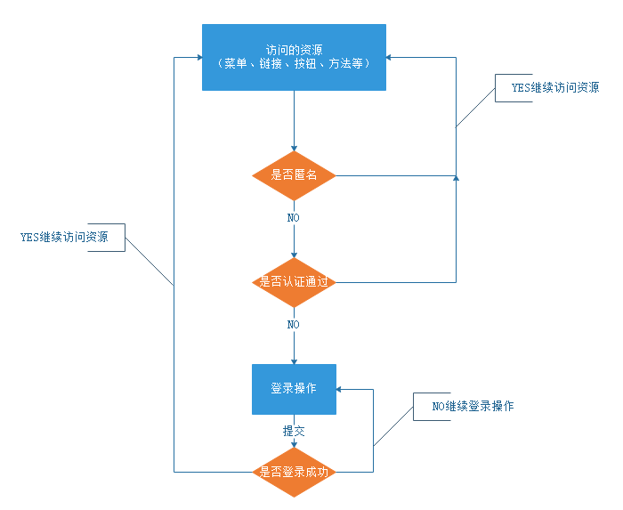
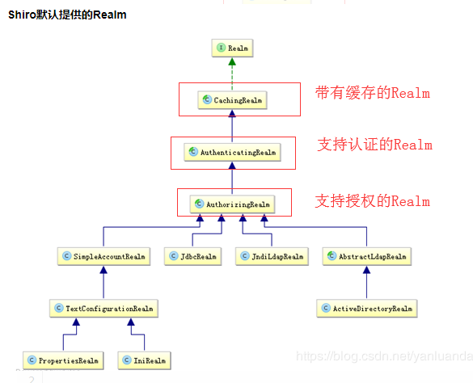
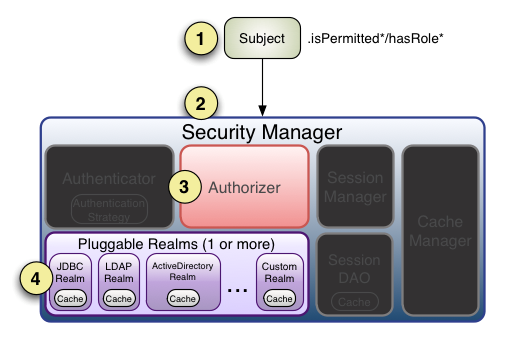

[TOC]

# 一、权限概述

## 1. 什么是权限

权限管理，一般指根据系统设置的安全策略或者安全规则，用户可以访问而且只能访问自己被授权的资源，不多不少。权限管理几乎出现在任何系统里面，只要有用户和密码的系统。 

权限管理在系统中一般分为：

* 访问权限

  能做什么样的操作，或者能够访问那些资源。（给张三赋予“店铺主管”角色，“店铺主管”具有“查询员工”、“添加员工”、“修改员工”和“删除员工”权限。此时张三能够进入系统，则可以进行这些操作）

* 数据权限

  表示某些数据你是否属于你，或者属于你可以操作范围。（张三是"店铺主管"角色，他可以看他手下客服人员所有的服务的买家订单信息，他的手下只能看自己负责的订单信息）


## 2. 认证

### 2.1 基本概念

 身份认证，就是判断一个用户是否为合法用户的处理过程。最常用的简单身份认证方式是系统通过核对用户输入的用户名和密码，看其是否与系统中存储的该用户的用户名和密码一致，来判断用户身份是否正确。例如：密码登录，手机短信验证、三方授权等


### 2.2 认证流程




### 2.2.3 关键对象

上边的流程图中需要理解以下关键对象：

​        **Subject**：主体：访问系统的用户，主体可以是用户、程序等，进行认证的都称为主体；

​        **Principal**：身份信息是主体（subject）进行身份认证的标识，标识必须具有唯一性，如用户名、手机号、邮箱地址等，一个主体可以有多个身份，但是必须有一个主身份（Primary Principal）。

​        **credential**：凭证信息：是只有主体自己知道的安全信息，如密码、证书等。


## 3. 授权

### 3.1 什么是授权

授权，即访问控制，控制谁能访问哪些资源。主体进行身份认证后，系统会为其分配对应的权限，当访问资

源时，会校验其是否有访问此资源的权限。

4个对象。

* 用户对象user：当前操作的用户、程序。
* 资源对象resource：当前被访问的对象
* 角色对象role ：一组 "权限操作许可权" 的集合。
* 权限对象permission：权限操作许可权

### 3.2 授权流程


### 3.3 关键对象

**授权可简单理解为who对what进行How操作**

**Who：**主体（Subject），可以是一个用户、也可以是一个程序

**What：**资源（Resource），如系统菜单、页面、按钮、方法、系统商品信息等。

​		访问类型：商品菜单，订单菜单、分销商菜单

​		数据类型：我的商品，我的订单，我的评价

**How：**权限/许可（Permission）

​		我的商品（资源）===>访问我的商品(权限许可)

​		分销商菜单（资源）===>访问分销商列表（权限许可）		


***


# 二、Shiro概述

## 1. Shiro简介

Shiro是apache旗下一个开源框架，它将软件系统的安全认证相关的功能抽取出来，实现用户身份认证，权限授权、加密、会话管理等功能，组成了一个通用的安全认证框架。

### 1.1 Shiro的特点

​	Shiro 是一个强大而灵活的开源安全框架，能够非常清晰的处理认证、授权、管理会话以及密码加密。如下是它所具有的特点：

* 易于理解的 Java Security API；
*  简单的身份认证（登录），支持多种数据源（LDAP，JDBC 等）；
*  对角色的简单的签权（访问控制），也支持细粒度的鉴权；
* 支持一级缓存，以提升应用程序的性能；
* 内置的基于 POJO 企业会话管理，适用于 Web 以及非 Web 的环境；
* 异构客户端会话访问；
*  非常简单的加密 API；
* 不跟任何的框架或者容器捆绑，可以独立运行。


## 2. 核心组件

Shiro架构


### 2.1 Subject 主体

Subject主体，外部应用与subject进行交互，subject将用户作为当前操作的主体。

主体：可以是一个通过浏览器请求的用户，也可能是一个运行的程序。Subject在shiro中是一个接口，接口中定义了很多认证授相关的方法，外部程序通过subject进行认证授，而subject是通过SecurityManager安全管理器进行认证授权


### 2.2 SecurityManager 权限管理器

SecurityManager权限管理器，它是shiro的核心，负责对所有的subject进行安全管理。

通过SecurityManager可以完成subject的认证、授权等，SecurityManager是通过Authenticator进行认证，通过Authorizer进行授权，通过SessionManager进行会话管理等。SecurityManager是一个接口，继承了Authenticator, Authorizer, SessionManager这三个接口


### 2.3 Authenticator 认证器

认证器，对用户登录时进行身份认证


### 2.4 Authorizer 授权器

用户通过认证器认证通过，在访问功能时需要通过授权器判断用户是否有此功能的操作权限。


### 2.5 Realm 领域（数据库读取+认证功能+授权功能实现）

Realm领域，相当于datasource数据源，securityManager进行安全认证需要通过Realm获取用户权限数据。

比如：
	如果用户身份数据在数据库那么realm就需要从数据库获取用户身份信息。
注意：
	不要把realm理解成只是从数据源取数据，在realm中还有认证授权校验的相关的代码。　


### 2.6 SessionManager 会话管理

shiro框架定义了一套会话管理，它不依赖web容器的session，所以shiro可以使用在非web应用上，也可以将分布式应用的会话集中在一点管理，此特性可使它实现单点登录。


### 2.7 SessionDAO 会话DAO

SessionDAO即会话dao，是对session会话操作的一套接口
比如:
	可以通过jdbc将会话存储到数据库
	也可以把session存储到缓存服务器


### 2.8 CacheManager  缓存管理

将用户权限数据存储在缓存，这样可以提高性能


### 2.9 Cryptography 密码管理

shiro提供了一套加密/解密的组件，方便开发。比如提供常用的散列、加/解密等功能


# 三、Shiro入门

## 1. 身份认证


基本流程：

1. Shiro把用户的数据封装成标识token，token一般封装着用户名，密码等信息
2. 使用Subject门面获取到封装着用户的数据的标识token
3. Subject把标识token交给SecurityManager，在SecurityManager安全中心中，SecurityManager把标识token委托给认证器Authenticator进行身份验证。认证器的作用一般是用来指定如何验证，它规定本次认证用到哪些Realm
4. 认证器Authenticator将传入的标识token，与数据源Realm对比，验证token是否合法


### 1.1 简单使用

目标：使用Shiro完成用户登录


#### 1.1.1 新建maven项目，导入依赖

```xml
<dependencies>
    <dependency>
        <groupId>commons-logging</groupId>
        <artifactId>commons-logging</artifactId>
        <version>1.2</version>
    </dependency>
    <dependency>
        <groupId>org.apache.shiro</groupId>
        <artifactId>shiro-core</artifactId>
        <version>1.7.1</version>
    </dependency>
    <dependency>
        <groupId>junit</groupId>
        <artifactId>junit</artifactId>
        <version>4.12</version>
        <scope>test</scope>
    </dependency>
</dependencies>
<build>
    <!-- maven编译插件 -->
    <plugins>
        <plugin>
            <groupId>org.apache.maven.plugins</groupId>
            <artifactId>maven-compiler-plugin</artifactId>
            <version>3.8.1</version>
            <configuration>
                <source>8</source>
                <target>8</target>
                <showWarnings>true</showWarnings>
            </configuration>
        </plugin>
    </plugins>
</build>
```


#### 1.1.2 编写shiro.ini

```ini
# shiro.ini 声明用户账号
[users]
admin=root
```


#### 1.1.3 编写程序

```java
package cn.onecolour.shiroDemo;


import org.apache.shiro.SecurityUtils;
import org.apache.shiro.authc.UsernamePasswordToken;
import org.apache.shiro.mgt.DefaultSecurityManager;
import org.apache.shiro.realm.text.IniRealm;
import org.apache.shiro.subject.Subject;

public class HelloShiro {
    public static void main(String[] args) {
        // 1. 创建一个基于ini文件的数据源
        IniRealm iniRealm = new IniRealm("classpath:shiro.ini");
        // 2. 初始化一个DefaultSecurityManager实例，将数据源绑定到实例中
        DefaultSecurityManager defaultSecurityManager = new DefaultSecurityManager(iniRealm);
        // 3. 将defaultSecurityManager实例绑定到SecurityUtils
        SecurityUtils.setSecurityManager(defaultSecurityManager);
        // 4. 获得主体
        Subject subject = SecurityUtils.getSubject();
        // 5. 创建令牌
        UsernamePasswordToken token = new UsernamePasswordToken("admin", "root");
        // 6. 登录操作
        subject.login(token);

        System.out.println("是否登录成功："+subject.isAuthenticated());

    }
}
```

#### 1.1.4 测试结果

```
是否登录成功：true

Process finished with exit code 0
```


## 2. Realm



一般在的项目中，我们不会直接实现Realm接口，我们一般的情况就是直接继承AuthorizingRealm，能够继承到认证与授权功能。它需要强制重写两个方法


### 2.1 自定义Realm

### 2.1.1 创建Maven工程导入坐标

与简单使用中的相同

#### 2.1.2 创建SecurityService接口及其实现类

```java
package cn.onecolour.shiroDemoRealm.service;
/**
 * @Description: 权限服务接口
 */
public interface SecurityService {
    /**
     * @Description: 查找密码，按用户登录名
     * @param loginName 登录名称
     * @return 账号密码
     */
    String findPasswordByLoginName(String loginName);
}
```

```java
package cn.onecolour.shiroDemoRealm.service.impl;

import cn.onecolour.shiroDemoRealm.service.SecurityService;

/**
 * @Description: 权限服务层
 */
public class SecurityServiceImpl implements SecurityService {


    // 模拟数据库查询
    @Override
    public String findPasswordByLoginName(String loginName) {
        return "123456"; // 只要输入的密码是123456就能通过验证
    }
```

### 2.1.3 创建自定义Realm

```java
package cn.onecolour.shiroDemoRealm.realm;

import cn.onecolour.shiroDemoRealm.service.SecurityService;
import cn.onecolour.shiroDemoRealm.service.impl.SecurityServiceImpl;
import org.apache.shiro.authc.*;
import org.apache.shiro.authz.AuthorizationInfo;
import org.apache.shiro.realm.AuthorizingRealm;
import org.apache.shiro.subject.PrincipalCollection;

/**
 * @Description: 声明自定义Realm
 */
public class MyRealm extends AuthorizingRealm {
    @Override
    public String getName() {
        return "MyRealm";
    }

    /**
     * @Description: 认证
     * @param token token对象
     * @return AuthenticationInfo
     */
    @Override
    protected AuthenticationInfo doGetAuthenticationInfo(AuthenticationToken token) throws AuthenticationException {
        String loginName = (String) token.getPrincipal();
        SecurityService securityService = new SecurityServiceImpl();
        if (loginName==null||loginName.equals("")){
            throw new UnknownAccountException("账户不存在");
        }
        // 数据库查询
        String password = securityService.findPasswordByLoginName(loginName);
        if (password==null||password.equals("")){
            throw new UnknownAccountException("账户不存在");
        }
        return new SimpleAuthenticationInfo(loginName,password,getName());
    }

    /**
     * 这里先不管，后面有
     * @Description: 鉴权
     * @param principals 令牌
     * @return AuthenticationInfo 
     */
    @Override
    protected AuthorizationInfo doGetAuthorizationInfo(PrincipalCollection principals) {
        return null;
    }
}
```


### 2.1.4 测试

```java
@Test
public void test1() {
    // 1. 初始化一个DefaultSecurityManager实例，
    DefaultSecurityManager defaultSecurityManager = new DefaultSecurityManager();
    // 2. 设置自定义的Realm
    defaultSecurityManager.setRealm(new MyRealm());
    // 3. 将defaultSecurityManager实例绑定到SecurityUtils
    SecurityUtils.setSecurityManager(defaultSecurityManager);
    // 4. 获得主体
    Subject subject = SecurityUtils.getSubject();
    // 5. 创建令牌
    UsernamePasswordToken token = new UsernamePasswordToken("admin", "123456");

    subject.login(token);
    System.out.println("是否登录成功："+subject.isAuthenticated());

}
```

结果

```
是否登录成功：true

Process finished with exit code 0
```


## 3. 编码、散列算法

### 3.1 编码与解码

Shiro提供了base64和16进制字符串编码/解码的API支持，方便一些编码解码操作。

Shiro内部的一些数据的【存储/表示】都使用了base64和16进制字符串

#### 3.1.1 创建Maven工程，导入坐标

与简单使用中相同

#### 3.2.2 创建测试类

```java
public class ClientTest {
    /**
     * @Description: 测试16进制编码
     */
    @Test
    public void testHex() {
        String s = "hello";
        String s1 = Hex.encodeToString(s.getBytes());
        String s2 = new String(Hex.decode(s1));
        System.out.printf("源字符串: %s\n编码后的字符串: %s\n源字符串==编码解码后的字符串: %s\n",
                s, s1, s.equals(s2));
    }/*
    源字符串: hello
    编码后的字符串: 68656c6c6f
    源字符串==编码解码后的字符串: true */
    /**
     * @Description: 测试Base64编码
     */
    @Test
    public void testBase64(){
        String s = "hello";
        String s1 = Base64.encodeToString(s.getBytes());
        String s2 = new String(Base64.decode(s1));
        System.out.printf("源字符串: %s\n编码后的字符串: %s\n源字符串==编码解码后的字符串: %s\n",
                s, s1, s.equals(s2));

    }/*
    源字符串: hello
    编码后的字符串: aGVsbG8=
    源字符串==编码解码后的字符串: true */
}
```


### 3.2 散列算法

散列算法一般用于生成数据的摘要信息，是一种不可逆的算法，一般适合存储密码之类的数据，常见的散列算法如MD5、SHA等。一般进行散列时最好提供一个salt（盐），比如加密密码“admin”，产生的散列值是“21232f297a57a5a743894a0e4a801fc3”，可以到一些md5解密网站很容易的通过散列值得到密码“admin”，即如果直接对密码进行散列相对来说破解更容易，此时我们可以加一些只有系统知道的干扰数据，如salt（即盐）；这样散列的对象是“密码+salt”，这样生成的散列值相对来说更难破解。


 #### 3.2.1 创建DigestsUtil

```java
package cn.onecolour.analogLogin.util;

import org.apache.shiro.crypto.SecureRandomNumberGenerator;
import org.apache.shiro.crypto.hash.Md2Hash;
import org.apache.shiro.crypto.hash.Md5Hash;
import org.apache.shiro.crypto.hash.SimpleHash;

import java.util.HashMap;
import java.util.Map;

/**
 * @Description: 散列算法工具类
 */
public class DigestsUtil {
    // hash算法
    public static final String SHA1 = "SHA-1";
    public static final String SHA256 = "SHA-256";
    public static final String SHA384 = "SHA-384";
    public static final String SHA512 = "SHA-512";
    public static final String MD2 = "MD2";
    public static final String MD5 = "MD5";

    // 散列次数
    public static final Integer ITERATIONS = 3;

    /**
     * @param input 需要散列字符串
     * @param salt  盐字符串
     * @return sha1
     */
    private static String sha1(String input, String salt, Integer iterations) {
        return new SimpleHash(SHA1, input, salt, iterations).toString();
    }

    private static String sha256(String input, String salt, Integer iterations) {
        return new SimpleHash(SHA256, input, salt, iterations).toString();
    }
    private static String sha384(String input, String salt, Integer iterations) {
        return new SimpleHash(SHA384, input, salt, iterations).toString();
    }

    private static String sha512(String input, String salt, Integer iterations) {
        return new SimpleHash(SHA512, input, salt, iterations).toString();
    }
    private static String md2(String input, String salt, Integer iterations) {
        return new Md2Hash(input, salt, iterations).toString();
    }
    private static String md5(String input, String salt, Integer iterations) {
        return new Md5Hash(input, salt, iterations).toString();
    }

    /**
     * @return salt
     * @Description: 随机获得salt字符串
     */
    public static String generateSalt() {
        SecureRandomNumberGenerator randomNumberGenerator = new SecureRandomNumberGenerator();
        return randomNumberGenerator.nextBytes().toHex();
    }


    /**
     *
     * @param hashMethod 加密方式
     * @param passwordPlain 密码原文
     * @param salt 盐
     * @param iterations 散列次数
     * @Description: 生成密码字符密文和salt密文
     * @return map{salt, password}
     */
    public static Map<String, String> encrypt(String hashMethod, String passwordPlain, String salt, Integer iterations) {
        Map<String, String> map = new HashMap<>();
        String password = encryptWith(hashMethod, passwordPlain, salt, iterations);
        map.put("salt", salt);
        map.put("password", password);
        return map;
    }
    public static Map<String, String> encrypt(String hashMethod, String passwordPlain, Integer iterations) {
        String salt = generateSalt();
        return encrypt(hashMethod, passwordPlain, salt, iterations);
    }
    public static Map<String, String> encrypt(String hashMethod,String passwordPlain, String salt) {
        return encrypt(hashMethod, passwordPlain, salt,ITERATIONS);
    }

    public static Map<String, String> encrypt(String hashMethod, String passwordPlain) {
        return encrypt(hashMethod, passwordPlain, ITERATIONS);
    }

    /**
     * @param hashMethod    Hash加密方式
     * @param passwordPlain 密码原文
     * @param salt          盐
     * @param iterations    迭代次数
     * @return 加密后的密码
     */

    private static String encryptWith(String hashMethod, String passwordPlain, String salt, Integer iterations) {
        if (hashMethod.equals(SHA1) || hashMethod.equals("SHA1")) {
            return sha1(passwordPlain, salt, iterations);
        }
        if (hashMethod.equals(SHA256) || hashMethod.equals("SHA256")) {
            return sha256(passwordPlain, salt, iterations);
        }
        if (hashMethod.equals(SHA384) || hashMethod.equals("SHA384")) {
            return sha384(passwordPlain, salt, iterations);
        }
        if (hashMethod.equals(SHA512) || hashMethod.equals("SHA512")) {
            return sha512(passwordPlain, salt, iterations);
        }
        if (hashMethod.equals(MD2) || hashMethod.equals("md2")) {
            return md5(passwordPlain, salt, iterations);
        }
        if (hashMethod.equals(MD5) || hashMethod.equals("md5")) {
            return md5(passwordPlain, salt, iterations);
        }
        throw new IllegalArgumentException("加密方法有误");
    }

    /**
     * @Description: SHA-1加密
     */
    public static Map<String, String> encryptWithSHA1(String passwordPlain,String salt, Integer iterations) {
        return encrypt(SHA1, passwordPlain,salt,iterations);
    }
    public static Map<String, String> encryptWithSHA1(String passwordPlain,Integer iterations) {
        return encrypt(SHA1, passwordPlain,iterations);
    }
    public static Map<String, String> encryptWithSHA1(String passwordPlain,String salt) {
        return encrypt(SHA1, passwordPlain,salt);
    }
    public static Map<String, String> encryptWithSHA1(String passwordPlain) {
        return encrypt(SHA1, passwordPlain);
    }

    /**
     * @Description: SHA-256加密
     */
    public static Map<String, String> encryptWithSHA256(String passwordPlain,String salt, Integer iterations) {
        return encrypt(SHA256, passwordPlain,salt,iterations);
    }
    public static Map<String, String> encryptWithSHA256(String passwordPlain,Integer iterations) {
        return encrypt(SHA256, passwordPlain,iterations);
    }
    public static Map<String, String> encryptWithSHA256(String passwordPlain,String salt) {
        return encrypt(SHA256, passwordPlain,salt);
    }
    public static Map<String, String> encryptWithSHA256(String passwordPlain) {
        return encrypt(SHA256, passwordPlain);
    }

    /**
     * @Description: SHA-384加密
     */
    public static Map<String, String> encryptWithSHA384(String passwordPlain,String salt, Integer iterations) {
        return encrypt(SHA384, passwordPlain,salt,iterations);
    }
    public static Map<String, String> encryptWithSHA384(String passwordPlain,Integer iterations) {
        return encrypt(SHA384, passwordPlain,iterations);
    }
    public static Map<String, String> encryptWithSHA384(String passwordPlain,String salt) {
        return encrypt(SHA384, passwordPlain,salt);
    }
    public static Map<String, String> encryptWithSHA384(String passwordPlain) {
        return encrypt(SHA384, passwordPlain);
    }

    /**
     * @Description: SHA-512加密
     */
    public static Map<String, String> encryptWithSHA512(String passwordPlain,String salt, Integer iterations) {
        return encrypt(SHA512, passwordPlain,salt,iterations);
    }
    public static Map<String, String> encryptWithSHA512(String passwordPlain,Integer iterations) {
        return encrypt(SHA512, passwordPlain,iterations);
    }
    public static Map<String, String> encryptWithSHA512(String passwordPlain,String salt) {
        return encrypt(SHA512, passwordPlain,salt);
    }
    public static Map<String, String> encryptWithSHA512(String passwordPlain) {
        return encrypt(SHA512, passwordPlain);
    }

    /**
     * @Description: MD2加密
     */
    public static Map<String, String> encryptWithMD2(String passwordPlain,String salt, Integer iterations) {
        return encrypt(MD2, passwordPlain,salt,iterations);
    }
    public static Map<String, String> encryptWithMD2(String passwordPlain,Integer iterations) {
        return encrypt(MD2, passwordPlain,iterations);
    }
    public static Map<String, String> encryptWithMD2(String passwordPlain,String salt) {
        return encrypt(MD2, passwordPlain,salt);
    }
    public static Map<String, String> encryptWithMD2(String passwordPlain) {
        return encrypt(MD2, passwordPlain);
    }

    /**
     * @Description: MD5加密
     */
    public static Map<String, String> encryptWithMD5(String passwordPlain,String salt, Integer iterations) {
        return encrypt(MD5, passwordPlain,salt,iterations);
    }
    public static Map<String, String> encryptWithMD5(String passwordPlain,Integer iterations) {
        return encrypt(MD5, passwordPlain,iterations);
    }
    public static Map<String, String> encryptWithMD5(String passwordPlain,String salt) {
        return encrypt(MD5, passwordPlain,salt);
    }
    public static Map<String, String> encryptWithMD5(String passwordPlain) {
        return encrypt(MD5, passwordPlain);
    }
}

```


#### 3.2.2 测试

```java
@Test
public void testHash() {
    Map<String, String> map = DigestsUtil.encrypt("SHA512", "123456");
    System.out.printf("salt: %s\npassword: %s\n",map.get("salt"),map.get("password"));

}
/*
salt: 7d004a8a01283d9576a52a83e0b321fb
password: 5ca3b79dabeefa68e3cad011dcea1f2f09e9fe0fcdb3344c7aaf7217f7cfad731bd2b16c36bfa31b31e9b202aeafa743c0a69e27d8af79cdd16592ec36fe382c
*/
```


## 4. Realm 使用散列算法

### 4.1 创建maven工程Shiro-realm-cipherText 并导包

与简单使用 相同


### 4.2 创建SecurityService接口及其实现类

```java
package cn.onecolour.realmCipherText.service;

import java.util.Map;
/**
 * @Description:  权限服务接口
 */
public interface SecurityService {
    /**
     * @Description: 查找密码按用户登录名
     * @param loginName 登录名称
     * @return map{salt: xxx, password: xxx}
     */
    Map<String, String> findPasswordByLoginName(String loginName);
}
```

```java
package cn.onecolour.realmCipherText.service.impl;

import cn.onecolour.realmCipherText.service.SecurityService;
import cn.onecolour.realmCipherText.util.DigestsUtil;
import java.util.Map;
/**
 * @Description:  权限服务层
 */
public class SecurityServiceImpl implements SecurityService {
    @Override
    public Map<String, String> findPasswordByLoginName(String loginName) {

        return DigestsUtil.encrypt("SHA512","123456","7d004a8a01283d9576a52a83e0b321fb",3);
    }
}
```


### 4.3 创建自定义Realm CipherTextRealm 指定Matcher

```java
package cn.onecolour.realmCipherText.realm;

import cn.onecolour.realmCipherText.service.SecurityService;
import cn.onecolour.realmCipherText.service.impl.SecurityServiceImpl;
import cn.onecolour.realmCipherText.util.DigestsUtil;
import org.apache.shiro.authc.*;
import org.apache.shiro.authc.credential.HashedCredentialsMatcher;
import org.apache.shiro.authz.AuthorizationInfo;
import org.apache.shiro.realm.AuthorizingRealm;
import org.apache.shiro.subject.PrincipalCollection;
import org.apache.shiro.util.ByteSource;

import java.util.Map;

public class CipherTextRealm extends AuthorizingRealm {
    /**
     * @Description: 无参构造
     */
    public CipherTextRealm() {
        // 指定密码匹配方式
        HashedCredentialsMatcher matcher = 
            new HashedCredentialsMatcher(DigestsUtil.SHA512);
        // 指定密码迭代次数
        matcher.setHashIterations(DigestsUtil.ITERATIONS);
        // 使用父方法使匹配方式生效
        setCredentialsMatcher(matcher);

    }

    @Override
    protected AuthenticationInfo doGetAuthenticationInfo(
        AuthenticationToken token) throws AuthenticationException {
        // 1. 从token中获取登录名
        String loginName = (String) token.getPrincipal();
        // 2. 模拟数据库查询
        SecurityService securityService = new SecurityServiceImpl();
        Map<String, String> map = 
            securityService.findPasswordByLoginName(loginName);
        if (map.isEmpty()) {
            throw new UnknownAccountException("账户不存在");
        }
        String salt = map.get("salt");
        String cipherText = map.get("password");

        // 3. 传递账号和密码:参数1：缓存对象，
        //    参数2：明文密码，参数三：字节salt,参数4：当前DefinitionRealm名称
        return new SimpleAuthenticationInfo(loginName,cipherText, ByteSource.Util.bytes(salt),getName());
    }

    @Override
    protected AuthorizationInfo doGetAuthorizationInfo(
        PrincipalCollection principals) {
        return null;
    }

}
```


### 4.4 创建测试类

```java
public class CipherTextTest {
    @Test
    public void testLogin() {
        // 1. 初始化一个DefaultSecurityManager实例，并设置自定义的Realm
        DefaultSecurityManager defaultSecurityManager = new DefaultSecurityManager(new CipherTextRealm());
        // 2. 将defaultSecurityManager实例绑定到SecurityUtils
        SecurityUtils.setSecurityManager(defaultSecurityManager);
        // 3. 获得主体
        Subject subject = SecurityUtils.getSubject();
        // 4. 创建令牌
        UsernamePasswordToken token = new UsernamePasswordToken("admin", "123456");

        subject.login(token);
        System.out.println("是否登录成功："+subject.isAuthenticated());
    }
}
```


## 5. 身份授权

```ini
[main]
#提供了对根对象securityManager及其依赖的配置
securityManager=org.apache.shiro.mgt.DefaultSecurityManager
…………
securityManager.realms=$jdbcRealm
[users]
#提供了对用户/密码及其角色的配置，用户名=密码，角色1，角色2
username=password,role1,role2
[roles]
#提供了角色及权限之间关系的配置，角色=权限1，权限2
role1=permission1,permission2
[urls]
#用于web，提供了对web url拦截相关的配置，url=拦截器[参数]，拦截器
/index.html = anon
/admin/** = authc, roles[admin], perms["permission1"]
```


### 5.1 基本流程



1. 首先调用Subject.isPermitted/hasRole接口，其会委托给SecurityManager。
2. SecurityManager接着会委托给内部组件Authorizer；
3. Authorizer再将其请求委托给我们的Realm去做；Realm才是真正干活的；
4. Realm将用户请求的参数封装成权限对象。再从我们重写的doGetAuthorizationInfo方法中获取从数据库中查询到的权限集合。
5. Realm将用户传入的权限对象，与从数据库中查出来的权限对象，进行一一对比。如果用户传入的权限对象在从数据库中查出来的权限对象中，则返回true，否则返回false。

进行授权操作的前提：用户必须通过认证。

```java
@Override
    protected AuthorizationInfo doGetAuthorizationInfo(
        PrincipalCollection principals) {
        return null;
    }

```

PrincipalCollection  principals，是loginName的包装对象，它表示"用户认证凭证信息"。

可以通过这个包装对象的getPrimaryPrincipal（）方法拿到此值,然后再从数据库中拿到对应的角色和资源，构建SimpleAuthorizationInfo。


### 5.2 案例

#### 5.2.1 新建maven工程analog-login导入坐标

与简单使用中的相同


#### 5.2.2 新建接口SecurityService及其实现类

```java
package cn.onecolour.analogLogin.service;

import java.util.List;
import java.util.Map;

/**
 * @Description:  权限服务接口
 */
public interface SecurityService {
    /**
     * @Description: 查找密码按用户登录名
     * @param loginName 登录名称
     * @return map{salt: xxx, password: xxx}
     */
    Map<String, String> findPasswordByLoginName(String loginName);

    /**
     * @Description: 查找角色按用户登录名
     * @param  loginName 登录名称
     * @return 角色列表
     */
    List<String> findRoleByLoginName(String loginName);

    /**
     * @Description: 查找资源按用户登录名
     * @param  loginName 登录名称
     * @return 资源列表
     */
    List<String>  findPermissionByLoginName(String loginName);
}
```

```java
package cn.onecolour.analogLogin.service.impl;


import cn.onecolour.analogLogin.service.SecurityService;
import cn.onecolour.analogLogin.util.DigestsUtil;

import java.util.ArrayList;
import java.util.List;
import java.util.Map;

public class SecurityServiceImpl implements SecurityService {
    @Override
    public Map<String, String> findPasswordByLoginName(String loginName) {
        return DigestsUtil.encryptWithSHA256("123456",
                   "7bc35d5f1391e90cd996e4aeb87cfe1a", 3);
    }

    @Override
    public List<String> findRoleByLoginName(String loginName) {
        List<String> list = new ArrayList<>();
        list.add("admin");
        list.add("dev");
        return list;
    }

    @Override
    public List<String> findPermissionByLoginName(String loginName) {
        List<String> list = new ArrayList<>();
        list.add("user:add");
        list.add("user:list");
        list.add("user:delete");
        return list;
    }
}

```

#### 5.2.3 创建自定义Realm MyRealm

```java
package cn.onecolour.analogLogin.realm;


import cn.onecolour.analogLogin.service.SecurityService;
import cn.onecolour.analogLogin.service.impl.SecurityServiceImpl;
import cn.onecolour.analogLogin.util.DigestsUtil;
import org.apache.shiro.authc.*;
import org.apache.shiro.authc.credential.HashedCredentialsMatcher;
import org.apache.shiro.authz.AuthorizationInfo;
import org.apache.shiro.authz.SimpleAuthorizationInfo;
import org.apache.shiro.realm.AuthorizingRealm;
import org.apache.shiro.subject.PrincipalCollection;
import org.apache.shiro.util.ByteSource;

import java.util.List;
import java.util.Map;

public class MyRealm extends AuthorizingRealm {

    public MyRealm() {
        // 1. 指定matcher加密方式为SHA-256
        HashedCredentialsMatcher matcher = new HashedCredentialsMatcher(DigestsUtil.SHA256);
        // 2. 指定散列次数为3
        matcher.setHashIterations(3);
        // 3. 调用父类更改matcher
        setCredentialsMatcher(matcher);
    }

    @Override
    protected AuthorizationInfo doGetAuthorizationInfo(PrincipalCollection principals) {
        // 1. 拿到用户凭证信息
        String loginName = (String) principals.getPrimaryPrincipal();
        // 2. 模拟数据库查询
        SecurityService securityService = new SecurityServiceImpl();
        List<String> roles = securityService.findRoleByLoginName(loginName);
        List<String> permissions = securityService.findPermissionByLoginName(loginName);
        // 3. 构建资源校验
        SimpleAuthorizationInfo authorizationInfo = new SimpleAuthorizationInfo();
        authorizationInfo.addRoles(roles);
        authorizationInfo.addStringPermissions(permissions);

        return authorizationInfo;
    }

    @Override
    protected AuthenticationInfo doGetAuthenticationInfo(AuthenticationToken token) throws AuthenticationException {
        // 1. 从token中获取登录名
        String loginName = (String) token.getPrincipal();
        // 2. 模拟数据库查询
        SecurityService securityService = new SecurityServiceImpl();
        Map<String, String> map = securityService.findPasswordByLoginName(loginName);
        if (map.isEmpty()) {
            throw new UnknownAccountException("账户不存在");
        }
        String cipherText = map.get("password");
        // 3. 模拟数据库验证密码
        if (!cipherText.equals("a9fcb87c849a4ad761059e97e77fabb4317ba1496ab55a275f7071a10735e0a8")){
            throw new IncorrectCredentialsException("密码错误");
        }
        String salt = map.get("salt");
        // 4. 传递账号和密码:参数1：缓存对象，参数2：明文密码，参数三：字节salt,参数4：当前DefinitionRealm名称
        return new SimpleAuthenticationInfo(loginName,cipherText, ByteSource.Util.bytes(salt),getName());
    }
}

```


#### 5.2.4 测试

```java
package cn.onecolour.analogLogin;


import cn.onecolour.analogLogin.realm.MyRealm;
import org.apache.shiro.SecurityUtils;
import org.apache.shiro.authc.UsernamePasswordToken;
import org.apache.shiro.authz.UnauthorizedException;
import org.apache.shiro.mgt.DefaultSecurityManager;
import org.apache.shiro.subject.Subject;
import org.junit.Before;
import org.junit.Test;

public class PermissionTest {
    private Subject subject;

    @Before
    public void login() {
        // 1. 初始化一个DefaultSecurityManager实例，并设置自定义的Realm
        DefaultSecurityManager securityManager = new DefaultSecurityManager(new MyRealm());
        // 2. 将defaultSecurityManager实例绑定到SecurityUtils
        SecurityUtils.setSecurityManager(securityManager);
        // 3. 获得主体
        subject = SecurityUtils.getSubject();
        // 4. 创建令牌
        UsernamePasswordToken token = new UsernamePasswordToken("admin", "123456");
        // 5. 登录
        subject.login(token);
    }
    @Test
    public void testPermission() {
        // 1. 判断用户是否已经登录
        System.out.println("是否登录成功："+ subject.isAuthenticated());

        // 2. 检查当前用户的角色信息
        System.out.println("是否有管理员角色："+subject.hasRole("admin"));
        // 3. 如果当前用户有此角色，无返回值。若没有此权限，则抛 UnauthorizedException
        try {
            subject.checkRole("coder");
            System.out.println("有coder角色");
        }catch (Exception e){
            System.out.println("没有coder角色");
            // throw new UnauthorizedException(e.getMessage());
        }

        // 4. 检查当前用户的权限信息
        System.out.println("是否有查看订单列表资源："+subject.isPermitted("user:list"));
        // 5. 如果当前用户有此权限，无返回值。若没有此权限，则抛 UnauthorizedException
        try {
            subject.checkPermissions("user:add","user:delete");
            System.out.println("有user:add, user:delete");
        } catch (Exception e){
            // throw new UnauthorizedException("There have no Permissions named 'user:add' and 'user:delete'");
            System.out.println("没user:add, user:delete");
        }
    }

}

```


# 四、Web项目集成Shiro

## 1. 新建maven项目shiro-web导包

```xml
<?xml version="1.0" encoding="UTF-8"?>
<project xmlns="http://maven.apache.org/POM/4.0.0" xmlns:xsi="http://www.w3.org/2001/XMLSchema-instance"
  xsi:schemaLocation="http://maven.apache.org/POM/4.0.0 http://maven.apache.org/xsd/maven-4.0.0.xsd">
  <modelVersion>4.0.0</modelVersion>

  <groupId>cn.onecolour</groupId>
  <artifactId>shiro-web</artifactId>
  <version>1.0.0-SNAPSHOT</version>
  <packaging>war</packaging>

  <name>shiro-web Maven Webapp</name>
  <!-- FIXME change it to the project's website -->
  <url>http://www.example.com</url>

  <properties>
    <project.build.sourceEncoding>UTF-8</project.build.sourceEncoding>
    <maven.compiler.source>1.8</maven.compiler.source>
    <maven.compiler.target>1.8</maven.compiler.target>
  </properties>

  <dependencies>
    <dependency>
      <groupId>commons-logging</groupId>
      <artifactId>commons-logging</artifactId>
      <version>1.2</version>
    </dependency>

    <dependency>
      <groupId>org.apache.shiro</groupId>
      <artifactId>shiro-core</artifactId>
      <version>1.7.1</version>
    </dependency>
    <dependency>
      <groupId>org.apache.shiro</groupId>
      <artifactId>shiro-web</artifactId>
      <version>1.7.1</version>
    </dependency>

    <dependency>
      <groupId>javax.servlet</groupId>
      <artifactId>javax.servlet-api</artifactId>
      <version>3.1.0</version>
      <scope>provided</scope>
    </dependency>
    <dependency>
      <groupId>jstl</groupId>
      <artifactId>jstl</artifactId>
      <version>1.2</version>
      <scope>provided</scope>
    </dependency>
    <dependency>
      <groupId>org.apache.taglibs</groupId>
      <artifactId>taglibs-standard-impl</artifactId>
      <version>1.2.5</version>
      <scope>provided</scope>
    </dependency>

    <dependency>
      <groupId>com.alibaba</groupId>
      <artifactId>fastjson</artifactId>
      <version>1.2.73</version>
    </dependency>

    <dependency>
      <groupId>org.projectlombok</groupId>
      <artifactId>lombok</artifactId>
      <version>1.18.18</version>
      <scope>provided</scope>
    </dependency>

    <dependency>
      <groupId>junit</groupId>
      <artifactId>junit</artifactId>
      <version>4.12</version>
      <scope>test</scope>
    </dependency>
  </dependencies>

  <build>
    <finalName>shiro-web</finalName>
    <plugins>
      <!-- tomcat7插件,命令： mvn tomcat7:run -DskipTests -->
      <plugin>
        <groupId>org.apache.tomcat.maven</groupId>
        <artifactId>tomcat7-maven-plugin</artifactId>
        <version>2.2</version>
        <configuration>
          <uriEncoding>utf-8</uriEncoding>
          <port>8080</port>
          <path>/</path>
        </configuration>
      </plugin>
    </plugins>
  </build>
</project>
```

## 2. shiro.ini

```ini
#声明自定义的realm，且为安全管理器指定realms
[main]
loginRealm = cn.onecolour.shiroWeb.realm.LoginRealm
securityManager.realms = $loginRealm
#用户退出后跳转指定JSP页面
logout.redirectUrl = /login.jsp
#若没有登录，则被authc过滤器重定向到login.jsp页面
authc.loginUrl = /login.jsp
# 登录后无权限
roles.unauthorizedUrl=/unauthorized
perms.unauthorizedUrl=/unauthorized

[urls]
# anon: 表示匿名访问，即不需要登录就可以访问，例如/login这个路径可以匿名访问
# authc: 表示需要登录才能访问
# roles[admin]: 表示有admin这个角色的用户才能访问
# perms["user:create"]: 表示有这个权限的才能访问
/login = anon
/static/** = anon
/login.html = anon
/home = anon
/user/add = perms["user:add"]
/user/del = perms["user:delete"]
/user/list = perms["user:list]
/logout = logout
```


## 3. Web.xml配置shiro

```xml
<web-app xmlns:xsi="http://www.w3.org/2001/XMLSchema-instance"
         xmlns="http://java.sun.com/xml/ns/javaee"
         xsi:schemaLocation="http://java.sun.com/xml/ns/javaee http://java.sun.com/xml/ns/javaee/web-app_3_0.xsd"
         version="3.0">
  <display-name>Shiro with web</display-name>
  
  <!-- shiro begin -->
  <!-- 初始化SecurityManager对象所需要的环境-->
  <context-param>
    <param-name>shiroEnvironmentClass</param-name>
    <param-value>org.apache.shiro.web.env.IniWebEnvironment</param-value>
  </context-param>

  <!-- 指定Shiro的配置文件的位置 -->
  <context-param>
    <param-name>shiroConfigLocations</param-name>
    <param-value>classpath:shiro.ini</param-value>
  </context-param>

  <!-- 监听服务器启动时，创建shiro的web环境。
       即加载shiroEnvironmentClass变量指定的IniWebEnvironment类-->
  <listener>
    <listener-class>org.apache.shiro.web.env.EnvironmentLoaderListener</listener-class>
  </listener>

  <!-- shiro的l过滤入口，过滤一切请求 -->
  <filter>
    <filter-name>shiroFilter</filter-name>
    <filter-class>org.apache.shiro.web.servlet.ShiroFilter</filter-class>
  </filter>
  <filter-mapping>
    <filter-name>shiroFilter</filter-name>
    <!-- 过滤所有请求 -->
    <url-pattern>/*</url-pattern>
  </filter-mapping>
  <!-- shiro end -->

</web-app>
```


## 4. SecurityServiceImpl和LoginServiceImpl

SecurityServiceImpl

```java
package cn.onecolour.shiroWeb.service.impl;


import cn.onecolour.shiroWeb.service.SecurityService;
import cn.onecolour.shiroWeb.util.DigestsUtil;

import java.util.ArrayList;
import java.util.List;
import java.util.Map;

/**
 * @Description: 密码校验服务 
 *     模拟数据库查询，这里不论账号是什么，密码只要是123456都能通过校验
 */
public class SecurityServiceImpl implements SecurityService {
    /**
     * @Description: 查找密码按用户登录名
     * @param loginName 登录名称
     * @return map{salt: xxx, password: xxx}
     */
    @Override
    public Map<String, String> findPasswordByLoginName(String loginName) {
        return DigestsUtil.encryptWithSHA256("123456", "7bc35d5f1391e90cd996e4aeb87cfe1a", 3);
    }

    /**
     * @Description: 查找角色按用户登录名
     * @param  loginName 登录名称
     * @return 角色列表
     */
    @Override
    public List<String> findRoleByLoginName(String loginName) {
        List<String> list = new ArrayList<>();
        list.add("admin".equals(loginName) ? loginName : "dev");
        return list;
    }
    
    /**
     * @Description: 查找资源按用户登录名
     * @param  loginName 登录名称
     * @return 资源列表
     */
    @Override
    public List<String> findPermissionByLoginName(String loginName) {
        List<String> list = new ArrayList<>();
        if ("admin".equals(loginName)){
            list.add("user:add");
            list.add("user:delete");
        }
        list.add("user:list");
        return list;
    }
}

```

LoginServiceImpl

```java
package cn.onecolour.shiroWeb.service.impl;


import cn.onecolour.shiroWeb.service.LoginService;
import org.apache.shiro.SecurityUtils;
import org.apache.shiro.authc.UsernamePasswordToken;
import org.apache.shiro.subject.Subject;

/**
 * @Description: 登录服务
 */
public class LoginServiceImpl implements LoginService {
    /**
     * @Description: 登录方法1
     * @param token 登录对象
     * @return true: 登录成功 , false: 登录失败
     */
    @Override
    public boolean login(UsernamePasswordToken token) {
        Subject subject = SecurityUtils.getSubject();
        try{
            subject.login(token);
        } catch (Exception e){
            return false;
        }
        return subject.isAuthenticated();
    }

    @Override
    public boolean login(String username, String password) {
        return login(new UsernamePasswordToken(username,password));
    }
    /**
     *@Description:  登出方法
     */
    @Override
    public void logout() {
        Subject subject = SecurityUtils.getSubject();
        subject.logout();
    }
}

```


## 5. 自定义Realm

```java
package cn.onecolour.shiroWeb.realm;


import cn.onecolour.shiroWeb.service.SecurityService;
import cn.onecolour.shiroWeb.service.impl.SecurityServiceImpl;
import cn.onecolour.shiroWeb.util.DigestsUtil;
import org.apache.shiro.authc.*;
import org.apache.shiro.authc.credential.HashedCredentialsMatcher;
import org.apache.shiro.authz.AuthorizationInfo;
import org.apache.shiro.authz.SimpleAuthorizationInfo;
import org.apache.shiro.realm.AuthorizingRealm;
import org.apache.shiro.subject.PrincipalCollection;
import org.apache.shiro.util.ByteSource;

import java.util.List;
import java.util.Map;

public class LoginRealm extends AuthorizingRealm {
    private final SecurityService securityService = new SecurityServiceImpl();

    public LoginRealm() {
        // 1. 设置加密方式
        HashedCredentialsMatcher matcher = new HashedCredentialsMatcher(DigestsUtil.SHA256);
        // 2. 设置散列次数
        matcher.setHashIterations(3);
        // 3. 更改matcher
        setCredentialsMatcher(matcher);
    }

    @Override
    protected AuthenticationInfo doGetAuthenticationInfo(AuthenticationToken token) throws AuthenticationException {
        String loginName = (String) token.getPrincipal();
        Map<String, String> map = securityService.findPasswordByLoginName(loginName);
        if (map.isEmpty()) {
            throw new UnknownAccountException("账户不存在");
        }
        String cipherText = map.get("password");
        // 3. 模拟数据库验证密码
        if (!cipherText.equals("a9fcb87c849a4ad761059e97e77fabb4317ba1496ab55a275f7071a10735e0a8")){
            throw new IncorrectCredentialsException("密码错误");
        }
        String salt = map.get("salt");
        return new SimpleAuthenticationInfo(loginName, cipherText,
                ByteSource.Util.bytes(salt), getName());
    }

    @Override
    protected AuthorizationInfo doGetAuthorizationInfo(PrincipalCollection principals) {
        // 1. 拿到用户凭证信息
        String loginName = (String) principals.getPrimaryPrincipal();
        // 2. 模拟数据库查询
        List<String> roles = securityService.findRoleByLoginName(loginName);
        List<String> permissions = securityService.findPermissionByLoginName(loginName);
        // 3. 构建资源校验
        SimpleAuthorizationInfo authorizationInfo = new SimpleAuthorizationInfo();
        authorizationInfo.addRoles(roles);
        authorizationInfo.addStringPermissions(permissions);

        return authorizationInfo;
    }
}
```


## 6. Servlet & JSP

### 6.1 登录

#### 6.1.2 LoginServlet

```java
package cn.onecolour.shiroWeb.servlet;

import cn.onecolour.shiroWeb.entity.ResultVO;
import cn.onecolour.shiroWeb.service.LoginService;
import cn.onecolour.shiroWeb.service.impl.LoginServiceImpl;
import com.alibaba.fastjson.JSON;
import com.alibaba.fastjson.JSONObject;
import jdk.net.SocketFlow;

import javax.servlet.ServletException;
import javax.servlet.ServletInputStream;
import javax.servlet.ServletOutputStream;
import javax.servlet.annotation.WebServlet;
import javax.servlet.http.HttpServlet;
import javax.servlet.http.HttpServletRequest;
import javax.servlet.http.HttpServletResponse;
import java.io.BufferedReader;
import java.io.IOException;
import java.io.InputStreamReader;
import java.io.PrintWriter;
import java.nio.charset.StandardCharsets;
import java.util.Map;

@WebServlet(name = "LoginServlet",urlPatterns = "/login")
public class LoginServlet extends HttpServlet {
    @Override
    protected void doPost(HttpServletRequest request, HttpServletResponse response) throws ServletException, IOException {
        boolean flag = false;
        // 1. 设置返回数据ContentType
        response.setContentType("application/json;charset=utf-8");
        // 2. 返回响应体
        ResultVO<String> resultVO;

        // 3. 接收json数据
        if (request.getContentType().contains("application/json")) {
            try {
                BufferedReader bf = new BufferedReader(new InputStreamReader(request.getInputStream(), StandardCharsets.UTF_8));
                StringBuilder sb = new StringBuilder();
                String tmp;
                while ((tmp = bf.readLine()) != null) {
                    sb.append(tmp);
                }
                JSONObject json = JSONObject.parseObject(sb.toString());
                LoginService loginService = new LoginServiceImpl();
                flag = loginService.login(json.getString("username"), json.getString("password"));
            } catch (Exception e) {
                e.printStackTrace();
            }
        }
        if (flag){
            resultVO = new ResultVO<>("登录成功");
        } else {
            resultVO = new ResultVO<>(1001,"用户名或密码错误");
        }
        response.getOutputStream().write(JSONObject.toJSONString(resultVO).getBytes());

    }

    @Override
    protected void doGet(HttpServletRequest request, HttpServletResponse response) throws ServletException, IOException {
        response.setStatus(405);
        // 返回响应体
        ResultVO<String> resultVO = new ResultVO<>(3001,"Method Not Allowed. Please use method POST");
        response.getOutputStream().print(JSONObject.toJSONString(resultVO));
    }

}

```

#### 6.1.2 login.jsp

```jsp
<%@ page contentType="text/html;charset=UTF-8" language="java" %>
<html lang="zh-cn">
<head>
    <meta charset="UTF-8">
    <title>登录页面</title>
    <script src="https://cdn.bootcdn.net/ajax/libs/jquery/3.6.0/jquery.js"></script>
    <script>
        function login() {
            $.post({
                url:"/login",
                data:JSON.stringify({"username":$("#username").val(),"password":$("#password").val()}),
                contentType:"application/json;charset=utf-8",
                dataType:"json",
                success:function (data) {
                    if (data['code'] == 1000){
                        window.location.href = "/home";
                    } else {
                        $("#msg").removeAttr("hidden").text(data['msg']);
                    }
                }
            })
        }
    </script>
</head>
<body>
<form action="javascript:login()">
    <label for="username">用户名：</label>
    <input id="username" type="text" name="username">
    <br>
    <label for="password">密码： </label>
    <input id="password" type="text" name="password">
    <br>
    <span style="color: red;font-size: large" id="msg" hidden></span>
        <br>
    <input type="submit" value="登录">
</form>
</body>
</html>
```


### 6.2 登陆后显示内容

#### 6.2.1 HomeServlet

```java
package cn.onecolour.shiroWeb.servlet;

import cn.onecolour.shiroWeb.entity.ResultVO;
import com.alibaba.fastjson.JSONObject;

import javax.servlet.ServletException;
import javax.servlet.annotation.WebServlet;
import javax.servlet.http.HttpServlet;
import javax.servlet.http.HttpServletRequest;
import javax.servlet.http.HttpServletResponse;
import java.io.IOException;

@WebServlet(name = "HomeServlet",urlPatterns = "/home")
public class HomeServlet extends HttpServlet {
    protected void doPost(HttpServletRequest request, HttpServletResponse response) throws ServletException, IOException {
        response.setStatus(405);
        // 返回响应体
        ResultVO<String> resultVO = new ResultVO<>(3001,"Method Not Allowed. Please use method POST");
        response.getOutputStream().print(JSONObject.toJSONString(resultVO));
    }

    protected void doGet(HttpServletRequest request, HttpServletResponse response) throws ServletException, IOException {
        // 将请求转发到home.jsp
        request.getRequestDispatcher("WEB-INF/jsp/home.jsp").forward(request,response);
    }
}

```

#### 6.2.2 home.jsp

```jsp
<%@ page contentType="text/html;charset=UTF-8" language="java" %>
<%@ taglib prefix="shiro" uri="http://shiro.apache.org/tags" %>
<html>
<head>
    <title>主页</title>
</head>
<body>
<%-- 访客看到的内容跟 --%>
<shiro:guest>
    <a style="font-size: large;color: orange" href="${pageContext.request.contextPath}/login.jsp">登录</a>
</shiro:guest>
<%-- 登陆后能看到的内容 --%>
<shiro:authenticated>
    欢迎您：<shiro:principal/>
    <h6>

        <a href="${pageContext.request.contextPath}/user/list">用户列表</a>
        <%-- 要求用户角色为admin才能看到以下内容 --%>
        <shiro:hasRole name="admin">
            <a href="${pageContext.request.contextPath}/user/add">添加用户</a>
            <a href="${pageContext.request.contextPath}/user/del">删除用户</a>
        </shiro:hasRole>
        <a href="${pageContext.request.contextPath}/logout">退出</a>

    </h6>
</shiro:authenticated>
</body>
</html>
```


### 6.3 UserServlet

```java
package cn.onecolour.shiroWeb.servlet;

import cn.onecolour.shiroWeb.entity.ResultVO;
import com.alibaba.fastjson.JSONObject;

import javax.servlet.ServletException;
import javax.servlet.annotation.WebServlet;
import javax.servlet.http.HttpServlet;
import javax.servlet.http.HttpServletRequest;
import javax.servlet.http.HttpServletResponse;
import java.io.IOException;

@WebServlet(name = "UserServlet", urlPatterns = {"/user/list","/user/add","/user/del"})
public class UserServlet extends HttpServlet {
    @Override
    protected void doGet(HttpServletRequest req, HttpServletResponse resp) throws ServletException, IOException {
        String uri = req.getRequestURI();
        if (uri.contains("list")){
            resp.getWriter().write("This is user list");
        }
        if (uri.contains("add")){
            resp.getWriter().write("This is user add ");
        }
        if (uri.contains("del")){
            resp.getWriter().write("This is user del ");
        }
    }

    @Override
    protected void doPost(HttpServletRequest req, HttpServletResponse response) throws ServletException, IOException {
        response.setStatus(405);
        // 返回响应体
        ResultVO<String> resultVO = new ResultVO<>(3001,"Method Not Allowed. Please use method POST");
        response.getOutputStream().print(JSONObject.toJSONString(resultVO));
    }
}

```


### 6.4  UnAuthorizedServlet 没有权限

```java
package cn.onecolour.shiroWeb.servlet;

import cn.onecolour.shiroWeb.entity.ResultVO;
import com.alibaba.fastjson.JSONObject;

import javax.servlet.ServletException;
import javax.servlet.annotation.WebServlet;
import javax.servlet.http.HttpServlet;
import javax.servlet.http.HttpServletRequest;
import javax.servlet.http.HttpServletResponse;
import java.io.IOException;

@WebServlet(name = "UnAuthorizedServlet",urlPatterns = "/unauthorized")
public class UnAuthorizedServlet extends HttpServlet {
    protected void doPost(HttpServletRequest request, HttpServletResponse response) throws ServletException, IOException {
        response.setStatus(405);
        // 返回响应体
        ResultVO<String> resultVO = new ResultVO<>(3001,"Method Not Allowed. Please use method POST");
        response.getOutputStream().print(JSONObject.toJSONString(resultVO));
    }

    protected void doGet(HttpServletRequest request, HttpServletResponse response) throws ServletException, IOException {
        response.setStatus(403);
        response.setContentType("application/json;charset=utf-8");
        ResultVO<String> resultVO = new ResultVO<>(3002,"You have no permission to access the page");
        response.getOutputStream().print(JSONObject.toJSONString(resultVO));
    }
}
```


## 7. 测试


使用错误账号密码登录

***


使用admin: 123456登录，role分配为admin 

***


role非admin看到的内容

***


访客访问`/home`看到的内容

***


role非admin的用户访问`/user/add`重定向到权限不足页面


## 8. 授权相关api

### 8.1 Servlet中

首先使用`Subject subject = SecurityUtils.getSubject();`获取当前用户subject

#### 8.1.1 登录相关

| Subject 登录相关方法 | 描述                                   |
| -------------------- | -------------------------------------- |
| isAuthenticated()    | 返回true 表示已经登录，否则返回false。 |

#### 8.1.2 角色相关

| Subject 角色相关方法                      | 描述                                                         |
| ----------------------------------------- | ------------------------------------------------------------ |
| hasRole(String roleName)                  | 返回true 如果Subject 被分配了指定的角色，否则返回false。     |
| hasRoles(List\<String> roleNames)         | 返回true 如果Subject 被分配了所有指定的角色，否则返回false。 |
| hasAllRoles(Collection\<String>roleNames) | 返回一个与方法参数中目录一致的hasRole 结果的集合。有性能的提高如果许多角色需要执行检查（例如，当自定义一个复杂的视图）。 |
| checkRole(String roleName)                | 安静地返回，如果Subject 被分配了指定的角色，不然的话就抛出AuthorizationException。 |
| checkRoles(Collection\<String>roleNames)  | 安静地返回，如果Subject 被分配了所有的指定的角色，不然的话就抛出AuthorizationException。 |
| checkRoles(String… roleNames)             | 与上面的checkRoles 方法的效果相同，但允许Java5 的var-args 类型的参数 |

#### 8.1.3 资源相关

| Subject 资源相关方法                            | 描述                                                         |
| ----------------------------------------------- | ------------------------------------------------------------ |
| isPermitted(Permission p)                       | 返回true 如果该Subject 被允许执行某动作或访问被权限实例指定的资源，否则返回false |
| isPermitted(List\<Permission> perms)            | 返回一个与方法参数中目录一致的isPermitted 结果的集合。       |
| isPermittedAll(Collection\<Permission>perms)    | 返回true 如果该Subject 被允许所有指定的权限，否则返回false有性能的提高如果需要执行许多检查（例如，当自定义一个复杂的视图） |
| isPermitted(String perm)                        | 返回true 如果该Subject 被允许执行某动作或访问被字符串权限指定的资源，否则返回false。 |
| isPermitted(String…perms)                       | 返回一个与方法参数中目录一致的isPermitted 结果的数组。有性能的提高如果许多字符串权限检查需要被执行（例如，当自定义一个复杂的视图）。 |
| isPermittedAll(String…perms)                    | 返回true 如果该Subject 被允许所有指定的字符串权限，否则返回false。 |
| checkPermission(Permission p)                   | 安静地返回，如果Subject 被允许执行某动作或访问被特定的权限实例指定的资源，不然的话就抛出AuthorizationException 异常。 |
| checkPermission(String perm)                    | 安静地返回，如果Subject 被允许执行某动作或访问被特定的字符串权限指定的资源，不然的话就抛出AuthorizationException 异常。 |
| checkPermissions(Collection\<Permission> perms) | 安静地返回，如果Subject 被允许所有的权限，不然的话就抛出AuthorizationException 异常。有性能的提高如果需要执行许多检查（例如，当自定义一个复杂的视图） |
| checkPermissions(String… perms)                 | 和上面的checkPermissions 方法效果相同，但是使用的是基于字符串的权限。 |


### 8.2 JSP标签

Shiro提供了一套JSP标签库来实现页面级的授权控制， 在使用Shiro标签库前，首先需要在JSP引入shiro标签： 

```html
<%@ taglib prefix="shiro" uri="http://shiro.apache.org/tags" %> 

```

| 标签                                | 说明                                                         |
| ----------------------------------- | ------------------------------------------------------------ |
| < shiro:guest >                     | 验证当前用户是否为“访客”，即未认证（包含未记住）的用户       |
| < shiro:user >                      | 认证通过或已记住的用户                                       |
| < shiro:authenticated >             | 已认证通过的用户。不包含已记住的用户，这是与user标签的区别所在 |
| < shiro:notAuthenticated >          | 未认证通过用户。与guest标签的区别是，该标签包含已记住用户    |
| < shiro:principal />                | 输出当前用户信息，通常为登录帐号信息                         |
| < shiro:hasRole name="角色">        | 验证当前用户是否属于该角色                                   |
| < shiro:lacksRole name="角色">      | 与hasRole标签逻辑相反，当用户不属于该角色时验证通过          |
| < shiro:hasAnyRoles name="a,b">     | 验证当前用户是否属于以下任意一个角色                         |
| <shiro:hasPermission name=“资源”>   | 验证当前用户是否拥有制定权限                                 |
| <shiro:lacksPermission name="资源"> | 与permission标签逻辑相反，当前用户没有制定权限时，验证通过   |


# 五、Shiro整合Spring

整合SpringMVC和SpringBoot参见<a href="./Shiro与Spring家族整合.md">Shiro与Spring家族整合</a>

## 1. 创建Maven工程，导入坐标

```xml
<?xml version="1.0" encoding="UTF-8"?>
<project xmlns="http://maven.apache.org/POM/4.0.0"
         xmlns:xsi="http://www.w3.org/2001/XMLSchema-instance"
         xsi:schemaLocation="http://maven.apache.org/POM/4.0.0 http://maven.apache.org/xsd/maven-4.0.0.xsd">
    <modelVersion>4.0.0</modelVersion>

    <groupId>cn.onecolour</groupId>
    <artifactId>shiro-spring</artifactId>
    <version>1.0-SNAPSHOT</version>
    <packaging>jar</packaging>

    <properties>
        <project.build.sourceEncoding>UTF-8</project.build.sourceEncoding>
        <maven.compiler.source>1.8</maven.compiler.source>
        <maven.compiler.target>1.8</maven.compiler.target>
        <spring.version>5.2.13.RELEASE</spring.version>
        <shiro.version>1.7.1</shiro.version>
        <aspectj.version>1.9.6</aspectj.version>
    </properties>


    <dependencies>
        <!-- logging -->
        <dependency>
            <groupId>commons-logging</groupId>
            <artifactId>commons-logging</artifactId>
            <version>1.2</version>
        </dependency>
        <dependency>
            <groupId>log4j</groupId>
            <artifactId>log4j</artifactId>
            <version>1.2.17</version>
        </dependency>

        <!-- shiro -->
        <dependency>
            <groupId>org.apache.shiro</groupId>
            <artifactId>shiro-spring</artifactId>
            <version>${shiro.version}</version>
        </dependency>

        <!-- IOC -->
        <dependency>
            <groupId>org.springframework</groupId>
            <artifactId>spring-core</artifactId>
            <version>${spring.version}</version>
        </dependency>
        <dependency>
            <groupId>org.springframework</groupId>
            <artifactId>spring-context</artifactId>
            <version>${spring.version}</version>
        </dependency>

        <!-- AOP -->
        <dependency>
            <groupId>org.springframework</groupId>
            <artifactId>spring-aop</artifactId>
            <version>${spring.version}</version>
        </dependency>
        <dependency>
            <groupId>org.aspectj</groupId>
            <artifactId>aspectjweaver</artifactId>
            <version>${aspectj.version}</version>
        </dependency>
        <dependency>
            <groupId>org.aspectj</groupId>
            <artifactId>aspectjrt</artifactId>
            <version>${aspectj.version}</version>
        </dependency>
        
        <!-- test -->
        <dependency>
            <groupId>org.springframework</groupId>
            <artifactId>spring-test</artifactId>
            <version>${spring.version}</version>
        </dependency>
        <dependency>
            <groupId>junit</groupId>
            <artifactId>junit</artifactId>
            <version>4.12</version>
            <scope>test</scope>
        </dependency>
        <dependency>
            <groupId>org.projectlombok</groupId>
            <artifactId>lombok</artifactId>
            <version>1.18.8</version>
            <scope>compile</scope>
        </dependency>
    </dependencies>

</project>
```

## 2. 创建实体

```java
package cn.onecolour.shiroSpring.domain;

import lombok.Data;

@Data
public class User {
    private String username;
    private String password;
    private String salt;
}
```


## 3. Service层

这里只用作模拟数据库访问

```java
package cn.onecolour.shiroSpring.service;


import cn.onecolour.shiroSpring.domain.User;

import java.util.List;

/**
 * @Description 用户服务
 */
public interface UserService {

    /**
     * @Description 根据用户名查找用户
     * @param username 用户名
     * @return 用户信息
     */
    User findUserByUsername(String username);

    /**
     * @Description 根据用户名查找角色列表
     * @param username 用户名
     * @return 角色列表
     */
    List<String> findRolesByUsername(String username);

    /**
     * @Description 据用户名查找许可列表
     * @param username 用户名
     * @return 权限列表
     */
    List<String> findPermissionsByUsername(String username);
}
```


```java
package cn.onecolour.shiroSpring.service.impl;


import cn.onecolour.shiroSpring.domain.User;
import cn.onecolour.shiroSpring.service.UserService;
import cn.onecolour.shiroSpring.util.DigestsUtil;
import org.springframework.stereotype.Service;

import java.util.ArrayList;
import java.util.List;


public class UserServiceImpl implements UserService {

    @Override
    public User findUserByUsername(String username) {
        // 1. 模拟数据库查询
        User user = new User();
        // 2. 写入模拟数据
        //    "123456"经过SHA256 散列次数为3 加密得到
        user.setSalt("7bc35d5f1391e90cd996e4aeb87cfe1a");
        user.setUsername(username);
        user.setPassword(
                DigestsUtil.encryptWithSHA256("123456",user.getSalt(),3)
                        .get("password"));
        return user;
    }
    @Override
    public List<String> findRolesByUsername(String username) {
        List<String> list = new ArrayList<String>();
        // 模拟操作，后期从数据库中获得
        list.add("admin".equals(username)?"admin":"normal");
        return list;
    }

    @Override
    public List<String> findPermissionsByUsername(String username) {
        List<String> list = new ArrayList<String>();
        // 模拟操作，后期从数据库中获得
        if ("admin".equals(username)){
            list.add("user:add");
            list.add("user:del");
        }
        list.add("user:list");
        return list;
    }
}

```


## 4.  自定义realm

<a href="./DigestsUtil.java">`DigestsUtil.java`</a>

```java
package cn.onecolour.shiroSpring.realm;

import cn.onecolour.shiroSpring.domain.User;
import cn.onecolour.shiroSpring.service.UserService;
import lombok.Setter;
import org.apache.shiro.authc.AuthenticationException;
import org.apache.shiro.authc.AuthenticationInfo;
import org.apache.shiro.authc.AuthenticationToken;
import org.apache.shiro.authc.SimpleAuthenticationInfo;
import org.apache.shiro.authz.AuthorizationInfo;
import org.apache.shiro.authz.SimpleAuthorizationInfo;
import org.apache.shiro.realm.AuthorizingRealm;
import org.apache.shiro.subject.PrincipalCollection;
import org.apache.shiro.util.ByteSource;
import org.springframework.beans.factory.annotation.Autowired;

import java.util.List;

@Setter
public class ShiroDBRealm extends AuthorizingRealm {
    private UserService userService;

    @Override
    protected AuthorizationInfo doGetAuthorizationInfo(PrincipalCollection principals) {
        // 1. 获取用户凭证
        String username = (String) principals.getPrimaryPrincipal();

        // 2. 模拟数据库查询 权限列表 和 角色列表
        List<String> roles = userService.findRolesByUsername(username);
        List<String> permissions = userService.findPermissionsByUsername(username);

        // 3. 构建资源校验
        SimpleAuthorizationInfo simpleAuthorizationInfo = new SimpleAuthorizationInfo();
        simpleAuthorizationInfo.addRoles(roles);
        simpleAuthorizationInfo.addStringPermissions(permissions);
        return simpleAuthorizationInfo;
    }

    @Override
    protected AuthenticationInfo doGetAuthenticationInfo(AuthenticationToken token) throws AuthenticationException {
        // 1. 获取用户凭证
        String username = (String) token.getPrincipal();
        // 2. 模拟数据库请求查询用户信息
        User user = userService.findUserByUsername(username);
        // 3. 获得密文密码 和 盐
        String salt = user.getSalt();
        String cipherText = user.getPassword();

        return new SimpleAuthenticationInfo(username,cipherText, ByteSource.Util.bytes(salt),getName());
    }
}

```


## 5. 整合Spring

`applicationContext.xml`

```xml
<?xml version="1.0" encoding="UTF-8"?>
<beans xmlns="http://www.springframework.org/schema/beans"
       xmlns:xsi="http://www.w3.org/2001/XMLSchema-instance"
       xmlns:context="http://www.springframework.org/schema/context"
       xsi:schemaLocation="http://www.springframework.org/schema/beans http://www.springframework.org/schema/beans/spring-beans.xsd http://www.springframework.org/schema/context https://www.springframework.org/schema/context/spring-context.xsd">
    <!-- 包扫描 -->
    <context:component-scan base-package="cn.onecolour.shiroSpring"/>
    <!-- 导入shiro配置 -->
    <import resource="classpath:applicationContext-shiro.xml"/>

</beans>
```


`applicationContext-shiro.xml`

```xml
<?xml version="1.0" encoding="UTF-8"?>
<beans xmlns="http://www.springframework.org/schema/beans"
       xmlns:xsi="http://www.w3.org/2001/XMLSchema-instance"
       xsi:schemaLocation="http://www.springframework.org/schema/beans http://www.springframework.org/schema/beans/spring-beans.xsd">
    <!-- 配置securityManager 
         整合ShiroWeb配DefaultWebSecurityManager, 
         JSEE配DefaultSecurityManager, 这里配错了会提示没有servlet api -->
    <bean id="securityManager" class="org.apache.shiro.mgt.DefaultSecurityManager">
        <property name="realm" ref="shiroDBRealm"/>
    </bean>

    <!-- 配置自定义Realm -->
    <bean id="shiroDBRealm" class="cn.onecolour.shiroSpring.realm.ShiroDBRealm">
        <property name="userService">
            <bean class="cn.onecolour.shiroSpring.service.impl.UserServiceImpl"/>
        </property>
        <property name="credentialsMatcher">
            <bean class="org.apache.shiro.authc.credential.HashedCredentialsMatcher">
                <property name="hashAlgorithmName" value="SHA-256"/>
                <property name="hashIterations" value="3"/>
            </bean>
        </property>
    </bean>
</beans>
```


## 6. 测试

```java
@RunWith(SpringJUnit4ClassRunner.class)
@ContextConfiguration("classpath:applicationContext.xml")
public class ShiroSpring {
    @Autowired
    private DefaultSecurityManager securityManager;

    Subject subject;

    @Before
    public void Before() {
        SecurityUtils.setSecurityManager(securityManager);
        subject = SecurityUtils.getSubject();
        try {
            subject.login(new UsernamePasswordToken("admin", "123456"));
            //subject.login(new UsernamePasswordToken("dev", "123456"));
            //subject.login(new UsernamePasswordToken("admin", "1234"));
        } catch (IncorrectCredentialsException e) {
            System.out.println(e.getMessage());
        }
        System.out.println("登录" + (subject.isAuthenticated() ? "成功" : "失败"));
    }

    @Test
    public void testPermissionAndRole() {
        String username = (String) subject.getPrincipal();
        System.out.printf("%s has role 'admin': %s\n",
                username, subject.hasRole("admin"));
        System.out.printf("%s has role 'normal': %s\n",
                username, subject.hasRole("normal"));
        System.out.printf("%s has permission 'user:add': %s\n",
                username, subject.isPermitted("user:add"));
        System.out.printf("%s has permission 'user:del': %s\n",
                username, subject.isPermitted("user:del"));
        System.out.printf("%s has permission 'user:list': %s\n",
                username, subject.isPermitted("user:list"));

    }
```

<span style="color:red;font-size:2em">测试结果:</span>

```properties
# 测试数据1: {"username":"admin","password":"123456"}
登录成功:true
admin has role 'admin': true
admin has role 'normal': false
admin has permission 'user:add': true
admin has permission 'user:del': true
admin has permission 'user:list': true

# 测试数据2: {"username":"dev","password":"123456"}

登录成功:true
dev has role 'admin': false
dev has role 'normal': true
dev has permission 'user:add': false
dev has permission 'user:del': false
dev has permission 'user:list': true

# 测试数据3: {"username":"admin","password":"1234"}

#Submitted credentials for token [org.apache.shiro.authc.UsernamePasswordToken - admin, rememberMe=false] did not match the expected credentials.
登录成功:false
null has role 'admin': false
null has role 'normal': false
null has permission 'user:add': false
null has permission 'user:del': false
null has permission 'user:list': false

```


# 六、缓存

这里以jsee项目整合spring 为例

web项目见<a href="./Shiro与Spring家族整合.md">Shiro与Spring家族整合</a>

清除缓存：

```java
shiroDBRealm.getAuthorizationCache().remove(subject.getPrincipals())
```


## 1. 整合Ehcache

### 1.1 Pom.xml

```xml
<?xml version="1.0" encoding="UTF-8"?>
<project xmlns="http://maven.apache.org/POM/4.0.0"
         xmlns:xsi="http://www.w3.org/2001/XMLSchema-instance"
         xsi:schemaLocation="http://maven.apache.org/POM/4.0.0 http://maven.apache.org/xsd/maven-4.0.0.xsd">
    <modelVersion>4.0.0</modelVersion>

    <groupId>cn.onecolour</groupId>
    <artifactId>shiro-cache</artifactId>
    <version>1.0-SNAPSHOT</version>
    <packaging>jar</packaging>

    <properties>
        <project.build.sourceEncoding>UTF-8</project.build.sourceEncoding>
        <maven.compiler.source>1.8</maven.compiler.source>
        <maven.compiler.target>1.8</maven.compiler.target>
        <spring.version>5.2.13.RELEASE</spring.version>
        <shiro.version>1.7.1</shiro.version>
        <aspectj.version>1.9.6</aspectj.version>
    </properties>


    <dependencies>
        <!-- logging -->
        <dependency>
            <groupId>log4j</groupId>
            <artifactId>log4j</artifactId>
            <version>1.2.17</version>
        </dependency>
        <dependency>
            <groupId>org.slf4j</groupId>
            <artifactId>slf4j-log4j12</artifactId>
            <version>1.7.30</version>
        </dependency>

        <!-- shiro -->
        <dependency>
            <groupId>org.apache.shiro</groupId>
            <artifactId>shiro-spring</artifactId>
            <version>${shiro.version}</version>
        </dependency>
        <dependency>
            <groupId>org.apache.shiro</groupId>
            <artifactId>shiro-ehcache</artifactId>
            <version>${shiro.version}</version>
        </dependency>

        <!-- IOC -->
        <dependency>
            <groupId>org.springframework</groupId>
            <artifactId>spring-core</artifactId>
            <version>${spring.version}</version>
        </dependency>
        <dependency>
            <groupId>org.springframework</groupId>
            <artifactId>spring-context</artifactId>
            <version>${spring.version}</version>
        </dependency>

        <!-- AOP -->
        <dependency>
            <groupId>org.springframework</groupId>
            <artifactId>spring-aop</artifactId>
            <version>${spring.version}</version>
        </dependency>
        <dependency>
            <groupId>org.aspectj</groupId>
            <artifactId>aspectjweaver</artifactId>
            <version>${aspectj.version}</version>
        </dependency>

        <!-- test -->
        <dependency>
            <groupId>org.springframework</groupId>
            <artifactId>spring-test</artifactId>
            <version>${spring.version}</version>
        </dependency>
        <dependency>
            <groupId>junit</groupId>
            <artifactId>junit</artifactId>
            <version>4.12</version>
            <scope>test</scope>
        </dependency>
        <dependency>
            <groupId>org.projectlombok</groupId>
            <artifactId>lombok</artifactId>
            <version>1.18.8</version>
            <scope>compile</scope>
        </dependency>
    </dependencies>

</project>
```

### 1.2 实体

```java
package cn.onecolour.shiroCache.domain;

import lombok.Data;

@Data
public class User{
    private String username;
    private String password;
    private String salt;
}
```

### <span id="userService">1.3 Service层</span>

```java
package cn.onecolour.shiroCache.service;


import cn.onecolour.shiroCache.domain.User;

import java.util.List;
import java.util.Map;

/**
 * @Description 用户服务
 */
public interface UserService {

    /**
     * @Description 根据用户名查找用户
     * @param username 用户名
     * @return 用户信息
     */
    User findUserByUsername(String username);

    /**
     * @Description 根据用户名查找角色列表
     * @param username 用户名
     * @return 角色列表
     */
    List<String> findRolesByUsername(String username);

    /**
     * @Description 据用户名查找权限列表
     * @param username 用户名
     * @return 权限列表
     */
    List<String> findPermissionsByUsername(String username);

    /**
     * @Description 根据用户名查找权限和角色列表
     * @param username 用户名
     * @return map {"roles":roleList, "permissions":permissionList}
     */
    Map<String,List<String>> findPermissionsAndRolesByUsername(String username);
}
```

```java
package cn.onecolour.shiroCache.service.impl;

import cn.onecolour.shiroCache.domain.User;
import cn.onecolour.shiroCache.service.UserService;
import cn.onecolour.shiroCache.util.DigestsUtil;

import java.util.ArrayList;
import java.util.HashMap;
import java.util.List;
import java.util.Map;


public class UserServiceImpl implements UserService {

    @Override
    public User findUserByUsername(String username) {
        // 1. 模拟数据库查询
        User user = new User();
        // 2. 写入模拟数据
        //    "123456"经过SHA256 散列次数为3 加密得到
        user.setSalt("7bc35d5f1391e90cd996e4aeb87cfe1a");
        user.setUsername(username);
        user.setPassword(
                DigestsUtil.encryptWithSHA256("123456",user.getSalt(),3)
                        .get("password"));
        return user;
    }
    @Override
    public List<String> findRolesByUsername(String username) {
        List<String> list = new ArrayList<String>();
        // 模拟操作，后期从数据库中获得
        list.add("admin".equals(username)?"admin":"normal");
        return list;
    }

    @Override
    public List<String> findPermissionsByUsername(String username) {
        List<String> list = new ArrayList<String>();
        // 模拟操作，后期从数据库中获得
        if ("admin".equals(username)){
            list.add("user:add");
            list.add("user:del");
        }
        list.add("user:list");
        return list;
    }

    @Override
    public Map<String, List<String>> findPermissionsAndRolesByUsername(String username) {
        Map<String, List<String>> map = new HashMap<String, List<String>>();
        map.put("roles",findRolesByUsername(username));
        map.put("permissions",findPermissionsByUsername(username));
        return map;
    }
}
```


### 1.4 Realm

```java
package cn.onecolour.shiroCache.realm;

import cn.onecolour.shiroCache.domain.User;
import cn.onecolour.shiroCache.service.UserService;
import lombok.Setter;
import lombok.extern.slf4j.Slf4j;
import org.apache.shiro.authc.AuthenticationException;
import org.apache.shiro.authc.AuthenticationInfo;
import org.apache.shiro.authc.AuthenticationToken;
import org.apache.shiro.authc.SimpleAuthenticationInfo;
import org.apache.shiro.authz.AuthorizationInfo;
import org.apache.shiro.authz.SimpleAuthorizationInfo;
import org.apache.shiro.cache.Cache;
import org.apache.shiro.realm.AuthorizingRealm;
import org.apache.shiro.subject.PrincipalCollection;
import org.apache.shiro.util.ByteSource;

import java.util.Collection;
import java.util.List;
import java.util.Map;

@Setter
@Slf4j
public class ShiroDBRealm extends AuthorizingRealm {
    private UserService userService;

    @Override
    protected AuthorizationInfo doGetAuthorizationInfo(PrincipalCollection principals) {
        // 1. 获取用户凭证
        String username = (String) principals.getPrimaryPrincipal();
        // 2. 数据库查询权限信息和角色信息
        Map<String, List<String>> map = userService.findPermissionsAndRolesByUsername(username);
        log.debug("\nFrom DB. roles = " + map.get("roles") + ", permissions = " + map.get("permissions"));
        // 3. 构建鉴权信息
        return makeSimpleAuthorizationInfo(map.get("roles"), map.get("permissions"));
    }

    private SimpleAuthorizationInfo makeSimpleAuthorizationInfo(
            Collection<String> roles, Collection<String> permissions) {
        SimpleAuthorizationInfo simpleAuthorizationInfo = new SimpleAuthorizationInfo();
        if (roles != null) {
            simpleAuthorizationInfo.addRoles(roles);
        }
        if (permissions != null) {
            simpleAuthorizationInfo.addStringPermissions(permissions);
        }
        return simpleAuthorizationInfo;
    }
    @Override
    protected AuthenticationInfo doGetAuthenticationInfo(AuthenticationToken token) throws AuthenticationException {
        // 1. 获取用户凭证
        String username = (String) token.getPrincipal();
        // 2. 模拟数据库请求查询用户信息
        User user = userService.findUserByUsername(username);
        // 3. 获得密文密码 和 盐
        String salt = user.getSalt();
        String cipherText = user.getPassword();

        return new SimpleAuthenticationInfo(username, cipherText, ByteSource.Util.bytes(salt), getName());
    }
}

```

### 1.5 整合spring

#### 1.5.1 applicationContext.xml

```xml
<?xml version="1.0" encoding="UTF-8"?>
<beans xmlns="http://www.springframework.org/schema/beans"
       xmlns:xsi="http://www.w3.org/2001/XMLSchema-instance"
       xmlns:context="http://www.springframework.org/schema/context"
       xsi:schemaLocation="http://www.springframework.org/schema/beans http://www.springframework.org/schema/beans/spring-beans.xsd http://www.springframework.org/schema/context https://www.springframework.org/schema/context/spring-context.xsd">
    <!-- 包扫描 -->
    <context:component-scan base-package="cn.onecolour.shiroCache"/>

    <!-- 导入shiro配置 -->
    <import resource="classpath:applicationContext-shiro.xml"/>

</beans>
```


#### 1.5.2 applicationContext-shiro.xml

```xml
<?xml version="1.0" encoding="UTF-8"?>
<beans xmlns="http://www.springframework.org/schema/beans"
       xmlns:xsi="http://www.w3.org/2001/XMLSchema-instance"
       xsi:schemaLocation="http://www.springframework.org/schema/beans http://www.springframework.org/schema/beans/spring-beans.xsd">
    
    <!-- 配置securityManager 整合ShiroWeb配DefaultWebSecurityManager, JSEE配DefaultSecurityManager -->
    <bean id="securityManager" class="org.apache.shiro.mgt.DefaultSecurityManager">
        <property name="realm" ref="shiroDBRealm"/>
    </bean>

    <!-- 配置自定义Realm -->
    <bean id="shiroDBRealm" class="cn.onecolour.shiroCache.realm.ShiroDBRealm">
        <property name="userService">
            <bean class="cn.onecolour.shiroCache.service.impl.UserServiceImpl"/>
        </property>
        <property name="credentialsMatcher">
            <bean class="org.apache.shiro.authc.credential.HashedCredentialsMatcher">
                <property name="hashAlgorithmName" value="SHA-256"/>
                <property name="hashIterations" value="3"/>
            </bean>
        </property>
    </bean>
</beans>
```


### 1.6 log4j.properties

```properties
log4j.rootLogger=trace,Console

log4j.appender.Console=org.apache.log4j.ConsoleAppender
log4j.appender.Console.Target=System.out
log4j.appender.Console.layout=org.apache.log4j.PatternLayout
log4j.appender.Console.layout.ConversionPattern=[%p][%d{yyyy-MM-dd HH\:mm\:ss,SSS}][%c]%m%n
```


### 1.7 创建ehcache配置文件

`encache.xml`

```xml
<ehcache xmlns:xsi="http://www.w3.org/2001/XMLSchema-instance"
         xsi:noNamespaceSchemaLocation="http://ehcache.org/ehcache.xsd"
         updateCheck="false"
         name="EhcacheConfig">
    <diskStore path="java.io.tmpdir"/>
    <!--
    user.home（用户目录）
    user.dir（用户当前的工作目录）
    java.io.tmpdir（默认的临时目录）
    ehcache.disk.store.dir（ehcache的配置目录）
    绝对路径（如：d:\\ehcache）
    -->
    <!-- 授权信息缓存 -->
    <cache name="authorizationCache"
           maxEntriesLocalHeap="2000"
           timeToIdleSeconds="1800"
           timeToLiveSeconds="1800"
           overflowToDisk="false"
           statistics="true">
    </cache>
    <!-- 身份信息缓存 -->
    <cache name="authenticationCache"
           maxEntriesLocalHeap="2000"
           timeToIdleSeconds="1800"
           timeToLiveSeconds="1800"
           overflowToDisk="false"
           statistics="true">
    </cache>
    <!-- Session缓存 -->
    <cache name="activeSessionCache"
           maxEntriesLocalHeap="2000"
           timeToIdleSeconds="1800"
           timeToLiveSeconds="1800"
           overflowToDisk="false"
           statistics="true">
    </cache>
    <!--
         name: 缓存名称。
         maxElementsInMemory: 缓存最大个数
         eternal: 对象是否永久有效,一但设置了,timeout将不起作用
         timeToIdleSeconds: 设置对象在失效前的允许闲置时间(单位：秒). 仅当eternal=false对象不是永久有效时使用,可选属性,默认值是0,也就是可闲置时间无穷大
         timeToLiveSeconds: 设置对象在失效前允许存活时间(单位：秒). 最大时间介于创建时间和失效时间之间. 仅当eternal=false对象不是永久有效时使用,默认是0,也就是对象存活时间无穷大
         overflowToDisk: 当内存中对象数量达到maxElementsInMemory时,Ehcache将会对象写到磁盘中
         diskSpoolBufferSizeMB: 这个参数设置DiskStore(磁盘缓存)的缓存区大小,默认是30MB. 每个Cache都应该有自己的一个缓冲区
         maxElementsOnDisk: 硬盘最大缓存个数
         diskPersistent: 是否缓存虚拟机重启期数据 Whether the disk store persists between restarts of the Virtual Machine. The default value is false.
         diskExpiryThreadIntervalSeconds: 磁盘失效线程运行时间间隔,默认是120秒
         memoryStoreEvictionPolicy: 当达到maxElementsInMemory限制时,Ehcache将会根据指定的策略去清理内存. 默认策略是LRU(最近最少使用). 你可以设置为FIFO(先进先出)或是LFU(较少使用)
         clearOnFlush: 内存数量最大时是否清除
     -->
    <defaultCache name="defaultCache"
                  maxElementsInMemory="10000"
                  timeToIdleSeconds="600"
                  timeToLiveSeconds="600"
                  overflowToDisk="false"
                  maxElementsOnDisk="100000"
                  diskPersistent="false"
                  diskExpiryThreadIntervalSeconds="120"
                  memoryStoreEvictionPolicy="LFU">
    </defaultCache>
</ehcache>
```

### 1.8 applicationContext-shiro.xml中配置ehcache

```xml
<?xml version="1.0" encoding="UTF-8"?>
<beans xmlns="http://www.springframework.org/schema/beans"
       xmlns:xsi="http://www.w3.org/2001/XMLSchema-instance"
       xsi:schemaLocation="http://www.springframework.org/schema/beans http://www.springframework.org/schema/beans/spring-beans.xsd">
    <!-- EhCache Manager -->
    <bean id="ehCacheManager" class="org.apache.shiro.cache.ehcache.EhCacheManager">
        <property name="cacheManagerConfigFile" value="classpath:ehcache.xml"/>
    </bean>

    <!-- 配置securityManager 整合ShiroWeb配DefaultWebSecurityManager, JSEE配DefaultSecurityManager -->
    <bean id="securityManager" class="org.apache.shiro.mgt.DefaultSecurityManager">
        <property name="realm" ref="shiroDBRealm"/>
        <property name="cacheManager" ref="ehCacheManager"/>
    </bean>

    <!-- 配置自定义Realm -->
    <bean id="shiroDBRealm" class="cn.onecolour.shiroCache.realm.ShiroDBRealm">
        <property name="userService">
            <bean class="cn.onecolour.shiroCache.service.impl.UserServiceImpl"/>
        </property>
        <property name="credentialsMatcher">
            <bean class="org.apache.shiro.authc.credential.HashedCredentialsMatcher">
                <property name="hashAlgorithmName" value="SHA-256"/>
                <property name="hashIterations" value="3"/>
            </bean>
        </property>
        <!--
		对认证数据、授权数据 哪些进行缓存
		缓存区的名字就是ehcache.xml中自定义cache的name -->
        <property name="cachingEnabled" value="true"/>
        <property name="authenticationCacheName" value="authenticationCache"/>
        <property name="authorizationCacheName" value="authorizationCache"/>
    </bean>
</beans>
```


### 1.9 测试

```java
@RunWith(SpringJUnit4ClassRunner.class)
@ContextConfiguration("classpath:applicationContext.xml")
public class ShiroEhcache {
    @Autowired
    private DefaultSecurityManager securityManager;
    @Autowired
    private ShiroDBRealm shiroDBRealm;
    private Subject subject;

    @Before
    public void before() {
        SecurityUtils.setSecurityManager(securityManager);
        subject = SecurityUtils.getSubject();
        try {
            subject.login(new UsernamePasswordToken("admin", "123456", true));
//            subject.login(new UsernamePasswordToken("dev", "123456",true));
//            subject.login(new UsernamePasswordToken("admin", "1234", true));
        } catch (IncorrectCredentialsException e) {
            System.out.println(e.getMessage());
        }
        System.out.println("登录成功:" + subject.isAuthenticated());
    }

    @Test
    public void testPermissionAndRole() {
        Cache<Object, AuthorizationInfo> cache = shiroDBRealm.getAuthorizationCache();

        String username = (String) subject.getPrincipal();
        // 1. 第一次查询
        System.out.println("第一次查询");
        System.out.printf("%s has role 'admin': %s\n",
                username, subject.hasRole("admin"));
        // 2. 第二次查询
        System.out.println("第二次查询");
        System.out.printf("%s has permission 'user:add': %s\n",
                username, subject.isPermitted("user:add"));
        // 3. 缓存清除, 第三次查询
        cache.remove(subject.getPrincipals());
        System.out.println("第三次查询");
        System.out.printf("%s has permission 'user:del': %s\n",
                username, subject.isPermitted("user:del"));
        System.out.printf("%s has permission 'user:list': %s\n",
                username, subject.isPermitted("user:list"));
    }
}
```

结果：

```
...
登录成功:true
...
第一次查询
...
[TRACE][2021-04-03 15:43:04,955][org.apache.shiro.realm.AuthorizingRealm]No AuthorizationInfo found in cache for principals [admin]
...
[DEBUG][2021-04-03 15:43:04,955][cn.onecolour.shiroCache.realm.ShiroDBRealm]
From DB. roles = [admin], permissions = [user:add, user:del, user:list]
[TRACE][2021-04-03 15:43:04,956][org.apache.shiro.realm.AuthorizingRealm]Caching authorization info for principals: [admin].
...
admin has role 'admin': true
------------------------------------------------------------------------------
第二次查询
...
[DEBUG][2021-04-03 15:43:04,967][net.sf.ehcache.Cache]Cache: authorizationCache store hit for admin
[TRACE][2021-04-03 15:43:04,968][org.apache.shiro.realm.AuthorizingRealm]AuthorizationInfo found in cache for principals [admin]
admin has permission 'user:add': true
-----------------------------------------------------------------------------
...
[TRACE][2021-04-03 15:43:04,970][org.apache.shiro.cache.ehcache.EhCache]Removing object from cache [authorizationCache] for key [admin]
[TRACE][2021-04-03 15:43:04,970][org.apache.shiro.cache.ehcache.EhCache]Getting object from cache [authorizationCache] for key [admin]
[DEBUG][2021-04-03 15:43:04,970][net.sf.ehcache.Cache]Cache: authorizationCache store hit for admin
第三次查询
...
[TRACE][2021-04-03 15:43:04,972][org.apache.shiro.realm.AuthorizingRealm]No AuthorizationInfo found in cache for principals [admin]
[DEBUG][2021-04-03 15:43:04,972][cn.onecolour.shiroCache.realm.ShiroDBRealm]
From DB. roles = [admin], permissions = [user:add, user:del, user:list]
[TRACE][2021-04-03 15:43:04,972][org.apache.shiro.realm.AuthorizingRealm]Caching authorization info for principals: [admin].
....
admin has permission 'user:del': true
```


> ① 第一次获取权限信息，缓存中没有，从数据库中获取，并加入缓存
>
> ② 第二次获取权限信息，成功从缓存中得到
>
> ③ 清除缓存后，重新查询数据库，并加入缓存

## 2. 整合Redis

这里以spring data redis为例

### 2.1 导包

```xml
<?xml version="1.0" encoding="UTF-8"?>
<project xmlns="http://maven.apache.org/POM/4.0.0"
         xmlns:xsi="http://www.w3.org/2001/XMLSchema-instance"
         xsi:schemaLocation="http://maven.apache.org/POM/4.0.0 http://maven.apache.org/xsd/maven-4.0.0.xsd">
    <modelVersion>4.0.0</modelVersion>

    <groupId>cn.onecolour</groupId>
    <artifactId>shiro-redis</artifactId>
    <version>1.0-SNAPSHOT</version>
    <packaging>war</packaging>

    <properties>
        <project.build.sourceEncoding>UTF-8</project.build.sourceEncoding>
        <maven.compiler.source>1.8</maven.compiler.source>
        <maven.compiler.target>1.8</maven.compiler.target>
        <spring.version>5.2.13.RELEASE</spring.version>
        <shiro.version>1.7.1</shiro.version>
        <aspectj.version>1.9.6</aspectj.version>
        <jackson.version>2.9.8</jackson.version>
    </properties>

    <dependencies>
        <!-- logging -->
        <dependency>
            <groupId>log4j</groupId>
            <artifactId>log4j</artifactId>
            <version>1.2.17</version>
        </dependency>
        <dependency>
            <groupId>org.slf4j</groupId>
            <artifactId>slf4j-log4j12</artifactId>
            <version>1.7.30</version>
        </dependency>

        <!-- shiro -->
        <dependency>
            <groupId>org.apache.shiro</groupId>
            <artifactId>shiro-spring</artifactId>
            <version>${shiro.version}</version>
        </dependency>
        <!-- shiro cache -->
        <dependency>
            <groupId>io.lettuce</groupId>
            <artifactId>lettuce-core</artifactId>
            <version>5.3.6.RELEASE</version>
        </dependency>
        <dependency>
            <groupId>org.apache.commons</groupId>
            <artifactId>commons-pool2</artifactId>
            <version>2.8.1</version>
        </dependency>
        <dependency>
            <groupId>org.springframework.data</groupId>
            <artifactId>spring-data-redis</artifactId>
            <version>2.3.7.RELEASE</version>
        </dependency>

        <dependency>
            <groupId>com.fasterxml.jackson.core</groupId>
            <artifactId>jackson-annotations</artifactId>
            <version>${jackson.version}</version>
        </dependency>
        <dependency>
            <groupId>com.fasterxml.jackson.core</groupId>
            <artifactId>jackson-databind</artifactId>
            <version>${jackson.version}</version>
        </dependency>
        <dependency>
            <groupId>com.fasterxml.jackson.core</groupId>
            <artifactId>jackson-core</artifactId>
            <version>${jackson.version}</version>
        </dependency>

        <!-- IOC -->
        <dependency>
            <groupId>org.springframework</groupId>
            <artifactId>spring-core</artifactId>
            <version>${spring.version}</version>
        </dependency>
        <dependency>
            <groupId>org.springframework</groupId>
            <artifactId>spring-context</artifactId>
            <version>${spring.version}</version>
        </dependency>

        <!-- AOP -->
        <dependency>
            <groupId>org.springframework</groupId>
            <artifactId>spring-aop</artifactId>
            <version>${spring.version}</version>
        </dependency>
        <dependency>
            <groupId>org.aspectj</groupId>
            <artifactId>aspectjweaver</artifactId>
            <version>${aspectj.version}</version>
        </dependency>
        <dependency>
            <groupId>org.aspectj</groupId>
            <artifactId>aspectjrt</artifactId>
            <version>${aspectj.version}</version>
        </dependency>

        <!-- mvc -->
        <dependency>
            <groupId>org.springframework</groupId>
            <artifactId>spring-web</artifactId>
            <version>${spring.version}</version>
        </dependency>
        <dependency>
            <groupId>org.springframework</groupId>
            <artifactId>spring-webmvc</artifactId>
            <version>${spring.version}</version>
        </dependency>

        <!-- web -->
        <dependency>
            <groupId>javax.servlet</groupId>
            <artifactId>javax.servlet-api</artifactId>
            <version>4.0.1</version>
            <scope>provided</scope>
        </dependency>
        <dependency>
            <groupId>javax.servlet.jsp</groupId>
            <artifactId>javax.servlet.jsp-api</artifactId>
            <version>2.3.3</version>
            <scope>provided</scope>
        </dependency>
        <dependency>
            <groupId>jstl</groupId>
            <artifactId>jstl</artifactId>
            <version>1.2</version>
            <scope>provided</scope>
        </dependency>
        <dependency>
            <groupId>org.apache.taglibs</groupId>
            <artifactId>taglibs-standard-impl</artifactId>
            <version>1.2.5</version>
            <scope>provided</scope>
        </dependency>


        <!-- test -->
        <dependency>
            <groupId>org.springframework</groupId>
            <artifactId>spring-test</artifactId>
            <version>${spring.version}</version>
        </dependency>
        <dependency>
            <groupId>junit</groupId>
            <artifactId>junit</artifactId>
            <version>4.12</version>
            <scope>test</scope>
        </dependency>
        <dependency>
            <groupId>org.projectlombok</groupId>
            <artifactId>lombok</artifactId>
            <version>1.18.18</version>
            <scope>provided</scope>
        </dependency>
    </dependencies>

    <build>
        <finalName>shiro-spring-mvc</finalName>
        <plugins>
            <plugin>
                <groupId>org.apache.tomcat.maven</groupId>
                <artifactId>tomcat7-maven-plugin</artifactId>
                <version>2.2</version>
                <configuration>
                    <uriEncoding>utf-8</uriEncoding>
                    <port>80</port>
                    <path>/</path>
                </configuration>
            </plugin>
        </plugins>
    </build>
</project>
```


### 2.2 实体

```java
@Data
public class User {
    private String username;
    private String password;
    private String salt;
}
```

```java
@Data
// 保证序列化json的时候,如果是null的对象,key也会消失
//@JsonInclude(JsonInclude.Include.NON_NULL)
public class ResultVO<T> implements Serializable {
    private Integer code;
    private String msg;
    private T data;

    public ResultVO() {
    }

    public ResultVO(String msg) {
        this(msg, null);
    }

    public ResultVO(Integer code, String msg) {
        this(code, msg, null);
    }

    public ResultVO(String msg, T data) {
        this(1000, msg, data);
    }

    public ResultVO(Integer code, String msg, T data) {
        this.code = code;
        this.msg = msg;
        this.data = data;
    }
}
```


### 2.3 util

#### 2.3.1 DigestsUtil

```java
package cn.onecolour.redis.util;

import org.apache.shiro.crypto.SecureRandomNumberGenerator;
import org.apache.shiro.crypto.hash.Md2Hash;
import org.apache.shiro.crypto.hash.Md5Hash;
import org.apache.shiro.crypto.hash.SimpleHash;

import java.util.HashMap;
import java.util.Map;

/**
 * @Description: 散列算法工具类
 */
public class DigestsUtil {
    // hash算法
    public static final String SHA1 = "SHA-1";
    public static final String SHA256 = "SHA-256";
    public static final String SHA384 = "SHA-384";
    public static final String SHA512 = "SHA-512";
    public static final String MD2 = "MD2";
    public static final String MD5 = "MD5";

    // 散列次数
    public static final Integer ITERATIONS = 3;

    /**
     * @param input 需要散列字符串
     * @param salt  盐字符串
     * @return sha1
     */
    private static String sha1(String input, String salt, Integer iterations) {
        return new SimpleHash(SHA1, input, salt, iterations).toString();
    }

    private static String sha256(String input, String salt, Integer iterations) {
        return new SimpleHash(SHA256, input, salt, iterations).toString();
    }
    private static String sha384(String input, String salt, Integer iterations) {
        return new SimpleHash(SHA384, input, salt, iterations).toString();
    }

    private static String sha512(String input, String salt, Integer iterations) {
        return new SimpleHash(SHA512, input, salt, iterations).toString();
    }
    private static String md2(String input, String salt, Integer iterations) {
        return new Md2Hash(input, salt, iterations).toString();
    }
    private static String md5(String input, String salt, Integer iterations) {
        return new Md5Hash(input, salt, iterations).toString();
    }

    /**
     * @return salt
     * @Description: 随机获得salt字符串
     */
    public static String generateSalt() {
        SecureRandomNumberGenerator randomNumberGenerator = new SecureRandomNumberGenerator();
        return randomNumberGenerator.nextBytes().toHex();
    }


    /**
     *
     * @param hashMethod 加密方式
     * @param passwordPlain 密码原文
     * @param salt 盐
     * @param iterations 散列次数
     * @Description: 生成密码字符密文和salt密文
     * @return map{salt, password}
     */
    public static Map<String, String> encrypt(String hashMethod, String passwordPlain, String salt, Integer iterations) {
        Map<String, String> map = new HashMap<>();
        String password = encryptWith(hashMethod, passwordPlain, salt, iterations);
        map.put("salt", salt);
        map.put("password", password);
        return map;
    }
    public static Map<String, String> encrypt(String hashMethod, String passwordPlain, Integer iterations) {
        String salt = generateSalt();
        return encrypt(hashMethod, passwordPlain, salt, iterations);
    }
    public static Map<String, String> encrypt(String hashMethod,String passwordPlain, String salt) {
        return encrypt(hashMethod, passwordPlain, salt,ITERATIONS);
    }

    public static Map<String, String> encrypt(String hashMethod, String passwordPlain) {
        return encrypt(hashMethod, passwordPlain, ITERATIONS);
    }

    /**
     * @param hashMethod    Hash加密方式
     * @param passwordPlain 密码原文
     * @param salt          盐
     * @param iterations    迭代次数
     * @return 加密后的密码
     */

    private static String encryptWith(String hashMethod, String passwordPlain, String salt, Integer iterations) {
        if (hashMethod.equals(SHA1) || hashMethod.equals("SHA1")) {
            return sha1(passwordPlain, salt, iterations);
        }
        if (hashMethod.equals(SHA256) || hashMethod.equals("SHA256")) {
            return sha256(passwordPlain, salt, iterations);
        }
        if (hashMethod.equals(SHA384) || hashMethod.equals("SHA384")) {
            return sha384(passwordPlain, salt, iterations);
        }
        if (hashMethod.equals(SHA512) || hashMethod.equals("SHA512")) {
            return sha512(passwordPlain, salt, iterations);
        }
        if (hashMethod.equals(MD2) || hashMethod.equals("md2")) {
            return md2(passwordPlain, salt, iterations);
        }
        if (hashMethod.equals(MD5) || hashMethod.equals("md5")) {
            return md5(passwordPlain, salt, iterations);
        }
        throw new IllegalArgumentException("加密方法有误");
    }

    /**
     * @Description: SHA-1加密
     */
    public static Map<String, String> encryptWithSHA1(String passwordPlain,String salt, Integer iterations) {
        return encrypt(SHA1, passwordPlain,salt,iterations);
    }
    public static Map<String, String> encryptWithSHA1(String passwordPlain,Integer iterations) {
        return encrypt(SHA1, passwordPlain,iterations);
    }
    public static Map<String, String> encryptWithSHA1(String passwordPlain,String salt) {
        return encrypt(SHA1, passwordPlain,salt);
    }
    public static Map<String, String> encryptWithSHA1(String passwordPlain) {
        return encrypt(SHA1, passwordPlain);
    }

    /**
     * @Description: SHA-256加密
     */
    public static Map<String, String> encryptWithSHA256(String passwordPlain,String salt, Integer iterations) {
        return encrypt(SHA256, passwordPlain,salt,iterations);
    }
    public static Map<String, String> encryptWithSHA256(String passwordPlain,Integer iterations) {
        return encrypt(SHA256, passwordPlain,iterations);
    }
    public static Map<String, String> encryptWithSHA256(String passwordPlain,String salt) {
        return encrypt(SHA256, passwordPlain,salt);
    }
    public static Map<String, String> encryptWithSHA256(String passwordPlain) {
        return encrypt(SHA256, passwordPlain);
    }

    /**
     * @Description: SHA-384加密
     */
    public static Map<String, String> encryptWithSHA384(String passwordPlain,String salt, Integer iterations) {
        return encrypt(SHA384, passwordPlain,salt,iterations);
    }
    public static Map<String, String> encryptWithSHA384(String passwordPlain,Integer iterations) {
        return encrypt(SHA384, passwordPlain,iterations);
    }
    public static Map<String, String> encryptWithSHA384(String passwordPlain,String salt) {
        return encrypt(SHA384, passwordPlain,salt);
    }
    public static Map<String, String> encryptWithSHA384(String passwordPlain) {
        return encrypt(SHA384, passwordPlain);
    }

    /**
     * @Description: SHA-512加密
     */
    public static Map<String, String> encryptWithSHA512(String passwordPlain,String salt, Integer iterations) {
        return encrypt(SHA512, passwordPlain,salt,iterations);
    }
    public static Map<String, String> encryptWithSHA512(String passwordPlain,Integer iterations) {
        return encrypt(SHA512, passwordPlain,iterations);
    }
    public static Map<String, String> encryptWithSHA512(String passwordPlain,String salt) {
        return encrypt(SHA512, passwordPlain,salt);
    }
    public static Map<String, String> encryptWithSHA512(String passwordPlain) {
        return encrypt(SHA512, passwordPlain);
    }

    /**
     * @Description: MD2加密
     */
    public static Map<String, String> encryptWithMD2(String passwordPlain,String salt, Integer iterations) {
        return encrypt(MD2, passwordPlain,salt,iterations);
    }
    public static Map<String, String> encryptWithMD2(String passwordPlain,Integer iterations) {
        return encrypt(MD2, passwordPlain,iterations);
    }
    public static Map<String, String> encryptWithMD2(String passwordPlain,String salt) {
        return encrypt(MD2, passwordPlain,salt);
    }
    public static Map<String, String> encryptWithMD2(String passwordPlain) {
        return encrypt(MD2, passwordPlain);
    }

    /**
     * @Description: MD5加密
     */
    public static Map<String, String> encryptWithMD5(String passwordPlain,String salt, Integer iterations) {
        return encrypt(MD5, passwordPlain,salt,iterations);
    }
    public static Map<String, String> encryptWithMD5(String passwordPlain,Integer iterations) {
        return encrypt(MD5, passwordPlain,iterations);
    }
    public static Map<String, String> encryptWithMD5(String passwordPlain,String salt) {
        return encrypt(MD5, passwordPlain,salt);
    }
    public static Map<String, String> encryptWithMD5(String passwordPlain) {
        return encrypt(MD5, passwordPlain);
    }
}

```


#### 2.3.2 EmptyUtil

```java

public class EmptyUtil {
    public static boolean isEmpty(String str){
        return "".equals(str);
    }
    public static boolean isNull(String str){
        return str==null;
    }
    public static boolean isEmptyOrNull(String str){
        return isEmpty(str)||isNull(str);
    }
    public static boolean isNotEmptyOrNull(String str){
        return !isEmptyOrNull(str);
    }
}
```


### 2.4 Service层

[UserService](#userService)


### 2.5 realm

> doGetAuthenticationInfo 的返回中 ByteSource不能直接使用`ByteSource.Util.bytes(salt.getBytes())`
>
> 序列化时会出错，应当创建一个类继承SimpleByteSource实现序列化接口

```java
package cn.onecolour.redis.realm;


import cn.onecolour.redis.cache.MySimpleByteSource;
import cn.onecolour.redis.domain.User;
import cn.onecolour.redis.service.UserService;
import lombok.Setter;
import lombok.extern.slf4j.Slf4j;
import org.apache.shiro.authc.AuthenticationException;
import org.apache.shiro.authc.AuthenticationInfo;
import org.apache.shiro.authc.AuthenticationToken;
import org.apache.shiro.authc.SimpleAuthenticationInfo;
import org.apache.shiro.authz.AuthorizationInfo;
import org.apache.shiro.authz.SimpleAuthorizationInfo;
import org.apache.shiro.realm.AuthorizingRealm;
import org.apache.shiro.subject.PrincipalCollection;
import org.apache.shiro.util.ByteSource;

import java.util.Collection;
import java.util.List;
import java.util.Map;

@Setter
@Slf4j
public class ShiroDBRealm extends AuthorizingRealm {

    private UserService userService;

    @Override
    protected AuthorizationInfo doGetAuthorizationInfo(PrincipalCollection principals) {
        // 1. 获取用户凭证
        String username = (String) principals.getPrimaryPrincipal();
        // 2. 数据库查询权限信息和角色信息
        Map<String, List<String>> map = userService.findPermissionsAndRolesByUsername(username);
        log.debug("\nFrom DB. roles = " + map.get("roles") + ", permissions = " + map.get("permissions"));
        // 3. 构建鉴权信息
        return makeSimpleAuthorizationInfo(map.get("roles"), map.get("permissions"));
    }

    private SimpleAuthorizationInfo makeSimpleAuthorizationInfo(
            Collection<String> roles, Collection<String> permissions) {
        SimpleAuthorizationInfo simpleAuthorizationInfo = new SimpleAuthorizationInfo();
        if (roles != null) {
            simpleAuthorizationInfo.addRoles(roles);
        }
        if (permissions != null) {
            simpleAuthorizationInfo.addStringPermissions(permissions);
        }
        return simpleAuthorizationInfo;
    }

    @Override
    protected AuthenticationInfo doGetAuthenticationInfo(AuthenticationToken token) throws AuthenticationException {
        // 1. 获取用户凭证
        String username = (String) token.getPrincipal();
        // 2. 模拟数据库请求查询用户信息
        User user = userService.findUserByUsername(username);
        // 3. 获得密文密码 和 盐
        String salt = user.getSalt();
        String cipherText = user.getPassword();

        return new SimpleAuthenticationInfo(username, cipherText, new MySimpleByteSource(salt.getBytes()), getName());
    }
}

```


### 2.6 cache包

#### 2.6.1 MySimpleByteSource

```java
package cn.onecolour.redis.cache;


import org.apache.shiro.codec.Base64;
import org.apache.shiro.codec.CodecSupport;
import org.apache.shiro.codec.Hex;
import org.apache.shiro.util.ByteSource;

import java.io.File;
import java.io.InputStream;
import java.io.Serializable;
import java.util.Arrays;

public class MySimpleByteSource  implements ByteSource,Serializable {
    public static final long serialVersionUID = 1L;
    private final byte[] bytes;
    private String cachedHex;
    private String cachedBase64;

    public MySimpleByteSource(byte[] bytes) {
        this.bytes = bytes;
    }

    public MySimpleByteSource(char[] chars) {
        this.bytes = CodecSupport.toBytes(chars);
    }

    public MySimpleByteSource(String string) {
        this.bytes = CodecSupport.toBytes(string);
    }

    public MySimpleByteSource(ByteSource source) {
        this.bytes = source.getBytes();
    }

    public MySimpleByteSource(File file) {
        this.bytes = (new MySimpleByteSource.BytesHelper()).getBytes(file);
    }

    public MySimpleByteSource(InputStream stream) {
        this.bytes = (new MySimpleByteSource.BytesHelper()).getBytes(stream);
    }

    public static boolean isCompatible(Object o) {
        return o instanceof byte[] || o instanceof char[] || o instanceof String || o instanceof ByteSource || o instanceof File || o instanceof InputStream;
    }

    public byte[] getBytes() {
        return this.bytes;
    }

    public boolean isEmpty() {
        return this.bytes == null || this.bytes.length == 0;
    }

    public String toHex() {
        if (this.cachedHex == null) {
            this.cachedHex = Hex.encodeToString(this.getBytes());
        }

        return this.cachedHex;
    }

    public String toBase64() {
        if (this.cachedBase64 == null) {
            this.cachedBase64 = Base64.encodeToString(this.getBytes());
        }

        return this.cachedBase64;
    }

    public String toString() {
        return this.toBase64();
    }

    public int hashCode() {
        return this.bytes != null && this.bytes.length != 0 ? Arrays.hashCode(this.bytes) : 0;
    }

    public boolean equals(Object o) {
        if (o == this) {
            return true;
        } else if (o instanceof ByteSource) {
            ByteSource bs = (ByteSource)o;
            return Arrays.equals(this.getBytes(), bs.getBytes());
        } else {
            return false;
        }
    }

    private static final class BytesHelper extends CodecSupport {
        private BytesHelper() {
        }

        public byte[] getBytes(File file) {
            return this.toBytes(file);
        }

        public byte[] getBytes(InputStream stream) {
            return this.toBytes(stream);
        }
    }
}

```


#### 2.6.2 RedisCacheManager

```java
package cn.onecolour.redis.cache;

import lombok.Getter;
import lombok.Setter;
import org.apache.shiro.authc.SimpleAuthenticationInfo;
import org.apache.shiro.authz.SimpleAuthorizationInfo;
import org.apache.shiro.cache.Cache;
import org.apache.shiro.cache.CacheException;
import org.apache.shiro.cache.CacheManager;
import org.apache.shiro.subject.SimplePrincipalCollection;
import org.springframework.data.redis.core.RedisTemplate;
import org.springframework.util.Assert;

import java.util.ArrayList;
import java.util.Collection;
import java.util.List;
import java.util.Set;
import java.util.concurrent.TimeUnit;

@Setter
@Getter
@SuppressWarnings("unchecked")
public class RedisCacheManager implements CacheManager {
    private RedisTemplate<String, Object> redisTemplate;
    private static final String DEFAULT_PREFIX = "user-cache-";
    private static final String AUTHENTICATION_INFO = "AuthenticationInfo:";
    private static final String AUTHORIZATION_INFO = "AuthorizationInfo:";
    private String prefix = DEFAULT_PREFIX;
    private static final long DEFAULT_EXPIRE = 3600L;
    private long expire = DEFAULT_EXPIRE;

    @Override
    public <K, V> Cache<K, V> getCache(String s) throws CacheException {
        if (s.contains("authorizationCache")) {
            return new RedisCache<>(prefix + AUTHORIZATION_INFO);
        }
        if (s.contains("authenticationCache")) {
            return new RedisCache<>(prefix + AUTHENTICATION_INFO);
        }

        return null;
    }

    class RedisCache<K, V> implements Cache<K, V> {
        private final String prefix;

        public RedisCache(String prefix) {
            this.prefix = prefix;
        }

        @Override
        public V get(K key) throws CacheException {

            // 授权信息
            Object o = redisTemplate.opsForValue().get(prefix + key.toString());
            if (o != null) {
                return (V) o;
            }
            return null;
        }

        @Override
        public V put(K key, V value) throws CacheException {
            Assert.notNull(value, "value cannot be null.");
            redisTemplate.opsForValue().set(prefix + key.toString(), value, expire, TimeUnit.SECONDS);
            return value;
        }

        @Override
        public V remove(K key) throws CacheException {
            Assert.notNull(key, "key argument cannot be null");
            V v = get(key);
            redisTemplate.delete(prefix + key.toString());
            return v;
        }

        @Override
        public void clear() throws CacheException {
            redisTemplate.delete((Collection<String>) keys());
        }

        @Override
        public int size() {

            return keys().size();
        }

        @Override
        public Set<K> keys() {
            Set<String> keys = redisTemplate.keys(prefix + "*");
            return (Set<K>) keys;
        }

        @Override
        public Collection<V> values() {
            List<V> list = new ArrayList<>();
            Set<K> keys = keys();
            if (keys != null) {
                for (K key : keys) {
                    list.add((V) redisTemplate.opsForValue().get(key.toString()));
                }
            }
            return list;
        }
    }
}

```


#### 2.6.3 RedisSessionDAO

Shiro Session Cache DAO

```java
package cn.onecolour.redis.cache;


import lombok.Setter;
import org.apache.shiro.session.Session;
import org.apache.shiro.session.UnknownSessionException;
import org.apache.shiro.session.mgt.eis.AbstractSessionDAO;
import org.springframework.data.redis.core.RedisTemplate;
import org.springframework.util.Assert;

import java.io.Serializable;
import java.util.ArrayList;
import java.util.Collection;
import java.util.List;
import java.util.Set;
import java.util.concurrent.TimeUnit;

@Setter
public class RedisSessionDAO extends AbstractSessionDAO {

    private RedisTemplate<String, Object> redisTemplate;
    private final static String DEFAULT_PREFIX = "shiro-session:";
    private String prefix = DEFAULT_PREFIX;
    private final static long DEFAULT_EXPIRE = 3600L;
    private long expire = DEFAULT_EXPIRE;


    private Serializable saveSession(Session session) {
        Assert.notNull(session, "session cannot be null.");
        // 获取sessionId
        Serializable sessionId = session.getId();
        // 缓存数据
        String key = prefix + sessionId.toString();
        // 存入redis
        redisTemplate.opsForValue().set(key, session, expire, TimeUnit.SECONDS);
        return sessionId;
    }


    @Override
    protected Serializable doCreate(Session session) {
        Serializable sessionId = generateSessionId(session);
        // 绑定session与sessionId
        assignSessionId(session, sessionId);
        return saveSession(session);
    }

    @Override
    protected Session doReadSession(Serializable sessionId) {
        Object o = redisTemplate.opsForValue().get(prefix + sessionId.toString());
        if (o != null) {
            return (Session) o;
        }
        return null;
    }

    @Override
    public void update(Session session) throws UnknownSessionException {
        Assert.notNull(session.getId(), "id argument cannot be null.");
        saveSession(session);
    }

    @Override
    public void delete(Session session) {
        Assert.notNull(session, "session argument cannot be null.");
        String sessionId = session.getId().toString();
        redisTemplate.delete(prefix + sessionId);
    }

    @Override
    public Collection<Session> getActiveSessions() {
        List<Session> sessionList = new ArrayList<>();
        Set<String> keys = redisTemplate.keys(prefix + "*");
        if (keys != null) {
            for (String key : keys) {
                sessionList.add(doReadSession(key));
            }
            return sessionList;
        }
        return null;
    }
}


```


#### 2.6.4 RedisSessionManager

```java
package cn.onecolour.redis.cache;

import org.apache.shiro.session.Session;
import org.apache.shiro.session.UnknownSessionException;
import org.apache.shiro.session.mgt.SessionKey;
import org.apache.shiro.web.session.mgt.DefaultWebSessionManager;
import org.apache.shiro.web.session.mgt.WebSessionKey;

import javax.servlet.ServletRequest;
import java.io.Serializable;

/**
 * @Description 为解决shiro session查询redis次数过多的问题
 * 第一次查询出来后将session放入HttpRequest域中，之后再查询就从HttpRequest域中取出
 */
public class RedisSessionManager extends DefaultWebSessionManager {
    @Override
    protected Session retrieveSession(SessionKey sessionKey) throws UnknownSessionException {
        Serializable sessionId = sessionKey.getSessionId();
        ServletRequest request = null;
        if (sessionKey instanceof WebSessionKey) {
            request = ((WebSessionKey) sessionKey).getServletRequest();
        }

        if (request != null && sessionId != null) {
            Session session = (Session) request.getAttribute(sessionId.toString());
            if (session != null) {
                return  session;
            }else {
                session = super.retrieveSession(sessionKey);
                request.setAttribute(sessionId.toString(),session);
            }
        }
        return super.retrieveSession(sessionKey);
    }

}

```


### 2.7 log4j.properties

```properties
log4j.rootLogger=info,Console

log4j.appender.Console=org.apache.log4j.ConsoleAppender
log4j.appender.Console.Target=System.out
log4j.appender.Console.layout=org.apache.log4j.PatternLayout
log4j.appender.Console.layout.ConversionPattern=[%p][%d{yyyy-MM-dd HH\:mm\:ss,SSS}][%c]%m%n
```


### 2.8 Spring配置文件

#### 2.8.1 applicationContext.xml

```xml
<?xml version="1.0" encoding="UTF-8"?>
<beans xmlns="http://www.springframework.org/schema/beans"
       xmlns:xsi="http://www.w3.org/2001/XMLSchema-instance"
       xmlns:context="http://www.springframework.org/schema/context"
       xsi:schemaLocation="http://www.springframework.org/schema/beans http://www.springframework.org/schema/beans/spring-beans.xsd
       http://www.springframework.org/schema/context https://www.springframework.org/schema/context/spring-context.xsd">
    <!-- 包扫描 -->
    <context:component-scan base-package="cn.onecolour.redis">
        <context:exclude-filter type="annotation" expression="org.springframework.stereotype.Controller"/>
        <context:exclude-filter type="annotation" expression="org.springframework.web.bind.annotation.ControllerAdvice"/>
    </context:component-scan>

    <!-- 导入redis配置 -->
    <import resource="classpath:applicationContext-redis.xml"/>
    <!-- 导入shiro配置 -->
    <import resource="classpath:applicationContext-shiro.xml"/>

</beans>
```

#### 2.8.2 applicationContext-redis.xml

```xml
<?xml version="1.0" encoding="UTF-8"?>
<beans xmlns="http://www.springframework.org/schema/beans"
       xmlns:xsi="http://www.w3.org/2001/XMLSchema-instance"
       xsi:schemaLocation="http://www.springframework.org/schema/beans http://www.springframework.org/schema/beans/spring-beans.xsd">

    <!-- 1. 配置lettuce连接工厂 -->
    <bean id="connectionFactory" class="org.springframework.data.redis.connection.lettuce.LettuceConnectionFactory">
        <constructor-arg name="configuration" ref="standaloneConfiguration"/>
    </bean>


    <!-- 2. 配置redis连接信息 -->
    <!-- lettuce 单机redis配置 -->
    <bean id="standaloneConfiguration" class="org.springframework.data.redis.connection.RedisStandaloneConfiguration">
        <property name="database" value="0"/>
        <property name="hostName" value="localhost"/>
        <property name="port" value="6379"/>
    </bean>

    <!-- lettuce redis哨兵模式配置 -->
    <!--<bean id="sentinelConfiguration" class="org.springframework.data.redis.connection.RedisSentinelConfiguration">
    </bean>-->

    <!-- 3. redisTemplate配置 -->
    <bean id="redisTemplate" class="org.springframework.data.redis.core.RedisTemplate">
        <property name="connectionFactory" ref="connectionFactory"/>
        <property name="keySerializer" ref="stringRedisSerializer"/>
        <property name="hashKeySerializer" ref="stringRedisSerializer"/>
        <property name="valueSerializer" ref="jdkSerializationRedisSerializer"/>
        <property name="hashValueSerializer" ref="jdkSerializationRedisSerializer"/>
    </bean>
    <bean id="stringRedisSerializer" class="org.springframework.data.redis.serializer.StringRedisSerializer"/>
    <bean id="jdkSerializationRedisSerializer" class="org.springframework.data.redis.serializer.JdkSerializationRedisSerializer"/>

</beans>
```

#### 2.8.3 applicationContext-shiro.xml

```xml
<?xml version="1.0" encoding="UTF-8"?>
<beans xmlns="http://www.springframework.org/schema/beans"
       xmlns:xsi="http://www.w3.org/2001/XMLSchema-instance"
       xsi:schemaLocation="http://www.springframework.org/schema/beans http://www.springframework.org/schema/beans/spring-beans.xsd">

    <bean id="shiroFilter" class="org.apache.shiro.spring.web.ShiroFilterFactoryBean">
        <property name="securityManager" ref="securityManager"/>
        <property name="successUrl" value="/success"/>
        <property name="unauthorizedUrl" value="/unauthorized"/>
        <property name="loginUrl" value="/login.jsp"/>
        <property name="filterChainDefinitions">
            <value>
                /login.jsp = anon
                /login = anon
                /unauthorized = anon
                /logout = logout
                /user/list = roles[admin],perms[user:list]
                /home=authc
                /**=authc
            </value>
        </property>
    </bean>
    <!-- 配置自定义Realm -->
    <bean id="shiroDBRealm" class="cn.onecolour.redis.realm.ShiroDBRealm">
        <property name="userService">
            <bean class="cn.onecolour.redis.service.impl.UserServiceImpl"/>
        </property>
        <property name="credentialsMatcher">
            <bean class="org.apache.shiro.authc.credential.HashedCredentialsMatcher">
                <property name="hashAlgorithmName" value="SHA-256"/>
                <property name="hashIterations" value="3"/>
            </bean>
        </property>
        <property name="cachingEnabled" value="true"/>
        <property name="authenticationCachingEnabled" value="true"/>
        <property name="authorizationCachingEnabled" value="true"/>
    </bean>

    <!-- shiro SecurityManager -->
    <bean id="securityManager" class="org.apache.shiro.web.mgt.DefaultWebSecurityManager">
        <property name="cacheManager" ref="redisCacheManager"/>
        <property name="realm" ref="shiroDBRealm"/>
        <property name="sessionManager" ref="sessionManager"/>
    </bean>

    <!-- shiro redis 缓存管理器 -->
    <bean id="redisCacheManager" class="cn.onecolour.redis.cache.RedisCacheManager">
        <property name="redisTemplate" ref="redisTemplate"/>
    </bean>

    <!-- shiro SessionManager -->
    <bean id="sessionManager" class="cn.onecolour.redis.cache.RedisSessionManager">
        <property name="sessionDAO" ref="redisSessionDAO"/>
    </bean>

    <bean id="redisSessionDAO" class="cn.onecolour.redis.cache.RedisSessionDAO">
        <property name="sessionIdGenerator">
            <bean class="org.apache.shiro.session.mgt.eis.JavaUuidSessionIdGenerator"/>
        </property>
        <property name="redisTemplate" ref="redisTemplate"/>
    </bean>


</beans>
```


#### 2.8.4 spring-mvc.xml

```xml
<?xml version="1.0" encoding="UTF-8"?>
<beans xmlns="http://www.springframework.org/schema/beans"
       xmlns:xsi="http://www.w3.org/2001/XMLSchema-instance" xmlns:mvc="http://www.springframework.org/schema/mvc"
       xmlns:context="http://www.springframework.org/schema/context"
       xsi:schemaLocation="http://www.springframework.org/schema/beans http://www.springframework.org/schema/beans/spring-beans.xsd
       http://www.springframework.org/schema/context http://www.springframework.org/schema/context/spring-context.xsd
       http://www.springframework.org/schema/mvc http://www.springframework.org/schema/mvc/spring-mvc.xsd">
    <!-- 包扫描 -->
    <context:component-scan base-package="cn.onecolour.redis.controller"/>

    <!-- 注解驱动 -->
    <mvc:annotation-driven/>

    <!-- 使用默认的Servlet来响应静态文件 -->
    <mvc:default-servlet-handler/>

    <!-- 请求映射处理适配器中配置消息处理器 -->
    <bean class="org.springframework.web.servlet.mvc.method.annotation.RequestMappingHandlerAdapter">
        <property name="messageConverters">
            <list>
                <bean class="org.springframework.http.converter.StringHttpMessageConverter">
                    <property name="defaultCharset" value="utf-8"/>
                </bean>
                <bean class="org.springframework.http.converter.json.MappingJackson2HttpMessageConverter">
                    <property name="supportedMediaTypes">
                        <list>
                            <bean class="org.springframework.http.MediaType">
                                <constructor-arg name="type" value="text"/>
                                <constructor-arg name="subtype" value="plain"/>
                                <constructor-arg name="charset" value="UTF-8"/>
                            </bean>
                            <bean class="org.springframework.http.MediaType">
                                <constructor-arg name="type" value="*"/>
                                <constructor-arg name="subtype" value="*"/>
                                <constructor-arg name="charset" value="UTF-8"/>
                            </bean>
                            <bean class="org.springframework.http.MediaType">
                                <constructor-arg name="type" value="text"/>
                                <constructor-arg name="subtype" value="*"/>
                                <constructor-arg name="charset" value="UTF-8"/>
                            </bean>
                            <bean class="org.springframework.http.MediaType">
                                <constructor-arg name="type" value="application"/>
                                <constructor-arg name="subtype" value="json"/>
                                <constructor-arg name="charset" value="UTF-8"/>
                            </bean>
                        </list>
                    </property>
                </bean>
            </list>
        </property>
    </bean>
</beans>
```


### 2.9 web.xml

```xml
<web-app xmlns:xsi="http://www.w3.org/2001/XMLSchema-instance"
         xmlns="http://java.sun.com/xml/ns/javaee"
         xsi:schemaLocation="http://java.sun.com/xml/ns/javaee http://java.sun.com/xml/ns/javaee/web-app_3_0.xsd"
         version="3.0">
    <display-name>Shiro-redis</display-name>

    <context-param>
        <param-name>contextConfigLocation</param-name>
        <param-value>classpath:applicationContext.xml</param-value>
    </context-param>
    <listener>
        <listener-class>org.springframework.web.context.ContextLoaderListener</listener-class>
    </listener>


    <servlet>
        <servlet-name>dispatcherServlet</servlet-name>
        <servlet-class>org.springframework.web.servlet.DispatcherServlet</servlet-class>
        <init-param>
            <param-name>contextConfigLocation</param-name>
            <param-value>classpath:spring-mvc.xml</param-value>
        </init-param>
        <load-on-startup>1</load-on-startup>
    </servlet>
    <servlet-mapping>
        <servlet-name>dispatcherServlet</servlet-name>
        <url-pattern>/</url-pattern>
    </servlet-mapping>

    <filter>
        <filter-name>shiroFilter</filter-name>
        <filter-class>org.springframework.web.filter.DelegatingFilterProxy</filter-class>
        <init-param>
            <param-name>targetFilterLifecycle</param-name>
            <param-value>true</param-value>
        </init-param>
    </filter>
    <filter-mapping>
        <filter-name>shiroFilter</filter-name>
        <url-pattern>/*</url-pattern>
    </filter-mapping>
    <filter>
        <filter-name>characterEncodingFilter</filter-name>
        <filter-class>
            org.springframework.web.filter.CharacterEncodingFilter
        </filter-class>
        <init-param>
            <param-name>encoding</param-name>
            <param-value>UTF-8</param-value>
        </init-param>
        <init-param>
            <param-name>forceEncoding</param-name>
            <param-value>true</param-value>
        </init-param>
    </filter>
    <filter-mapping>
        <filter-name>characterEncodingFilter</filter-name>
        <url-pattern>/*</url-pattern>
    </filter-mapping>

</web-app>
```

