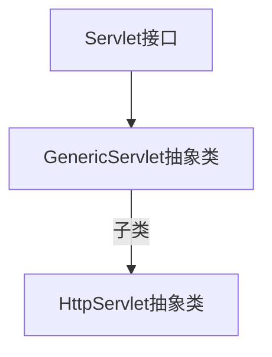
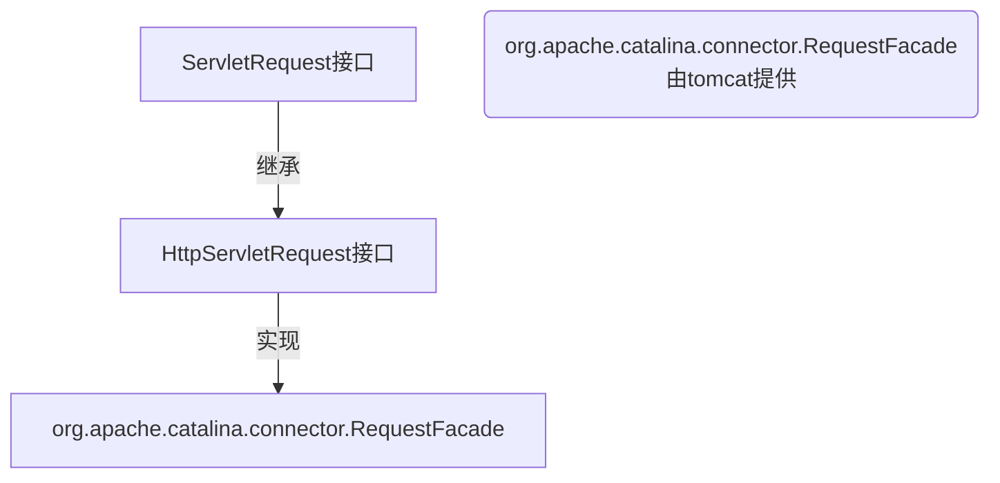

[TOC]

# 一、Web相关概念

## 1. 软件架构

1. C/S：客户端/服务器端

2. B/S：浏览器/服务器端

## 2. 资源分类

1. 静态资源：所有用户访问后，得到的结果都是一样的，称为静态资源.静态资源可以直接被浏览器解析
   * 如： html,css,JavaScript
2. 动态资源:每个用户访问相同资源后，得到的结果可能不一样。称为动态资源。动态资源被访问后，需要先转换
    为静态资源，在返回给浏览器
  * 如：servlet/jsp,php,asp....

## 3. 网络通信三要素

1. IP：电子设备(计算机)在网络中的唯一标识。
2. 端口：应用程序在计算机中的唯一标识。 0~65536
3. 传输协议：规定了数据传输的规则
   1. 基础协议：
      * tcp:安全协议，三次握手。 速度稍慢
      * udp：不安全协议。 速度快


***


# 二、WEB服务器软件

服务器：安装了服务器软件的计算机

服务器软件：接收用户的请求，处理请求，做出响应

web服务器软件：接收用户的请求，处理请求，做出响应。

	* 在web服务器软件中，可以部署web项目，让用户通过浏览器来访问这些项目
	* web容器

常见的java相关的web服务器软件：

* webLogic：oracle公司，大型的JavaEE服务器，支持所有的JavaEE规范，收费的。

* webSphere：IBM公司，大型的JavaEE服务器，支持所有的JavaEE规范，收费的。

* JBOSS：JBOSS公司的，大型的JavaEE服务器，支持所有的JavaEE规范，收费的。

* Tomcat：Apache基金组织，中小型的JavaEE服务器，仅仅支持少量的JavaEE规范servlet/jsp。开源的，免费
  的。

***JavaEE***：Java语言在企业级开发中使用的技术规范的总和，一共规定了13项大的规范


***


# 三、Servlet server applet

## 1. 概念

* Servlet就是一个接口，定义了Java类被浏览器访问到(tomcat识别)的规则。
* 将来我们自定义一个类，实现Servlet接口，复写方法。

## 2. 快速入门

1. 创建JavaEE项目
2. 定义一个类，实现Servlet接口

```java
public class ServletDemo1 implements Servlet
```

3. 实现接口中的抽象方法

4. 配置Servlet

   * 在web.xml中配置：

   ```xml
   <!--配置Servlet -->
   <servlet>
   	<servlet-name>demo1</servlet-name>
   	<servlet-class>com.webtest.ServletDemo1</servlet-class>
   </servlet>
   <servlet-mapping>
   	<servlet-name>demo1</servlet-name>
   	<url-pattern>/demo1</url-pattern>
   </servlet-mapping>
   ```

   

## 3. 执行原理

1. 当服务器接受到客户端浏览器的请求后，会解析请求URL路径，获取访问的Servlet的资源路径
2. 查找web.xml文件，是否有对应的\<url-pattern\>标签体内容。
3. 如果有，则在找到对应的\<servlet-class\>全类名
4. tomcat会将字节码文件加载进内存，并且创建其对象
5. 调用其方法

## 4. Servlet的生命周期

### 4.1 被创建

执行init方法，只执行一次

Servlet创建时间：

* 默认情况下，第一次被访问时，Servlet被创建

* 在\<servlet\>标签(web.xml中)下配置
  1. 第一次被访问时，创建

     * \<load-on-startup\>的值为负数

  2. 在服务器启动时，创建

     * \<load-on-startup\>的值为0或正整数

       

Servlet的init方法，**只执行一次**，说明一个Servlet在内存中只存在一个对象，Servlet是单例的
* 多个用户同时访问时，可能存在线程安全问题。
* 解决：尽量不要在Servlet中定义成员变量。即使定义了成员变量，也不要对修改值


### 4.2 提供服务

执行service方法，执行多次

* 每次访问Servlet时，Service方法都会被调用一次。


### 4.3 被销毁

执行destroy方法，只执行一次
* Servlet被销毁时执行。服务器关闭时，Servlet被销毁
* 只有服务器正常关闭时，才会执行destroy方法。
* destroy方法在Servlet被销毁之前执行，一般用于释放资源


## 5. Servlet3.0

> 支持<span style="color:red">注解配置</span>。可以不需要web.xml了。

1. 创建JavaEE项目，选择Servlet的版本3.0以上，可以不创建web.xml
2. 定义一个类，实现Servlet接口
3. 复写方法
4. 在类上使用@WebServlet注解，进行配置
* @WebServlet("资源路径")

```java
@Target({ElementType.TYPE})
@Retention(RetentionPolicy.RUNTIME)
@Documented
public @interface WebServlet {
    String name() default "";

    String[] value() default {};

    String[] urlPatterns() default {};

    int loadOnStartup() default -1;

    WebInitParam[] initParams() default {};

    boolean asyncSupported() default false;

    String smallIcon() default "";

    String largeIcon() default "";

    String description() default "";

    String displayName() default "";
}
```

| 属性名         | **类型**       | **描述**                                                     |
| :------------- | :------------- | :----------------------------------------------------------- |
| name           | String         | 指定Servlet 的 name 属性，等价于 \<servlet-name>。如果没有显式指定，则该 Servlet 的取值即为类的全限定名。 |
| value          | String[]       | 该属性等价于 urlPatterns 属性。两个属性不能同时使用。        |
| urlPatterns    | String[]       | 指定一组 Servlet 的 URL 匹配模式。等价于\<url-pattern>标签。 |
| loadOnStartup  | int            | 指定 Servlet 的加载顺序，等价于 \<load-on-startup>标签。     |
| initParams     | WebInitParam[] | 指定一组 Servlet 初始化参数，等价于\<init-param>标签。       |
| asyncSupported | boolean        | 声明 Servlet 是否支持异步操作模式，等价于\<async-supported> 标签。 |
| description    | String         | 该 Servlet 的描述信息，等价于 \<description>标签。           |
| displayName    | String         | 该 Servlet 的显示名，通常配合工具使用，等价于 \<display-name>标签。 |

## 6.Servlet体系机构




GenericServlet：将Servlet接口中其他的方法做了默认空实现，只将service()方法作为抽象

HttpServlet：对http协议的一种封装，简化操作
1. 定义类继承HttpServlet
2. 复写doGet/doPost方法


## 7.Servlet相关配置

urlpartten:Servlet访问路径
		1. 一个Servlet可以定义多个访问路径 ： @WebServlet({"/d4","/dd4","/ddd4"})
  		2. 路径定义规则：
              		1. /xxx：路径匹配
                     		2. /xxx/xxx:多层路径，目录结构
                            		3. *.do：扩展名匹配

# 四、Request 对象




## 1.获取请求行数据

```http
GET /index/demo1?name=zhangsan HTTP/1.1
```

### 1.1 获取请求方式

GET

```java
String getMethod()
```

### 1.2获取虚拟目录*

/index

```java
String getContextPath()
```

### 1.3获取Servlet路径

/demo1

```java
String getServletPath()
```

### 1.4获取请求参数

name=zhangsan

```java
String getQueryString()
```

### 1.5 获取请求URI/URL *

```java
String getRequestURI()// /index/demo1
StringBuffer getRequestURL() //	http://localhost:8080/index/demo1
```

### 1.6 获取协议及版本

```java
String getProtocol()
```

### 1.7 获取客户机的IP地址

```java
String getRemoteAddr()
```

***

## 2. 获取请求头数据

```http
DNT: 1
Upgrade-Insecure-Requests: 1
User-Agent: Mozilla/5.0 (Windows NT 10.0; Win64; x64) AppleWebKit/537.36 (KHTML, like Gecko) Chrome/84.0.4147.135 Safari/537.36
Accept: text/html,application/xhtml+xml,application/xml;q=0.9,image/webp,image/apng,*/*;q=0.8,application/signed-exchange;v=b3;q=0.9
```

### 2.1 通过请求头的名称获取请求头的值

```java
String getHeader(String name)
String getHeaders(String name)
```

### 2.2 获取所有的请求头名称

```java
Enumeration<String> getHeaderNames() 
```

***

## 3.获取请求体数据

GET请求无请求体，POST有

1. 获取流对象

```java
BufferedReader getReader()// 获取字符输入流，只能操作字符数据
ServletInputStream getInputStream()// 获取字节输入流，可以操作所有类型数据
```

2. 从流中获取数据

## 4. 获取参数通用方式

不论get还是post请求方式都可以使用下列方法来获取请求参数

### 4.1 根据参数名称获取参数值

```java
String getParameter(String name)
```

### 4.2 根据参数名称获取参数值的数组

```java
String[] getParameterValues(String name)
```

### 4.3 获取所有请求的参数名称

```java
Enumeration<String> getParameterNames()
```

### 4.4 获取所有参数的map集合

```java
Map<String,String[]> getParameterMap()
```

***

## 5. 转发

步骤：

### 5.1 通过request对象获取请求转发器对象

```java
RequestDispatcher getRequestDispatcher(String path) // path为@WebServlet中的路径
```

### 5.2 使用RequestDispatcher对象来进行转发

```java
req.getRequestDispatcher.forward(ServletRequest request,ServletResponse response)
```

### 5.3特点

1. 浏览器地址栏路径不发生变化
2. 只能转发到当前服务器内部资源中。
3. 转发是一次请求

***

## 6. 共享数据

> 域对象：一个有作用范围的对象，可以在范围内共享数据
>
> request域：代表一次请求的范围，一般用于请求转发的多个资源中共享数据

```java
void setAttribute(String name,Object obj)// 存储数据
Object getAttitude(String name)// 通过键获取值
void removeAttribute(String name)// 通过键移除键值对
```

***

## 7. 获取ServletContext

 ```java
ServletContext getServletContext()
 ```

***

## 8.案例：用户登录

>用户登录案例需求：
>	1.编写login.html登录页面
>		username & password 两个输入框
>	2.使用Druid数据库连接池技术,操作mysql，day14数据库中user表
>	3.使用JdbcTemplate技术封装JDBC
>	4.登录成功跳转到SuccessServlet展示：登录成功！用户名,欢迎您
>	5.登录失败跳转到FailServlet展示：登录失败，用户名或密码错误

### 8.1 创建项目，导入html页面，配置文件，jar包

HTML

```html
<!DOCTYPE html>
<html lang="zh-CN">
<head>
    <meta charset="UTF-8">
    <title>Title</title>
</head>
<body>
    <form action="/login" method="post">
        用户名:<input type="text" name="username"> <br>
        密码:<input type="password" name="password"><br>

        <input type="submit" value="登录">

    </form>
</body>
</html>
```

jar包


### 8.2 创建数据库环境

```sql
CREATE DATABASE test;
USE test;
CREATE TABLE user (
  id int(10) NOT NULL AUTO_INCREMENT PRIMARY KEY,
  username varchar(16) NOT NULL,
  password varchar(16) DEFAULT NULL
) ENGINE=InnoDB AUTO_INCREMENT=2 DEFAULT CHARSET=utf8;
```

### 8.3 创建类User

```java
package com.anli.domain;

/**
 * 用户实体类
 */
public class User {
    private int id;
    private String username;
    private String password;

    public int getId() {
        return id;
    }

    public void setId(int id) {
        this.id = id;
    }

    public String getUsername() {
        return username;
    }

    public void setUsername(String username) {
        this.username = username;
    }

    public String getPassword() {
        return password;
    }

    public void setPassword(String password) {
        this.password = password;
    }

    @Override
    public String toString() {
        return "User{" +
                "id=" + id +
                ", username='" + username + '\'' +
                ", password='" + password + '\'' +
                '}';
    }
}
```

### 8.4 编写工具类JDBCUtils

```java
package com.anli.utils;

/**
 * JDBC工具类
 */

import com.alibaba.druid.pool.DruidDataSourceFactory;
import javax.sql.DataSource;
import java.io.InputStream;
import java.sql.Connection;
import java.sql.SQLException;
import java.util.Properties;

public class JDBCUtils {
    // 定义连接池对象
    private static DataSource ds;

    // 静态代码块
    static {
        try {
            Properties pro = new Properties();
            InputStream is = JDBCUtils.class.getClassLoader().getResourceAsStream("druid.properties");
            pro.load(is);
            ds = DruidDataSourceFactory.createDataSource(pro);
        } catch (Exception e){
            e.printStackTrace();
        }
    }

    // 获取连接池对象
    public static DataSource getDataSource(){
        return ds;
    }

    // 获取连接
    public static Connection getConnection() throws SQLException {
        return ds.getConnection();
    }

    public static void init(){

    }
}
```

### 8.5 创建UserDao提供login方法

```java
package com.anli.dao;

/**
 * 操作数据库中user表的类
 */

import com.anli.domain.User;
import com.anli.utils.JDBCUtils;
import org.springframework.dao.DataAccessException;
import org.springframework.jdbc.core.BeanPropertyRowMapper;
import org.springframework.jdbc.core.JdbcTemplate;

public class UserDao {
    //声明JDBCTemplate对象共用
    private JdbcTemplate template = new JdbcTemplate(JDBCUtils.getDataSource());

    public User login(User loginUser) {
        try {
            String sql = "SELECT id,username,password FROM user WHERE username = ? AND password = ?";
            User user = template.queryForObject(sql, new BeanPropertyRowMapper<User>(User.class), loginUser.getUsername(), loginUser.getPassword());
            System.out.println(loginUser);
            return user;
        } catch (DataAccessException e){
            e.printStackTrace();
            return null;
        }

    }
}
```

### 8.6编写 Login类

```java
package com.anli.servlet;


import com.anli.dao.UserDao;
import com.anli.domain.User;
import com.anli.utils.JDBCUtils;

import javax.servlet.ServletException;
import javax.servlet.annotation.WebServlet;
import javax.servlet.http.HttpServlet;
import javax.servlet.http.HttpServletRequest;
import javax.servlet.http.HttpServletResponse;
import java.io.IOException;


@WebServlet("/login")
public class Login extends HttpServlet {
    @Override
    public void init() throws ServletException {
        // 初始化连接池
        JDBCUtils.init();
    }

    @Override
    protected void doGet(HttpServletRequest req, HttpServletResponse resp) throws ServletException, IOException {
        //1.设置编码
        req.setCharacterEncoding("utf-8");
        //2.获取请求参数
        String username = req.getParameter("username");
        String password = req.getParameter("password");
        //3.封装user对象
        User loginUser = new User();
        loginUser.setUsername(username);
        loginUser.setPassword(password);

        //4.调用UserDao的login方法
        UserDao dao = new UserDao();
        User user = dao.login(loginUser);

        //5.判断user
        if (user == null) {
            //登录失败
            req.getRequestDispatcher("/failServlet").forward(req, resp);
        } else {
            //登录成功
            //存储数据
            req.setAttribute("user", user);
            //转发
            req.getRequestDispatcher("/successServlet").forward(req, resp);
        }


    }

    @Override
    protected void doPost(HttpServletRequest req, HttpServletResponse resp) throws ServletException, IOException {
        doGet(req, resp);
    }
}
```


### 8.7 编写FailServlet和SuccessServlet类

```java
package com.anli.servlet;

/**
 * SuccessServlet 成功登录
 */

import com.anli.domain.User;
import javax.servlet.ServletException;
import javax.servlet.annotation.WebServlet;
import javax.servlet.http.HttpServlet;
import javax.servlet.http.HttpServletRequest;
import javax.servlet.http.HttpServletResponse;
import java.io.IOException;

@WebServlet("/successServlet")
public class SuccessServlet extends HttpServlet {
    @Override
    protected void doPost(HttpServletRequest request, HttpServletResponse response) throws ServletException, IOException {
        //获取request域中共享的user对象
        User user = (User) request.getAttribute("user");

        if (user != null) {
            //给页面写一句话

            //设置编码
            response.setContentType("text/html;charset=utf-8");
            //输出
            response.getWriter().write("登录成功！" + user.getUsername() + ",欢迎您");
        }
    }

    @Override
    protected void doGet(HttpServletRequest request, HttpServletResponse response) throws ServletException, IOException {
        this.doPost(request, response);
    }
}
```

```java
package com.anli.servlet;

/**
 * FailServlet 登录失败
 */

import javax.servlet.ServletException;
import javax.servlet.annotation.WebServlet;
import javax.servlet.http.HttpServlet;
import javax.servlet.http.HttpServletRequest;
import javax.servlet.http.HttpServletResponse;
import java.io.IOException;

@WebServlet("/failServlet")
public class FailServlet extends HttpServlet {
    @Override
    protected void doPost(HttpServletRequest request, HttpServletResponse response) throws ServletException, IOException {
        //给页面写一句话
        //设置编码
        response.setContentType("text/html;charset=utf-8");
        //输出
        response.getWriter().write("<span style='color:red'>登录失败，用户名或密码错误<span>");

    }

    @Override
    protected void doGet(HttpServletRequest request, HttpServletResponse response) throws ServletException, IOException {
        this.doPost(request, response);
    }
}

```

### 8.8 login.html中form表单的action路径的写法

虚拟目录+Servlet的资源路径

***

### 8.9 BeanUtils 工具类，简化数据封装

JavaBean：标准的Java类
1. 要求：
   1. 类必须被public修饰
   2. 必须提供空参的构造器
   3. 成员变量必须使用private修饰
   4. 提供公共setter和getter方法
2. 功能：封装数据
2. 概念：
成员变量：
属性：setter和getter方法截取后的产物
例如：getUsername() --> Username--> username
4. 方法：
   1. setProperty()
   2. getProperty()
   3. populate(Object obj , Map map):将map集合的键值对信息，封装到对应的JavaBean对象中

```java
import org.apache.commons.beanutils.BeanUtils;
import org.junit.Test;
import com.anli.domain.User

    public class BeanUtilsTest {
        
        @Test
        public void test(){
            User user = new User();
            BeanUtils.setProperty(user,"zhangsan","male");
            System.out.println(user);
            String gender = BeanUtils.getProperty(user, "zhangsan");
            System.out.println(gender);
        }
}
```


## 9. 请求方法

| 序号 | 方法 & 描述                                                  |
| :--- | :----------------------------------------------------------- |
| 1    | **Cookie[] getCookies()** 返回一个数组，包含客户端发送该请求的所有的 Cookie 对象。 |
| 2    | **Enumeration getAttributeNames()** 返回一个枚举，包含提供给该请求可用的属性名称。 |
| 3    | **Enumeration getHeaderNames()** 返回一个枚举，包含在该请求中包含的所有的头名。 |
| 4    | **Enumeration getParameterNames()** 返回一个 String 对象的枚举，包含在该请求中包含的参数的名称。 |
| 5    | **HttpSession getSession()** 返回与该请求关联的当前 session 会话，或者如果请求没有 session 会话，则创建一个。 |
| 6    | **HttpSession getSession(boolean create)** 返回与该请求关联的当前 HttpSession，或者如果没有当前会话，且创建是真的，则返回一个新的 session 会话。 |
| 7    | **Locale getLocale()** 基于 Accept-Language 头，返回客户端接受内容的首选的区域设置。 |
| 8    | **Object getAttribute(String name)** 以对象形式返回已命名属性的值，如果没有给定名称的属性存在，则返回 null。 |
| 9    | **ServletInputStream getInputStream()** 使用 ServletInputStream，以二进制数据形式检索请求的主体。 |
| 10   | **String getAuthType()** 返回用于保护 Servlet 的身份验证方案的名称，例如，"BASIC" 或 "SSL"，如果JSP没有受到保护则返回 null。 |
| 11   | **String getCharacterEncoding()** 返回请求主体中使用的字符编码的名称。 |
| 12   | **String getContentType()** 返回请求主体的 MIME 类型，如果不知道类型则返回 null。 |
| 13   | **String getContextPath()** 返回指示请求上下文的请求 URI 部分。 |
| 14   | **String getHeader(String name)** 以字符串形式返回指定的请求头的值。 |
| 15   | **String getMethod()** 返回请求的 HTTP 方法的名称，例如，GET、POST 或 PUT。 |
| 16   | **String getParameter(String name)** 以字符串形式返回请求参数的值，或者如果参数不存在则返回 null。 |
| 17   | **String getPathInfo()** 当请求发出时，返回与客户端发送的 URL 相关的任何额外的路径信息。 |
| 18   | **String getProtocol()** 返回请求协议的名称和版本。          |
| 19   | **String getQueryString()** 返回包含在路径后的请求 URL 中的查询字符串。 |
| 20   | **String getRemoteAddr()** 返回发送请求的客户端的互联网协议（IP）地址。 |
| 21   | **String getRemoteHost()** 返回发送请求的客户端的完全限定名称。 |
| 22   | **String getRemoteUser()** 如果用户已通过身份验证，则返回发出请求的登录用户，或者如果用户未通过身份验证，则返回 null。 |
| 23   | **String getRequestURI()** 从协议名称直到 HTTP 请求的第一行的查询字符串中，返回该请求的 URL 的一部分。 |
| 24   | **String getRequestedSessionId()** 返回由客户端指定的 session 会话 ID。 |
| 25   | **String getServletPath()** 返回调用 JSP 的请求的 URL 的一部分。 |
| 26   | **String[] getParameterValues(String name)** 返回一个字符串对象的数组，包含所有给定的请求参数的值，如果参数不存在则返回 null。 |
| 27   | **boolean isSecure()** 返回一个布尔值，指示请求是否使用安全通道，如 HTTPS。 |
| 28   | **int getContentLength()** 以字节为单位返回请求主体的长度，并提供输入流，或者如果长度未知则返回 -1。 |
| 29   | **int getIntHeader(String name)** 返回指定的请求头的值为一个 int 值。 |
| 30   | **int getServerPort()** 返回接收到这个请求的端口号。         |
| 31   | **int getParameterMap()** 将参数封装成 Map 类型。            |

***


# 五、Response对象

1. 响应行

   * 协议/版本 状态码 状态码描述
   * 响应状态码：服务器告诉客户端浏览器本次请求和响应的一个状态。
     1. 状态码都是3位数字
     2. 分类：
        * 1xx：服务器就收客户端消息，但没有接受完成，等待一段时间后，发送1xx多状态码
        * 2xx：成功。代表：200
        * 3xx：重定向。代表：302(重定向)，304(访问缓存)
        * 4xx：客户端错误。404（请求路径没有对应的资源）405：请求方式没有对应的doXxx方法
        * 5xx：服务器端错误。代表：500(服务器内部出现异常)

2. 响应头

   1. 格式：头名称： 值

   2. 常见的响应头：

      * Content-Type：服务器告诉客户端本次响应体数据格式以及编码格式

      * Content-disposition：服务器告诉客户端以什么格式打开响应体数据

        in-line:默认值,在当前页面内打开

        attachment;filename=xxx：以附件形式打开响应体。文件下载

3. 响应空行
4. 响应体

```http
HTTP/1.1 200 OK
Content-Type: text/html;charset=UTF-8
Content-Length: 101
Date: Wed, 06 Jun 2018 07:08:42 GMT

<html>
	<head>
		<title>hello , response</title>
	</head>
<body>
	hello , response
</body>
</html>
```

## 1. 设置响应行（状态码）

### 1.1 格式

```http
HTTP/1.1 200 ok
```

### 1.2 设置状态码

```java
response.setStatus(int sc)
```

***

## 2.设置响应头

```java
response.setHeader(String name, String value)
// 设置响应头
    
```

## 3. 设置响应体

步骤：

### 3.1 获取输出流

* 字符输出流：PrintWriter getWriter()
* 字节输出流：ServletOutputStream getOutputStream()

### 3.2 使用输出流，将数据输出到客户端浏览器


***

## 4. 案例 重定向

> 重定向(Redirect)就是通过各种方法将各种网络请求重新定个方向转到其它位置（如：网页重定向、域名的重定向、路由选择的变化也是对数据报文经由路径的一种重定向）。

代码实现

```java
//1. 设置状态码为302
response.setStatus(302);
//2.设置响应头location
response.setHeader("location","/day15/responseDemo2");

//简单的重定向方法
response.sendRedirect("/day15/responseDemo2");
```

### 4.1 重定向（redirect）与转发（forward）

#### Redirect的特点

1. 地址栏发生变化
2. 重定向可以访问其他站点(服务器)的资源
3. 重定向是两次请求。不能使用request对象来共享数据

#### Forward的特点

1. 转发地址栏路径不变
2. 转发只能访问当前服务器下的资源
3. 转发是一次请求，可以使用request对象来共享数据

### 4.2 路径写法：

#### 4.2.1 路径分类

1. 相对路径

   * 如：./index.html
     * 不以/开头，以.开头
   * 规则：找到当前资源和目标资源之间的相对位置关系
     * ./：当前目录
     * ../:后退一级目录

2. 绝对路径

   * 如：http://localhost/day15/responseDemo2  

   * /day15/responseDemo2

     * 以/开头的路径

   * 规则：判断定义的路径是给谁用的？判断请求将来从哪儿发出

     * 给客户端浏览器使用：需要加虚拟目录(项目的访问路径)

       * 虚拟目录动态获取：request.getContextPath()

         ```java
         
         ```

       * \<a\> , \<form\> 重定向...

     * 给服务器使用：不需要加虚拟目录

       * 转发路径

### 4.3 服务器数据到浏览器

#### 4.3.1 输出字符数据

* 乱码问题: 在获取流之前设置流的默认编码

```java
response.setContentType("text/html;charset=utf-8");
response.getWriter().write("<span style='color:red'>登录失败，用户名或密码错误<span>");
```


#### 4.3.2 输出字节数据

```java
package com.fileDownload;

import javax.servlet.ServletContext;
import javax.servlet.ServletException;
import javax.servlet.ServletOutputStream;
import javax.servlet.annotation.WebServlet;
import javax.servlet.http.HttpServlet;
import javax.servlet.http.HttpServletRequest;
import javax.servlet.http.HttpServletResponse;
import java.io.BufferedInputStream;
import java.io.FileInputStream;
import java.io.IOException;
import java.net.URLEncoder;

@WebServlet("/downloadServlet")
public class DownloadServlet extends HttpServlet {
    protected void doPost(HttpServletRequest request, HttpServletResponse response) throws ServletException, IOException {
        // 获取文件名
        String filename = request.getParameter("filename");
        //获取文件位置
        ServletContext context = this.getServletContext();
        String realPath = context.getRealPath("/img/"+filename);


        // 设置response响应头
        String mimeType = context.getMimeType(filename);//获取文件的mime类型
        response.setHeader("content-type", mimeType);
        System.out.println(filename);
        response.setHeader("content-disposition", "attachment;filename="+ URLEncoder.encode(filename, "utf-8"));
        // 创建文件输入缓冲流对象
        BufferedInputStream bis = new BufferedInputStream(new FileInputStream(realPath));

        // 创建输出流对象
        ServletOutputStream sos = response.getOutputStream();

        byte[] bytes = new byte[1024*64];
        int len;
        while ((len = bis.read(bytes)) != - 1) {
            sos.write(bytes, 0, len);
        }


        bis.close();
    }

    protected void doGet(HttpServletRequest request, HttpServletResponse response) throws ServletException, IOException {
        this.doPost(request, response);
    }
}

```


## 5. 响应方法

| 序号 | 方法 & 描述                                                  |
| :--- | :----------------------------------------------------------- |
| 1    | **String encodeRedirectURL(String url)** 为 sendRedirect 方法中使用的指定的 URL 进行编码，或者如果编码不是必需的，则返回 URL 未改变。 |
| 2    | **String encodeURL(String url)** 对包含 session 会话 ID 的指定 URL 进行编码，或者如果编码不是必需的，则返回 URL 未改变。 |
| 3    | **boolean containsHeader(String name)** 返回一个布尔值，指示是否已经设置已命名的响应报头。 |
| 4    | **boolean isCommitted()** 返回一个布尔值，指示响应是否已经提交。 |
| 5    | **void addCookie(Cookie cookie)** 把指定的 cookie 添加到响应。 |
| 6    | **void addDateHeader(String name, long date)** 添加一个带有给定的名称和日期值的响应报头。 |
| 7    | **void addHeader(String name, String value)** 添加一个带有给定的名称和值的响应报头。 |
| 8    | **void addIntHeader(String name, int value)** 添加一个带有给定的名称和整数值的响应报头。 |
| 9    | **void flushBuffer()** 强制任何在缓冲区中的内容被写入到客户端。 |
| 10   | **void reset()** 清除缓冲区中存在的任何数据，包括状态码和头。 |
| 11   | **void resetBuffer()** 清除响应中基础缓冲区的内容，不清除状态码和头。 |
| 12   | **void sendError(int sc)** 使用指定的状态码发送错误响应到客户端，并清除缓冲区。 |
| 13   | **void sendError(int sc, String msg)** 使用指定的状态发送错误响应到客户端。 |
| 14   | **void sendRedirect(String location)** 使用指定的重定向位置 URL 发送临时重定向响应到客户端。 |
| 15   | **void setBufferSize(int size)** 为响应主体设置首选的缓冲区大小。 |
| 16   | **void setCharacterEncoding(String charset)** 设置被发送到客户端的响应的字符编码（MIME 字符集）例如，UTF-8。 |
| 17   | **void setContentLength(int len)** 设置在 HTTP Servlet 响应中的内容主体的长度，该方法设置 HTTP Content-Length 头。 |
| 18   | **void setContentType(String type)** 如果响应还未被提交，设置被发送到客户端的响应的内容类型。 |
| 19   | **void setDateHeader(String name, long date)** 设置一个带有给定的名称和日期值的响应报头。 |
| 20   | **void setHeader(String name, String value)** 设置一个带有给定的名称和值的响应报头。 |
| 21   | **void setIntHeader(String name, int value)** 设置一个带有给定的名称和整数值的响应报头。 |
| 22   | **void setLocale(Locale loc)** 如果响应还未被提交，设置响应的区域。 |
| 23   | **void setStatus(int sc)** 为该响应设置状态码。              |

***


# 六、ServletContext对象

>代表整个web应用，可以和程序的容器(服务器)来通信

## 1. 获取

### 1.1 通过request对象获取

 ```java
request.getServletContext();
 ```

### 1.2 通过HttpServlet获取

```java
this.getServletContext();
```

## 2. 功能

### 2.1 获取MIME类型

>MIME类型:在互联网通信过程中定义的一种文件数据类型
>
>格式： 大类型/小类型 text/html image/jpeg

```java
String getMimeType(String file)
```

### 2.2 域对象：共享数据

```java
setAttribute(String name,Object value) // 设置共享数据
getAttribute(String name) 
removeAttribute(String name) 
```

ServletContext对象范围：所有用户所有请求的数据

### 2.3  获取文件的真实(服务器)路径

```java
ServletContext context = this.getServletContext();

String b = context.getRealPath("/b.txt");//web目录下资源访问
System.out.println(b);
String c = context.getRealPath("/WEB-INF/c.txt");//WEB-INF目录下的资源访问
System.out.println(c);
String a = context.getRealPath("/WEB-INF/classes/a.txt");//src目录下的资源访问
System.out.println(a);
```


## 3. 案例 

>文件下载需求：
>1. 页面显示超链接
>2. 点击超链接后弹出下载提示框
>3. 完成图片文件下载
>
>content-disposition:attachment;filename=xxx


```html
<!DOCTYPE html>
<html lang="zh-cn">
<head>
    <meta charset="UTF-8">
    <title>图片下载</title>
</head>
<body>

<a href="/downloadServlet?filename=你好.jpg">点击下载</a>
</body>
</html>
```


```java
package com.fileDownload;

import javax.servlet.ServletContext;
import javax.servlet.ServletException;
import javax.servlet.ServletOutputStream;
import javax.servlet.annotation.WebServlet;
import javax.servlet.http.HttpServlet;
import javax.servlet.http.HttpServletRequest;
import javax.servlet.http.HttpServletResponse;
import java.io.BufferedInputStream;
import java.io.FileInputStream;
import java.io.IOException;
import java.net.URLEncoder;

@WebServlet("/downloadServlet")
public class DownloadServlet extends HttpServlet {
    protected void doPost(HttpServletRequest request, HttpServletResponse response) throws ServletException, IOException {
        // 获取文件名
        String filename = request.getParameter("filename");
        //获取文件位置
        ServletContext context = this.getServletContext();
        String realPath = context.getRealPath("/img/"+filename);


        // 设置response响应头
        String mimeType = context.getMimeType(filename);//获取文件的mime类型
        response.setHeader("content-type", mimeType);
        System.out.println(filename);
        response.setHeader("content-disposition", "attachment;filename="+ URLEncoder.encode(filename, "utf-8"));
        // 创建文件输入缓冲流对象
        BufferedInputStream bis = new BufferedInputStream(new FileInputStream(realPath));

        // 创建输出流对象
        ServletOutputStream sos = response.getOutputStream();

        byte[] bytes = new byte[1024*64];
        int len;
        while ((len = bis.read(bytes)) != - 1) {
            sos.write(bytes, 0, len);
        }


        bis.close();
    }

    protected void doGet(HttpServletRequest request, HttpServletResponse response) throws ServletException, IOException {
        this.doPost(request, response);
    }
}

```


# 七、抽取 BaseServlet

