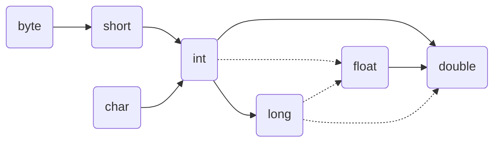
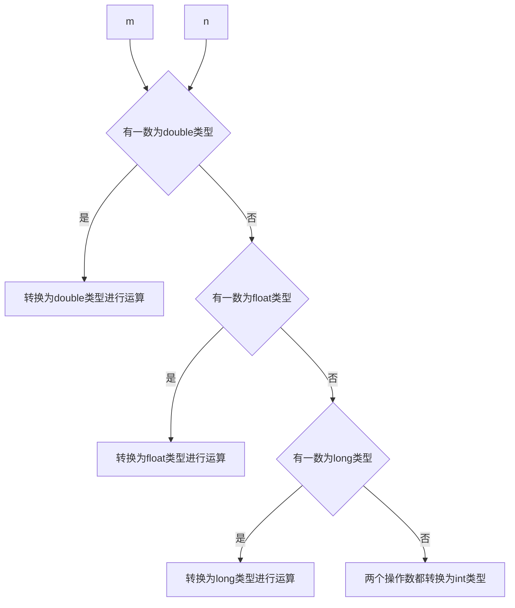

[TOC]

# 一、 Java语法基础

## 1. 注释

注释是对代码的解释和说明文字，可以提高程序的**可读性**，因此在程序中添加必要的注释文字

十分重要。Java中的

注释分为三种：

单行注释。单行注释的格式是使用//，从//开始至本行结尾的文字将作为注释文字。

```java
// 这是单行注释文字
```

多行注释。多行注释的格式是使用/* 和 */将一段较长的注释括起来。

```java
/*
这是多行注释文字
这是多行注释文字
这是多行注释文字
*/
// 注意：多行注释不能嵌套使用。
```

文档注释。文档注释以/\** 开始，以*/ 结束。


***


## 2. 关键字

关键字是指被java语言赋予了特殊含义的单词。

关键字的特点：

关键字的字母全部小写。常用的代码编辑器对关键字都有高亮显示，比如现在我们能看到的public、class、static等。


***


## 3. 常量

常量：在程序运行过程中，其值不可以发生改变的量。

Java中的常量分类：

字符串常量 用双引号括起来的多个字符（可以包含0个、一个或多个），例如"a"、"abc"、"中

国"等

整数常量 整数，例如：-10、0、88等

小数常量 小数，例如：-5.5、1.0、88.88等

字符常量 用单引号括起来的一个字符，例如：'a'、'5'、'B'、'中'等

布尔常量 布尔值，表示真假，只有两个值true和false

空常量 一个特殊的值，空值，值为null

除空常量外，其他常量均可使用输出语句直接输出。

```java
public class Demo {
    public static void main(String[] args) {
        System.out.println(10); // 输出一个整数
        System.out.println(5.5); // 输出一个小数
        System.out.println('a'); // 输出一个字符
        System.out.println(true); // 输出boolean值true
        System.out.println("欢迎来到黑马程序员"); // 输出字符串
    }
}
```


***


## 4.  数据类型

### 4.1 基本类型

| 数据类型 | 关键字       | 内存占用 | 取值范围                                                     | 默认值   |
| -------- | ------------ | -------- | ------------------------------------------------------------ | -------- |
| 整数类型 | byte         | 1        | -128-127                                                     | 0        |
|          | short        | 2        | -32768-32767                                                 | 0        |
|          | int(默认)    | 4        | -2的31次方到2的31次方-1                                      | 0        |
|          | long         | 8        | -2的63次方到2的63次方-1                                      | 0        |
| 浮点类型 | float        | 4        | 负数：-3.402823E+38到-1.401298E-45 正数： 1.401298E-45到3.402823E+38 | 0.0f     |
|          | double(默认) | 2        | 负数：-1.797693E+308到-4.9000000E-324 正数：4.9000000E-324 到1.797693E+308 | 0.0d     |
| 字符类型 | char         | 2        | 0-65535                                                      | '\u0000' |
| 布尔类型 | boolean      | 1        | true, false                                                  | false    |


* [The Java® Virtual Machine Specification](https://docs.oracle.com/javase/tutorial/java/nutsandbolts/datatypes.html)

### 4.2 包装类型

基本类型都有对应的包装类型，基本类型与其对应的包装类型之间的赋值使用自动装箱与拆箱完成。

```java
Integer x = 2;     // 装箱 调用了 Integer.valueOf(2)
int y = x;         // 拆箱 调用了 X.intValue()
```

* [Autoboxing and Unboxing](https://docs.oracle.com/javase/tutorial/java/data/autoboxing.html)


### 4.3 枚举类型

有时候，变量的取值只在一个有限的集合内。针对这种情况，可以自定义枚举类型，枚举类型包括有限个命名的值。例如：

```java
public class Consumer {
    public enum Gender{man, woman};
    public String username;
    public Gender gender;

    //... Getter And Setter
}

public class EnumTest {
    public static void main(String[] args) {
        Consumer consumer = new Consumer();
        consumer.setUsername("Tom");
        consumer.setGender(Consumer.Gender.man);
        System.out.println(consumer);
    }
}
```

在该例子中，Gender类型的变量智能存储这个类型声明中的枚举值man, woman。或者特殊值null。

***


## 5. 变量

程序运行过程中，其值可以发生改变的量。

### 5.1 声明变量 与 赋值

变量的名字可大小写混用，但首字符应小写。词由大写字母分隔，限制用下划线，限制使用美元符（$），因为这个字符对内部类有特殊的含义。示例如：idCard。

命名规范可参考 [alibaba-java-style-guide (一) 命名规约](https://github.com/chjw8016/alibaba-java-style-guide/blob/master/c1/s1.md)

```java
int j; // 如果变量声明时未给变量赋值，则变量为初始值
int age = 18; // 数据类型 变量名 = 初始化值; 
// 声明变量并赋值
```

或：

```java
int age;
age = 18;
// 先声明，后赋值（使用前赋值即可）
```


 变量的声明应该尽可能的放于第一次使用的地方。


### 5.2 使用变量的注意事项

1. 在同一对花括号中，变量名不能重复。
2. 变量在使用之前，必须初始化（赋值）。
3. 定义long类型的变量时，需要在整数的后面加L（大小写均可，建议大写）。因为整数默认是int类型，整数太
大可能超出int范围。
4. 定义float类型的变量时，需要在小数的后面加F（大小写均可，建议大写）。因为浮点数的默认类型是
double， double的取值范围是大于float的，类型不兼容。


***


## 6. 字符串

String 类代表字符串，Java 程序中的所有字符串文字（例如“abc”）都被实现为此类的实例，也就是说，Java 程序中所有的双引号字符串，都是 String 类的对象。String 类在 java.lang 包下，所以使用的时候不需要导包！


***


## 7. 类型转换

### 7.1 数值类型之间的转换





实线箭头表示无信息丢失的转化；虚线箭头表示可能有精度损失的转换。

```java
jshell> short b = 12345;//合法
b ==> 12345

jshell> short b = 1234567;
|  错误:
|  不兼容的类型: 从int转换到short可能会有损失
|  short b = 1234567;
|            ^-----^
```


**注**：当用一个二元运算符连接两个值时(例如m+n, n与m类型不同)，先要将两个操作数转换为同一类型进行计算




### 7.2 强制类型转换

 强制类型转换是在有可能丢失信息的情况下进行的转换，有可能造成精度降低或溢出。

```java
(type)var     //语法格式，运算符“()”中的type表示将值var想要转换成的目标数据类型。
```

```java
double x = 3.14;
int nx = (int) x; // nx = 3 浮点数强制转换为整数通过截断小数部分实现
```

如果要得到与浮点数最接近的整数：

```java
double x = 3.14;
int nx = (int) Math.round(x);
```

**注意：**转换类型要注意边界。当一种类型强制转换为另一种类型而又超出了目标类型的表示范围，结果就会截断为一个完全不同的值。

> (byte) 300 的实际值为44；


