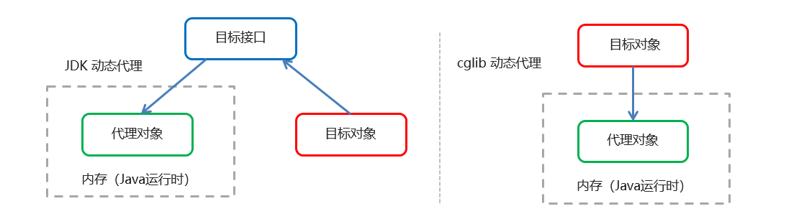

[TOC]

**设计模式**

> 设计模式（Design pattern）代表了最佳的实践，通常被有经验的面向对象的软件开发人员所采用。设计模式是软件开发人员在软件开发过程中面临的一般问题的解决方案。这些解决方案是众多软件开发人员经过相当长的一段时间的试验和错误总结出来的。


***


# 一、代理模式

>在代理模式（Proxy Pattern）中，一个类代表另一个类的功能。这种类型的设计模式属于结构型模式。
>
>在代理模式中，我们创建具有现有对象的对象，以便向外界提供功能接口。
>
>为其他对象提供一个代理以控制对某个对象的访问。代理类主要负责为委托了（真实对象）预处理消息、过滤消息、传递消息给委托类，代理类不现实具体服务，而是利用委托类来完成服务，并将执行结果封装处理。
>
>其实就是代理类为被代理类预处理消息、过滤消息并在此之后将消息转发给被代理类，之后还能进行消息的后置处理。代理类和被代理类通常会存在关联关系(即上面提到的持有的被带离对象的引用)，代理类本身不实现服务，而是通过调用被代理类中的方法来提供服务。

## 1. 静态代理

创建一个接口，然后创建被代理的类实现该接口并且实现该接口中的抽象方法。之后再创建一个代理类，同时使其也实现这个接口。在代理类中持有一个被代理对象的引用，而后在代理类方法中调用该对象的方法。

目标类接口：

```java
public interface Hello {
    void sayHello();
}
```

目标类：

```java
public class HelloImpl implements HelloInterface{
    @Override
    public void sayHello() {
        System.out.println("Hello!");
    }
}
```

代理类：

```java
public class HelloImplProxy implements Hello{
    private Hello hello = new HelloImpl();
    @Override
    public void sayHello() {
        System.out.println("Before invoke sayHello" );
        hello.sayHello();
        System.out.println("After invoke sayHello");
    }
}
```

调用代理类：

```java
public static void main(String[] args) {
    Hello hello = new HelloImplProxy();
    hello.sayHello();
}
```

控制台输出

```
Before invoke sayHello
Hello!
After invoke sayHello
```


## 2. 动态代理

利用反射机制在**运行时**创建代理类。

常用的动态代理技术

JDK 代理 : 基于<span style="color:red;font-weight:bold">接口</span>的动态代理技术 ==> 目标类必须要有接口才能进行JDK动态代理

cglib 代理：基于父类的动态代理技术



### 2.1 JDK动态代理

目标类接口：

```java
public interface Hello {
    void sayHello();
}
```

目标类：

```java
public class HelloImpl implements HelloInterface{
    @Override
    public void sayHello() {
        System.out.println("Hello!");
    }
}
```

动态代理目标类

```java
public class EnhancedHelloImpl {
    public static void main(String[] args) {
        HelloImpl helloImpl = new HelloImpl();
        // 创建目标对象

        // 创建代理对象
        Hello hello = (Hello) Proxy.newProxyInstance(helloImpl.getClass().getClassLoader(),
                helloImpl.getClass().getInterfaces(), new InvocationHandler() {
                    @Override
                    public Object invoke(Object proxy, Method method, Object[] args) throws Throwable {
                        System.out.println("前置代码增强...");
                        Object invoke = method.invoke(helloImpl, args);
                        System.out.println("后置代码增强...");
                        return invoke;
                    }
                });
        // 测试
        hello.sayHello();
    }
}
```

控制台输出：

```
前置代码增强...
Hello!
后置代码增强...
```


### 2.2 cglib动态代理

cglib是基于父类的动态代理技术

目标类

```java
public class Hello{
    public void sayHello() {
        System.out.println("Hello!");
    }
}
```

动态代理代码：

```java
public class EnhancedHello {
    public static void main(String[] args) {
        Hello hello1 = new Hello(); // 创建目标对象
        Enhancer enhancer = new Enhancer(); // 创建增强器
        enhancer.setSuperclass(Hello.class); // 设置父类
        enhancer.setCallback(new MethodInterceptor() {
            @Override
            public Object intercept(Object o, Method method, Object[] objects, MethodProxy methodProxy) throws Throwable {
                System.out.println("前置代码增强...");
                Object invoke = method.invoke(hello1, objects);
                System.out.println("后置代码增强...");
                return invoke;
            }
        });
        Hello hello2 = (Hello) enhancer.create();
        hello2.sayHello();
    }
}
```

控制台输出

```
前置代码增强...
Hello!
后置代码增强...
```


