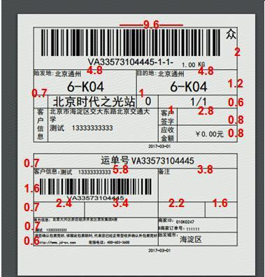
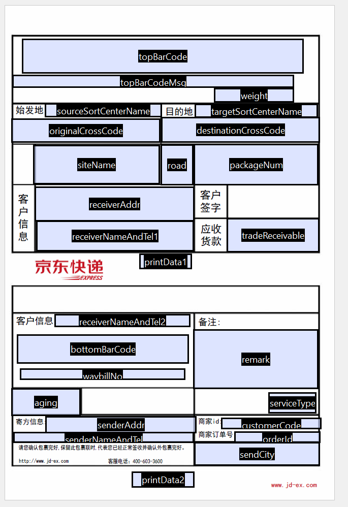
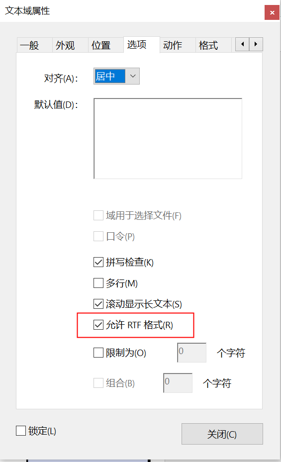
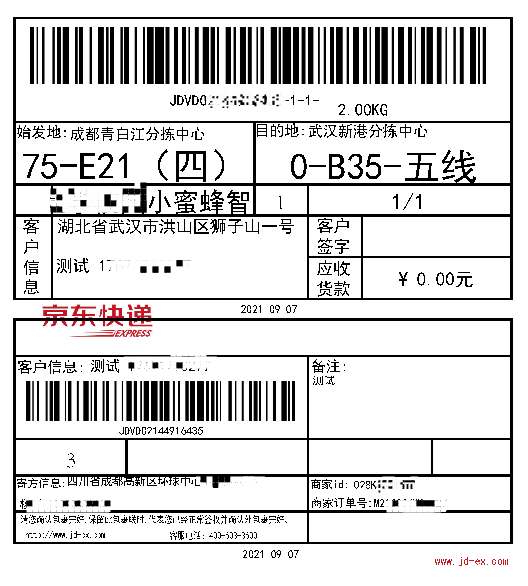

> ​		公司最近对接京东快递，但是京东快递的面单打印只能通过其客户端进行。所以为了系统对接，我们只能自行进行面单绘制。

下面是京东快递提供的面单样式。



如上图所示，京东面单绘制不仅需要绘制文字，还需要绘制条形码。

## 一、`pdf`绘制常用方法

1. 使用`Graphics`绘制图片, 再将图片用`IText`或`Aspose`转为`pdf`.
2. 直接使用`IText`绘制`pdf`.
3. 使用`Adobe Acrobat DC PRO` 生成带表单域的模板文件，再使用`Itext`进行填充即可.


1，2方法都在代码中进行`pdf`绘制，后期要修改比较费时，所以本次业务使用了方法3


`Adobe Acrobat DC PRO`生成表单文件时，生成对应的`pdf`文字域插入条形码图像，强烈建议不要用图像域，坑超级多！

***

## 二、条形码绘制

条形码绘制使用的是`barcode4j`，没啥好说的，用的时候注意高度就好了没啥好说的。


## 三、面单绘制

下图是京东的面单模板



文本域设置也没啥好说的，唯一一点就是文本域属性设置选项中，需要勾选"`允许RTF格式`"，方便在代码中动态设置字体大小等内容。




## 四、代码

* 使用的库

`itextpdf` 5.5.13.2

`barcode4j-light` 2.0

```xml
<dependency>
    <groupId>com.itextpdf</groupId>
    <artifactId>itextpdf</artifactId>
    <version>${itextpdf.version}</version>
</dependency>
<dependency>
    <groupId>net.sf.barcode4j</groupId>
    <artifactId>barcode4j-light</artifactId>
    <version>${barcode4j-light.version}</version>
</dependency>
```

* 面单绘制工具类

```java
@Slf4j
@Component
public class JDPlotFaceSheetUtil {
    // 模板路径
    private static String templatePdfPath;
    // 字体路径
    private static String fontPath;

    public static void setTemplatePdfPath(String templatePdfPath) {
        JDPlotFaceSheetUtil.templatePdfPath = templatePdfPath;
    }

    public static void setFontPath(String fontPath) {
        JDPlotFaceSheetUtil.fontPath = fontPath;
    }

    public static String getTemplatePdfPath() {
        return templatePdfPath;
    }

    public static String getFontPath() {
        return fontPath;
    }

    public static byte[] generate(Map<String, String> template) throws IOException, DocumentException {
        ClassPathResource templatePathResource = new ClassPathResource(templatePdfPath);
        ClassPathResource fontPathResource = new ClassPathResource(fontPath);
//        log.info("templatePdfPath: {}, fontPath: {}", templatePdfPath, fontPath);
//        log.info("templatePathResource: {}", templatePathResource);
        // 创建pdf阅读器
        //InputStream templateInputStream = FileUtil.getInputStream(templatePdfPath);
        InputStream templateInputStream = templatePathResource.getInputStream();
        PdfReader reader = new PdfReader(templateInputStream);
//        log.info("pdfReader: {}", reader);
        ByteArrayOutputStream bos = new ByteArrayOutputStream();
        // 创建pdf模板
        PdfStamper ps = new PdfStamper(reader, bos);
        // 封装数据
        AcroFields form = ps.getAcroFields();
        form.addSubstitutionFont(BaseFont.createFont(fontPathResource.getPath(), BaseFont.IDENTITY_H, BaseFont.NOT_EMBEDDED));
//        log.info("form: {}",form);
        // 加入运单号-包裹-包裹总数-
        String[] sArray = template.get("packageNum").split("/");
        template.put("topBarCodeMsg",String.format("%s-%s-%s-", template.get("waybillNo"), sArray[0], sArray[1]));

        template.forEach((key, value) -> {
            if (value != null) {
                try {
                    // 站点名设置大小
                    if ("siteName".equals(key) && value.length() > 8) {
                        form.setFieldProperty("siteName", "textsize", 8f, null);
                    }
                    form.setField(key, value);
                } catch (IOException | DocumentException e) {
                    e.printStackTrace();
                }
            }
        });
        // 生成条形码
        byte[] topCode = genBarCode(template.get("topBarCodeMsg"), 150, 0.44f, 12, 0);
        byte[] bottomCode = genBarCode(template.get("waybillNo"), 150, 0.44f, 10, 0);

/*        PdfContentByte contentByte = ps.getOverContent(0);
        System.out.println(contentByte);
        if (topCode != null) {
            // 插入条形码
            Image img = Image.getInstance(topCode);
            // 居中显示
            img.setAlignment(1);
            // 显示位置
            img.setAbsolutePosition(100, 100);
            // 显示百分比大小
            contentByte.addImage(img);
        }*/

        // pdf添加图片
        PdfContentByte contentByte = ps.getOverContent(1);
        addImg("topBarCode",topCode,contentByte,form);
        addImg("bottomBarCode",bottomCode,contentByte,form);

        ps.setFormFlattening(true);
        ps.close();

        return bos.toByteArray();
    }

    private static void addImg(String fieldName, byte[] imgByte, PdfContentByte contentByte,AcroFields form) throws DocumentException, IOException {
        if (imgByte != null) {
            // 获取关键字所在页面位置
            Rectangle signRect = form.getFieldPositions(fieldName).get(0).position;
            float x = signRect.getLeft();
            float y = signRect.getBottom();
            // 根据域的大小缩放图片
            Image img = Image.getInstance(imgByte);
            img.scaleToFit(signRect.getWidth(), signRect.getHeight());
            img.setAbsolutePosition(x,y);
            contentByte.addImage(img);
        }
    }

    /**
     * 生成条形码
     * @param msg 条形码文字
     * @param dpi 分辨率
     * @param moduleWidth ??
     * @param barHeight 高度mm
     * @param quiteZone 两侧留白mm
     * @return
     */
    public static byte[] genBarCode(String msg, int dpi, float moduleWidth, float barHeight, float quiteZone) {
        Code128Bean barCode = new Code128Bean();

        // UnitConv 是barcode4j 提供的单位转换的实体类，用于毫米mm,像素px,英寸in,点pt之间的转换
        barCode.doQuietZone(true);
        // 设置分辨率
        // UnitConv 是barcode4j 提供的单位转换的实体类，用于毫米mm,像素px,英寸in,点pt之间的转换
        barCode.setModuleWidth(moduleWidth);
        barCode.setBarHeight(barHeight);
        if (quiteZone > 0) {
            barCode.doQuietZone(true);
            barCode.setQuietZone(quiteZone);
        } else {
            barCode.doQuietZone(false);
        }
        // 设置条码文字位置
        barCode.setMsgPosition(HumanReadablePlacement.HRP_NONE);
        ByteArrayOutputStream bos = null;
        BitmapCanvasProvider canvas = null;
        try {
            bos = new ByteArrayOutputStream();
            canvas = new BitmapCanvasProvider(bos, "image/png", dpi, BufferedImage.TYPE_BYTE_BINARY, false, 0);
            barCode.generateBarcode(canvas, msg);
            canvas.finish();
            return bos.toByteArray();
        } catch (IOException e) {
            e.printStackTrace();
        } finally {
            if (canvas != null) {
                try {
                    canvas.finish();
                } catch (IOException e) {
                    e.printStackTrace();
                }
            }
            if (bos != null) {
                try {
                    bos.close();
                } catch (IOException e) {
                    e.printStackTrace();
                }
            }

        }
        return null;
    }


}
```


