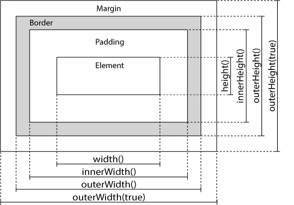

[TOC]

# 1. 简介

jQuery是一个JavaScript函数库。

> jQuery是一个快速、简洁的JavaScript框架，是继Prototype之后又一个优秀的JavaScript代码库（或JavaScript框架）。jQuery设计的宗旨	是“write Less，Do More”，即倡导写更少的代码，做更多的事情。它封装JavaScript常用的功能代码，提供一种简便的JavaScript设计模式，优	化HTML文档操作、事件处理、动画设计和Ajax交互。

jQuery库包含以下功能：

* HTML 元素选取

* HTML 元素操作

* CSS 操作

* HTML 事件函数

* JavaScript 特效和动画

* HTML DOM 遍历和修改

* AJAX

* Utilities

  

***


# 2.jQuery 使用

jQuery下载时有两种，

1. Production versionjquery-3.3.1.min.js：用于实际的网站中，已被精简和压缩。如：jquery-3.3.1.min.js
2. Development version：用于测试和开发（未压缩，是可读的代码）如：jquery-3.3.1.js

```html
<script src="jQuery路径" type="text/javascript"></script>
<!-- type="text/javascript"可以省略，JavaScript 是 HTML5 以及所有现代浏览器中的默认脚本语言！ -->
```

也可以通过CDN（内容分发网络） 引用，如：

```html
<head>
<script src="https://apps.bdimg.com/libs/jquery/1.10.2/jquery.min.js">
</script>
</head>
```

## 2.1 版本选择

目前jQuery有三个大版本：
	1.x：兼容ie678,使用最为广泛的，官方只做BUG维护，
		 功能不再新增。因此一般项目来说，使用1.x版本就可以了，
	2.x：不兼容ie678，很少有人使用，官方只做BUG维护，
		 功能不再新增。如果不考虑兼容低版本的浏览器可以使用2.x，
	3.x：不兼容ie678，只支持最新的浏览器。除非特殊要求，
		 一般不会使用3.x版本的，很多老的jQuery插件不支持这个版本。
		 目前该版本是官方主要更新维护的版本。


***


# 3. jQuery对象与原生js对象相互转换

jQuery对象转为原生js对象

```html
<script>
    var jsObj1 = $(selecter1)[index];
    var jsObj2 = $(selecter2).get(index);
    <!-- jsObj为原生js对象，selecter为jQuery选择器，index为索引 -->
</script>
```

js对象转为jQuery对象

```html
<script>
	var jqObj = $(jsObj);
</script>
```


***


# 4. jQuery语法

通过jQuery可以选取（查询，query）HTML元素，并对其进行DOM操作

基础语法： **$(selector).action()**

* $符号定义jQuery
* 选择器（selecter）”查询“和”查找“HTML元素
* action()为对元素的操作

例如

$("#test").hide() 隐藏id为test的元素

**注：**为了防止文档在完全加载（就绪）之前运行 jQuery 代码，即在 DOM 加载完成后才对 DOM 进行操作

```javascript
$(document).ready(function(){
// 开始写 jQuery 代码...
});
<!-- 另一种写法 -->
$(function(){
    // 开始写 jQuery 代码...
})
```

## 4.1 window.onload与jQuery入口函数的区别

1. 原生js中window.onload只能执行最后一次定义的，而jQuery入口函数可以执行多次
2. JavaScript 的 window.onload 事件是等到所有内容，包括外部图片之类的文件加载完后，才会执
   行。jQuery 的入口函数是在 html 所有标签(DOM)都加载之后，就会去执行。

# 5. 选择器

## 5.1基本选择器

### 5.1.1 id选择器

```javascript
$("#id") 
$("#id属性值")
```

### 5.1.2 标签选择器

```javascript
$("div") 
$("标签名")
```

### 5.1.3 类选择器

```javascript
$(".btn") 
$(".class属性值")
```

### 5.1.4 并集(组合)选择器

```javascript
$(".btn,#id1") //组合选择器
$("选择器1,选择器2,...")
```

## 5.2 层级选择器

### 5.2.1 子元素选择器

```javascript
$("#navdiv > p") // 选择的是p1,p2,p3
$("选择器1 > 选择器2")
```

```html
<div id = "navdiv">
    <p id="p1"></p>
    <p id="p2"></p>
    <p id="p3"></p>
    <span id="span1">
        <p id="p4"></p>
    </span>
</div>
<div id="footdiv"></div>
<span id = "span2"></span>
```

### 5.2.2 后代元素选择器

```javascript
$("#navdiv  p") // 试验用例同5.1 选择的是p1,p2,p3,p4
$("选择器1  选择器2")
```

### 5.2.1 紧邻下⼀个元素选择器

```javascript
$("#navdiv + p") // 试验用例同5.1 选择的是p1
$("选择器1 + 选择器2")
```

### 5.2.1 兄弟元素选择器

```javascript
$("#navdiv ~ div") // 试验用例同5.1 选择的是 footdiv
$("选择器1 ~ 选择器2")
```


## 5.3 属性选择器

采用xpath语法

### 5.3.1 属性名称选择器

```javascript
$("[title]") 
$("标签名[属性名]") // 包含指定属性的选择器
```

### 5.3.2 属性选择器

```javascript
$("[title='bannerImg']")
$("标签名[属性名='属性值']") // 包含指定属性，且指定属性等于指定属性值的选择器
```

### 5.3.3 复合属性选择器

```javascript
$("[name='bannner'][src]")
 $("标签名[属性名='值'][]...") // 包含多个属性条件的选择器
```


## 5.4 过滤选择器

通常与其他选择器结合使用

### 5.4.1 首元素过滤选择器

```javascript
$("li :first") // 第⼀个li标签
$("选择器... :first") // 获得选择的元素中的第一个元素
```

### 5.4.2 尾元素过滤选择器

```javascript
$("li :last") // 最后一个li标签
$("选择器... :last") // 获得选择的元素中的最后一个元素
```

### 5.4.3 非元素选择器

```javascript
$("li:not(.btn)") //挑选除类名为btn 以外的所有li标签
$("选择器1... :not(选择器2)") // 不包含not()括号中的元素
```

### 5.4.4 偶数选择器

```javascript
$("li : even") // 挑选索引为偶数的li标签
$("选择器 : even") // 偶数，从 0 开始计数
```

### 5.4.5 奇数选择器

```javascript
$("li : odd") // 挑选索引为奇数的li标签
$("选择器 : odd") // 偶数，从 1 开始计数
```

### 5.4.6 索引选择器

#### 1. 等于索引选择器

```javascript
$("li : eq(4)") // 索引等于4的li标签（从0开始）
$("选择器 : eq(index)") // 指定索引元素
```

#### 2. 大于索引选择器

```javascript
$("li:gt(2)") // 索引大于2的li标签
$("选择器 : gt(index)") // 索引大于index的元素
```

#### 3. 小于索引选择器

```javascript
$("li:lt(3)") // 索引小于3的li标签
$("选择器 : lt(index)") // 索引大于index的元素
```

### 5.4.7 标题选择器

```javascript
$(":header") // 获得标题（h1~h6）
```


### 5.4.8 内容过滤选择器

#### 1. 包含选择器

```javascript
$("div:contains('nav')")    // 包含 nav文本的元素
$("div:has(selector)")      // 含有选择器所匹配的元素
```

#### 2. 空选择器

```javascript
$("td:empty")                 //不包含子元素或者文本的空元素
```

#### 4. 含子元素选择器

```javascript
$("td:parent")                //含有子元素或者文本的元素
```

### 5.4.9 可见性过滤选择器

```java
$("li:hidden")       //匹配所有不可见元素，或type为hidden的元素
$("li:visible")      //匹配所有可见元素
```

### 5.4.10 属性过滤选择器

```javascript
$("div[id]")        	  //所有含有 id 属性的 div 元素
$("div[id='123']")        // id属性值为123的div 元素
$("div[id!='123']")       // id属性值不等于123的div 元素
$("div[id^='qq']")        // id属性值以qq开头的div 元素
$("div[id$='zz']")        // id属性值以zz结尾的div 元素
$("div[id*='bb']")        // id属性值包含bb的div 元素
$("input[id][name$='man']") //多属性选过滤，同时满足两个属性的条件的元素
```

### 5.4.11 状态过滤选择器

#### 1. 可用元素选择器

```javascript
$(":enabled")    // 获得可用元素
$("input : enable") // 匹配可用的输入框
```

#### 2. 不可用元素选择器

```javascript
$(":disabled")   // 获得不可用元素
$("imput:disable") // 匹配不可用的输入框
```

#### 3. 选中选择器1

```javascript
$(":checked")    // 获得单选/复选框选中的元素
$("input:checked") // 匹配勾选了的input标签
```

#### 4. 选中选择器2

```javascript
$(":selected")  // 获得下拉框选中的元素
$("option:selected")  // 匹配选中的 option
```

### 5.4.12 表单选择器

```javascript
$(":input")      //匹配所有 input, textarea, select 和 button 元素
$(":text")       //所有的单行文本框，$(":text") 等价于$("[type=text]")，推荐使用$("input:text")  //效率更高，下同
$(":password")   //所有密码框
$(":radio")      //所有单选按钮
$(":checkbox")   //所有复选框
$(":submit")     //所有提交按钮
$(":reset")      //所有重置按钮
$(":button")     //所有button按钮
$(":file")       //所有文件域
```

## 5.5 选择器列表

| 选择器|实例|选取|
| :-- | :-- | :--|
| \*| $("\*")                        | 所有元素                                                     |
| #id|$("#lastname")|id="lastname" 的元素 |
| .class|$(".intro")| class="intro" 的所有元素|
| .class,.class|$(".intro,.demo")|class 为 "intro" 或 "demo" 的所有元素|
| element|$("p")|所有\<p>元素|
| el1,el2,el3 | $("h1,div,p")| 所有 \<h1>、\<div> 和 \<p> 元素|
||||
| :first| $("p:first")| 第一个 \<p> 元素|
| :last| $("p:last")| 最后一个 \<p> 元素|
| :even| $("tr:even")| 所有偶数 \<tr> 元素，索引值从 0 开始，第一个元素是偶数 (0)，第二个元素是奇数 (1)，以此类推。 |
| :odd| $("tr:odd")| 所有奇数 \<tr> 元素，索引值从 0 开始，第一个元素是偶数 (0)，第二个元素是奇数 (1)，以此类推。 |
||||
| :first-child | $("p:first-child")| 属于其父元素的第一个子元素的所有 \<p> 元素|
| :first-of-type | $("p:first-of-type")| 属于其父元素的第一个\<p> 元素的所有 \<p> 元素|
| :last-child| $("p:last-child")| 属于其父元素的最后一个子元素的所有 \<p> 元素|
| :last-of-type| $("p:last-of-type")| 属于其父元素的最后一个 \<p> 元素的所有 \<p> 元素|
| :nth-child(n)| $("p:nth-child(2)")| 属于其父元素的第二个子元素的所有 \<p> 元素|
| :nth-last-child(n)| $("p:nth-last-child(2)")| 属于其父元素的第二个子元素的所有 \<p> 元素，从最后一个子元素开始计数 |
| :nth-of-type(n)| $("p:nth-of-type(2)")| 属于其父元素的第二个 \<p> 元素的所有 \<p> 元素|
| :nth-last-of-type(n)| $("p:nth-last-of-type(2)")| 属于其父元素的第二个 \<p> 元素的所有 \<p> 元素，从最后一个子元素开始计数 |
| :only-child| $("p:only-child")| 属于其父元素的唯一子元素的所有 \<p> 元素|
| :only-of-type| $("p:only-of-type")| 属于其父元素的特定类型的唯一子元素的所有 \<p> 元素|
||||
| parent > child | $("div > p")| \<div> 元素的直接子元素的所有 \<p> 元素 |
| parent descendant| $("div p")| \<div> 元素的后代的所有\<p> 元素|
| element + next | $("div + p")| 每个 \<div> 元素相邻的下一个 \<p> 元素|
| element ~ siblings| $("div ~ p")| \<div> 元素同级的所有 \<p> 元素|
||||
| :eq(index)| $("ul li:eq(3)")| 列表中的第四个元素（index 值从 0 开始）|
| :gt(no)| $("ul li:gt(3)")| 列举 index 大于 3 的元素|
| :lt(no)| $("ul li:lt(3)")| 列举 index 小于 3 的元素|
| :not(selector)| $("input:not(:empty)")|所有不为空的输入元素|
||||
| :header| $(":header")| 所有标题元素 \<h1>, \<h2> ...|
| :animated| $(":animated")| 所有动画元素|
| :focus| $(":focus")| 当前具有焦点的元素|
| :contains(text)| $(":contains('Hello')")| 所有包含文本 "Hello" 的元素|
| :has(selector)| $("div:has(p)")| 所有包含有 \<p> 元素在其内的 \<div> 元素|
| :empty| $(":empty")| 所有空元素|
| :parent| $(":parent")| 匹配所有含有子元素或者文本的父元素。|
| :hidden| $("p:hidden")| 所有隐藏的 \<p> 元素|
| :visible| $("table:visible")| 所有可见的表格|
| :root| $(":root")| 文档的根元素 |
| :lang(language)| $("p:lang(de)") | 所有 lang 属性值为 "de" 的 \<p> 元素 |
||||
| [attribute]| $("[href]")| 所有带有 href 属性的元素|
| [attribute=value]| $("[href='default.htm']")| 所有带有 href 属性且值等于 "default.htm" 的元素|
| [attribute!=value]| $("[href!='default.htm']")| 所有带有 href 属性且值不等于 "default.htm" 的元素|
| [attribute$=value]| $("[href$='.jpg']")| 所有带有 href 属性且值以 ".jpg" 结尾的元素|
| [attribute\|=value]| $("[title\|='Tomorrow']")| 所有带有 title 属性且值等于 'Tomorrow' 或者以 'Tomorrow' 后跟连接符作为开头的字符串 |
| [attribute^=value]| $("[title^='Tom']")| 所有带有 title 属性且值以 "Tom" 开头的元素|
| [attribute~=value]| $("[title~='hello']")| 所有带有 title 属性且值包含单词 "hello" 的元素|
| [attribute\*=value]| $("[title\*='hello']")| 所有带有 title 属性且值包含字符串 "hello" 的元素 |
| \[name=value]\[name2=value2] | $( "input\[id]\[name$='man']" ) | 带有 id 属性，并且 name 属性以 man 结尾的输入框|
||||
| :input| $(":input")| 所有 input 元素|
| :text| $(":text")| 所有带有 type="text" 的 input 元素|
| :password| $(":password")| 所有带有 type="password" 的 input 元素|
| :radio| $(":radio")| 所有带有 type="radio" 的 input 元素|
| :checkbox | $(":checkbox")| 所有带有 type="checkbox" 的 input 元素 |
| :submit | $(":submit")| 所有带有 type="submit" 的 input 元素|
| :reset| $(":reset")| 所有带有 type="reset" 的 input 元素|
| :button| $(":button")| 所有带有 type="button" 的 input 元素|
| :image| $(":image")| 所有带有 type="image" 的 input 元素|
| :file| $(":file")| 所有带有 type="file" 的 input 元素|
| :enabled| $(":enabled")| 所有启用的元素|
| :disabled | $(":disabled") | 所有禁用的元素|
| :selected| $(":selected")| 所有选定的下拉列表元素|
| :checked| $(":checked")| 所有选中的复选框选项|
| .selector| $(selector).selector| <span style="color:red">在jQuery 1.7中已经不被赞成使用</span>。返回传给jQuery()的原始选择器 |
| :target| $( "p:target" )| 选择器将选中ID和URI中一个格式化的标识符相匹配的\<p>元素|
<a href="https://www.runoob.com/jquery/jquery-ref-selectors.html" style="color:red;text-decoration:none">各个选择器具体使用方式点击此处</a>


***


# 6. 事件

页面对不同访问者的响应叫做事件。

事件处理程序指的是当 HTML 中发生某些事件时所调用的方法。

在事件中经常使用术语"触发"（或"激发"）例如： "按下按键时触发 keypress 事件"。

jQuery中的事件与原生js的事件基本都能找到对应关系

## 6.1 事件绑定

### .on("事件名称",回调函数)

### .off("事件名称")

如果off方法不传递任何参数，则将组件上的所有事件全部解绑

```js
// 为p元素绑定鼠标单击事件
$("p").on("click",function(){
    alert("段落被点击了。");
});

// 为p元素解绑鼠标单击事件
$("p").off("click");

// 为p元素解绑所有事件
$("p").off();
```


***


## 6.2 几种常见的事件

### 6.2.1 鼠标事件

#### 1 click

鼠标单击事件，由mousedown和mouseup两个动作构成

##### $ele.click( handler(eventObject) )

handler(eventObject)
每次事件触发时会执行的函数。

```javascript
$("p").click(function(){
    alert("段落被点击了。");
});
```

##### $ele.click( [eventData ], handler(eventObject) )

* eventData
  一个对象，它包含的数据键值对映射将被传递给事件处理程序。
* handler(eventObject)
  每次事件触发时会执行的函数。$("p").click(); 表示*在页面上所有段落上触发click事件*

```javascript
$("#text").click(11111,function(e) {
    //this指向 div元素
    //e.date  => 11111 传递数据
});
```

##### $ele.click()

不接受任何参数，用来指定触发一个事件。

```html
<div id="test">点击触发<div>
<script>
    $("ele").click(function(){ 
    	alert('触发指定事件')
	})
	$("#text").click(function(){
    	$("ele").click()  //手动指定触发事件
	});
    </script>
    

```

#### 2 dbclick

鼠标双击事件

##### $ele.dbclick( handler(eventObject) )

##### $ele.dbclick( [eventData ], handler(eventObject) )

##### $ele.dbclick( )

参数用法与 .click 相同

```javascript
$("p").dblclick(function(){
    alert("这个段落被双击。");
});
```

#### 3 mouseenter

鼠标进入事件

##### .mouseenter( handler(eventObject) )
handler(eventObject)
每次事件触发时会执行的函数。

##### .mouseenter( [eventData ], handler(eventObject) )
eventData
一个对象，它包含的数据键值对映射将被传递给事件处理程序。
handler(eventObject)
每次事件触发时会执行的函数。

##### .mouseenter()
这个方法不接受任何参数。

```javascript
$("p").mouseenter(function(){
    $("p").css("background-color","yellow");
});
```

#### 4 mouseleave 

鼠标离开事件

##### .mouseleave( handler(eventObject) )  

handler(eventObject) 
每次事件触发时会执行的函数。  

##### .mouseleave( [eventData ], handler(eventObject) )  

eventData 
一个对象，它包含的数据键值对映射将被传递给事件处理程序。 
handler(eventObject) 
每次事件触发时会执行的函数。  

##### .mouseleave()  

这个方法不接收任何参数

```javascript
$("p").mouseleave(function(){
    $("p").css("background-color","");
});
```

#### 5 focusin

将一个事件函数绑定到获得焦点事件上。

##### .focusin(handler(eventObject))
handler(eventObject)
每次事件出发会执行的函数。

##### .focusin([eventData],handler(eventObject))
eventData
一个对象，它包含的数据键值对映射将被传递给事件处理程序。
handler(eventObject)
每次事件出发会执行的函数。

```javascript
　$("p").focusin(function() {
　　　　$(this).css('color','yellow');
　　}); //当p 内获得焦点的时候执行此函数。
```

#### 6 focusout

将一个事件函数绑定到失去焦点事件上。

##### .focusout(handler(eventObject))

handler(eventObject)
每次事件出发会执行的函数。

##### .focusout([eventData],handler(eventObject))

eventData
一个对象，它包含的数据键值对映射将被传递给事件处理程序。
handler(eventObject)
每次事件出发会执行的函数。

```javascript
$("p").focusin(function() {
　　　　$(this).css('color','');
　　}); //当p 内失去焦点的时候执行此函数。
```

####  hover 

将两个时间函数绑定到匹配元素上，分别当鼠标指针进入和离开元素时被被执行。
##### .hover(handlerIn(eventObject),handlerOut(eventObject))
handlerIn(eventObject)
当鼠标指针进入元素时触发执行的事件函数。

##### .handlerOut
当鼠标指针离开元素时候触发执行的事件函数。
用法：

```html
<p id="test">test</p>
<script>
    $("p").hover(function(){
        $("p").css("background-color","yellow");
    },function(){
        $("p").css("background-color","");
    });
</script>
```

### 6.2.2 键盘事件

#### 1 keypress

当浏览器捕获一个元素上键盘输入时，`keypress`就会发送个元素。这是类似`keydown`事件，除了当按键被一直按下（即连续插入字符的场合）时的处理。如果用户按下并按住这个键（不松开释放）的时候，`keydown`事件只触发一次，但是`keypress`会在每个字符插入的时候都会触发事件。此外，组合键（如Shift）会触发`keydown`事件，但不会触发`keypress`事件。

`keypress`事件处理程序可以附加到任何元素，但该事件只是发送到具有焦点的元素上。不同的浏览器中，可获得焦点的元素略有不同，但是表单元素总是能获取焦点，所以对于此事件类型表单元素是最合适的。

##### .keypress( handler(eventObject) )
handler(eventObject)
每次事件触发时会执行的函数。
##### .keypress( [eventData ], handler(eventObject) )
eventData
一个对象，它包含的数据键值对映射将被传递给事件处理程序。
handler(eventObject)
每次事件触发时会执行的函数。
##### .keypress()
这个方法不接受任何参数

```javascript
$("input").keypress(function(){
    $("span").text(i+=1);
});
```

#### 2 keydown

当用户在一个元素上第一次按下键盘上的键的时候，`keydown`事件就会发送给这个元素。它可以绑定到任何元素，但该事件只是发送到具有焦点的元素上。

##### .keydown( handler(eventObject) )
handler(eventObject)
每次事件触发时会执行的函数。

##### .keydown( [eventData ], handler(eventObject) )
eventData
一个对象，它包含的数据键值对映射将被传递给事件处理程序。
handler(eventObject)
每次事件触发时会执行的函数。

##### .keydown()
这个方法不接受任何参数。

```javascript
$("input").keydown(function(event){
    $("input").css("background-color","yellow");
	  console.log(event.keyCode);// 弹出获取键的ASCII值
  });
```

#### 3 keyup

当用户在一个元素上释放按键的时候，`keyup`事件就会被附加到这个元素。它可以绑定到任何元素，但该事件只是发送到获取焦点的元素上。不同的浏览器中，可获得焦点的元素略有不同，但是表单元素总是能获取焦点，所以对于此事件类型表单元素是最合适的。

##### .keyup( handler(eventObject) )
handler(eventObject)
每次事件触发时会执行的函数。

##### .keyup( [eventData ], handler(eventObject) )
eventData
一个对象，它包含的数据键值对映射将被传递给事件处理程序。
handler(eventObject)
每次事件触发时会执行的函数。

##### .keyup()
这个方法不接受任何参数。

```javascript
$("input").keyup(function(){
    $("input").css("background-color","pink");
});
```

### 6.2.3 表单事件

#### 1 blur

当元素失去焦点的时候触发事件。

##### .blur(handler(eventObject))
handler(eventObject)
每当事件触发时候执行的函数。
##### .blur([eventData],handler(eventObject))
eventData
一个对象，它包含的数据键值对映射将被传递给事件处理程序。
handler(eventObject)
每当事件触发时执行的函数。

```javascript
$("input").blur(function(){
　　　　　　$("input").css("background-color","pink");
　　　　}); 当输入域失去焦点 (blur) 时改变其颜色：
```

#### 2 change

当元素的值发生变化时，会触发此事件，该事件仅用于text field textarea 和 select
##### .change(handler(eventObject))
handler
每当事件触发时执行的函数。

##### .change([eventData,handler(eventObject)])
eventData
一个对象，它包含的数据键值对映射将被传递给事件处理程序。
handler(eventObject)
每当事件触发时执行的一个函数。

##### .change()
这个方法不接受任何参数

```html
<script type="text/javascript">
	$(document).ready(function() {
		$("input[name='username']").blur(function(){
			//发送ajax请求
            //期望服务器响应回的数据格式：
            //{"userExsit":true,"msg":"此用户名太受欢迎,请更换一个"}
            //{"userExsit":false,"msg":"用户名可用"}
			$.get(
                "regUsername",
                {"username":$(this).val()},
                function(data){
                    if(data.userExit){
                        $("#username_msg").css("color","red");
                    }
                    $("#username_msg").text(data.msg);
                    },
                json);
        });
    });
</script>
<input type="text" name="username" placeholder="请输入用户名" />
<span id="username_msg"></span>
```

#### 3 focus

当元素获得焦点的时候触发的事件。
##### .focus(handler(eventObject))
handler(eventObject)
每当事件触发时候执行的函数。
##### .focus([eventData],handler(eventObject))
eventData
一个对象，它包含的数据键值对映射将被传递给事件处理程序。
handler(eventObject)
每当事件触发时执行的函数。

```javascript
$("input").focus(function(){
    $("input").css("background-color","#FFFFCC");
});
```

#### 4 select

当触发select 事件时执行函数。
##### .select(handler(eventObject))
handler(eventObject
每当事件触发时候执行的函数。
##### .select([eventData],handler(eventObject))
eventData
一个对象，它包含的数据键值对映射将被传递给事件处理程序。
handler(eventObject)
每当事件触发时执行的函数。

```javascript
$("input").select(function(){
    $("input").after(" Text marked!");
});
```

#### 5 submit

当提交表单时会触发此函数。
##### .submit(handler(eventObject))
handler(eventObject
每当事件触发时候执行的函数。

##### .submit([eventData],handler(eventObject))
eventData
一个对象，它包含的数据键值对映射将被传递给事件处理程序。
handler(eventObject)
每当事件触发时执行的函数。

```javascript
$("form").submit(function(e){
    alert("Submitted");
});
```

### 6.2.4 文档/窗口事件

#### 1 ready

当DOM准备就绪时，指定一个函数来执行。

 **.ready( handler )**
handler
当DOM准备就绪时，执行的一个函数。

```javascript
$(document).ready(function(){}) //从 jQuery 1.8 开始不再建议使用
$(function(){})
$.when(function(){}) // jQuery3.0
```

#### 2 load

当所有子元素已经被完全加载完成时，`load`事件被发送到这个元素。此事件适用于任何可使用 URL关联的任何元素:images, scripts, frames, iframes, `window` 对象。

##### .load( handler(eventObject) )
handler(eventObject)
每次事件触发时会执行的函数。

##### .load( [eventData ], handler(eventObject) )
eventData
一个对象，它包含的数据键值对映射将被传递给事件处理程序。

##### handler(eventObject)
每次事件触发时会执行的函数。

#### 3 unload

当用户离开这个页面时，就会触发`window`元素上的`unload`事件。

>这意味着很多情况会触发这个事件。用户可以点击一个链接，离开页面，或在地址栏输入一个新的URL。前进和后退按钮会触发该事件。关闭浏览器窗口，将导致该事件被触发。即使重新加载页面首先会创建一个`unload`事件。

##### .unload( handler(eventObject) )
handler(eventObject)
每次事件触发时会执行的函数。

##### .unload( [eventData ], handler(eventObject) )
eventData
一个普通对象，它包含的数据键值对映射将被传递给事件处理程序。

##### handler(eventObject)
每次事件触发时会执行的函数。

```javascript
$(window).unload( function () { alert("Bye now!"); } );
```

## 6.3 事件方法列表

| 方法 | 描述 |
| :--- | :--- |
|bind()|向元素添加事件处理程序|
|blur()|添加/触发失去焦点事件|
|change()|添加/触发 change 事件|
|click()|添加/触发 click 事件|
|dblclick()|添加/触发 double click 事件|
|delegate()|向匹配元素的当前或未来的子元素添加处理程序|
|die()|<span style="color:red">在版本 1.9 中被移除。</span>|
|error()|<span style="color:red">在版本 1.8 中被废弃。</span>|
|event.currentTarget|在事件冒泡阶段内的当前 DOM 元素|
|event.data|包含当前执行的处理程序被绑定时传递到事件方法的可选数据|
|event.delegateTarget|返回当前调用的 jQuery 事件处理程序所添加的元素|
|event.isDefaultPrevented()|返回指定的 event 对象上是否调用了 event.preventDefault()|
|event.isImmediatePropagationStopped()|返回指定的 event 对象上是否调用了 event.stopImmediatePropagation()|
|event.isPropagationStopped()|返回指定的 event 对象上是否调用了 event.stopPropagation()|
|event.namespace|返回当事件被触发时指定的命名空间|
|event.pageX|返回相对于文档左边缘的鼠标位置|
|event.pageY|返回相对于文档上边缘的鼠标位置|
|event.preventDefault()|阻止事件的默认行为|
|event.relatedTarget|返回当鼠标移动时哪个元素进入或退出|
|event.result|包含由被指定事件触发的事件处理程序返回的最后一个值|
|event.stopImmediatePropagation()|阻止其他事件处理程序被调用|
|event.stopPropagation()|阻止事件向上冒泡到 DOM 树，阻止任何父处理程序被事件通知|
|event.target|返回哪个 DOM 元素触发事件|
|event.timeStamp|返回从 1970 年 1 月 1 日到事件被触发时的毫秒数|
|event.type|返回哪种事件类型被触发|
|event.which|返回指定事件上哪个键盘键或鼠标按钮被按下|
|event.metaKey|事件触发时 META 键是否被按下|
|focus()|添加/触发 focus 事件|
|focusin()|添加事件处理程序到 focusin 事件|
|focusout()|添加事件处理程序到 focusout 事件|
|hover()|添加两个事件处理程序到 hover 事件|
|keydown()|添加/触发 keydown 事件|
|keypress()|添加/触发 keypress 事件|
|keyup()|添加/触发 keyup 事件|
|live()|<span style="color:red">在版本 1.9 中被移除。</span>添加一个或多个事件处理程序到当前或未来的被选元素|
|load()|<span style="color:red">在版本 1.8 中被废弃。</span>添加一个事件处理程序到 load 事件|
|mousedown()|添加/触发 mousedown 事件|
|mouseenter()|添加/触发 mouseenter 事件|
|mouseleave()|添加/触发 mouseleave 事件|
|mousemove()|添加/触发 mousemove 事件|
|mouseout()|添加/触发 mouseout 事件|
|mouseover()|添加/触发 mouseover 事件|
|mouseup()|添加/触发 mouseup 事件|
|off()|移除通过 on() 方法添加的事件处理程序|
|on()|向元素添加事件处理程序|
|one()|向被选元素添加一个或多个事件处理程序。该处理程序只能被每个元素触发一次|
|$.proxy()|接受一个已有的函数，并返回一个带特定上下文的新的函数|
|ready()|规定当 DOM 完全加载时要执行的函数|
|resize()|添加/触发 resize 事件|
|scroll()|添加/触发 scroll 事件|
|select()|添加/触发 select 事件|
|submit()|添加/触发 submit 事件|
|toggle()|<span style="color:red">在版本 1.9 中被移除。</span>添加 click 事件之间要切换的两个或多个函数|
|trigger()|触发绑定到被选元素的所有事件|
|triggerHandler()|触发绑定到被选元素的指定事件上的所有函数|
|unbind()|从被选元素上移除添加的事件处理程序|
|undelegate()|从现在或未来的被选元素上移除事件处理程序|
|unload()|<span style="color:red">在版本 1.8 中被废弃。</span>添加事件处理程序到 unload 事件|
|contextmenu()|添加事件处理程序到 contextmenu 事件|
|$.holdReady()|用于暂停或恢复.ready() 事件的执行|

<a href="https://www.runoob.com/jquery/jquery-ref-events.html" style="color:red;text-decoration:none">jQuery事件方法</a>

## 6.4 事件对象

|||
|---|---|
|event.currentTarget|在事件冒泡过程中的当前DOM元素。|
|event.data|当当前正在执行的处理程序绑定时，一个可选的数据对象传递给一个事件方法。|
|event.delegateTarget|绑定了当前正在调用jQuery事件处理器的元素。|
|event.isDefaultPrevented()|根据事件对象中是否调用过event.preventDefault()方法,来返回一个布尔值。|
|event.isImmediatePropagationStopped()|根据事件对象中是否调用过event.stopImmediatePropagation()方法,来返回一个布尔值。|
|event.isPropagationStopped()|根据事件对象中是否调用过event.stopPropagation()方法,来返回一个布尔值。|
|event.metaKey|表示事件触发时哪个Meta键被按下。|
|event.namespace|当事件被触发时此属性包含指定的命名空间。|
|event.pageX|鼠标相对于文档的左边缘的位置（坐标）。|
|event.pageY|鼠标相对于文档的顶部边缘的位置（坐标）。|
|event.preventDefault()|如果调用这个方法，默认事件行为将不再触发。|
|event.relatedTarget|在事件中涉及的其它任何DOM元素。|
|event.result|事件被触发的一个事件处理程序的最后返回值，除非值是undefined。|
|event.stopImmediatePropagation()|阻止剩余的事件处理函数执行并且防止事件冒泡到DOM树上。|
|event.stopPropagation()|防止事件冒泡到DOM树上，也就是不触发的任何前辈元素上的事件处理函数。|
|event.target|触发事件的DOM元素。|
|event.timeStamp|这个属性返回事件触发时距离1970年1月1日的毫秒数。|
|event.type|描述事件的性质。|
|event.which|针对键盘和鼠标事件，这个属性能确定你到底按的是哪个键。|


***


# 7.jQuery效果

## 7.1 隐藏/显示

### <span id="hide">.hide()</span>

隐藏匹配的元素。

**.hide()**

**.hide([duration ] [, complete ] )**

.hide( [duration ] [, easing ] [, complete ])

* duration (默认: `400`) `slow`(600),`fast`(200)或毫秒值
  一个字符串或者数字决定动画将运行多久。
* easing (默认: `swing`)
  一个字符串，表示过渡使用哪种缓动函数。（译者注：jQuery自身提供"`linear`" 和 "`swing`"，其他可以使用相关的插件）
* complete
  在动画完成时执行的函数。

```javascript
$(document).ready(function(){
  $(".hidebtn").click(function(){
    $("div").hide(1000,"linear",function(){
      alert("Hide() 方法已完成!");
    });
  });
});
```

.hide(option)

**options** `json`
一组包含动画选项的值的集合。 支持的选项:

* **duration** (default: 400)
  Type: Number or String
  一个字符串或者数字决定动画将运行多久。（注：默认值: "normal"， 三种预定速度的字符串("slow", "normal", 或 "fast")或表示动画时长的毫秒数值(如：1000) ）
* **easing** (default: swing)
  Type: String
  一个字符串，表示过渡使用哪种缓动函数。（注：jQuery自身提供"linear" 和 "swing"，其他效果可以使用jQuery Easing Plugin插件）
* **queue** (default: true)
  Type: Boolean or String
  一个布尔值，指示是否将动画放置在效果队列中。如果为false时，将立即开始动画。 从jQuery1.7开始，队列选项也可以接受一个字符串，在这种情况下，在动画被添加到由该字符串表示的队列中。当一个自定义的队列名称被使用，动画不会自动启动;你必须调用.dequeue("queuename")来启动它。
* **specialEasing**
  Type: PlainObject
  一组一个或多个通过相应的参数和相对简单函数定义的CSS属性 ( 1.4 新增)
* **step**
  Type: Function( Number now, Tween tween )
  每个动画元素的每个动画属性将调用的函数。这个函数为修改Tween 对象提供了一个机会来改变设置中得属性值。
* **progress**
  Type: Function( Promise animation, Number progress, Number remainingMs )
  每一步动画完成后调用的一个函数，无论动画属性有多少，每个动画元素都执行单独的函数。 (version added: 1.8)
* **complete**
  Type: Function()
  在动画完成时执行的函数。
* **done**
  Type: Function( Promise animation, Boolean jumpedToEnd )
  在动画完成时执行的函数。 (他的Promise对象状态已完成). (version added: 1.8)
* **fail**
  Type: Function( Promise animation, Boolean jumpedToEnd )
  动画失败完成时执行的函数。(他的Promise对象状态未完成)。 (version added: 1.8)
* **always**
  Type: Function( Promise animation, Boolean jumpedToEnd )
  在动画完成或未完成情况下停止时执行的函数。(他的Promise对象状态已完成或未完成)。 (version added: 1.8)

### .show()

显示匹配的元素

**.show()**

**.show([duration ] [, complete ] )**

.show( [duration ] [, easing ] [, complete ])

.show(option)

参数同[.hide()](#hide)

### .toggle()

切换元素的显示/隐藏

**.toggle()**

**.toggle([duration ] [, complete ] )**

.toggle( [duration ] [, easing ] [, complete ])

.toggle(option)

参数同[.hide()](#hide)

```html
$("button").click(function(){
  $("p").toggle();
});
```

## 7.2 渐变（淡入淡出）

### .fadeIn()

通过淡入的方式显示匹配元素。

.**fadeIn( [duration ] [, complete ] )**

**.fadeIn( [duration ] [, easing ] [, complete ] )**

.fadeIn( options )

参数设置与[.hide()](#hide)相同

### .fadeOut()

通过淡出的方式隐藏匹配元素。

.**fadeOut( [duration ] [, complete ] )**

**.fadeOut( [duration ] [, easing ] [, complete ] )**

.fadeOut( options )

参数设置与[.hide()](#hide)相同

### .fadeToggle()

通过匹配的元素的不透明度动画，来显示或隐藏它们。

.**fadeToggle( [duration ] [, complete ] )**

**.fadeToggle( [duration ] [, easing ] [, complete ] )**

.fadeOut( options )

参数设置与[.hide()](#hide)相同

### .fadeTo()

**.fadeTo( duration, opacity [, complete ] )**

**.fadeTo( duration, opacity [, easing ] [, complete ] )**

* duration
  一个字符串或者数字决定动画将运行多久。
* opacity
  0和1之间的数字表示目标元素的不透明度。
* easing
  一个字符串，表示动画过渡使用哪种缓动函数。（jQuery自身提供"linear" 和 "swing"，其他可以使用相关的插件）
* complete
  在动画完成时执行的函数。

```html
<div id="div1" style="width:80px;height:80px;background-color:red;"></div><br>
<div id="div2" style="width:80px;height:80px;background-color:green;"></div><br>
<div id="div3" style="width:80px;height:80px;background-color:blue;"></div>
<script>
$(document).ready(function(){
  $("button").click(function(){
    $("#div1").fadeTo("slow",0.15);
    $("#div2").fadeTo("slow",0.4);
    $("#div3").fadeTo("slow",0.7);
  });
});
</script>
```

## 7.3 滑动

### .slideDown()

**.slideDown( [duration ] [, complete ] )**

**.slideDown( [duration ] [, easing ] [, complete ] )**

.slideDown( options )

参数设置与[.hide()](#hide)相同

### .slideUp()

**.slideUp( [duration ] [, complete ] )**

**.slideUp( [duration ] [, easing ] [, complete ] )**

.slideUp( options )

参数设置与[.hide()](#hide)相同

### .slideToggle()

**.slideToggle( [duration ] [, complete ] )**

**.slideToggle( [duration ] [, easing ] [, complete ] )**

.slideToggle( options )

参数设置与[.hide()](#hide)相同


***


# 8. DOM操作

## 8.1 属性操作

### .attr()

获取匹配的元素集合中的第一个元素的属性的值  或 设置每一个匹配元素的一个或多个属性。

| 方法                                          | 描述                                                         |
| --------------------------------------------- | ------------------------------------------------------------ |
| .attr( attributeName )                        | 获取匹配的元素集合中的第一个元素的属性的值。                 |
| .attr( attributeName, value )                 | 设置每一个匹配元素的一个属性。                               |
| .attr( attributes )                           | 设置每一个匹配元素的一个或多个属性。<sup id="sup1">[1]</sup> |
|                                               | attributes为集合对象，如{name:"btn", value:'点击' }          |
| .attr( attributeName, function(index, attr) ) | 同<sup>[\[1]](#sup1)</sup>                                   |
|                                               | function(index, attr)返回用来设置的值，`this`指向当前的元素。接收index 参数表示元素在匹配集合中的索引位置和html 参数表示元素上原来的 HTML 内容。 |

```html

<script>
	$('#greatphoto').attr('alt', 'Beijing Brush Seller');
	// 通过.attr()方法改变 alt 属性并附上新值
    
	$('#greatphoto').attr('title', 'Photo by Kelly Clark');
    // 添加 一个属性
    
    $('#greatphoto').attr({ 
        alt: 'Beijing Brush Seller',
        title: 'photo by Kelly Clark'});
    // 同时改变alt 属性 和 添加 title属性
    
    $('#greatphoto').attr('title', function(i, val) {
        return val + ' - photo by Kelly Clark'
    });
    // 把新的值与现有的值联系在一起
</script>
```

注意：

1. jQuery禁止改变一个 `<input>` 或 `<button>`元素的`type` 特性（attribute），并且在所有浏览器下将抛出一个错误
2. 现有一html元素\<input type="checkbox" checked="checked" />，假设它是一个JavaScript变量命名的`elem`

| elem.checked|`true` (Boolean) 将随着复选框状态的改变而改变|
|:---|:---|
|**$(elem).prop("checked")**|同上|
|elem.getAttribute("checked")|`"checked"` (String) 复选框的初始状态;不会改变|
|$(elem).attr("checked") *(1.6)*|`"checked"` (String) 复选框的初始状态;不会改变|
|`$(elem).attr("checked")` *(1.6.1+)*|`"checked"` (String) 将随着复选框状态的改变而改变|
|`$(elem).attr("checked")` *(pre-1.6)*|`true` (Boolean) 将随着复选框状态的改变而改变|

<span style="color:red;font-size:18px">Tips：</span>

当设置`selectedIndex`, `tagName`, `nodeName`, `nodeType`, `ownerDocument`, `defaultChecked`, 或 `defaultSelected`必须使用这个方法。从jQuery1.6开始，这些属性可以不再使用`.attr()`方法来设置。他们没有相应的属性（attributes），只有属性(property)。

### .prop()

| 方法                                                     | 描述                                                         |
| :------------------------------------------------------- | :----------------------------------------------------------- |
| .prop( propertyName )                                    | 获取匹配的元素集中第一个元素的属性（property）值             |
| .prop( propertyName, value )                             | 为匹配的元素设置一个属性（properties）                       |
| .prop( properties )                                      | 为匹配的元素设置一个或多个属性（properties）<sup id="sup2">[2]</sup> |
|                                                          | properties用来设置的 属性 - 值对 的对象。<br>{disable : true, "checked", true} |
| .prop( propertyName, function(index, oldPropertyValue) ) | 同<sup>[\[2]](#sup2)</sup>                                   |

Tip:

Properties 属性一般影响 DOM 元素的动态状态并不会改变序列化的 HTML attribute 属性。例如，input 元素的 value 属性，input 和 按钮 元素的 disabled 属性, 以及 checkbox 的 checked 属性，selected。应该使用 .prop() 方法设置 disabled 和 checked 属性，而不是使用 .attr() 方法。 .val() 方法应该用于存取 value 值。


### .val()

获取匹配的元素集合中第一个元素的当前值或设置匹配的元素集合中每个元素的值。

| 方法                           | 描述                                                         |
| :----------------------------- | :----------------------------------------------------------- |
| .val()                         | 获取匹配的元素集合中第一个元素的当前值。                     |
| .val( value )                  | 设置匹配的元素集合中每个元素的值。                           |
| .val( function(index, value) ) | 一个用来返回设置值的函数。this 指向当前元素。接收的集合中的元素，旧的值作为参数的索引位置。 |

```html
<p>Type something and then click or tab out of the input.</p>
<input type="text" value="type something" />
<script>
    $('input').bind('blur', function() {
        $(this).val(function( i, val ) {
            return val.toUpperCase();
        });
    });
</script>
```

### .removeAttr()和.removeProp()

* .removeAttr( attributeName )

  为匹配的元素集合中的每个元素中移除一个属性（attribute）。

* .removeProp( propertyName )

  为集合中匹配的元素删除一个属性（property）。

不要使用此方法来删除原生的属性（ property ），比如*checked*, *disabled*, 或者*selected*。这将完全移除该属性，一旦移除，不能再次被添加到元素上。使用`.prop()`来设置这些属性设置为`false`代替。


## 8.2 标签内容操作

### .text()

text() - 设置或返回所选元素的文本内容

```javascript
$("#btn1").click(function(){
    $("#test1").text(function(i,origText){
        return "旧文本: " + origText + " 新文本: Hello world! (index: " + i + ")"; 
    });
});
```

### .html

html() - 设置或返回所选元素的内容（包括 HTML 标记）

```javascript
$("#btn2").click(function(){
    $("#test2").html(function(i,origText){
        return "旧 html: " + origText + " 新 html: Hello <b>world!</b> (index: " + i + ")"; 
    });
});
```

## 8.3 添加元素

### .append()

append() - 在被选元素的结尾插入内容（仍然在该元素的内部）。

### .prepend()

prepend() - 在被选元素的开头插入内容。

```html
<p>p element</p>
<a class="test">text</a>
<script>
    $("p").append("追加文本"); 
    // ==> <p>p element追加文本</p>
    $("p").prepend("在开头追加文本");
    // ==> <p>在开头追加文本p element追加文本</p>
    $("p").prepend($(".test"));
    // ==> <p><a class="test">text</a>在开头追加文本p element追加文本</p>
</script>
```

### .after()

after() 方法在被选元素之后插入内容。

### .before()

before() 方法在被选元素之前插入内容。

Tip:

after() 和 before() 方法能够通过参数接收无限数量的新元素。可以通过 text/HTML、jQuery 或者 JavaScript/DOM 来创建新元素。

```javascript
function afterText()
{
    var txt1="<b>I </b>";                    // 使用 HTML 创建元素
    var txt2=$("<i></i>").text("love ");     // 使用 jQuery 创建元素
    var txt3=document.createElement("big");  // 使用 DOM 创建元素
    txt3.innerHTML="jQuery!";
    $("img").after(txt1,txt2,txt3);          // 在图片后添加文本
}
```

## 8.4 删除元素

### .remove()

 remove() 方法删除被选元素及其子元素。

```javascript
$("#div1").remove();
$("p").remove(".italic");
```

### .empty()

empty() 方法删除被选元素的子元素。(包括所有子元素和文本)

```javascript
$("#div1").empty();
```


## 8.5 CSS类（Class属性）

### .addClass()

为每个匹配的元素添加指定的样式类名

```javascript
$("p").addClass("myClass youClass");
// 对所有匹配的元素可以一次添加多个用空格隔开的样式类名

$("ul li:last").addClass(function(index) {
  return "item-" + index;
}); 
// 给定一个有2个<li>元素的无序列表，这个例子将在最后一个<li>元素上加上"item-1"样式
```

### .removeClass()

移除集合中每个匹配元素上一个，多个或全部样式。

```javascript
myClass youClass$("p").removeClass() 
// 移除所有样式

$("p").removeClass("myClass youClass")
// 对所有匹配的元素可以一次删除多个用空格隔开的样式类名


```

.removeClass( function(index, class) )

一个函数，返回一个或多个将要被移除的样式名。index 参数表示在所有匹配元素的集合中当前元素的索引位置。class 参数表示原有的样式名。

### .toggleClass()

在匹配的元素集合中的每个元素上添加或删除一个或多个样式类,取决于这个样式类是否存在或值切换属性。即：如果存在（不存在）就删除（添加）一个类。

.toggleClass('class1 class2 ...' | function(index, oldClass), switch?)

第一个参数表示要添加或删除的类，既可以用类列表，也可以用函数返回值指定（index 是选择器选中的所有元素中当前对象的索引值，oldClass 是当前对象的类名）。

switch: 布尔值，true 表示只添加，false 表示只删除

### .css()

设置或返回样式属性

.css("*propertyname*");

返回指定的 CSS 属性的值

```javascript
$("p").css("background-color");
```

.css("*propertyname*","*value*");

设置指定的 CSS 属性

```javascript
$("p").css("background-color","yellow");
```

.css({"*propertyname*":"*value*","*propertyname*":"*value*",...});

设置多个 CSS 属性

```javascript
$("p").css({"background-color":"yellow","font-size":"200%"});
```

.css( propertyName, function(index, value) )

当你点击一个div的时候递增他的尺寸

```html
<div>click</div>
<div>click</div>
<script>
    $("div").click(function() {
        $(this).css({
            width: function(index, value) {
                return parseFloat(value) * 1.2;
            },
            height: function(index, value) {
                return parseFloat(value) * 1.2;
            }
   	 });
    });
```

### 8.6 尺寸



.width() 方法**设置**或返回元素的宽度（不包括内边距、边框或外边距）。

.height() 方法**设置**或返回元素的高度（不包括内边距、边框或外边距）。

.innerWidth() 方法返回元素的宽度（包括内边距）。

.innerHeight() 方法返回元素的高度（包括内边距）。

.outerWidth() 方法返回元素的宽度（包括内边距和边框）。

.outerHeight() 方法返回元素的高度（包括内边距和边框）。

Tip:

```css
.test{width:100px;height:100px;padding:10px;border:10px;box-sizing:border-box;}
```

设置了 box-sizing 后，width() 获取的是 css 设置的 width 减去 padding 和 border 的值。

*  width() 获取为: 60
*  innerWidth() 获取值为: 80
*  outWidth() 获取值为: 100


***


# 9. jQuery遍历

## 9.1 祖先

### .parent()

返回被选元素的直接父元素。

```html
<div class="ancestors">
    <div style="width:500px;">div (曾祖父元素)
        <ul>ul (祖父元素)  
            <li>li (父元素)
                <span>span</span>
            </li>
        </ul>   
    </div>
    
    <div style="width:500px;">div (祖父元素)   
        <p>p (父元素)
            <span>span</span>
        </p> 
    </div>
</div>
```

```javascript
$(document).ready(function(){
  $("span").parent().css({"color":"red","border":"2px solid red"});
});
```


### .parents()

返回被选元素的所有祖先元素，它一路向上直到文档的根元素 (\<html>)

```html
<style>
    .ancestors *
    { 
        display: block;
        border: 2px solid lightgrey;
        color: lightgrey;
        padding: 5px;
        margin: 15px;
    }
</style>
<body class="ancestors">body (曾曾祖父元素)
    <div style="width:500px;">div (曾祖父元素)
      <ul>ul (祖父元素)  
        <li>li (父元素)
            <span>span</span>
        </li>
      </ul>   
    </div>
    <script>
        $(document).ready(function(){
            $("span").parents().css({"color":"red","border":"2px solid red"});
        });
    </script>
</body>
```


### .parentsUntil() 

返回介于两个给定元素之间的所有祖先元素

```html
<style>
    .ancestors *
    { 
        display: block;
        border: 2px solid lightgrey;
        color: lightgrey;
        padding: 5px;
        margin: 15px;
    }
</style>
<script>
    $(document).ready(function(){
        $("span").parentsUntil("body").css({"color":"red","border":"2px solid red"});
    });
</script>
</head>

<body class="ancestors"> body (曾曾祖父元素)
    <div style="width:500px;">div (曾祖父元素)
        <ul>ul (祖父元素)  
            <li>li (父元素)
                <span>span</span>
            </li>
        </ul>   
    </div>
</body>
```


## 9.2 后代

### .children()

返回被选元素的所有直接子元素。

```html
<style>
    .descendants *
    { 
        display: block;
        border: 2px solid lightgrey;
        color: lightgrey;
        padding: 5px;
        margin: 15px;
    }
</style>
<body>
    <div class="descendants" style="width:500px;">div (当前元素) 
        <p class="1">p (儿子元素)
            <span>span (孙子元素)</span>     
        </p>
        <p class="2">p (儿子元素)
            <span>span (孙子元素)</span>
        </p> 
    </div>
</body>
<script>
    $(document).ready(function(){
        $("div").children("p").css({"color":"blue","border":"2px solid blue"});
        $("div").children("p.1").css({"color":"red","border":"2px solid red"});
    });
</script>
```


### .find()

返回被选元素的后代元素，一路向下直到最后一个后代。

```js
$(document).ready(function(){
    $("div").find("span");
});
// 返回属于 <div> 后代的所有 <span> 元素

$(document).ready(function(){
    $("div").find("*");
});
// 下面的例子返回 <div> 的所有后代
```

### 9.3 同胞

同胞拥有相同的父元素

### .siblings()

```js
// 返回属于 <h2> 的同胞元素的所有 <p> 元素
$(document).ready(function(){
    $("h2").siblings("p");
});

// 返回被选元素的所有同胞元素
$(document).ready(function(){
    $("h2").siblings();
});
```

### <span id="next">.next()</span>

```js
// 返回 <h2> 的下一个同胞元素。
$(document).ready(function(){
    $("h2").next();
});

// 返回<h2>的下一个<p>同胞元素。
$(document).ready(function(){
    $("h2").next("p");
}); // 注意：如果h2元素的下一个同级元素不是p则返回的结果length为0
```

### <span id="nextAll">.nextAll()</span>

```js
// 返回 <h2> 的所有跟随的同胞元素
$(document).ready(function(){
    $("h2").nextAll();
});

// 返回<h2>所有跟随的<p>同胞元素。
$(document).ready(function(){
    $("h2").next("p");
});
```

### <span id="nextUntil">.nextUntil()</span>

```js
// 返回介于 <h2> 与 <h6> 元素之间的所有同胞元素
$(document).ready(function(){
    $("h2").nextUntil("h6");
});
```

### .prev()

返回被选元素的上一个同胞元素

与[next](#next)相似

### .prevAll()

返回被选元素之前的所有同胞元素

与[nextAll](#nextAll)相似

### .prevUntil()

与[nextUntil](#nextUntil)相似

## 9.3 过滤

| 方法              | 描述                                                     |
| ----------------- | -------------------------------------------------------- |
| .first()          | 返回被选元素的首个元素                                   |
| .last()           | 返回被选元素的最后一个元素                               |
| .eq(index)        | 返回被选元素中带有指定索引号的元素                       |
| .not(selector)    | 返回不匹配标准的所有元素                                 |
| .filter(selector) | 不匹配这个标准的元素会被从集合中删除，匹配的元素会被返回 |

```js
// 选取首个 <div> 元素内部的第一个 <p> 元素
$(document).ready(function(){
    $("div p").first();
});

// 选择最后一个 <div> 元素中的最后一个 <p> 元素
$(document).ready(function(){
    $("div p").last();
});

// 例子选取第二个 <p> 元素（索引号 1）
$(document).ready(function(){
    $("p").eq(1);
});

// 返回带有类名 "url" 的所有 <p> 元素
$(document).ready(function(){
    $("p").filter(".url");
});

// 返回不带有类名 "url" 的所有 <p> 元素
$(document).ready(function(){
    $("p").not(".url");
});
```

## 9.4 .each()

### jQueryObj.each(callback)

1. 语法：

   jquery对象.each(function(index,element){});

   * index：元素在集合中的索引
   * element：集合中的每一个元素对象 

2. 回调函数返回值
   * true：如果当前function返回为false，则结束循环(break)。
   * false：如果当前function返回为true，则结束本次循环，继续下次循环(continue)

等同于**$.each(object,callback)**

### for...of

jQuery 3.0 版本之后提供的方式

for(元素对象 of 容器对象)


***

# 10. AJAX

## .ajax()

语法：$.ajax({键值对})

```js
//使用$.ajax()发送异步请求

$.ajax({
    url:"ajaxServlet" , // 请求路径
    type:"POST" , //请求方式
    //data: "username=jack&age=23",//请求参数
    data:{"username":"jack","age":23},
    success:function (data) {
        alert(data);
    },//响应成功后的回调函数
    error:function () {
        alert("出错啦...")
    },//表示如果请求响应出现错误，会执行的回调函数
    dataType:"text"//设置接受到的响应数据的格式
});
```

### .get()

从指定的资源请求数据，<span style="color:red">GET 方法可能返回**缓存**数据</span>

语法：$.get(url, [data], [callback], [type])

参数：

* url：请求路径
* data：请求参数
* callback：回调函数
* type：响应结果的类型


### .post()

向指定的资源提交要处理的数据

$.post(url, [data], [callback], [type])

### .load()

load() 方法从服务器加载数据，并把返回的数据放入被选元素中

$(selector).load(URL,data,callback);

```js
// 把文件 "demo_test.txt" 的内容加载到指定的 <div> 元素中
$("#div1").load("demo_test.txt");
```


# jQuery动画

