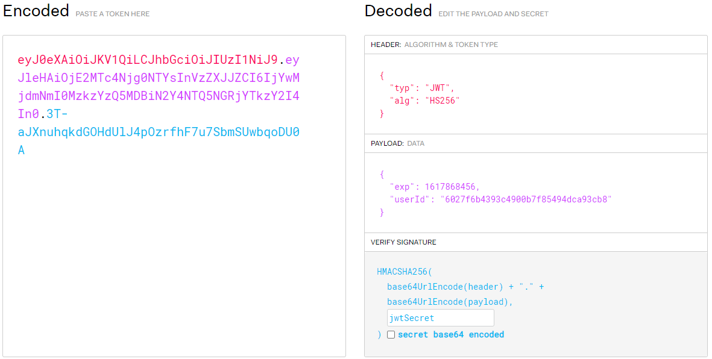

[TOC]

# 一、JWT概述

JWT（JSON WEB TOKEN）：JSON网络令牌，JWT是一个轻便的安全跨平台传输格式，定义了一个紧凑的自包含的方式在不同实体之间安全传输信息（JSON格式）。它是在Web环境下两个实体之间传输数据的一项标准。实际上传输的就是一个字符串。

>Json web token (JWT), 是为了在网络应用环境间传递声明而执行的一种基于JSON的开放标准（[(RFC 7519](https://link.jianshu.com?t=https://tools.ietf.org/html/rfc7519)).该token被设计为紧凑且安全的，特别适用于分布式站点的单点登录（SSO）场景。JWT的声明一般被用来在身份提供者和服务提供者间传递被认证的用户身份信息，以便于从资源服务器获取资源，也可以增加一些额外的其它业务逻辑所必须的声明信息，该token也可直接被用于认证，也可被加密。

## 1. JWT组成

JWT由三部分构成：header（头部）、payload（负载）和signature（签名）。

[JWT官网](https://jwt.io/)

### 1.1 Header

存储两个变量

1. 秘钥（可以用来比对）
2. 算法（也就是下面将Header和payload加密成Signature）

### 1.2 payload

存储很多东西，基础信息有如下几个

1. 签发人，也就是这个“令牌”归属于哪个用户。一般是`userId` 
2. 创建时间，也就是这个令牌是什么时候创建的
3. 失效时间，也就是这个令牌什么时候失效(session的失效时间)
4. 唯一标识，一般可以使用算法生成一个唯一标识（jti==>sessionId）

### 1.3 Signature

这个是上面两个经过Header中的算法加密生成的，用于比对信息，防止篡改Header和payload

当客户端传递给服务端时可以进行校验——验签


## 2. JWT储存

将这Header, payload, signture的信息经过加密生成一个`JwtToken`的字符串，发送给客户端，客户端保存在本地。当客户端发起请求的时候携带这个到服务端(可以是在`cookie`，可以是在`header`)，在服务端进行验证，我们需要解密对于的payload的内容


## 3. JWT简单使用

```java
package cn.onecolour.jwt.simpleUse;


import com.auth0.jwt.JWT;
import com.auth0.jwt.algorithms.Algorithm;
import com.auth0.jwt.exceptions.JWTDecodeException;
import com.auth0.jwt.interfaces.DecodedJWT;
import com.auth0.jwt.interfaces.JWTVerifier;

import java.util.Date;
import java.util.HashMap;
import java.util.Map;

public class JwtUtil {
    // token过期时长30分钟
    private static final long EXPIRE_TIME = 30 * 60 * 1000;
    // token私钥
    private static final String TOKEN_SECRET = "jwtSecret";

    /**
     * 生成签名30分钟后过期
     *
     * @param userId 用户ID
     * @return 加密的token
     */
    public static String sign(String userId) {
        try {
            //过期时间
            Date date = new Date(System.currentTimeMillis() + EXPIRE_TIME);
            //私钥及加密算法
            Algorithm algorithm = Algorithm.HMAC256(TOKEN_SECRET);
            //设置头部信息
            Map<String, Object> header = new HashMap<>(2);
            header.put("typ", "JWT");
            header.put("alg", "hs256");
            //附带userName userId信息，生成签名
            return JWT.create()
                    .withHeader(header)
                    .withClaim("userId", userId)
                    .withExpiresAt(date)
                    .sign(algorithm);

        } catch (Exception e) {
            e.printStackTrace();
            return null;
        }
    }

    /**
     * 校验token是否正确
     *
     * @param token 密钥
     * @return 是否正确
     */
    public static boolean verify(String token) {
        try {
            Algorithm algorithm = Algorithm.HMAC256(TOKEN_SECRET);
            JWTVerifier verifier = JWT.require(algorithm)
                    .build();
            DecodedJWT JWT = verifier.verify(token);
            return true;
        } catch (Exception ex) {
            return false;
        }
    }

    /**
     * 获取token中的信息无需secret解密也能获取
     *
     * @param token 密钥
     * @return token中包含的用户ID
     */
    public static String getUserId(String token) {
        try {
            DecodedJWT jwt = JWT.decode(token);
            return jwt.getClaim("userId").asString();
        } catch (JWTDecodeException e) {
            return null;
        }
    }

    public static String reSign(String token){
        String userId = getUserId(token);
        return sign(userId);
    }
}

```

```java
@Test
public void sign() throws JsonProcessingException {
    String jwt = JwtUtil.sign("6027f6b4393c4900b7f85494dca93cb8");
    System.out.println(jwt);
    System.out.println(JwtUtil.verify(jwt));

}
```





# 二、基于shiro+JWT的单点登录


