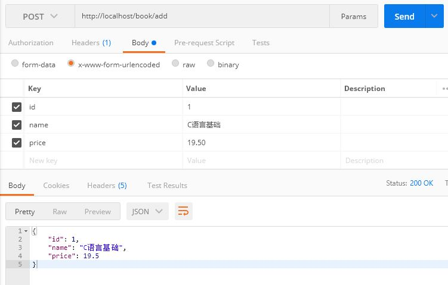

[TOC]

# 一、简介

1.  根目录：`cn.onecolour`
   领域模型的相关命名：DO/BO/DTO/VO/DAO

2. 启动类BootApplication.java推荐放在根目录`cn.onecolour`包下

3. 数据实体类domain：

   * jpa项目: `cn.onecolour.domain`
   * mybatis项目: `cn.onecolour.entity`

4. 数据接口访问层Dao：

   * jpa项目： `cn.onecolour.repository`
   * mybatis项目：` cn.onecolour.mapper`

5. 数据服务接口层Service：`cn.onecolour.service`

6. 数据服务接口实现层Service Implements：`cn.onecolour.service.impl`

7. 前端控制器层Controller：`cn.onecolour.controller`

8. 工具类库utils：`cn.onecolour.utils`

9. 配置类config：`cn.onecolour.config`

10. 数据传输对象dto：`cn.onecolour.dto`

11. 数据传输对象Data Transfer Object用于封装多个实体类domain之间的关系，不破坏原有的实体类结构

12. 视图包装对象vo：`cn.onecolour.vo`

    视图包装对象View Object用于封装客户端请求的数据，防止部分数据泄露如：管理员ID，保证数据安全，不破坏 原有的实体类结构

13. 常量类constant：`cn.onecolour.constant`
14. 异常类expection: `cn.onecolour.expection`

## 1. Spring 与 Spring Boot 对比

## 1.1 Spring 的优缺点

### 1.1.1 Spring的优点

Spring是Java企业版（Java Enterprise Edition，JEE，也称J2EE）的轻量级代替品。无需开发重量级的EnterpriseJavaBean（EJB），Spring为企业级Java开发提供了一种相对简单的方法，通过依赖注入和面向切面编程，用简单的Java对象（Plain Old Java Object，POJO）实现了EJB的功能。

### 1.1.2 Spring的缺点

虽然Spring的组件代码是轻量级的，但它的**配置却是重量级**的。一开始，Spring用XML配置，而且是很多XML配置。Spring 2.5引入了基于注解的组件扫描，这消除了大量针对应用程序自身组件的显式XML配置。Spring 3.0引入了基于Java的配置，这是一种类型安全的可重构配置方式，可以代替XML。

所有这些配置都代表了开发时的损耗。因为在**思考Spring特性配置和解决业务问题之间需要进行思维切换**，所以编写配置挤占了编写应用程序逻辑的时间。和所有框架一样，Spring实用，但与此同时它要求的回报也不少。

除此之外，项目的**依赖管理**也是一件**耗时耗力**的事情。在环境搭建时，需要分析要导入哪些库的坐标，而且还需要分析导入与之有依赖关系的其他库的坐标，一旦选错了依赖的版本，随之而来的不兼容问题就会严重阻碍项目的开发进度。

## 1.2 SpringBoot的特点

SpringBoot对上述Spring的缺点进行的改善和优化，基于约定优于配置的思想，可以让开发人员不必在配置与逻辑业务之间进行思维的切换，全身心的投入到逻辑业务的代码编写中，从而大大提高了开发的效率，一定程度上缩短了项目周期。


1. 为基于Spring的开发提供更快的入门体验
2. **开箱即用**，没有代码生成，也无需XML配置。同时也可以修改默认值来满足特定的需求
3. 提供了一些大型项目中常见的非功能性特性，如嵌入式服务器、安全、指标，健康检测、外部配置等
4. SpringBoot不是对Spring功能上的增强，而是提供了一种快速使用Spring的方式

## 2. SpringBoot的核心功能

* 起步依赖

  起步依赖本质上是一个Maven项目对象模型（Project Object Model，POM），定义了对其他库的传递依赖，这些东西加在一起即支持某项功能。
  简单的说，起步依赖就是将具备某种功能的坐标打包到一起，并提供一些默认的功能。

* 自动配置

  Spring Boot的自动配置是一个运行时（更准确地说，是应用程序启动时）的过程，考虑了众多因素，才决定Spring配置应该用哪个，不该用哪个。该过程是Spring自动完成的。


***


# 二、快速入门

## 1. 创建maven工程

pom.xml

```xml
<?xml version="1.0" encoding="UTF-8"?>
<project xmlns="http://maven.apache.org/POM/4.0.0"
         xmlns:xsi="http://www.w3.org/2001/XMLSchema-instance"
         xsi:schemaLocation="http://maven.apache.org/POM/4.0.0 http://maven.apache.org/xsd/maven-4.0.0.xsd">
    <modelVersion>4.0.0</modelVersion>

    <groupId>cn.onecolour</groupId>
    <artifactId>springboot_quickstart</artifactId>
    <version>0.0.1-SNAPSHOT</version>
    <name>SpringBoot Quick Start</name>
    <properties>
        <java.version>11</java.version>
    </properties>

    <!-- 导入springboot父工程. 注意：任何的SpringBoot工程都必须有的！！！ -->
    <!-- 父工程的作用：锁定起步的依赖的版本号，并没有真正到依赖 -->
    <parent>
        <groupId>org.springframework.boot</groupId>
        <artifactId>spring-boot-starter-parent</artifactId>
        <version>2.3.9.RELEASE</version>
        <relativePath/> <!-- lookup parent from repository -->
    </parent>

    <!-- web起步依赖 -->
    <dependencies>
        <dependency>
            <groupId>org.springframework.boot</groupId>
            <artifactId>spring-boot-starter-web</artifactId>
        </dependency>
    </dependencies>
</project>
```


## 2. 创建SpringBoot引导类

```java
package cn.onecolour.spqs;

import org.springframework.boot.SpringApplication;
import org.springframework.boot.autoconfigure.SpringBootApplication;

@SpringBootApplication
public class MyBootApplication {
    public static void main(String[] args) {
        SpringApplication.run(MyBootApplication.class);
    }
}

```


## 3. 编写Controller

```java
package cn.onecolour.spqs.controller;

import org.springframework.stereotype.Controller;
import org.springframework.web.bind.annotation.GetMapping;
import org.springframework.web.bind.annotation.ResponseBody;

@Controller
public class QuickStartController {

    @GetMapping("/quick")
    @ResponseBody
    public String quick() {
        return "SpringBoot启动成功";
    }
}
```


## 4. 测试

执行SpringBoot起步类的主方法，控制台打印日志如下：

```

  .   ____          _            __ _ _
 /\\ / ___'_ __ _ _(_)_ __  __ _ \ \ \ \
( ( )\___ | '_ | '_| | '_ \/ _` | \ \ \ \
 \\/  ___)| |_)| | | | | || (_| |  ) ) ) )
  '  |____| .__|_| |_|_| |_\__, | / / / /
 =========|_|==============|___/=/_/_/_/
 :: Spring Boot ::        (v2.3.9.RELEASE)

2021-03-12 11:34:29.359  INFO 552 --- [           main] cn.onecolour.spqs.MyBootApplication      : Starting MyBootApplication on Yang-DESKTOP with PID 552 (D:\develop\IDEAProject\spring_test\springboot_quickstart\target\classes started by hasee in D:\develop\IDEAProject\spring_test)
2021-03-12 11:34:29.363  INFO 552 --- [           main] cn.onecolour.spqs.MyBootApplication      : No active profile set, falling back to default profiles: default
2021-03-12 11:34:30.207  INFO 552 --- [           main] o.s.b.w.embedded.tomcat.TomcatWebServer  : Tomcat initialized with port(s): 8080 (http)
2021-03-12 11:34:30.216  INFO 552 --- [           main] o.apache.catalina.core.StandardService   : Starting service [Tomcat]
2021-03-12 11:34:30.217  INFO 552 --- [           main] org.apache.catalina.core.StandardEngine  : Starting Servlet engine: [Apache Tomcat/9.0.43]
2021-03-12 11:34:30.285  INFO 552 --- [           main] o.a.c.c.C.[Tomcat].[localhost].[/]       : Initializing Spring embedded WebApplicationContext
2021-03-12 11:34:30.286  INFO 552 --- [           main] w.s.c.ServletWebServerApplicationContext : Root WebApplicationContext: initialization completed in 856 ms
2021-03-12 11:34:30.432  INFO 552 --- [           main] o.s.s.concurrent.ThreadPoolTaskExecutor  : Initializing ExecutorService 'applicationTaskExecutor'
2021-03-12 11:34:30.579  INFO 552 --- [           main] o.s.b.w.embedded.tomcat.TomcatWebServer  : Tomcat started on port(s): 8080 (http) with context path ''
2021-03-12 11:34:30.592  INFO 552 --- [           main] cn.onecolour.spqs.MyBootApplication      : Started MyBootApplication in 1.901 seconds (JVM running for 3.376)

```

tomcat已经起步，端口监听8080

打开浏览器访问url地址为：http://localhost:8080/quick


## 5. 快速入门解析

### 5.1 SpringBoot 代码解析

* @SpringBootApplication：标注SpringBoot的启动类，该注解具备多种功能
* SpringApplication.run(MySpringBootApplication.class) 代表运行SpringBoot的启动类，参数为SpringBoot
  启动类的字节码对象

### 5.2 SpringBoot工程热部署

1. 使用springloaded配置pom.xml文件，使用mvn spring-boot:run启动
2. 使用springloaded本地加载启动，配置jvm参数
3. 使用devtools工具包，操作简单，但是每次需要重新部署

### 5.2.1 在pom.xml中添加依赖

```xml
<!--热部署配置-->
<dependency>
    <groupId>org.springframework.boot</groupId>
    <artifactId>spring-boot-devtools</artifactId>
</dependency>
```

### 5.2.2 配置 IDEA

* 勾选Settings->Complier 下的 Build project automatically
* 然后 Shift+Ctrl+Alt+/，选择Registry 勾选complier.automake.allow.when.app.running


## 6. 使用idea快速创建SpringBoot项目

新建项目-->选择Spring Initializr 然后选择相应配置即可


# 三、SpringBoot配置文件

## 1. 自定义banner

Spring Boot工程的`/src/main/resources`目录下创建一个`banner.txt`文件，然后将ASCII字符画复制进去，就能替换默认的banner了。


## 2. 配置文件application

SpringBoot是基于约定的，所以很多配置都有默认值，但如果想使用自己的配置替换默认配置的话，就可以使用**application*.properties**或者**application*.yml**（application.yaml）进行配置。


#### 2.1 application.properties/yml

SpringBoot默认会从Resources目录下加载application.properties或application.yml（application.yaml）文件。除了properties文件外，SpringBoot还可以使用yml文件进行配置。

```properties
server.port=80
```

现在比较流行的是将properties文件改为yml文件。yml文件的格式yaml是这样的：

```yaml
server:
	port: 80
```

yml和properties的作用是一样的。yml的好处是利于书写与读

属性引用使用${varname}:

```yaml
userInfo:
	email: yang@onecolour.cn
	uri: http://onecolour.cn
	title: 'Hello, Link to ${userInfo.uri} or email to ${userInfo.email}'
```

<a href="https://docs.spring.io/spring-boot/docs/current/reference/html/appendix-application-properties.html">SpringBoot 官方配置属性列表</a>


### 2.2 多环境配置

通常开发一个应用会有多个环境，如 dev/prod等，SpringBoot 支持配置文件的灵活切换

定义配置文件需要遵循以下格式`application-{profile}.properties`或`application-{profile}.yml`

如：现在有dev与prod两个环境，在application.yml文件之外新建两个文件

>1. application-dev.yml
>
>   ```yaml
>   server: 
>   	port: 8080
>   ```
>
>2. application-prod.yml
>
>   ```yaml
>   server:
>   	port: 80
>   ```

在application.yml中通过`application.profiles.active={profile}`指明启用那个配置：

```yml
application:
	profiles: 
		active: dev
```


### 2.3 自定义属性

#### 

#### 2.3.1基本类型

```properties
name=tom
age=20
```

```yaml
name: tom
age: 20
```

#### 2.3.2 JavaBean类型

```properties
user.name=tom
user.age=20
```

```properties
user:
  name: tom
  age: 20
```

#### 2.3.3 数组/List

```properties
user.list=tom,jack,david
```

或者

```properties
user.list[0]=tom
user.list[1]=jack
user.list[2]=david
```


```yaml
users:
  list:
  - tom
  - jack
  - david
```

#### 2.3.4 Map集合

```properties
user={name:"tom",age:20}
```


```yaml
user: {name: tom,age: 20}
```

## 3. SpringBoot读取配置文件

### 3.1 通过获取环境变量获取配置*

```yaml
server.port: 80

# datasource
spring:
  datasource:
    driver-class-name: com.mysql.jdbc.Driver
    url: jdbc:mysql://192.168.1.3/ssm_demo?useSSL=false&characterEncoding=utf-8
    username: yang
    password: yang

# mybatis
mybatis:
  mapper-locations: classpath:mapping/*Mapper.xml
  type-aliases-package: cn.onecolour.spqs.mapper
  
user:
  list:
   -tom
   -jack
   -david
```

```java
@SpringBootApplication
public class MyBootApplication {
    public static void main(String[] args) {
        // 获取SpringBoot 上下文
        ConfigurableApplicationContext context = SpringApplication.run(MyBootApplication.class);
        System.out.println("===========================================");
        // 获取环境变量
        ConfigurableEnvironment contextEnvironment = context.getEnvironment();
        System.out.println("Integer: "+contextEnvironment.getProperty("server.port",Integer.class));
        System.out.println("String: "+contextEnvironment.getProperty("spring.datasource.url"));
        System.out.println("List: " + contextEnvironment.getProperty("user.list", List.class,new ArrayList<String>()));
        System.out.println("===========================================");
    }
}
```

打印信息：

```cmd
===========================================
Integer: 80
String: jdbc:mysql://192.168.1.3/ssm_demo?useSSL=false&characterEncoding=utf-8
List: [-tom -jack -david]
===========================================
```


### 3.2 通过注入的方式

#### 3.2.1 @Value

使用@Value注解的时候，所在类必须被Spring容器管理，也就是被@Component、@Controller、@Service等注解定义的类。

主类：

```java
@SpringBootApplication
public class MyBootApplication {
    public static void main(String[] args) {
        ConfigurableApplicationContext context = SpringApplication.run(MyBootApplication.class);
        Inject inject = (Inject) context.getBean("inject");
        inject.show();
        context.close();
    }
}
```

测试类

```java
@Component
public class Inject {
    @Value("${user.nickname}")
    private String name;
    @Value("${user.age}")
    private Integer age;
    @Value("${user.list}")
    private List<String> list;

    public void show(){
        System.out.println("===========================================");
        System.out.println(name);
        System.out.println(age);
        System.out.println(list);
        System.out.println("===========================================");
    }
}
```

测试数据：

```yaml
user:
  list:
    -tom
    -jack
    -david
  nickname: yang
  age: 20
```


打印结果：

```cmd
===========================================
yang
20
[-tom -jack -david]
===========================================
```


#### 3.2.2@ConfigurationProperties(prefix = "")

测试类

```
@Component
@ConfigurationProperties(prefix = "user")
public class Inject {
    private String nickname;
    private Integer age;
    private List<String> list;

    public void setNickname(String nickname) {
        this.nickname = nickname;
    }

    public void setAge(Integer age) {
        this.age = age;
    }

    public void setList(List<String> list) {
        this.list = list;
    }

    public void show(){
        System.out.println("===========================================");
        System.out.println(nickname);
        System.out.println(age);
        System.out.println(list);
        System.out.println("===========================================");
    }
}
```

结果与3.2.1相同


## 4. SpringBoot访问静态资源

在Spring Boot应用启动过程中，会读取加载一个静态资源文件加载路径这个属性

```properties
# 默认值为
spring.resources.static-locations=classpath:/META-INF/resources/,classpath:/resources/,classpath:/static/,classpath:/public/
```

这个属性的默认值代表静态资源扫描目录：

```
classpath:/META-INF/resources/ 
classpath:/resources/
classpath:/static/ 
classpath:/public/
/：当前项目的根路径
```

### 4.1  修改Spring Boot静态资源路径

```yaml
# 修改静态资源加载路径
spring:
  resources:
    static-locations: classpath:/yiidian
```

如果希望保留默认路径，那就要先写上之前所有值，再最后加上新的路径。


# 四、异常处理

## 1. 自定义error页面

SpringBoot应用默认已经提供一套错误处理机制：就是把所有后台错误统一交给error请求，然后跳转到了本身自己的错误提示页面。这时，我们重新建立了一个新的error.html，该页面必须放在resources的templates目录下。

/resources/templates/error.html

```html
<!DOCTYPE html>
<html lang="zh" xmlns:th="http://www.thymeleaf.com">
<head>
    <meta charset="UTF-8">
    <title th:text="${title}"></title>
</head>
<body>
<div >
    <div>
        <div>
            <p><span class="code" th:text="${status}"></span>非常抱歉，页面出现错误</p>
            <a href="/" class="btn-back common-button">首页</a>
            <div >
                <div th:text="${#dates.format(timestamp,'yyyy-MM-dd HH:mm:ss')}"></div>
                <div th:text="${messages}"></div>
                <div th:text="${error}"></div>
            </div>
        </div>
    </div>
</div>
</body>
```


## 2. ExpectionHandler

```java
@Target({ElementType.METHOD})
@Retention(RetentionPolicy.RUNTIME)
@Documented
public @interface ExceptionHandler {
    Class<? extends Throwable>[] value() default {};
}
```

@ExceptionHandler 注解只能作用为对象的方法上，并且在运行时有效，value() 可以指定异常类。由该注解注释的方法可以具有灵活的输入参数。

示例：

```java
@Controller
public class ExpceptionHandlerController {

    @GetMapping("/exception1")
    @ResponseBody
    public String exception1(){
        int i = 1 / 0;
        return null;
    }

    @GetMapping("/exception2")
    @ResponseBody
    public Object exception2(){
        String[] s = null;
        return s[0];
    }

    // 处理java.lang.ArithmeticException
    @ExceptionHandler(value = { java.lang.ArithmeticException.class })
    @ResponseBody
    public String handlerArithmeticException(Exception e) { // e:该对象包含错误信息
        return "数学运算错误："+e.getMessage();
    }

    // 处理java.lang.NullPointerException
    @ExceptionHandler(value = { java.lang.NullPointerException.class })
    @ResponseBody
    public String handlerNullPointerException(Exception e) { // e:该对象包含错误信息
        return "空指针错误："+e.getMessage();
    }

}

```


## 3. @ControllerAdvice

@ExceptionHandler注解是用在控制器类里面的，这样每个控制器都需要定义相关方法，比较繁琐。这时可以使用@ControllerAdvice来抽取所有共同的@ExceptionHandler方法，从而简化异常方法的定义。

```java
@ControllerAdvice
public class GlobalExceptionHandler {
    // 处理java.lang.ArithmeticException
    @ExceptionHandler(value = { java.lang.ArithmeticException.class })
    @ResponseBody
    public String handlerArithmeticException(Exception e) { // e:该对象包含错误信息
        return "数学运算错误："+e.getMessage();
    }

    // 处理java.lang.NullPointerException
    @ExceptionHandler(value = { java.lang.NullPointerException.class })
    @ResponseBody
    public String handlerNullPointerException(Exception e) { // e:该对象包含错误信息
        return "空指针错误："+e.getMessage();
    }
}
```


## 4. HandlerExceptionResovler

```java
@Configuration
public class MyHandlerExceptionResolver implements HandlerExceptionResolver {

    @Override
    public ModelAndView resolveException(HttpServletRequest arg0, HttpServletResponse arg1, Object arg2,Exception e) {
        ModelAndView mv = new ModelAndView();
        //判断不同异常类型，做不同处理
        if(e instanceof ArithmeticException){
            mv.setViewName("error1");
        }
        if(e instanceof NullPointerException){
            mv.setViewName("error2");
        }
        
        mv.addObject("error", e.toString());
        return mv;
    }

}
```


***


# 五、表单数据校验

## 1. 引入依赖

```xml
<parent>
    <groupId>org.springframework.boot</groupId>
    <artifactId>spring-boot-starter-parent</artifactId>
    <version>2.3.9.RELEASE</version>
    <relativePath/> <!-- lookup parent from repository -->
</parent>
<dependencies>
    <!-- 模板引擎 -->
    <dependency>
        <groupId>org.springframework.boot</groupId>
        <artifactId>spring-boot-starter-thymeleaf</artifactId>
    </dependency>

    <dependency>
        <groupId>org.springframework.boot</groupId>
        <artifactId>spring-boot-starter-web</artifactId>
    </dependency>

    <dependency>
        <groupId>org.springframework.boot</groupId>
        <artifactId>spring-boot-devtools</artifactId>
        <scope>runtime</scope>
        <optional>true</optional>
    </dependency>

    <!-- 表单验证 -->
    <dependency>
        <groupId>javax.validation</groupId>
        <artifactId>validation-api</artifactId>
    </dependency>
    <dependency>
        <groupId>org.springframework.boot</groupId>
        <artifactId>spring-boot-starter-validation</artifactId>
    </dependency>
    
    <!-- lombok -->
    <dependency>
        <groupId>org.projectlombok</groupId>
        <artifactId>lombok</artifactId>
        <optional>true</optional>
    </dependency>
    <dependency>
        <groupId>org.springframework.boot</groupId>
        <artifactId>spring-boot-starter-test</artifactId>
        <scope>test</scope>
        <exclusions>
            <exclusion>
                <groupId>org.junit.vintage</groupId>
                <artifactId>junit-vintage-engine</artifactId>
            </exclusion>
        </exclusions>
    </dependency>
</dependencies>
```

## 2. JSR - 303

JSR-303 是JAVA EE 6 中的一项子规范，叫做Bean Validation，Hibernate Validator 是 Bean Validation 的参考实现 . Hibernate Validator 提供了 JSR 303 规范中所有内置 constraint 的实现，除此之外还有一些附加的 constraint。

 **Bean Validation 中内置的 constraint**

| 注解                        | 说明                                                         |
| --------------------------- | ------------------------------------------------------------ |
| `@NotNull`                  | 限制必须不为null                                             |
| `@NotEmpty`                 | 验证注解的元素值不为 null 且不为空（字符串长度不为0、集合大小不为0） |
| `@NotBlank`                 | 验证注解的元素值不为空（不为null、去除首位空格后长度为0），不同于@NotEmpty，@NotBlank只应用于字符串且在比较时会去除字符串的空格 |
| `@Pattern(value)`           | 限制必须符合指定的正则表达式                                 |
| `@Size(max,min)`            | 限制字符长度必须在 min 到 max 之间（也可以用在集合上）       |
| `@Email`                    | 验证注解的元素值是Email，也可以通过正则表达式和flag指定自定义的email格式 |
| `@Max(value)`               | 限制必须为一个不大于指定值的数字                             |
| `@Min(value)`               | 限制必须为一个不小于指定值的数字                             |
| `@DecimalMax(value)`        | 限制必须为一个不大于指定值的数字                             |
| `@DecimalMin(value)`        | 限制必须为一个不小于指定值的数字                             |
| `@Null`                     | 限制只能为null（很少用）                                     |
| `@AssertFalse`              | 限制必须为false （很少用）                                   |
| `@AssertTrue`               | 限制必须为true （很少用）                                    |
| `@Past`                     | 限制必须是一个过去的日期                                     |
| `@Future`                   | 限制必须是一个将来的日期                                     |
| `@Digits(integer,fraction)` | 限制必须为一个小数，且整数部分的位数不能超过 integer，小数部分的位数不能超过 fraction （很少用） |

**Hibernate Validator 附加的 constraint**

| 注解      | 说明                           |
| --------- | ------------------------------ |
| @Emailb   | 被注释的元素必须是电子邮箱     |
| @Length   | 被注释的字符串大小必须在范围内 |
| @NotEmpty | 被注释的字符串必须非空         |
| @Range    | 被注释的元素必须在合适的范围内 |


## 3. Entity

```java
@Data
public class User {
    private Integer id;
    //@NotBlank(message="用户名不能为空") // 非空
    @NotEmpty(message="用户名不能为空")
    private String name;
    @NotBlank(message="密码不能为空") // 非空
    @Length(min=4,max=10,message="密码必须在4-10位之间")
    private String password;
    @Min(value=0)
    private Integer age;
    @Email(message="邮箱不合法")
    private String email;
}

```

## 4. html页面

add.html

```html
<!DOCTYPE html>
<html lang="zh-cn" xmlns="http://www.w3.org/1999/xhtml" xmlns:th="http://www.thymeleaf.org">
    <head>
        <meta charset="UTF-8">
        <title>用户添加</title>
    </head>
    <body>
        <h3>用户添加</h3>
        <form action="/user/addUser" method="post">
            用户名：<input type="text" name="name"/><span style="color: red; font-size: large" th:errors="${user.name}" ></span><br/>
            密码：<input type="password" name="password"/><span style="color: red; font-size: large" th:errors="${user.password}"></span><br/>
            年龄：<input type="text" name="age"/><span style="color: red; font-size: large" th:errors="${user.age}"></span><br/>
            邮箱：<input type="text" name="email"/><span style="color: red; font-size: large" th:errors="${user.email}"></span><br/>
            <input type="submit" value="保存"/>
        </form>
    </body>
</html>
```

success.html

```html
<!DOCTYPE html>
<html lang="zh-cn" xmlns="http://www.w3.org/1999/xhtml" xmlns:th="http://www.thymeleaf.org">
    <head>
        <meta charset="UTF-8">
        <title>用户添加</title>
    </head>
    <body>
        <h3>添加成功</h3>
    </body>
</html>
```


## 5. Controller

```java
@Controller
@RequestMapping("/user")
public class UserController {

    @RequestMapping("/add")
    public String add(User user){
        return "add";
    }


    @RequestMapping("/addUser")
    public Object addUser(@Valid User user, BindingResult result){
        if (result.hasErrors()){
            return "add";
        }
        System.out.println(user);
        return "success";
    }
}
```


# 六、上传文件

## 1. html页面

upload.html

```html
<!DOCTYPE html>
<html lang="zh-cn" xmlns="http://www.w3.org/1999/xhtml" xmlns:th="http://www.thymeleaf.org">
<head>
    <meta charset="UTF-8">
    <title>上传页面</title>
</head>
<body>
<h3>文件上传</h3>
<hr/>
<form action="/uploadAttach" method="post" enctype="multipart/form-data">
    请选择文件：<input type="file" name="attach"/><br/>
    <input type="submit" value="开始上传"/>
</form>

</body>
</html>
```

## 2. Controller

```java
@Controller
public class UploadController {

    @GetMapping("/upload")
    public String upload(){
        return "upload";
    }

    @PostMapping("/uploadAttach")
    @ResponseBody
    public String uploadAttach(@RequestParam("attach") MultipartFile file) throws IOException {
        //文件处理
        System.out.println("文件名称：" +file.getName());
        System.out.println("文件类型："+file.getContentType());
        file.transferTo(new File("C:/Users/hasee/Desktop/upload/"+file.getOriginalFilename()));
        return "上传成功";
    }
}
```

## 3. 启动类

```java
@SpringBootApplication
public class SpringBootApplicationRunner {
    public static void main(String[] args) {
        SpringApplication.run(SpringBootApplicationRunner.class);
    }
}
```


# 七、SpringBoot 使用Servlet

```xml
<parent>
    <groupId>org.springframework.boot</groupId>
    <artifactId>spring-boot-starter-parent</artifactId>
    <version>2.3.9.RELEASE</version>
</parent>

<dependencies>
    <!--web起步依赖-->
    <dependency>
        <groupId>org.springframework.boot</groupId>
        <artifactId>spring-boot-starter-web</artifactId>
    </dependency>
</dependencies>
```

## 1. Servlet、Filter、Listener

### 1.1 引导类

```java
@SpringBootApplication
@ServletComponentScan
// 扫描 @WebServlet @WebListerner @WebFilter 注解
public class SpringBootApplicationRunner {
    public static void main(String[] args) {
        SpringApplication.run(SpringBootApplicationRunner.class);
    }
}
```

### 1.2 编写组件

#### 1.2.1 Servlet

```java
@WebServlet(urlPatterns = {"/helloServlet"})
/*
 * 等同于web.xml配置
 *     <servlet>
 *         <servlet-name>helloServlet</servlet-name>
 *         <servlet-class>cn.onecolour.servlet.servlet.HelloServlet</servlet-class>
 *     </servlet>
 *     <servlet-mapping>
 *     	   <servlet-name>helloServlet</servlet-name>
 *         <url-pattern>/helloServlet</url-pattern>
 *     </servlet-mapping>
 */
public class HelloServlet extends HttpServlet {
    @Override
    protected void doGet(HttpServletRequest req, HttpServletResponse resp) throws ServletException, IOException {
        System.out.println("执行了HelloServlet的doGet方法....");
        resp.getWriter().write("This is HelloServlet");
    }
}
```

#### 1.2.2 Filter

```java
@WebFilter(filterName = "HelloFilter",urlPatterns = "/helloFilter")
public class HelloFilter implements Filter {
    public void destroy() {
    }
    public void doFilter(ServletRequest req, ServletResponse resp, FilterChain chain) throws ServletException, IOException {
        System.out.println("执行了前面代码");
        chain.doFilter(req, resp);
        System.out.println("执行了后面代码");

    }
    public void init(FilterConfig config) throws ServletException {

    }
}
```

#### 1.2.3 Listener

```java
@WebListener()
public class HelloListener implements ServletContextListener,
        HttpSessionListener, HttpSessionAttributeListener {

    @Override
    public void contextInitialized(ServletContextEvent sce) {
        System.out.println("ServletContext对象创建了");
    }

    @Override
    public void contextDestroyed(ServletContextEvent sce) {
        System.out.println("ServletContext对象销毁了");
    }
}
```


### 1.3 访问测试

启动SpringBoot后，控制台打印`ServletContext对象创建了`

访问Servlet后，控制台打印如下

>`执行了前面代码`
>
>`执行了HelloServlet的doGet方法`
>
>`执行了后面代码`


## 2. @Bean（等效于1中的方法）

直接在启动类中注册，如下

```java
@SpringBootApplication
public class SpringBootApplicationRunner {
    public static void main(String[] args) {
        SpringApplication.run(SpringBootApplicationRunner.class);
    }

    //注册Servlet程序
    @Bean
    public ServletRegistrationBean getServletRegistrationBean(){
        ServletRegistrationBean bean = new ServletRegistrationBean(new HelloServlet());
        //设置访问路径
        bean.addUrlMappings("/helloServlet");
        return bean;
    }

    //注册Filter
    @Bean
    public FilterRegistrationBean getFilterRegistrationBean(){
        FilterRegistrationBean bean = new FilterRegistrationBean(new HelloFilter());
        //过滤器拦截路径
        bean.addUrlPatterns("/helloServlet");
        return bean;
    }

    //注册Listener
    @Bean
    public ServletListenerRegistrationBean<HelloListener> getServletListenerRegistrationBean(){
        ServletListenerRegistrationBean<HelloListener> bean = new ServletListenerRegistrationBean<HelloListener>(new HelloListener());
        return bean;
    }
}
```


***


# 八、SpringBoot整合

## 1. Thymeleaf

1. 市面上主流的 Java 模板引擎有：JSP、Velocity、Freemarker、Thymeleaf。
2. JSP本质也是模板引擎，Spring Boot官方推荐使用“`Thymeleaf`”模板引擎。

>模板引擎的作用都是将模板(页面)和数据进行整合然后输出显示，区别在于不同的模板使用不同的语法，如 JSP 的JSTL表达式，以及J SP 自己的表达式和语法，同理 Thymeleaf 也有自己的语法。

### 1.1 导入依赖

```xml
<!--省略SpringBoot父工程、web起步依赖-->
<!-- thymeleaf -->
<dependency>
    <groupId>org.springframework.boot</groupId>
    <artifactId>spring-boot-starter-thymeleaf</artifactId>
</dependency>
```

* 模板文件必须放在`/resources/templates`目录下，否则无法渲染
* Thymeleaf标签都是以th开头的
* Controller中的方法可直接return "html文件名"

## 2. FreeMarker

```xml
<!--省略SpringBoot父工程、web起步依赖-->
<!-- freemarker -->
<dependency>
    <groupId>org.springframework.boot</groupId>
    <artifactId>spring-boot-starter-freemarker</artifactId>
</dependency>
```

FreeMarker模板文件必须放在`/resources/templates`目录下，后缀名为.ftl

FreeMarker具体语法：http://freemarker.foofun.cn/

## 3. MyBatis

### 3.1 建表

```sql
CREATE TABLE goods (
    uuid varchar(32) NOT NULL,
    name varchar(64) NOT NULL,
    description varchar(128) DEFAULT NULL,
    price double(12,2) DEFAULT '999999999.99',
    PRIMARY KEY (uuid)
) ENGINE=InnoDB DEFAULT CHARSET=utf8;
```

### 3.2 导入依赖

```xml
<dependency>
    <groupId>org.projectlombok</groupId>
    <artifactId>lombok</artifactId>
    <optional>true</optional>
</dependency>
<!-- mybatis起步依赖 -->
<dependency>
    <groupId>org.mybatis.spring.boot</groupId>
    <artifactId>mybatis-spring-boot-starter</artifactId>
</dependency>
<!-- 单元测试 -->
<dependency>
    <groupId>org.springframework.boot</groupId>
    <artifactId>spring-boot-starter-test</artifactId>
    <scope>test</scope>
</dependency>
<!-- mysql驱动 -->
<dependency>
    <groupId>mysql</groupId>
    <artifactId>mysql-connector-java</artifactId>
</dependency>
```

### 3.3 编写实体

```java
package cn.onecolour.mybatis.entity;

import lombok.Data;

@Data
public class Goods {
    private String uuid;
    private String name;
    private String description;
    private Double price;
}
```

### 3.4 Dao

```java
package cn.onecolour.mybatis.mapper;

import cn.onecolour.mybatis.entity.Goods;
import org.apache.ibatis.annotations.Mapper;

import java.util.List;

@Mapper
public interface GoodsMapper {
    public List<Goods> findAll();
}
```

### 3.5 Service

```java
package cn.onecolour.mybatis.service;

import cn.onecolour.mybatis.entity.Goods;

import java.util.List;

public interface GoodsService {
    public List<Goods> findAll();
}

```

```java
package cn.onecolour.mybatis.service.impl;


import cn.onecolour.mybatis.entity.Goods;
import cn.onecolour.mybatis.mapper.GoodsMapper;
import cn.onecolour.mybatis.service.GoodsService;
import org.springframework.beans.factory.annotation.Autowired;
import org.springframework.stereotype.Service;

import java.util.List;

@Service
public class GoodsServiceImpl implements GoodsService {

    @Autowired
    private GoodsMapper goodsMapper;

    @Override
    public List<Goods> findAll() {
        return goodsMapper.findAll();
    }
}
```

### 3.6 Dao映射

直接在Dao接口相同目录下建立同名XML文件，可以不在SpringBoot配置文件中配置

```xml
<?xml version="1.0" encoding="UTF-8" ?>
<!DOCTYPE mapper PUBLIC "-//mybatis.org//DTD Mapper 3.0//EN" "http://mybatis.org/dtd/mybatis-3-mapper.dtd">
<mapper namespace="cn.onecolour.mybatis.mapper.GoodsMapper">

    <select id="findAll" resultType="goods">
        select uuid, name, description, price
        from goods
    </select>
</mapper>
```

### 3.7 Controller

```java
package cn.onecolour.mybatis.controller;

import cn.onecolour.mybatis.service.GoodsService;
import org.springframework.beans.factory.annotation.Autowired;
import org.springframework.stereotype.Controller;
import org.springframework.web.bind.annotation.RequestMapping;
import org.springframework.web.bind.annotation.ResponseBody;

@Controller
@RequestMapping("/goods")
public class GoodsController {
    @Autowired
    GoodsService goodsService;

    @RequestMapping("/findAll")
    @ResponseBody
    public Object findAll(){
        return goodsService.findAll();
    }
}
```

### 3.8 application.yml

```yaml
server:
  port: 80

# dataSource
spring:
  datasource:
    driver-class-name: com.mysql.cj.jdbc.Driver
    url: jdbc:mysql://192.168.1.3/ssm_demo?useSSL=false&characterEncoding=utf-8
    username: yang
    password: yang

# mybatis
mybatis:
  type-aliases-package: cn.onecolour.mybatis.entity
  mapper-locations: classpath:mapper/*.xml

```

### 3.9 引导类

```java
package cn.onecolour.mybatis;

import org.springframework.boot.SpringApplication;
import org.springframework.boot.autoconfigure.SpringBootApplication;

@SpringBootApplication
public class ApplicationRunner {
    public static void main(String[] args) {
        SpringApplication.run(ApplicationRunner.class);
    }
}
```


## 4. Spring Data JPA

参见[spring data jpa笔记](../../DB/JPA/Spring Data JPA.md)

 

## 5. Redis

启动Redis服务端

### 5.1 导入依赖

```xml
<!-- 导入springboot父工程. 注意：任何的SpringBoot工程都必须有的！！！ -->
<!-- 父工程的作用：锁定起步的依赖的版本号，并没有真正到依赖 -->
<parent>
    <groupId>org.springframework.boot</groupId>
    <artifactId>spring-boot-starter-parent</artifactId>
    <version>2.1.11.RELEASE</version>
</parent>

<dependencies>
    <!--web起步依赖-->
    <dependency>
        <groupId>org.springframework.boot</groupId>
        <artifactId>spring-boot-starter-web</artifactId>
    </dependency>

    <!-- 配置使用 redis 启动器 -->
    <dependency>
        <groupId>org.springframework.boot</groupId>
        <artifactId>spring-boot-starter-data-redis</artifactId>
    </dependency>
</dependencies>
```

### 5.2 编写application.yml 

```yaml
server:
  port: 80

spring:
  redis:
    #服务器地址
    host: localhost
    # Redis服务器连接端口
    port: 6379
    # Redis数据库索引（默认为0）
    database: 0
    # Redis服务器连接密码（默认为空）
    password:
    # 连接超时时间（毫秒）
    timeout: 5000ms
    jedis:
      pool:
        # 连接池最大连接数（使用负值表示没有限制）
        max-active: 8
        # 连接池最大阻塞等待时间（使用负值表示没有限制）
        max-wait: 1ms
        # 连接池中的最小空闲连接
        min-idle: 0
```

### 5.5 配置Redis序列化

```java
package cn.onecolour.redis.config;


import org.springframework.context.annotation.Bean;
import org.springframework.context.annotation.Configuration;
import org.springframework.data.redis.connection.RedisConnectionFactory;
import org.springframework.data.redis.core.RedisTemplate;
import org.springframework.data.redis.serializer.GenericJackson2JsonRedisSerializer;
import org.springframework.data.redis.serializer.StringRedisSerializer;

@Configuration
public class RedisConfig {

    @Bean
    public RedisTemplate<Object, Object> redisTemplate(RedisConnectionFactory redisConnectionFactory){
        RedisTemplate<Object, Object> redisTemplate = new RedisTemplate<>();
        redisTemplate.setConnectionFactory(redisConnectionFactory);

        // 设置key， hashKey的序列化规则
        StringRedisSerializer stringRedisSerializer = new StringRedisSerializer();
        redisTemplate.setHashKeySerializer(stringRedisSerializer);
        redisTemplate.setKeySerializer(stringRedisSerializer);

        // 设置value的序列化规则
        GenericJackson2JsonRedisSerializer genericJackson2JsonRedisSerializer = new GenericJackson2JsonRedisSerializer();
        redisTemplate.setHashValueSerializer(genericJackson2JsonRedisSerializer);
        redisTemplate.setValueSerializer(genericJackson2JsonRedisSerializer);
        return redisTemplate;
    }
}

```


### 5.4 编写实体与Controller

```java
package cn.onecolour.redis.entity;

import lombok.Data;

import javax.validation.constraints.Min;
import javax.validation.constraints.NotBlank;
import java.io.Serializable;

@Data
public class Book implements Serializable {
    @Min(value = 1)
    private Integer id;
    @NotBlank
    private String name;
    @Min(value = 0)
    private Double price;
}
```


BookController

```java
package cn.onecolour.redis.controller;

import cn.onecolour.redis.entity.Book;
import org.springframework.beans.factory.annotation.Autowired;
import org.springframework.data.redis.core.HashOperations;
import org.springframework.data.redis.core.RedisTemplate;
import org.springframework.web.bind.annotation.PostMapping;
import org.springframework.web.bind.annotation.RequestMapping;
import org.springframework.web.bind.annotation.ResponseBody;
import org.springframework.web.bind.annotation.RestController;

import javax.validation.Valid;
import java.util.Map;

@RestController
@RequestMapping("/book")
public class BookController {
    @Autowired
    private RedisTemplate<Object, Object> redisTemplate;

    @PostMapping("/add")
    @ResponseBody
    public Object add(@Valid Book book) {
        redisTemplate.boundHashOps("Books").put("book_"+book.getId(),book);
        HashOperations<Object, Object, Object> opsForHash = redisTemplate.opsForHash();
        Map<Object, Object> books = opsForHash.entries("Books");
        System.out.println(books);
        return books.get("book_1");
    }

}
```

### 5.5 运行测试

使用Postman发送请求，如下




## 6. Junit

### 6.1 导入坐标

```xml
<parent>
    <artifactId>spring-boot-starter-parent</artifactId>
    <groupId>org.springframework.boot</groupId>
    <version>2.3.9.RELEASE</version>
</parent>

<dependencies>
    <dependency>
        <groupId>org.springframework.boot</groupId>
        <artifactId>spring-boot-starter-web</artifactId>
    </dependency>

    <dependency>
        <groupId>org.springframework.boot</groupId>
        <artifactId>spring-boot-starter-test</artifactId>
    </dependency>
</dependencies>
```


### 6.2 编写Junit测试类

```java
@RunWith(SpringJUnit4ClassRunner.class)
@SpringBootTest(classes = MyBootApplication.class)
public class JunitDemo {

    @Test
    public void test1(){
        System.out.println("testing");
    }
}
```


## 7. Quartz


## 8. Task


# 九、事务管理

## 1. 直接加载事务管理的xml文件

`@EnableTransactionMnagement `    开启事务管理器注解

`@ImportResource("classpath:applicationContext-transaction.xml")`  导入xml配置注解

启动类上加入上面的注解

## 2. @Transactional

`@EnableTransactionMnagement `    开启事务管理器注解

`@Transactional`对每一个方法或类手动添加任务

## 3. 使用配置类

`@EnableTransactionMnagement `    开启事务管理器注解

要导入`spring-boot-starter-aop`

```java
@Configuration
public class TranscationalConfig {
	@Autowired
    private DataSource dataSource;
	
	@Bean("txManager")
	public DataSourceTransactionManager txManager() {
		return new DataSourceTransactionManager(dataSource);
	}
 
    /*事务拦截器*/
    @Bean("txAdvice")
    public 	TransactionInterceptor txAdvice(DataSourceTransactionManager txManager){
    	 
    	NameMatchTransactionAttributeSource source = new NameMatchTransactionAttributeSource();
          /*只读事务，不做更新操作*/
         RuleBasedTransactionAttribute readOnlyTx = new RuleBasedTransactionAttribute();
         readOnlyTx.setReadOnly(true);
         readOnlyTx.setPropagationBehavior(TransactionDefinition.PROPAGATION_NOT_SUPPORTED );
         /*当前存在事务就使用当前事务，当前不存在事务就创建一个新的事务*/
         //RuleBasedTransactionAttribute requiredTx = new RuleBasedTransactionAttribute();
         //requiredTx.setRollbackRules(
         //    Collections.singletonList(new RollbackRuleAttribute(Exception.class)));
         //requiredTx.setPropagationBehavior(TransactionDefinition.PROPAGATION_REQUIRED);
         RuleBasedTransactionAttribute requiredTx = new RuleBasedTransactionAttribute(TransactionDefinition.PROPAGATION_REQUIRED,
             Collections.singletonList(new RollbackRuleAttribute(Exception.class)));
         requiredTx.setTimeout(5);
         Map<String, TransactionAttribute> txMap = new HashMap<>();
         txMap.put("add*", requiredTx);
         txMap.put("save*", requiredTx);
         txMap.put("insert*", requiredTx);
         txMap.put("update*", requiredTx);
         txMap.put("delete*", requiredTx);
         txMap.put("get*", readOnlyTx);
         txMap.put("query*", readOnlyTx);
         source.setNameMap( txMap );
        return new TransactionInterceptor(txManager ,source) ;
    }
 
    /**切面拦截规则 参数会自动从容器中注入*/
    @Bean
    public DefaultPointcutAdvisor defaultPointcutAdvisor(TransactionInterceptor txAdvice){
    	DefaultPointcutAdvisor pointcutAdvisor = new DefaultPointcutAdvisor();
        pointcutAdvisor.setAdvice(txAdvice);
        AspectJExpressionPointcut pointcut = new AspectJExpressionPointcut();
        pointcut.setExpression("execution (* com.test.service.*.*(..))");
        pointcutAdvisor.setPointcut(pointcut);
        return pointcutAdvisor;
    }
 
 
}
```

