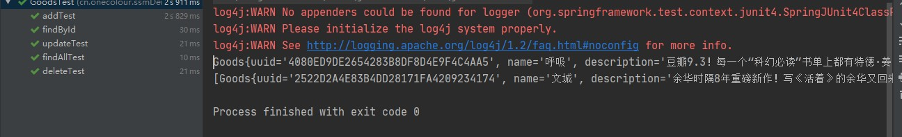
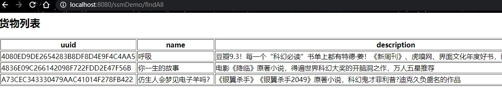

[TOC]

# 一、创建数据源

```sql
# 创建数据库
create database ssm_demo DEFAULT CHARACTER SET utf8 DEFAULT COLLATE utf8_general_ci;

# 使用数据库
use ssm_demo;

# 创建测试表
create table goods
(
    uuid        varchar(32) not NULL,
    name        varchar(64) not null,
    description varchar(128),
    price       double(12, 2) default '999999999.99',
    primary key (uuid)
) engine = innodb;

# 插入测试数据
insert into goods
values ('4080ED9DE2654283B8DF8D4E9F4C4AA5', '呼吸',
        '豆瓣9.3！每一个“科幻必读”书单上都有特德·姜！《新周刊》、虎嗅网、界面文化年度好书，雨果奖、星云奖获奖作品',
        39.90);
insert into goods
values ('4836E09C266142098F722FDD2E47F56B', '你一生的故事',
        '电影《降临》原著小说，得遍世界科幻大奖的开脑洞之作，万人五星推荐',
        29.90);
insert into goods
values ('A73CEC343330479AAC41014F278FB422', ' 仿生人会梦见电子羊吗？',
        '《银翼杀手》《银翼杀手2049》原著小说，科幻鬼才菲利普?迪克久负盛名的作品',
        46.50);
```


# 二、搭建环境

## 1 创建web项目

```
src
    ├─main
    │  ├─java
    │  ├─resources
    │  └─webapp
    │      └─WEB-INF
    │	   		web.xml
    └─test

```


## 2 导入SSM相关依赖

```xml
<?xml version="1.0" encoding="UTF-8"?>
<project xmlns="http://maven.apache.org/POM/4.0.0"
         xmlns:xsi="http://www.w3.org/2001/XMLSchema-instance"
         xsi:schemaLocation="http://maven.apache.org/POM/4.0.0 http://maven.apache.org/xsd/maven-4.0.0.xsd">
    <modelVersion>4.0.0</modelVersion>

    <groupId>cn.onecolour</groupId>
    <artifactId>ssm</artifactId>
    <version>0.0.1-SNAPSHOT</version>
    <packaging>war</packaging>
    <name>ssm简单整合</name>

    <properties>
        <spring.version>5.2.8.RELEASE</spring.version>
        <aspectjweaver.version>1.9.6</aspectjweaver.version>
        <junit.version>4.12</junit.version>
        <slf4j.version>1.7.30</slf4j.version>
        <log4j.version>1.2.17</log4j.version>
        <mysql.version>5.1.49</mysql.version>
        <mybatis.version>3.5.5</mybatis.version>
        <mybatis-spring.version>2.0.5</mybatis-spring.version>
        <c3p0.version>0.9.5.5</c3p0.version>
        <jackson.version>2.9.8</jackson.version>
        <taglibs.version>1.2.5</taglibs.version>
        <jstl.version>1.2</jstl.version>
        <servlet.version>4.0.1</servlet.version>
        <jsp.version>2.3.3</jsp.version>

        <project.build.sourceEncoding>UTF-8</project.build.sourceEncoding>
        <maven.compiler.source>1.8</maven.compiler.source>
        <maven.compiler.target>1.8</maven.compiler.target>
    </properties>

    <dependencies>

        <!-- Spring 相关 -->
        <!-- 1.1 ioc -->
        <dependency>
            <groupId>org.springframework</groupId>
            <artifactId>spring-context</artifactId>
            <version>${spring.version}</version>
        </dependency>
        <!-- 1.2 aop -->
        <dependency>
            <groupId>org.aspectj</groupId>
            <artifactId>aspectjweaver</artifactId>
            <version>${aspectjweaver.version}</version>
        </dependency>

        <!-- 1.3 声明式事务控制 -->
        <dependency>
            <groupId>org.springframework</groupId>
            <artifactId>spring-jdbc</artifactId>
            <version>${spring.version}</version>
        </dependency>
        <dependency>
            <groupId>org.springframework</groupId>
            <artifactId>spring-tx</artifactId>
            <version>${spring.version}</version>
        </dependency>
        <!-- 1.4 SpringMVC -->
        <dependency>
            <groupId>org.springframework</groupId>
            <artifactId>spring-web</artifactId>
            <version>${spring.version}</version>
        </dependency>
        <dependency>
            <groupId>org.springframework</groupId>
            <artifactId>spring-webmvc</artifactId>
            <version>${spring.version}</version>
        </dependency>
        <!-- 1.5 test -->
        <dependency>
            <groupId>org.springframework</groupId>
            <artifactId>spring-test</artifactId>
            <version>${spring.version}</version>
        </dependency>
        <dependency>
            <groupId>junit</groupId>
            <artifactId>junit</artifactId>
            <version>${junit.version}</version>
            <scope>test</scope>
        </dependency>
        <!-- spring end -->

        <!-- 2 日志 -->
        <dependency>
            <groupId>log4j</groupId>
            <artifactId>log4j</artifactId>
            <version>${log4j.version}</version>
        </dependency>
        <dependency>
            <groupId>org.slf4j</groupId>
            <artifactId>slf4j-log4j12</artifactId>
            <version>${slf4j.version}</version>
        </dependency>

        <!-- 3 数据库 -->
        <!-- 3.1 数据库驱动 -->
        <dependency>
            <groupId>mysql</groupId>
            <artifactId>mysql-connector-java</artifactId>
            <version>${mysql.version}</version>
        </dependency>
        <!-- 3.2 数据库连接池 -->
        <dependency>
            <groupId>com.mchange</groupId>
            <artifactId>c3p0</artifactId>
            <version>${c3p0.version}</version>
        </dependency>
        <!-- mybatis -->
        <dependency>
            <groupId>org.mybatis</groupId>
            <artifactId>mybatis</artifactId>
            <version>${mybatis.version}</version>
        </dependency>
        <dependency>
            <groupId>org.mybatis</groupId>
            <artifactId>mybatis-spring</artifactId>
            <version>${mybatis-spring.version}</version>
        </dependency>

        <!-- jackson -->
        <dependency>
            <groupId>com.fasterxml.jackson.core</groupId>
            <artifactId>jackson-annotations</artifactId>
            <version>${jackson.version}</version>
        </dependency>
        <dependency>
            <groupId>com.fasterxml.jackson.core</groupId>
            <artifactId>jackson-databind</artifactId>
            <version>${jackson.version}</version>
        </dependency>
        <dependency>
            <groupId>com.fasterxml.jackson.core</groupId>
            <artifactId>jackson-core</artifactId>
            <version>${jackson.version}</version>
        </dependency>

        <!-- java web -->
        <dependency>
            <groupId>org.apache.taglibs</groupId>
            <artifactId>taglibs-standard-impl</artifactId>
            <version>${taglibs.version}</version>
        </dependency>
        <dependency>
            <groupId>jstl</groupId>
            <artifactId>jstl</artifactId>
            <version>${jstl.version}</version>
        </dependency>
        <dependency>
            <groupId>javax.servlet</groupId>
            <artifactId>javax.servlet-api</artifactId>
            <version>${servlet.version}</version>
            <scope>provided</scope>
        </dependency>
        <dependency>
            <groupId>javax.servlet.jsp</groupId>
            <artifactId>javax.servlet.jsp-api</artifactId>
            <version>${jsp.version}</version>
            <scope>provided</scope>
        </dependency>
    </dependencies>

    <build>
        <plugins>
            <plugin>
                <groupId>org.apache.tomcat.maven</groupId>
                <artifactId>tomcat7-maven-plugin</artifactId>
                <version>2.2</version>
                <configuration>
                    <hostName>localhost</hostName>        <!--   Default: localhost -->
                    <port>8080</port>                     <!-- 启动端口 Default:8080 -->
                    <path>/</path>   <!-- 访问应用路径  Default: /${project.artifactId}-->
                    <uriEncoding>UTF-8</uriEncoding>      <!-- uri编码 Default: ISO-8859-1 -->
                </configuration>
            </plugin>
        </plugins>
    </build>

</project>
```


## 3 整合Spring和Mybatis

### 3.1创建POJO

```java
package cn.onecolour.ssmDemo.domain;

public class Goods {
    private String uuid;
    private String name;
    private String description;
    private Double price;

    public Goods() {
    }

    public Goods(String uuid, String name, String description, Double price) {
        this.uuid = uuid;
        this.name = name;
        this.description = description;
        this.price = price;
    }
    // getter and setter and toString
}

```


### 3.2 创建 DAO 层接口

```java
package cn.onecolour.ssmDemo.mapper;


import cn.onecolour.ssmDemo.domain.Goods;

import java.util.List;

public interface GoodsMapper {
    public List<Goods> findAll();

    public void update(Goods goods) ;

    public void add(Goods goods);

    public void delete(String uuid);

    public Goods findByUuid(String uuid);
}

```

### 3.3 编写Mapper文件

在resources目录下 创建与dao接口包名相同的目录，并以接口名为xml文件名

```xml
<?xml version="1.0" encoding="UTF-8" ?>
<!DOCTYPE mapper PUBLIC "-//mybatis.org//DTD Mapper 3.0//EN" "http://mybatis.org/dtd/mybatis-3-mapper.dtd">
<mapper namespace="cn.onecolour.ssmDemo.mapper.GoodsMapper">

    <select id="findAll" resultType="goods">
        select uuid, name, description, price
        from goods
    </select>

    <select id="findByUuid" resultType="goods" parameterType="String">
        select uuid, name, description, price
        from goods
        where uuid = #{uuid}
    </select>

    <update id="update" parameterType="goods">
        update goods
        set name=#{name},
        description=#{description},
        price=#{price}
        where uuid = #{uuid}
    </update>

    <insert id="add" parameterType="goods">
        insert into goods
        values (#{uuid}, #{name}, #{description}, #{price})
    </insert>

    <delete id="delete" parameterType="String">
        delete
        from goods
        where uuid = #{uuid}
    </delete>
</mapper>
```

### 3.4 创建Service 接口及其实现

```java
package cn.onecolour.ssmDemo.service;

import cn.onecolour.ssmDemo.domain.Goods;

import java.util.List;

public interface GoodsService {
    public List<Goods> findAll();

    public Goods findByUuid(String uuid);

    public void update(Goods goods);

    public void delete(String uuid);

    public void add(Goods goods);
}
```


```java
package cn.onecolour.ssmDemo.service.impl;

import cn.onecolour.ssmDemo.domain.Goods;
import cn.onecolour.ssmDemo.mapper.GoodsMapper;
import cn.onecolour.ssmDemo.service.GoodsService;
import org.springframework.beans.factory.annotation.Autowired;
import org.springframework.stereotype.Service;
import org.springframework.transaction.annotation.Transactional;

import java.util.List;

@Service // Service层标识
@Transactional // 事务控制
public class GoodsServiceImpl implements GoodsService {
    @Autowired // 自动注入
    private GoodsMapper goodsMapper;

    @Override
    public List<Goods> findAll() {
        return goodsMapper.findAll();
    }

    @Override
    public Goods findByUuid(String uuid) {
        return goodsMapper.findByUuid(uuid);
    }

    @Override
    public void update(Goods goods) {
        goodsMapper.update(goods);
    }

    @Override
    public void delete(String uuid) {
        goodsMapper.delete(uuid);
    }

    @Override
    public void add(Goods goods) {
        goodsMapper.add(goods);
    }
}
```


### 3.5 编写Spring配置文件，整合mybatis

jdbc.properties

```properties
jdbc.driver=com.mysql.jdbc.Driver
jdbc.url=jdbc:mysql://192.168.1.3/ssm_demo?useSSL=false&characterEncoding=utf-8
jdbc.username=yang
jdbc.password=yang
jdbc.initialSize=5
jdbc.maxActive=10
jdbc.maxWait=3000
```


```xml
<?xml version="1.0" encoding="UTF-8"?>
<beans xmlns="http://www.springframework.org/schema/beans"
       xmlns:xsi="http://www.w3.org/2001/XMLSchema-instance"
       xmlns:context="http://www.springframework.org/schema/context"
       xmlns:tx="http://www.springframework.org/schema/tx"
       xsi:schemaLocation="
		http://www.springframework.org/schema/beans http://www.springframework.org/schema/beans/spring-beans.xsd
		http://www.springframework.org/schema/context http://www.springframework.org/schema/context/spring-context.xsd
		http://www.springframework.org/schema/tx http://www.springframework.org/schema/tx/spring-tx.xsd
">
    <!-- 配置扫描器, 扫描Service -->
    <context:component-scan base-package="cn.onecolour.ssmDemo.service"/>

    <!-- 载入数据库配置文件 -->
    <context:property-placeholder location="classpath:jdbc.properties"/>
    <!-- 数据源 -->
    <bean id="dataSource" class="com.mchange.v2.c3p0.ComboPooledDataSource">
        <property name="driverClass" value="${jdbc.driver}"/>
        <property name="user" value="${jdbc.username}"/>
        <property name="password" value="${jdbc.password}"/>
        <property name="jdbcUrl" value="${jdbc.url}"/>
        <property name="initialPoolSize" value="${jdbc.initialSize}"/>
        <property name="maxPoolSize" value="${jdbc.maxActive}"/>
        <property name="checkoutTimeout" value="${jdbc.maxWait}"/>
    </bean>

    <!-- spring整合mybatis框架的SqlSessionFactoryBean -->
    <bean id="sqlSessionFactory" class="org.mybatis.spring.SqlSessionFactoryBean">
        <property name="dataSource" ref="dataSource"/>
        <!-- 扫描实体, 创建别名 -->
        <property name="typeAliasesPackage" value="cn.onecolour.ssmDemo.domain"/>
    </bean>

    <!-- 事务管理器 -->
    <bean id="TransactionManager" class="org.springframework.jdbc.datasource.DataSourceTransactionManager">
        <property name="dataSource" ref="dataSource"/>
    </bean>

    <!-- 事务注解驱动-->
    <tx:annotation-driven transaction-manager="TransactionManager"/>
    
        <!-- 事务管理 属性/通知 -->  
    <tx:advice id="txAdvice" transaction-manager="transactionManager">  
        <tx:attributes>  
            <!-- 对insert,update,delete 开头的方法进行事务管理,只要有异常就回滚 -->  
            <tx:method name="insert*" propagation="REQUIRED" rollback-for="java.lang.Throwable"/>  
            <tx:method name="update*" propagation="REQUIRED" rollback-for="java.lang.Throwable"/>  
            <tx:method name="delete*" propagation="REQUIRED" rollback-for="java.lang.Throwable"/>  
            <!-- select,count开头的方法,开启只读,提高数据库访问性能 -->  
            <tx:method name="select*" read-only="true"/>  
            <tx:method name="count*" read-only="true"/>  
            <!-- 对其他方法 使用默认的事务管理 -->  
            <tx:method name="*"/>  
        </tx:attributes>
  </tx:advice>
      
    <!-- 事务 aop 配置/纳入 -->  
    <aop:config>  
        <aop:pointcut id="serviceMethods" expression="execution(* 包名..*.*(..))"/> 
        <aop:advisor advice-ref="txAdvice" pointcut-ref="serviceMethods"/>  
    </aop:config>  

    <!--  mapper扫描器，用于产生代理对象 -->
    <bean class="org.mybatis.spring.mapper.MapperScannerConfigurer">
        <property name="basePackage" value="cn.onecolour.ssmDemo.mapper"/>
    </bean>
</beans>
```


### 3.6 编写测试类

```java
package cn.onecolour.ssmDemo.test;

import cn.onecolour.ssmDemo.domain.Goods;
import cn.onecolour.ssmDemo.service.GoodsService;
import org.junit.Test;
import org.junit.runner.RunWith;
import org.springframework.beans.factory.annotation.Autowired;
import org.springframework.test.context.ContextConfiguration;
import org.springframework.test.context.junit4.SpringJUnit4ClassRunner;

@RunWith(SpringJUnit4ClassRunner.class)
@ContextConfiguration({"classpath:applicationContext.xml"})
public class GoodsTest {
    @Autowired
    private GoodsService goodsService;

    @Test
    public void findById() {
        Goods goods = goodsService.findByUuid("4080ED9DE2654283B8DF8D4E9F4C4AA5");
        System.out.println(goods);
    }

    @Test
    public void findAllTest() {
        System.out.println(goodsService.findAll());
    }

    @Test
    public void addTest() {
        Goods goods = new Goods("2522D2A4E83B4DD28171FA4209234174",
                "文城",
                "余华时隔8年重磅新作！写《活着》的余华又回来了！人生就是自己的往事和他人的序章。关于一个人和他一生的寻找，以及一群人和一个汹涌的年代。精彩过瘾，不负等待！易烊千玺挚爱作家。限量赠送余华珍藏生肖漫画！",
                39.50);
        goodsService.add(goods);
    }

    @Test
    public void updateTest() {
        Goods goods = goodsService.findByUuid("2522D2A4E83B4DD28171FA4209234174");
        goods.setPrice(25d);
        goodsService.update(goods);
    }

    @Test
    public void deleteTest() {
        goodsService.delete("2522D2A4E83B4DD28171FA4209234174");
    }
}
```

测试结果:




## 4 搭建Spring MVC 环境

### 4.1 配置SpringMVC核心控制器

web.xml中配置

```xml
<?xml version="1.0" encoding="UTF-8"?>
<web-app xmlns="http://xmlns.jcp.org/xml/ns/javaee"
         xmlns:xsi="http://www.w3.org/2001/XMLSchema-instance"
         xsi:schemaLocation="http://xmlns.jcp.org/xml/ns/javaee http://xmlns.jcp.org/xml/ns/javaee/web-app_4_0.xsd"
         version="4.0">

    <display-name>ssmDemo</display-name>

    <!-- SpringMVC DispatcherServlet -->
    <servlet>
        <servlet-name>DispatcherServlet</servlet-name>
        <servlet-class>org.springframework.web.servlet.DispatcherServlet</servlet-class>
        <init-param>
            <param-name>contextConfigLocation</param-name>
            <param-value>classpath:springMVC.xml</param-value>
        </init-param>
        <load-on-startup>1</load-on-startup>
    </servlet>
    <servlet-mapping>
        <servlet-name>DispatcherServlet</servlet-name>
        <url-pattern>/</url-pattern>
    </servlet-mapping>
</web-app>
```

### 4.2 配置springMVC.xml

```xml
<?xml version="1.0" encoding="UTF-8"?>
<beans xmlns="http://www.springframework.org/schema/beans"
       xmlns:context="http://www.springframework.org/schema/context"
       xmlns:mvc="http://www.springframework.org/schema/mvc"
       xmlns:xsi="http://www.w3.org/2001/XMLSchema-instance"
       xsi:schemaLocation="http://www.springframework.org/schema/beans http://www.springframework.org/schema/beans/spring-beans.xsd
       http://www.springframework.org/schema/context http://www.springframework.org/schema/context/spring-context.xsd
       http://www.springframework.org/schema/mvc http://www.springframework.org/schema/mvc/spring-mvc.xsd
">
    <!-- 组件扫描 -->
    <context:component-scan base-package="cn.onecolour.ssmDemo.controller"/>

    <!-- 视图解析器 -->
    <bean class="org.springframework.web.servlet.view.InternalResourceViewResolver">
        <property name="prefix" value="/WEB-INF/jsp/"/>
        <property name="suffix" value=".jsp"/>
    </bean>

    <!--使用默认的Servlet来响应静态文件-->
    <mvc:default-servlet-handler/>

    <!--创建处理器映射器和处理器适配器 -->
    <mvc:annotation-driven/>

    <!-- jackson自动处理返回值为pojo,map,list类型为json对象 -->
    <bean class="org.springframework.web.servlet.mvc.method.annotation.RequestMappingHandlerAdapter">
        <property name="messageConverters">
            <list>
                <bean class="org.springframework.http.converter.StringHttpMessageConverter">
                    <property name="defaultCharset" value="utf-8"/>
                </bean>
                <bean class="org.springframework.http.converter.json.MappingJackson2HttpMessageConverter">
                    <property name="supportedMediaTypes">
                        <list>
                            <value>application/json;charset=utf-8</value>
                        </list>
                    </property>
                </bean>
            </list>
        </property>
    </bean>
</beans>
```


### 4.3 编写Controller

```java
package cn.onecolour.ssmDemo.controller;

import org.springframework.stereotype.Controller;
import org.springframework.ui.Model;
import org.springframework.web.bind.annotation.*;


@Controller
@RequestMapping("/ssmDemo")
public class GoodsController {

    @RequestMapping("/findAll")
    public String findAll(Model model){
        model.addAttribute("list","这是findAll");
        return "list";
    }
}
```

### 4.4 编写jsp

list.jsp

```jsp
<%@ page contentType="text/html;charset=UTF-8" isELIgnored="false" language="java" %>
<html>
<head>
    <title>FindAll</title>
</head>
<body>
${list}
</body>
</html>
```

### 4.5 浏览器访问测试


# 三、整合Spring SpringMVC Mybatis

## 1. 配置Spring监听器

在web.xml中配置，在项目启动的时候，加载applicationContext.xml文件，把Spring环境启动即可。

```xml
<!-- Spring  ContextLoaderListener,
     配置spring监听器，用于加载applicationContext.xml（初始化SpringIOC容器） -->
<context-param>
    <param-name>contextConfigLocation</param-name>
    <param-value>classpath:applicationContext.xml</param-value>
</context-param>
<listener>
    <listener-class>org.springframework.web.context.ContextLoaderListener</listener-class>
</listener>
```

## 2. 在控制层调用业务层

```java
package cn.onecolour.ssmDemo.controller;

import cn.onecolour.ssmDemo.domain.Goods;
import cn.onecolour.ssmDemo.service.GoodsService;
import org.springframework.beans.factory.annotation.Autowired;
import org.springframework.stereotype.Controller;
import org.springframework.ui.Model;
import org.springframework.web.bind.annotation.*;

import java.util.List;


@Controller
@RequestMapping("/ssmDemo")
public class GoodsController {
    @Autowired
    private GoodsService goodsService;

    @RequestMapping("/findAll")
    public String findAll(Model model){
        //调用业务层方法
        List<Goods> goodsList = goodsService.findAll();
        //存入数据到request域
        model.addAttribute("list",goodsList);
        return "list";
    }
}
```

## 3. 修改jsp页面

```java
<%@ page contentType="text/html;charset=UTF-8" isELIgnored="false" language="java" %>
<%@ taglib prefix="c" uri="http://java.sun.com/jsp/jstl/core" %>
<html>
<head>
    <title>FindAll</title>
</head>
<body>
<h2>货物列表</h2>
<table border="1">
    <tr>
        <th>uuid</th>
        <th>name</th>
        <th>description</th>
        <th>price</th>
    </tr>
    <c:forEach items="${list}" var="goods">
        <tr>
            <td>${goods.uuid}</td>
            <td>${goods.name}</td>
            <td>${goods.description}</td>
            <td>${goods.price}</td>
        </tr>
    </c:forEach>
</table>

</body>
</html>

```

## 4. 结果展示



